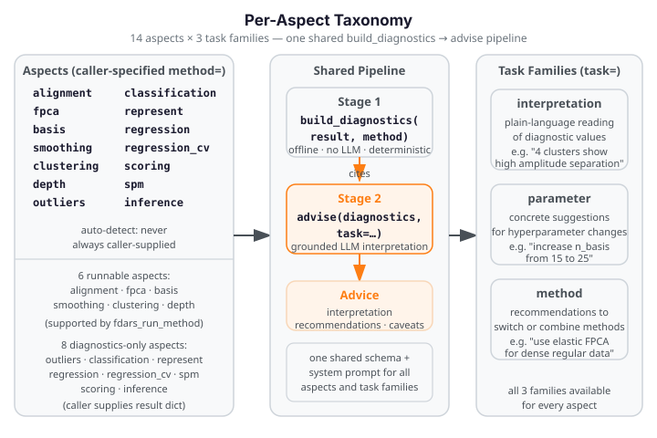

# Per-Aspect Coverage

Every fdars analysis aspect follows the same two-stage treatment: an offline
deterministic `build_diagnostics(result, method=…)` report, then grounded
`advise(…, task=…)` task families. The aspect is **always caller-specified** —
`build_diagnostics` never auto-detects it from result keys.

The three task families available for every aspect are:

| `task=` | What you get |
|---|---|
| `"interpretation"` | Plain-language reading of the diagnostic values |
| `"parameter"` | Concrete suggestions for changing hyperparameters |
| `"method"` | Recommendations for switching or combining fdars methods |

{ .fdars-diagram }

## Coverage Table

| Aspect (`method=`) | fdars source(s) | Key diagnostics (count) | Offline fence |
|---|---|---|---|
| `clustering` | `fdars.clustering.kmeans_fd` | k, cluster_means, cluster_sizes, pairwise distances, separations (7) | [python-api.md](python-api.md) |
| `smoothing` | `fdars.basis.smooth_basis_gcv`, `pspline_fit_gcv` | lambda sweep or single-fit GCV scalars (8) | — |
| `alignment` | `fdars.alignment.karcher_mean`, `karcher_mean_elastic` | mean curve stats, amplitude/phase distances, convergence, registration-quality scores (17) | — |
| `basis` | `fdars.basis.basis_nbasis_cv` | n_basis sweep, GCV curve, optimal n_basis (8) | — |
| `fpca` | `fdars.regression.fpca`, `fdars.pace_fpca` | n_components, eigenvalues, cumulative variance, phase leakage; PACE branch: pace_ncomp, pace_sigma2, pace_variance_explained_cumulative (12) | [this page](#fpca) |
| `fts` | `fdars.fts.ftsm`, `fdars.fts.stationarity_test`, `fdars.fts.functional_acf`, `fdars.fts.dpca`, `fdars.fts.fplsr` | stationarity branch: has_stationarity, statistic, p_value, n_perm; acf branch: has_acf, n_lags, acf_at_lag1, acf_decay; dpca branch: has_dpca, dpca_ncomp, n_freqs, filter_lag, dpca_eigenvalues; fplsr branch: has_fplsr, fplsr_ncomp, fplsr_fitted_rmse; ftsm branch: has_ftsm, ncomp, n_obs, n_points, n_ar_models, ar_max_order, ar_sigma2_max, fitted_rmse; forecast branch: has_forecast, h, forecast_mean (28) | [this page](#fts) |
| `frechet` | `fdars.frechet.frechet_mean`, `fdars.frechet.frechet_anova`, `fdars.frechet.frechet_global_reg`, `fdars.frechet.frechet_local_reg` — **diagnostics-only** (not in `_RUNNABLE_METHODS`) | frechet_mean branch: has_frechet_mean, frechet_mean_ndim, frechet_mean_dim, frechet_mean_trace; anova branch: has_anova, anova_p_value_permutation, anova_p_value_asymptotic, n_perm, n_groups, pooled_frechet_variance, group_frechet_variance_max; reg branch: has_global_reg, has_local_reg, predicted_n_obs, bandwidth (15) | — |
| `represent` | raw `Fdata` or `{"data":…,"argvals":…}` dict | grid stats, data range, imputation-quality diagnostics (13) | — |
| `depth` | `fdars.depth.*` score arrays | n_obs, depth statistics, histogram (9) | [this page](#depth) |
| `outliers` | `fdars.outliers.*` result dicts | n_outliers, outlier_fraction, magnitude/shape/outliergram ranges; tvdmss: has_tvdmss + 7 keys; muod: has_muod + 9 keys; sequential_transform: has_sequential_transform + 2 keys; depthgram: has_depthgram + 6 keys (37) | — |
| `classification` | `fdars.classification.*` result dicts | accuracy, cv_error_rate, fold_error_std, best_ncomp; elastic_multinomial branch: has_elastic_multinomial, train_accuracy, train_error_rate; shapelet_classifier branch: has_shapelet_classifier, shapelet_n_shapelets, shapelet_train_accuracy, shapelet_n_classes (13) | — |
| `regression` | `fdars.regression.fregre_*`, `fosr`, `fosr_fpc`, `functional_glm`, `concurrent_regression`, `fof_regression`, `fof_re_regression`; `fdars.scalar_on_function.fam`, `fregre_gkam` | r_squared, residual stats, beta_t_range, has_fosr; GLM branch: has_functional_glm + 7 keys; concurrent branch: has_concurrent_regression + 3 keys; FoF branch: has_fof_regression, fof_r_squared, beta_surface_shape, beta_surface_max_abs, fof_ncomp; FoF-RE branch: has_fof_re_regression + 4 keys; FAM/GSAM branch: has_fam + 4 keys; GKAM branch: has_fregre_gkam + 3 keys (34) | — |
| `regression_cv` | `fdars.regression.fregre_cv`, `model_selection_ncomp` | optimal_k, cv_curve, elbow_present (6) | — |
| `scoring` | `fdars.scoring.functional_mae/mse/mape/msle/explained_variance` | five integrated prediction-quality scalars (5) | [this page](#scoring) |
| `spm` | `fdars.spm.spm_phase1`, `fdars.spm.mfpca`, `fdars.spm.spe_multivariate` | T², SPE stats, exceedance rates, eigenvalues, kurtosis check; mfpca branch: has_mfpca, mfpca_ncomp, mfpca_n_obs, mfpca_n_variables, mfpca_eigenvalues, mfpca_variance_explained_cumulative; spe_multivariate branch: has_spe_multivariate, spe_mv_n_obs, spe_mv_max, spe_mv_mean, spe_mv_all_nonneg (25) | — |
| `inference` | caller-supplied `TestResult` / `ToleranceBand` dict from `fdars.inference` (diagnostics-only) | statistic, p_value, n_perm, significance flags, is_permutation_test (9) | [this page](#inference) |

---

## clustering

**fdars source:** `fdars.clustering.kmeans_fd`

Returns a dict with `centers`, `cluster`, and `k`. Pass `argvals` to enable
amplitude/phase pairwise distances between cluster means.

| Key | Meaning |
|---|---|
| `method` | Always `"clustering"` |
| `k` | Number of clusters |
| `cluster_means` | List of k mean curves (each a list of floats) |
| `cluster_sizes` | Per-cluster observation counts |
| `pairwise_amplitude_distance` | k×k matrix of amplitude distances between cluster means; `None` when `argvals` absent |
| `pairwise_phase_distance` | k×k matrix of phase distances between cluster means; `None` when `argvals` absent |
| `mean_amplitude_separation` | Mean off-diagonal amplitude distance; `None` when `argvals` absent |
| `mean_phase_separation` | Mean off-diagonal phase distance; `None` when `argvals` absent |

**Task families:** `"interpretation"` (read cluster structure) · `"parameter"` (adjust k)
· `"method"` (switch to elastic alignment + clustering)

---

## smoothing

**fdars source:** `fdars.basis.smooth_basis_gcv`, `fdars.basis.pspline_fit_gcv`

Two input shapes are handled. A lambda-sweep result (`lambda_values` + `gcv` keys in
the dict) fills the curve keys. A single-fit `pspline_fit_gcv` result fills only the
`optimal_*` scalars and leaves the curve keys `None`.

| Key | Meaning |
|---|---|
| `method` | Always `"smoothing"` |
| `lambda_values` | Lambda grid evaluated (list of floats); `None` for single-fit path |
| `gcv_curve` | GCV score at each lambda; `None` for single-fit path |
| `edf` | Effective degrees of freedom at each lambda; `None` for single-fit path |
| `gcv_aic_approx` | AIC-approximation curve (`n·log(GCV) + 2·edf`); `None` when edf absent |
| `gcv_bic_approx` | BIC-approximation curve (`n·log(GCV) + log(n)·edf`); `None` when edf absent |
| `optimal_lambda` | Lambda minimising GCV; `None` for single-fit path |
| `optimal_gcv` | GCV value at the optimal lambda (or the single-fit GCV) |
| `optimal_edf` | EDF at optimal lambda (or the single-fit EDF) |

**Task families:** `"interpretation"` (assess smoothing level) · `"parameter"` (adjust lambda range)
· `"method"` (switch smoother)

---

## alignment

**fdars source:** `fdars.alignment.karcher_mean`, `fdars.alignment.karcher_mean_elastic`

Pass `argvals` to enable per-observation amplitude/phase distance computation.
Without `argvals`, the distance keys are `None` but mean-curve stats are always computed.

| Key | Meaning |
|---|---|
| `method` | Always `"alignment"` |
| `mean_length` | Number of evaluation points in the Karcher mean curve |
| `mean_min` | Minimum value of the mean curve |
| `mean_max` | Maximum value of the mean curve |
| `mean_avg` | Mean value of the mean curve |
| `mean_curve` | Full Karcher mean curve as a list |
| `n_obs` | Number of aligned observations; `None` when `aligned_data` absent |
| `amplitude_distances` | Per-observation amplitude distances from the mean; `None` when `argvals` absent |
| `phase_distances` | Per-observation phase distances from the mean; `None` when `argvals` absent |
| `amplitude_mean` | Mean amplitude distance; `None` when `argvals` absent |
| `amplitude_max` | Maximum amplitude distance; `None` when `argvals` absent |
| `phase_mean` | Mean phase distance; `None` when `argvals` absent |
| `phase_max` | Maximum phase distance; `None` when `argvals` absent |
| `converged` | Whether the Karcher iteration converged; `None` if not reported |
| `n_iter` | Number of Karcher iterations taken; `None` if not reported |
| `ls_score` | `least_squares_score` on the registered curves — mean $L^2$ spread around the mean; lower is better; `None` when registration inputs absent |
| `pairwise_corr_score` | `pairwise_correlation_score` — mean centered functional Pearson correlation across all pairs; range $[-1,1]$; higher is better; `None` when absent |
| `sobolev_score` | `sobolev_least_squares_score` at a default $\lambda$ — LS score plus derivative penalty; lower is better; `None` when absent or grid is non-uniform |

!!! tip "Registration-quality interpretation"
    `pairwise_corr_score` below 0.7 after shift registration suggests the phase variation is not purely rigid — prefer elastic alignment (`karcher_mean`). A high `ls_score` relative to the cross-sectional variance indicates persistent phase spread after alignment, recommending a wider `max_shift` or more Karcher iterations.

**Task families:** `"interpretation"` (assess phase/amplitude separation, registration quality) · `"parameter"` (adjust max iterations, tolerance, or max_shift)
· `"method"` (switch between elastic and non-elastic alignment; try banded alignment for large datasets)

---

## basis

**fdars source:** `fdars.basis.basis_nbasis_cv`

Accepts a pre-computed cross-validation result dict (keys `n_basis_values`, `gcv`) or
raw data + `argvals` kwargs to trigger a live `basis_nbasis_cv` call.

| Key | Meaning |
|---|---|
| `method` | Always `"basis"` |
| `n_basis_values` | Basis count grid evaluated (list of ints) |
| `gcv_curve` | GCV score at each n_basis (list of floats) |
| `edf` | Effective degrees of freedom at each n_basis; `None` when absent |
| `gcv_aic_approx` | AIC approximation curve; `None` when edf or n_obs absent |
| `gcv_bic_approx` | BIC approximation curve; `None` when edf or n_obs absent |
| `optimal_n_basis` | n_basis minimising GCV |
| `optimal_gcv` | GCV at optimal n_basis |
| `optimal_edf` | EDF at optimal n_basis |

**Task families:** `"interpretation"` (assess basis complexity) · `"parameter"` (widen/narrow n_basis range)
· `"method"` (switch basis family)

---

## fpca

**fdars source:** `fdars.regression.fpca`, `fdars.pace_fpca`

`fpca` returns a dict with `scores`, `singular_values`, `rotation`, `mean`. Eigenvalues
are derived as `singular_values² / (n−1)`, matching `FPCAResult.explained_variance`.
`pace_fpca` returns pre-scaled `eigenvalues` directly — detected by the presence of the
`"eigenvalues"` key (unique to PACE; standard FPCA uses `"singular_values"`).

**Standard FPCA keys** (from `fdars.regression.fpca`):

| Key | Meaning |
|---|---|
| `method` | Always `"fpca"` |
| `n_components` | Number of retained FPC components |
| `n_obs` | Number of observations (rows in scores) |
| `eigenvalues` | Per-component eigenvalues (list of floats); `None` when `singular_values`/`scores` absent |
| `explained_variance_ratio` | Per-component fraction of total variance |
| `cumulative_variance_explained` | Running cumulative explained variance |
| `total_variance` | Sum of all eigenvalues |
| `phase_leakage_indicator` | Fraction of variance NOT explained by the first component; high value (≥ 0.5) suggests phase variation leaking into the amplitude decomposition |
| `phase_leakage_flagged` | `True` when `phase_leakage_indicator > 0.5` |

**pace_fpca keys** (trigger: `"eigenvalues"` in raw — unique to `pace_fpca`):

| Key | Meaning |
|---|---|
| `has_pace_fpca` | `True` when `"eigenvalues"` key is present in the raw dict |
| `pace_ncomp` | Actual number of PACE components returned (raw key `"ncomp"`); may be less than the requested count |
| `pace_sigma2` | Measurement-noise variance estimate from PACE (raw key `"sigma2"`) |
| `pace_variance_explained_cumulative` | Running cumulative variance explained by PACE eigenvalues |
| `pace_variance_explained_first` | Fraction of variance explained by the leading PACE component |
| `pace_noise_signal_ratio` | `sigma2 / sum(eigenvalues)`: ratio of measurement-noise variance to total signal variance; `None` when total variance is zero (degenerate case) |
| `pace_truncated_rank_flagged` | `True` when the number of PACE components actually returned (`pace_ncomp`) is less than the number of raw eigenvalues — indicates the eigenvalue spectrum was truncated |
| `pace_mean_prediction_band_width` | Mean of `fitted_upper - fitted_lower` over the full `(n, m)` prediction grid; quantifies average pointwise uncertainty in the PACE fitted curves; `None` when confidence bands are absent |

!!! tip "PACE noise-to-signal interpretation"
    `pace_noise_signal_ratio > 0.30` suggests that measurement noise is substantial relative
    to the signal — consider increasing `sigma2` or using fewer components. A
    `pace_truncated_rank_flagged=True` result means the returned component count is smaller
    than expected; increase `ncomp` if the scree suggests more components are meaningful.

**Task families:** `"interpretation"` (read scree / phase leakage; PACE: assess noise level and component count) · `"parameter"` (change n_comp; PACE: adjust bandwidth or sigma2)
· `"method"` (use elastic FPCA for dense regular data; use PACE for sparse irregular observations)

The fence below loads the Canadian Weather dataset, runs `fpca`, and builds the offline
diagnostics report. No API key is required — this runs live in the docs build.

```python exec="1" html="1" source="above"
from docs_data import load_canadian_weather
from fdars import regression
from fdars.advisor import build_diagnostics

day, X, meta = load_canadian_weather("temperature")
fp = regression.fpca(X, day, n_comp=4)
diag = build_diagnostics(fp, method="fpca")

print(f"n_components:                      {diag['n_components']}")
print(f"cumulative_variance_explained[0]:  {diag['cumulative_variance_explained'][0]:.4f}  FDARS_FENCE_OK")
print(f"phase_leakage_indicator:           {diag['phase_leakage_indicator']:.4f}")
print(f"phase_leakage_flagged:             {diag['phase_leakage_flagged']}")
```

---

## fts

**fdars source:** `fdars.fts.ftsm`, `fdars.fts.stationarity_test`, `fdars.fts.functional_acf`,
`fdars.fts.dpca`, `fdars.fts.fplsr`

Six discriminated result shapes are handled via independent `has_<fn>` booleans. The
discriminator keys (tested in order, with fplsr tested before the bare forecast branch):
1. `stationarity_test` — unique key `"n_perm"` (with `"statistic"` and `"p_value"`);
2. `functional_acf` / `functional_pacf` — unique key `"upper_band"`;
3. `dpca` — unique keys `"filter_lag"` and `"n_freqs"`;
4. `fplsr` — `"fitted"` + `"forecast"` + `"ncomp"` + forecast shape[0] == 1;
5. `ftsm` — unique key `"ar_models"`;
6. `ftsm_forecast` / `ftsm_forecast_multistep` — `"forecast"` + `"h"`.

**stationarity keys** (trigger: `"n_perm"` + `"statistic"` + `"p_value"` in raw):

| Key | Meaning |
|---|---|
| `has_stationarity` | `True` when result is from `stationarity_test` |
| `stationarity_statistic` | Test statistic (float); `None` when not stationarity result |
| `stationarity_p_value` | Permutation p-value in [0,1]; `None` when not stationarity result |
| `n_perm` | Number of permutations used (int); `None` when not stationarity result |

**acf keys** (trigger: `"acf"` + `"upper_band"` in raw):

| Key | Meaning |
|---|---|
| `has_acf` | `True` when result is from `functional_acf` or `functional_pacf` |
| `n_lags` | Number of lags computed (int); `None` when not acf result |
| `acf_at_lag1` | First-lag autocorrelation (float); `None` when not acf result or empty |
| `acf_decay` | Last-lag value — proxy for ACF tail decay (float); `None` when not acf result |

**dpca keys** (trigger: `"filter_lag"` + `"n_freqs"` in raw):

| Key | Meaning |
|---|---|
| `has_dpca` | `True` when result is from `dpca` |
| `dpca_ncomp` | Number of dynamic PCA components (int); `None` when not dpca result |
| `n_freqs` | Frequency count (int); `None` when not dpca result |
| `filter_lag` | Lag window parameter (int); `None` when not dpca result |
| `dpca_eigenvalues` | Per-component peak spectral eigenvalue — `float(np.max(ev))` for each component's frequency-domain spectrum (list of floats); `None` when not dpca result |

**fplsr keys** (trigger: `"fitted"` + `"forecast"` + `"ncomp"` + forecast.shape[0] == 1):

| Key | Meaning |
|---|---|
| `has_fplsr` | `True` when result is from `fplsr` |
| `fplsr_ncomp` | Number of PLS components (int); `None` when not fplsr result |
| `fplsr_fitted_rmse` | RMSE of fitted values over training observations (float); `None` when not fplsr result |

**ftsm keys** (trigger: `"ar_models"` in raw):

| Key | Meaning |
|---|---|
| `has_ftsm` | `True` when result is from `ftsm` |
| `ncomp` | Number of FTS components fitted (int); `None` when not ftsm result |
| `n_obs` | Number of training observations — inferred from scores shape[0] (int); `None` when not ftsm result |
| `n_points` | Evaluation grid size — inferred from mean shape[0] (int); `None` when not ftsm result |
| `n_ar_models` | Number of AR models fitted (equals ncomp) (int); `None` when not ftsm result |
| `ar_max_order` | Maximum AR lag order across all component models (int); `None` when not ftsm result or no models |
| `ar_sigma2_max` | Largest residual variance across all AR models (float); `None` when not ftsm result |
| `fitted_rmse` | Overall reconstruction RMSE across all fitted observations (float); `None` when not ftsm result |

**ftsm_forecast keys** (trigger: `"forecast"` + `"h"` in raw; only reached when fplsr discriminator is False):

| Key | Meaning |
|---|---|
| `has_forecast` | `True` when result is from `ftsm_forecast` or `ftsm_forecast_multistep` |
| `h` | Forecast horizon — number of steps ahead (int); `None` when not forecast result |
| `forecast_mean` | Mean value across all forecast points (float); `None` when not forecast result |

**Task families:** `"interpretation"` (read stationarity, ACF decay, ftsm component structure, forecast quality)
· `"parameter"` (adjust ncomp, n_perm, filter_lag, AR order)
· `"method"` (switch from ftsm to fplsr for covariate-driven forecasting; use dpca for frequency-domain decomposition)

```python exec="1" source="above"
import numpy as np
from fdars.fts import ftsm, ftsm_forecast, stationarity_test
from fdars.advisor import build_diagnostics

rng = np.random.default_rng(42)
n, m = 20, 30       # non-square: n != m (transposition guard)
t = np.linspace(0, 1, m)
data = np.array([np.sin(2 * np.pi * t + rng.uniform(0, 0.5)) +
                 0.1 * rng.standard_normal(m) for _ in range(n)])

fit = ftsm(data, t, ncomp=3)
diag_ftsm = build_diagnostics(fit, method="fts")

st = stationarity_test(data, t, n_perm=19, seed=42)
diag_stat = build_diagnostics(st, method="fts")

print(f"ftsm ncomp:           {diag_ftsm['ncomp']}")
print(f"ftsm n_ar_models:     {diag_ftsm['n_ar_models']}")
print(f"stationarity p_value: {diag_stat['stationarity_p_value']:.3f}  FDARS_FENCE_OK")
```

---

## frechet

**fdars source:** `fdars.frechet.frechet_mean`, `fdars.frechet.frechet_anova`,
`fdars.frechet.frechet_global_reg`, `fdars.frechet.frechet_local_reg`

**Diagnostics-only** — `frechet` is NOT in `_RUNNABLE_METHODS` and cannot be invoked
via the MCP auto-run path. The caller runs the fdars function and passes the result
directly to `build_diagnostics`. Four result shapes are handled: `frechet_mean` returns
a **naked numpy array** (not a dict); the other three return dicts detected by key-presence guards.

The `isinstance(raw, dict)` check is applied **first** — before any dict key access —
so the array path is handled cleanly.

**frechet_mean path** (trigger: raw is a numpy array — not a dict):

| Key | Meaning |
|---|---|
| `has_frechet_mean` | `True` when raw is a numpy array (not a dict) |
| `frechet_mean_ndim` | Number of array dimensions: 1 for spherical/Euclidean, 2 for SPD/correlation (int); `None` when not frechet_mean result |
| `frechet_mean_dim` | Last dimension size `d` (int); `None` when not frechet_mean result |
| `frechet_mean_trace` | Matrix trace when ndim==2; `None` for 1-D arrays or non-frechet_mean paths |

**frechet_anova keys** (trigger: `"p_value_permutation"` + `"group_labels"` in raw):

| Key | Meaning |
|---|---|
| `has_anova` | `True` when result is from `frechet_anova` |
| `anova_p_value_permutation` | Permutation p-value in [0,1] (float); `None` when not anova result |
| `anova_p_value_asymptotic` | Asymptotic p-value in [0,1] (float); `None` when not anova result or absent |
| `n_perm` | Number of permutations used (int); `None` when not anova result |
| `n_groups` | Number of distinct groups derived from `group_labels` (int); `None` when not anova result |
| `pooled_frechet_variance` | Pooled within-group Fréchet variance (float); `None` when not anova result |
| `group_frechet_variance_max` | Maximum per-group Fréchet variance (float); `None` when not anova result |

**frechet_global_reg and frechet_local_reg keys** (trigger: `"predicted"` + `"x_bar"` in raw for global; `"bandwidth"` in raw for local):

| Key | Meaning |
|---|---|
| `has_global_reg` | `True` when result is from `frechet_global_reg` |
| `has_local_reg` | `True` when result is from `frechet_local_reg` |
| `predicted_n_obs` | Number of prediction-output objects — shape[0] of the `predicted` array (int); `None` when not a regression result |
| `bandwidth` | Kernel bandwidth (float); present for `frechet_local_reg` only; `None` for global regression |

**Task families:** `"interpretation"` (read mean geometry, group variance, regression prediction count)
· `"parameter"` (adjust n_perm for anova; adjust bandwidth for local regression)
· `"method"` (switch between global and local Fréchet regression; use anova to test group-mean differences)

---

## represent

**fdars source:** raw `Fdata` object or `{"data": …, "argvals": …}` dict (pre-analysis check)

`represent` is a data-quality check that operates on the **input data**, not on an fdars
method output. Pass either an `Fdata` object or a plain dict with `"data"` and `"argvals"` keys.

| Key | Meaning |
|---|---|
| `method` | Always `"represent"` |
| `n_obs` | Number of functional observations (rows) |
| `n_points` | Number of evaluation grid points (columns) |
| `argvals_min` | Minimum grid value |
| `argvals_max` | Maximum grid value |
| `argvals_spacing_mean` | Mean spacing between adjacent argvals; `None` when fewer than 2 grid points |
| `argvals_spacing_std` | Std of argval spacing; `None` when fewer than 2 grid points |
| `is_uniform_grid` | `True` when `spacing_std / spacing_mean < 0.01` (or trivially uniform) |
| `data_range_min` | Minimum value in the data matrix |
| `data_range_max` | Maximum value in the data matrix |
| `data_range_mean` | Mean value in the data matrix |
| `nan_frac` | Fraction of all data-matrix entries that are NaN; `None` when no NaN inputs were present |
| `has_boundary_nans` | `True` when any NaN appears in the first or last column of the data matrix (boundary NaN requires boundary-extension imputation rather than interpolation); `None` when no NaN inputs present |
| `imputation_method` | The `ImputationMethod` string used (`"linear"`, `"mean"`, or `"constant"`); `None` when imputation was not applied |

These three keys default `None` when the input data contains no NaN values — they populate only after an `impute_missing_values` call is included in the result.

!!! tip "Imputation-quality guidance"
    `nan_frac` above 0.30 suggests high missingness — the `"mean"` or `"constant"` imputation methods are safer than `"linear"` when more than a third of values per curve are missing. `has_boundary_nans=True` means linear imputation will extrapolate from the nearest valid interior point; consider `"mean"` imputation instead if the boundary values matter for downstream analysis.

**Task families:** `"interpretation"` (assess data quality / grid regularity / missingness) · `"parameter"` (adjust grid density or range; choose imputation method)
· `"method"` (switch to irregular-grid methods if `is_uniform_grid=False`; use `impute_missing_values` before smoothing or depth when NaN present)

---

## depth

**fdars source:** any `fdars.depth.*` function — `fraiman_muniz_1d`, `modal_1d`,
`random_projection_1d`, etc. All depth functions return a raw `ndarray (n,)` score
array, **not** a dict. Pass the array directly to `build_diagnostics`.

The `method_name` keyword is required: it names the depth variant used.

```python
diag = build_diagnostics(scores, method="depth", method_name="fraiman_muniz")
```

| Key | Meaning |
|---|---|
| `method` | Always `"depth"` |
| `method_name` | Caller-supplied depth method name (e.g. `"fraiman_muniz"`, `"modal"`) |
| `n_obs` | Number of observations |
| `depth_min` | Minimum depth score (most peripheral curve) |
| `depth_max` | Maximum depth score (most central curve) |
| `depth_mean` | Mean depth score |
| `depth_median` | Median depth score |
| `depth_q10` | 10th-percentile depth score (flags peripheral curves) |
| `depth_q90` | 90th-percentile depth score |
| `depth_histogram` | 10-bucket histogram of depth scores (list of 10 ints) |

**Task families:** `"interpretation"` (read depth distribution) · `"parameter"` (adjust depth method parameters)
· `"method"` (switch depth variant)

The fence below loads the Canadian Weather dataset, computes Fraiman–Muniz depth scores,
and builds the offline diagnostics report. No API key is required — this runs live in the
docs build.

```python exec="1" html="1" source="above"
from docs_data import load_canadian_weather
from fdars import depth
from fdars.advisor import build_diagnostics

day, X, meta = load_canadian_weather("temperature")
scores = depth.fraiman_muniz_1d(X, X)
diag = build_diagnostics(scores, method="depth", method_name="fraiman_muniz")

print(f"n_obs:       {diag['n_obs']}")
print(f"depth_mean:  {diag['depth_mean']:.4f}  FDARS_FENCE_OK")
print(f"depth_q10:   {diag['depth_q10']:.4f}")
print(f"depth_q90:   {diag['depth_q90']:.4f}")
```

---

## outliers

**fdars source:** `fdars.outliers.detect_outliers_lrt`,
`fdars.outliers.detect_outliers_lrt_with_dist`,
`fdars.outliers.outliergram`,
`fdars.outliers.magnitude_shape`,
`fdars.outliers.tvdmss`,
`fdars.outliers.muod`,
`fdars.outliers.sequential_transform_outliers`,
`fdars.outliers.depthgram`

Eight result shapes are handled by key-presence guards (each detector's result is detected
by a unique combination of keys). `magnitude_shape` returns **no** `"outliers"` key —
`n_outliers` and `outlier_fraction` are `None` for that variant.
`sequential_transform_outliers` does not expose a score array so `n_obs` is `None`.

**Base keys (all shapes):**

| Key | Meaning |
|---|---|
| `method` | Always `"outliers"` |
| `n_obs` | Number of observations (inferred from the first score array present); `None` for `sequential_transform_outliers` |
| `n_outliers` | Count of flagged outliers; `None` for `magnitude_shape` results |
| `outlier_fraction` | Fraction flagged; `None` when `"outliers"` key absent |
| `threshold` | LRT threshold when present; `None` otherwise |
| `has_magnitude_shape` | `True` when `"magnitude"` and `"shape"` keys both present |
| `magnitude_range` | `[min, max]` of magnitude scores; `None` when absent |
| `shape_range` | `[min, max]` of shape scores; `None` when absent |
| `has_outliergram` | `True` when `"mei"` and `"mbd"` keys both present (and result is NOT depthgram) |
| `mei_range` | `[min, max]` of MEI scores; `None` when absent |
| `mbd_range` | `[min, max]` of MBD scores; `None` when absent |

**tvdmss keys** (trigger: `"tvd"` and `"mss"` both in raw):

| Key | Meaning |
|---|---|
| `has_tvdmss` | `True` when `"tvd"` and `"mss"` keys are present |
| `n_magnitude_outliers` | Count of tvdmss magnitude-direction outliers |
| `n_shape_outliers` | Count of tvdmss shape-direction outliers |
| `magnitude_outlier_fraction` | tvdmss magnitude-direction fraction; `None` when `n_obs == 0` |
| `shape_outlier_fraction` | tvdmss shape-direction fraction; `None` when `n_obs == 0` |
| `tvd_range` | `[min, max]` of TVD scores |
| `mss_range` | `[min, max]` of MSS scores |

**muod keys** (trigger: `"amplitude_outliers"` in raw):

| Key | Meaning |
|---|---|
| `has_muod` | `True` when `"amplitude_outliers"` key is present |
| `n_muod_magnitude_outliers` | muod magnitude-direction count |
| `n_muod_shape_outliers` | muod shape-direction count |
| `n_amplitude_outliers` | muod amplitude-direction count |
| `muod_magnitude_outlier_fraction` | muod magnitude fraction; `None` when `n_obs == 0` |
| `muod_shape_outlier_fraction` | muod shape fraction; `None` when `n_obs == 0` |
| `amplitude_outlier_fraction` | muod amplitude fraction; `None` when `n_obs == 0` |
| `shape_index_range` | `[min, max]` of muod shape scores |
| `magnitude_index_range` | `[min, max]` of muod magnitude scores |
| `amplitude_index_range` | `[min, max]` of muod amplitude scores |

**sequential_transform_outliers keys** (trigger: `"union_outliers"` in raw):

| Key | Meaning |
|---|---|
| `has_sequential_transform` | `True` when `"union_outliers"` key is present |
| `n_union_outliers` | Size of the union of outliers across all sequential transform stages |
| `n_transforms` | Number of sequential detector stages (length of `per_transform_outliers`) |

**depthgram keys** (trigger: `"mbd_mei_d"` in raw):

| Key | Meaning |
|---|---|
| `has_depthgram` | `True` when `"mbd_mei_d"` key is present |
| `n_depthgram_shape_outliers` | depthgram shape-direction count |
| `n_depthgram_magnitude_outliers` | depthgram magnitude-direction count |
| `depthgram_shape_outlier_fraction` | depthgram shape fraction; `None` when `n_obs == 0` |
| `depthgram_magnitude_outlier_fraction` | depthgram magnitude fraction; `None` when `n_obs == 0` |
| `depthgram_mbd_range` | `[min, max]` of depthgram MBD scores |
| `depthgram_mei_range` | `[min, max]` of depthgram MEI scores |

**Task families:** `"interpretation"` (read outlier count and type) · `"parameter"` (adjust threshold or alpha)
· `"method"` (combine detectors; use `tvdmss`/`muod`/`depthgram` for direction-aware outlier analysis)

---

## classification

**fdars source:** `fdars.classification.fclassif_lda`, `fclassif_qda`, `fclassif_knn`,
`fclassif_kernel`, `fclassif_dd`, `fclassif_cv`,
`fdars.classification.elastic_multinomial`

Three result shapes are handled by key-presence guards: point-estimate functions return
`"accuracy"`; `fclassif_cv` returns `"error_rate"` (emitted as `cv_error_rate`) and has
no `"accuracy"` key; `elastic_multinomial` returns `"train_accuracy"` (detected by the
unique `train_accuracy` key) and overrides `n_classes` from the raw dict.

`n_classes` **cannot be inferred from the result dict for LDA/QDA/KNN variants** —
supply it explicitly:

```python
diag = build_diagnostics(result, method="classification", n_classes=K)
```

| Key | Meaning |
|---|---|
| `method` | Always `"classification"` |
| `n_obs` | Number of observations (from `predicted` length); `None` for CV-only results |
| `n_classes` | Caller-supplied ground-truth class count (overridden by `elastic_multinomial`'s raw `n_classes`); `None` when not passed |
| `accuracy` | Proportion correctly classified; derived as `1 - cv_error_rate` when only CV result present |
| `error_rate` | `1 - accuracy` for point-estimate results; `None` for CV-only |
| `cv_error_rate` | CV error rate from `fclassif_cv` (raw key `"error_rate"`); `None` for point-estimate |
| `fold_error_std` | Std of per-fold errors (CV path); `None` for point-estimate |
| `best_ncomp` | Number of FPC components minimising CV error; `None` for point-estimate |

**elastic_multinomial keys** (trigger: `"train_accuracy"` in raw AND `"n_shapelets"` NOT in raw — the shapelet classifier also exposes `train_accuracy`, so the absence of `"n_shapelets"` is required to correctly distinguish `elastic_multinomial` from the shapelet classifier):

| Key | Meaning |
|---|---|
| `has_elastic_multinomial` | `True` when `"train_accuracy"` key is present |
| `train_accuracy` | Training-set proportion correctly classified (float) |
| `train_error_rate` | `1 - train_accuracy` |
| `overfitting_gap` | `train_accuracy - holdout_accuracy`: difference between training accuracy and caller-supplied holdout or cross-validation accuracy. **`None` unless `holdout_accuracy` is passed to `build_diagnostics`** — the `elastic_multinomial` result has no holdout accuracy of its own and this gap is never fabricated (grounding invariant). A positive gap indicates overfitting |
| `n_classes_flagged` | `True` when `n_classes > 2` (multiclass problem — elastic multinomial scales to K classes via a one-vs-rest structure; flag helps the LLM contextualise `train_accuracy` correctly); `None` when `n_classes` is not supplied |

!!! warning "overfitting_gap requires holdout_accuracy"
    `overfitting_gap` is `None` unless you pass `holdout_accuracy=<float>` to
    `build_diagnostics`. The `elastic_multinomial` result dict contains only training
    accuracy — the gap cannot be computed without an externally supplied holdout or
    cross-validation accuracy. Do not pass `holdout_accuracy` from the same training
    run used to fit the model; use a held-out test split or a CV error rate.

    ```python
    diag = build_diagnostics(result, method="classification",
                             n_classes=K, holdout_accuracy=cv_accuracy)
    ```

**shapelet_classifier keys** (trigger: `"n_shapelets"` in raw — unique to `shapelet_classifier_fit`; the coercion guard in `__init__.py` converts the `PyShapeletClassifierFit` opaque handle to a dict before this discriminator runs):

| Key | Meaning |
|---|---|
| `has_shapelet_classifier` | `True` when result is from `shapelet_classifier_fit` |
| `shapelet_n_shapelets` | Number of shapelets discovered and used (int); `None` when not shapelet classifier result |
| `shapelet_train_accuracy` | Training-set proportion correctly classified — `clf.train_accuracy` (float in [0,1]); `None` when not shapelet classifier result |
| `shapelet_n_classes` | Number of distinct label classes (int); `None` when not shapelet classifier result |

!!! tip "Opaque handle coercion"
    `shapelet_classifier_fit` returns a `PyShapeletClassifierFit` opaque PyO3 handle.
    Pass it directly to `build_diagnostics` — the advisor's `__init__.py` coercion guard
    (placed before the generic `dict(raw)` block) converts it to a plain dict via
    `{"n_shapelets": handle.n_shapelets, "train_accuracy": handle.train_accuracy, ...}`
    before the classification builder runs. No manual conversion is needed.

**Task families:** `"interpretation"` (read classification accuracy and CV stability; shapelet: assess discriminative subsequence count and training accuracy)
· `"parameter"` (tune k / n_comp; shapelet: adjust n_shapelets, quality, or classifier type)
· `"method"` (switch classifier; use `elastic_multinomial` for K-class problems in the elastic SRSF domain; use `shapelet_classifier_fit` when discriminative subsequence structure is expected)

---

## regression

**fdars source:** `fdars.regression.fregre_lm`, `fregre_pls`, `fregre_l1`,
`fregre_huber`, `fregre_np`, `fosr`, `fosr_fpc`,
`fdars.regression.functional_glm`,
`fdars.regression.concurrent_regression`,
`fdars.regression.fof_regression`, `fdars.regression.fof_re_regression`,
`fdars.scalar_on_function.fam`, `fdars.scalar_on_function.fregre_gsam`,
`fdars.scalar_on_function.fregre_gkam`

Note that `fregre_l1` and `fregre_huber` do **not** return `r_squared` — that key is
`None` for robust regression variants. `fosr`/`fosr_fpc` return 2-D residuals (shape
`n × m`); residual summary statistics are computed only for 1-D residual arrays.
`functional_glm` and `concurrent_regression` are detected by unique key guards and
expose their own sub-tables below.

**Base keys (all variants):**

| Key | Meaning |
|---|---|
| `method` | Always `"regression"` |
| `n_obs` | Number of observations (inferred from `fitted_values` or `fitted`) |
| `r_squared` | Coefficient of determination; `None` for `fregre_l1` / `fregre_huber` |
| `residual_mean` | Mean residual; `None` for `fosr`/`fosr_fpc`/`concurrent_regression` (2-D residuals) |
| `residual_std` | Std of residuals; `None` for `fosr`/`fosr_fpc`/`concurrent_regression` |
| `residual_max_abs` | Maximum absolute residual; `None` for `fosr`/`fosr_fpc`/`concurrent_regression` |
| `residual_skew` | Pure-NumPy skewness of residuals; `None` for `fosr`/`fosr_fpc`/`concurrent_regression` |
| `beta_t_range` | `[min, max]` of `beta_t`; `None` for `fregre_np` and `fosr`/`fosr_fpc` |
| `has_fosr` | `True` only when `"fitted"` key is present AND the array is 2-D (also `True` for `concurrent_regression`) |

**functional_glm keys** (trigger: `"deviance"` in raw):

| Key | Meaning |
|---|---|
| `has_functional_glm` | `True` when `"deviance"` key is present (unique to `functional_glm`) |
| `deviance` | Model deviance — residual measure for the exponential-family fit (lower is better) |
| `aic` | Akaike Information Criterion from the score-space GLM |
| `bic` | Bayesian Information Criterion from the score-space GLM |
| `log_likelihood` | Log-likelihood at IRLS convergence |
| `iterations` | Number of IRLS iterations to convergence (key `"iterations"`, NOT `"n_iter"`) |
| `glm_ncomp` | Number of FPC components used in the GLM (raw key `"ncomp"`) |
| `family` | Exponential-family name string (`"gaussian"`, `"binomial"`, `"poisson"`, `"gamma"`) |

!!! warning "Gamma AIC is not comparable to R `glm()` AIC"
    The `aic` value from `functional_glm` is computed in the FPC score space, not the
    original data space. It is **not** comparable to AIC from R's `glm()` function, which
    operates in the original response space.

**concurrent_regression keys** (trigger: `"beta_curve"` in raw):

| Key | Meaning |
|---|---|
| `has_concurrent_regression` | `True` when `"beta_curve"` key is present (unique to `concurrent_regression`) |
| `n_predictors` | Number of functional predictor curves (rows of `beta_curve`; shape `(p, m)`) |
| `concurrent_residual_rms` | Root-mean-squared residual over the full `n × m` grid; `None` when residuals absent |
| `concurrent_residual_max_abs` | Maximum absolute residual over the full grid; `None` when residuals absent |

**fof_regression keys** (trigger: `"beta_surface"` in raw — unique to `fof_regression` and `fof_re_regression`):

| Key | Meaning |
|---|---|
| `has_fof_regression` | `True` when `"beta_surface"` key is present AND the fitted array is 2-D (also `True` for `fof_re_regression`) |
| `fof_r_squared` | Scalar coefficient of determination from `fof_regression` result (float); `None` when key absent |
| `beta_surface_shape` | Shape of the beta surface as `[ncomp_x, ncomp_y]` (list of 2 ints); `None` when not FoF result |
| `beta_surface_max_abs` | Maximum absolute value in the beta surface (float); `None` when not FoF result |
| `fof_ncomp` | `[ncomp_x, ncomp_y]` — number of FPCA components for predictor and response (list of 2 ints); `None` when keys absent |

**fof_re_regression keys** (trigger: `"random_effects"` + `"n_subjects"` in raw — unique to `fof_re_regression`; `has_fof_regression` is also `True` for this result shape):

| Key | Meaning |
|---|---|
| `has_fof_re_regression` | `True` when `"random_effects"` and `"n_subjects"` keys are both present |
| `n_subjects` | Number of subjects in the random-effects model (int); `None` when not FoF-RE result |
| `sigma2_u_max` | Maximum subject-level random-effects variance — `max(sigma2_u)` (float); `None` when absent |
| `sigma2_eps` | Residual noise variance (float); `None` when absent |
| `re_dims` | Shape of the random-effects matrix as `[n_subjects, m_y]` (list of 2 ints); `None` when absent |

**fam / fregre_gsam keys** (trigger: `"component_fits"` + `"fitted_values"` in raw — shared by `fam` and `fregre_gsam`; `has_fregre_gkam` is the more specific discriminator for `gkam` which also has these keys):

| Key | Meaning |
|---|---|
| `has_fam` | `True` when `"component_fits"` and `"fitted_values"` keys are both present |
| `fam_n_obs` | Number of observations from fitted_values shape[0] (int); `None` when not FAM/GSAM result |
| `fam_n_components` | Number of smooth component fits (int); `None` when not FAM/GSAM result |
| `fam_r_squared` | Coefficient of determination (float); `None` when absent |
| `fam_ncomp` | Number of FPCA components (int); `None` when absent |

**fregre_gkam keys** (trigger: `"converged"` + `"bandwidths"` in raw — unique to `fregre_gkam`; `has_fam` is also `True` for gkam):

| Key | Meaning |
|---|---|
| `has_fregre_gkam` | `True` when `"converged"` and `"bandwidths"` keys are both present |
| `gkam_converged` | Whether the GKAM algorithm converged (bool); `None` when not GKAM result |
| `gkam_bandwidths` | Per-component kernel bandwidths (list of floats); `None` when not GKAM result |
| `gkam_n_predictors` | Number of functional predictors (int, inferred from bandwidths length); `None` when not GKAM result |

**Task families:** `"interpretation"` (read model fit and residual behaviour; FoF: assess beta-surface shape and R²; GKAM: assess convergence and component bandwidths)
· `"parameter"` (adjust regularisation or IRLS max_iter; FoF: adjust ncomp_x/ncomp_y via cross-validation)
· `"method"` (switch between scalar-response, function-on-scalar, GLM, and varying-coefficient regression; use `fof_regression` when both predictor and response are functional; use `fam`/`fregre_gsam` for additive smooth components)

---

## regression_cv

**fdars source:** `fdars.regression.fregre_cv`, `fdars.regression.model_selection_ncomp`

Two source functions are detected by key presence: `fregre_cv` exposes `"optimal_k"`;
`model_selection_ncomp` exposes `"best_ncomp"` and `"criteria"`.

| Key | Meaning |
|---|---|
| `method` | Always `"regression_cv"` |
| `optimal_k` | Chosen number of components or nearest neighbours |
| `min_cv_error` | Minimum CV error; `None` for `model_selection_ncomp` |
| `cv_curve` | CV error (or GCV) values per k (list of floats) |
| `k_values` | Component counts matching `cv_curve` (list of ints) |
| `cv_curve_range` | `[min, max]` of `cv_curve`; `None` when curve is empty |
| `elbow_present` | `True` when the CV curve has a strict local minimum at an interior index (not at boundary) |

**Task families:** `"interpretation"` (read optimal k and curve shape) · `"parameter"` (widen k range to expose elbow)
· `"method"` (switch CV strategy or regression variant)

---

## scoring

**fdars source:** `fdars.scoring.functional_mae`, `fdars.scoring.functional_mse`,
`fdars.scoring.functional_mape`, `fdars.scoring.functional_msle`,
`fdars.scoring.functional_explained_variance`

The `scoring` aspect reports domain-integrated prediction-quality scalars. Unlike
column-wise averages, each metric integrates the error (or squared error) over the
evaluation domain via Simpson's rule. Pass a dict with the computed scalar values directly
to `build_diagnostics` — the advisor does not recompute them.

```python
from fdars.advisor import build_diagnostics
from fdars import scoring

# Assuming y_true, y_pred, argvals are arrays
result = {
    "functional_mae": scoring.functional_mae(y_true, y_pred, argvals),
    "functional_mse": scoring.functional_mse(y_true, y_pred, argvals),
    "functional_explained_variance": scoring.functional_explained_variance(y_true, y_pred, argvals),
}
diag = build_diagnostics(result, method="scoring")
```

| Key | Meaning |
|---|---|
| `method` | Always `"scoring"` |
| `functional_mae` | Mean absolute integrated error; same units as the data; robust to outlier curves |
| `functional_mse` | Mean squared integrated error; penalises large errors more heavily; squared units |
| `functional_mape` | Mean absolute percentage integrated error; `None` when not computed or inputs near zero |
| `functional_msle` | Mean squared log-error; `None` when not computed; requires all values $> -1$ |
| `functional_explained_variance` | Integrated explained variance; range $(-\infty, 1]$; 1 = perfect prediction |

!!! danger "MAPE and MSLE domain restrictions"
    `functional_mape` raises `ValueError` when any `|y_true(t)| < ε` for any grid point — the library correctly rejects inputs near zero rather than producing numerically undefined results. `functional_msle` raises `ValueError` when any value is $\leq -1$. Do not include these keys in the result dict when the data does not satisfy their domain conditions; use `functional_mae` or `functional_mse` instead.

The fence below builds a scoring diagnostics report on a synthetic regression prediction.
No API key is required — this runs live in the docs build.

```python exec="1" html="1" source="above"
import numpy as np
from fdars.advisor import build_diagnostics
from fdars import scoring

rng = np.random.default_rng(42)
n, m = 12, 80
t = np.linspace(0, 1, m)
y_true = np.array([np.sin(2 * np.pi * t + rng.uniform(-0.2, 0.2)) for _ in range(n)])
y_pred = y_true + rng.normal(0, 0.08, size=y_true.shape)

result = {
    "functional_mae": scoring.functional_mae(y_true, y_pred, t),
    "functional_mse": scoring.functional_mse(y_true, y_pred, t),
    "functional_explained_variance": scoring.functional_explained_variance(y_true, y_pred, t),
}
diag = build_diagnostics(result, method="scoring")

print(f"functional_mae:                {diag['functional_mae']:.4f}")
print(f"functional_mse:                {diag['functional_mse']:.4f}")
print(f"functional_explained_variance: {diag['functional_explained_variance']:.4f}  FDARS_FENCE_OK")
```

**Task families:** `"interpretation"` (read prediction quality and choose a primary metric for reporting)
· `"parameter"` (adjust regularisation or model complexity to improve scores)
· `"method"` (switch from scalar to functional regression; use `functional_explained_variance` as primary quality signal; if MAPE or MSLE are undefined, fall back to MAE/MSE)

---

## spm

**fdars source:** `fdars.spm.spm_phase1`, `fdars.spm.mfpca`, `fdars.spm.spe_multivariate`

Three distinct input shapes are handled. The `spe_multivariate` naked-array path is
checked **first** (before any dict-key access). When `has_mfpca=True`, the `spm_phase1`
sentinel fields (`ncomp`, `eigenvalues`, `variance_explained_cumulative`) are set to `None`
— the mfpca-specific keys carry that information instead.

SPM is the only aspect whose builder makes a live fdars call:
`fdars.spm.spe_moment_match_diagnostic(spe_values)` — a deterministic pure-moment
computation with no RNG, fully offline. The call is wrapped in `try/except` so
`spe_kurtosis_excess` and `spe_moment_match_adequate` degrade to `None` gracefully
when the compiled extension is unavailable.

**spm_phase1 keys** (from `fdars.spm.spm_phase1`):

| Key | Meaning |
|---|---|
| `method` | Always `"spm"` |
| `n_obs` | Number of observations (from T² array length) |
| `ncomp` | Number of PCA components retained; `None` when `has_mfpca=True` (mfpca input gating) |
| `t2_limit` | Hotelling T² control limit |
| `spe_limit` | SPE (Q) control limit |
| `t2_max` | Maximum T² value across all observations |
| `t2_mean` | Mean T² value |
| `t2_exceedance_rate` | Fraction of observations exceeding `t2_limit` |
| `spe_max` | Maximum SPE value |
| `spe_mean` | Mean SPE value |
| `spe_exceedance_rate` | Fraction of observations exceeding `spe_limit` |
| `eigenvalues` | PCA eigenvalues (list of floats, length = ncomp); `None` when `has_mfpca=True` |
| `variance_explained_cumulative` | Running cumulative variance explained; `None` when `has_mfpca=True` |
| `spe_kurtosis_excess` | Excess kurtosis of the SPE distribution (from `spe_moment_match_diagnostic`); `None` when fdars unavailable |
| `spe_moment_match_adequate` | `True` when the SPE distribution is adequately moment-matched; `None` when fdars unavailable |

**mfpca keys** (trigger: `"eigenfunctions"` + `"scales"` in raw — unique to `mfpca` vs `spm_phase1`; when `has_mfpca=True` the `spm_phase1` ncomp and eigenvalues keys are `None`):

| Key | Meaning |
|---|---|
| `has_mfpca` | `True` when `"eigenfunctions"` and `"scales"` keys are both present |
| `mfpca_ncomp` | Number of MFPCA components — `eigenvalues` array length (int); `None` when not mfpca result |
| `mfpca_n_obs` | Number of observations from `scores` shape[0] (int); `None` when not mfpca result |
| `mfpca_n_variables` | Number of multivariate variables — `len(eigenfunctions)` (int); `None` when not mfpca result |
| `mfpca_eigenvalues` | MFPCA eigenvalues (list of floats); `None` when not mfpca result |
| `mfpca_variance_explained_cumulative` | Running cumulative variance explained by MFPCA eigenvalues (list of floats); `None` when not mfpca result |

**spe_multivariate keys** (trigger: raw is a naked numpy array — not a dict; `spe_multivariate` returns a 1-D array directly):

| Key | Meaning |
|---|---|
| `has_spe_multivariate` | `True` when raw is a numpy array (not a dict) |
| `spe_mv_n_obs` | Number of SPE values in the array (int); `None` when not spe_multivariate result |
| `spe_mv_max` | Maximum SPE value (float); `None` when not spe_multivariate result |
| `spe_mv_mean` | Mean SPE value (float); `None` when not spe_multivariate result |
| `spe_mv_all_nonneg` | `True` when all SPE values are ≥ 0 (bool); `None` when not spe_multivariate result |

!!! note "mfpca ncomp gating"
    When `has_mfpca=True`, the `spm_phase1` fields `ncomp`, `eigenvalues`, and
    `variance_explained_cumulative` are all `None` — the mfpca-specific variants
    (`mfpca_ncomp`, `mfpca_eigenvalues`, `mfpca_variance_explained_cumulative`) carry
    the equivalent information. This gating prevents ambiguity when both spm_phase1-style
    eigenvalue keys and mfpca-style eigenfunctions keys are present.

**Task families:** `"interpretation"` (read process stability and exceedance rates; mfpca: assess multivariate component structure and variance explained; spe_multivariate: assess SPE distribution shape)
· `"parameter"` (adjust ncomp or significance level; mfpca: adjust n_components per variable)
· `"method"` (add UCL monitoring or switch to functional T² variants; use `mfpca` for multivariate functional process monitoring)

---

## inference

**fdars source:** caller-supplied `TestResult` or `ToleranceBand` dict from `fdars.inference` — **diagnostics-only**

Unlike every other aspect, `inference` does **not** call an fdars function internally. The caller runs one of the Phase 31 inference functions (`fdars.inference.t_perm_test`, `f_perm_test`, `two_sample_mean_test`, `mean_scb`, `scb_two_sample_test`, `oneway_anova_vstat`, `flm_f_test`, `flm_gof_test`) and passes the returned dict directly to `build_diagnostics`. This preserves the grounding invariant: the advisor never re-computes inference statistics.

Two input shapes are handled:

**TestResult** (primary — from permutation or asymptotic tests): keys `statistic`, `p_value`, `n_perm`.
`n_perm == 0` is a **legitimate** value indicating the asymptotic path (e.g. Hotelling T² in `two_sample_mean_test`), not a missing value.

**ToleranceBand / SCB** (secondary — from `mean_scb`): keys `lower`, `upper`, `center`, `half_width`. Detected by the presence of `half_width` + `center` **without** `p_value`. All significance fields are set to `None` for this shape.

| Key | Meaning |
|---|---|
| `method` | Always `"inference"` |
| `statistic` | The fdars-computed test statistic (float); `None` for ToleranceBand path |
| `p_value` | Permutation or asymptotic p-value; `None` for ToleranceBand path |
| `n_perm` | Permutations used; `0` = asymptotic path; `None` when key absent |
| `significant_at_0.01` | `p_value < 0.01`; `None` when `p_value` absent |
| `significant_at_0.05` | `p_value < 0.05`; `None` when `p_value` absent |
| `significant_at_0.10` | `p_value < 0.10`; `None` when `p_value` absent |
| `strongest_significance_level` | Smallest alpha at which the result is significant (0.01, 0.05, or 0.10); `None` when not significant at any level |
| `is_permutation_test` | `True` when `n_perm > 0`; `False` when `n_perm == 0` (asymptotic); `None` when `n_perm` absent |
| `band_present` | `True` for the ToleranceBand path; absent from the TestResult path |
| `half_width` | Mean SCB half-width (float); present only for the ToleranceBand path |

**ITP (Interval-wise Testing Procedure) keys** (trigger: `"adjusted_pvalues"` in raw):

ITP results from `fdars.inference` functions that return an `adjusted_pvalues` vector (e.g.
`flm_f_test`, `flm_gof_test`) expose two complementary scalar families: **detection** (is the
effect globally significant?) and **localisation** (where on the domain is it significant?).
Both families are always emitted together — citing only detection without localisation (or
vice versa) would give the LLM a misleadingly incomplete picture (PITFALLS #8).

*Detection scalars (whether the effect is present):*

| Key | Meaning |
|---|---|
| `itp_result_present` | `True` when an ITP `adjusted_pvalues` vector was detected |
| `itp_min_adjusted_pvalue` | Minimum adjusted p-value across all basis functions (scalar `float`); small value → at least one basis function's contribution is globally significant |
| `itp_detected_at_0.05` | `True` when `itp_min_adjusted_pvalue < 0.05`; overall detection flag at the conventional 5 % level |
| `itp_n_basis` | Number of basis functions tested (length of `adjusted_pvalues` array) |
| `itp_n_perm` | Number of permutations used in the ITP test |

*Localisation scalars (where the effect is located):*

| Key | Meaning |
|---|---|
| `itp_n_significant_0.05` | Count of basis functions with adjusted p-value `< 0.05`; measures the breadth of the significant region |
| `itp_fraction_significant_0.05` | `itp_n_significant_0.05 / itp_n_basis`; proportion of the basis functions in the significant region |
| `itp_first_significant_basis` | Zero-based index of the first basis function with adjusted p-value `< 0.05`; `None` when no basis function is significant; localises the onset of significance |

!!! tip "Detection vs. localisation"
    `itp_detected_at_0.05` answers *whether* an effect is present.
    `itp_n_significant_0.05`, `itp_fraction_significant_0.05`, and `itp_first_significant_basis`
    answer *where* on the evaluation domain the effect is localised.
    Both families are needed for a complete ITP interpretation — a significant detection
    with low `itp_fraction_significant_0.05` points to a narrow localised effect; a high
    fraction points to broad significance.

**Task families:** `"interpretation"` (read significance level and test path; ITP: detect and localise) · `"parameter"` (adjust `n_perm` or significance threshold)
· `"method"` (switch between permutation test and asymptotic test; consider SCB for continuous inference)

The fence below constructs a small synthetic TestResult dict (no API key, no real permutation compute) and builds the offline diagnostics report — mirroring the offline precedent of the `fpca` and `depth` fences above.

```python exec="1" html="1" source="above"
from fdars.advisor import build_diagnostics

# Synthetic TestResult from a (hypothetical) permutation test.
# No fdars.inference call — grounding invariant preserved offline.
test_result = {
    "statistic": 3.142,
    "p_value": 0.038,
    "n_perm": 99,
}

diag = build_diagnostics(test_result, method="inference")

print(f"method:                     {diag['method']}")
print(f"p_value:                    {diag['p_value']:.3f}")
print(f"significant_at_0.05:        {diag['significant_at_0.05']}")
print(f"strongest_significance_level: {diag['strongest_significance_level']}")
print(f"is_permutation_test:        {diag['is_permutation_test']}  FDARS_FENCE_OK")
```
