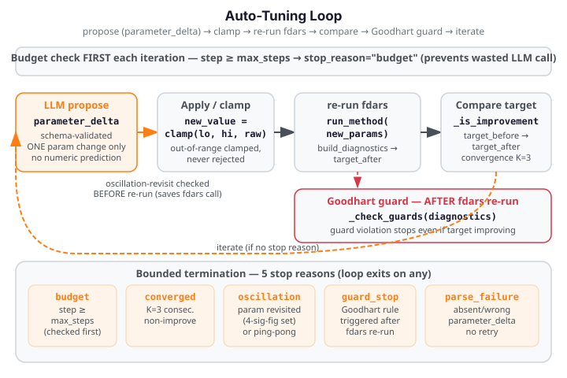

# Closed-Loop Auto-Tuning

Auto-tuning closes the loop between the advisor's diagnostics and fdars parameter
selection: an LLM proposes one parameter change per iteration, fdars re-runs with the new
value, and the loop continues until a bounded termination condition fires. The LLM reasons
about diagnostics — it never touches the numeric computation path directly.

{ .fdars-diagram }

## Method

`auto_tune` orchestrates a bounded propose→apply→clamp→re-run→compare loop. The key
invariants are:

**Bounded termination.** The loop terminates on exactly five conditions, checked in strict
precedence order each iteration:

| Stop reason | Condition |
|---|---|
| `"budget"` | `step >= max_steps` (hard cap; max 20) |
| `"parse_failure"` | LLM proposal missing, wrong param name, or non-numeric `new_value` |
| `"oscillation"` | Proposed param value already visited (before the fdars re-run, saving a wasted call) |
| `"guard_stop"` | A Goodhart-guard metric threshold exceeded (after the fdars re-run) |
| `"converged"` | No improvement for `no_improve_window` consecutive steps |

**Schema-validated numeric boundary (grounding invariant).** The LLM's only numeric
contribution to the loop is `Recommendation.parameter_delta.new_value` — a schema-validated
field in the `parameter_proposal` task family. This value is:

1. Read from the schema-validated `parameter_delta` field — never parsed from prose.
2. Clamped to the declared parameter range: `max(lo, min(hi, raw_value))`. Out-of-range
   proposals are always clamped, never rejected.
3. Int-cast when the parameter type is `int`.
4. The single number from the LLM that ever enters the fdars numeric path.

**Goodhart guard.** After each fdars re-run, deterministic Python guard rules check whether
the tuning has caused a secondary metric to degrade beyond a safe threshold. If a guard
fires, the loop exits with `stop_reason="guard_stop"` — even when the primary target metric
is still improving. This prevents Goodhart's Law scenarios where optimising one metric
breaks another.

**Offline and injectable.** For docs, CI, and offline use the `_run_method` and
`_build_diagnostics` seams replace the real fdars calls. `provider` accepts any object
satisfying the `Provider` protocol, including an offline `FakeProvider`. No API key
or network connection is needed in offline mode.

**Tuneable methods.** The following fdars method families are tuneable:

| Method | Tuned parameter | Range | Target metric |
|---|---|---|---|
| `"smoothing"` | `n_basis` (`int`) | 4–60 | `optimal_gcv` (lower) |
| `"basis"` | `lambda_` (`float`) | 1e-6–1e4 | `optimal_edf` (lower) |
| `"fpca"` | `n_comp` (`int`) | 1–20 | `cumulative_variance_explained` (higher) |
| `"clustering"` | `k` (`int`) | 2–15 | `mean_amplitude_separation` (higher) |

`"alignment"` and `"depth"` are not tuneable and raise `ValueError`.

## Worked example

The fence below runs a two-step auto-tuning loop offline using injectable seams — no
network call and no API key needed. A `FakeProvider` returns a valid
schema-validated proposal; `_run_method` and `_build_diagnostics` replace the real fdars
calls with synthetic results.

```python exec="1" html="1" source="above"
from fdars.advisor import auto_tune
from fdars.advisor._schema import Advice, Recommendation, TuneProposal

# FakeProvider: satisfies the Provider protocol without any network call
class FakeProvider:
    name = "fake"
    model = "fake-model"
    supports_native_structured_output = True

    def __init__(self, response_fn):
        self._response_fn = response_fn

    def complete_structured(self, model_cls, messages, system):
        return self._response_fn(model_cls, messages, system)


def _fake_response(model_cls, messages, system):
    """Propose n_basis=20 (within [4, 60]) — purely qualitative rationale."""
    return Advice(
        interpretation="GCV is currently above target; a larger basis may fit better.",
        recommendations=[
            Recommendation(
                action="increase n_basis",
                kind="parameter",
                rationale="the current basis count appears insufficient for the signal complexity",
                expected_effect="should improve GCV",
                evidence=["the diagnostic value indicates adjustment is warranted"],
                parameter_delta=TuneProposal(
                    param="n_basis",
                    new_value=20.0,
                    rationale="increase basis count to capture more variation",
                ),
            )
        ],
        caveats=[],
    )


call_count = [0]
gcv_values = [0.15, 0.10]  # step 0 → 0.15, step 1 → 0.10

def _fake_run_method(dataset_id, method, **params):
    return {"synthetic": True, "method": method, "params": params}

def _fake_build_diagnostics(result, method, argvals=None, **kwargs):
    idx = min(call_count[0], len(gcv_values) - 1)
    call_count[0] += 1
    return {"optimal_gcv": gcv_values[idx], "optimal_edf": 10.0 + call_count[0]}


tune_result = auto_tune(
    "synthetic_dataset",
    "smoothing",
    max_steps=2,
    provider=FakeProvider(_fake_response),
    _run_method=_fake_run_method,
    _build_diagnostics=_fake_build_diagnostics,
    n_basis=15,  # initial value
)

print(f"stop_reason:          {tune_result.trace.stop_reason}")
print(f"improved:             {tune_result.improved}")
print(f"initial_gcv:          {tune_result.initial_target_value:.4f}")
print(f"final_gcv:            {tune_result.final_target_value:.4f}")
print(f"steps taken:          {len(tune_result.trace.steps)}")
print("FDARS_FENCE_OK")
```

---

## Functions

### `auto_tune`

```
auto_tune(dataset_id, method, *, target_metric=None, max_steps=10,
          domain_context="", model="claude-opus-4-8", provider=None,
          guard=True, _run_method=None, _build_diagnostics=None,
          **initial_params) -> TuneResult
```

Run the closed-loop tuning orchestrator with an LLM-backed proposal function.

**Parameters**

| Parameter | Type | Default | Description |
|---|---|---|---|
| `dataset_id` | `str` | — | Opaque dataset handle registered in the MCP registry. Any string when using test seams |
| `method` | `str` | — | The fdars method to tune (`"smoothing"`, `"basis"`, `"fpca"`, `"clustering"`) |
| `target_metric` | `str` or `None` | `None` | Diagnostic metric key to optimise. When `None`, the per-method default from `_PARAM_REGISTRY` is used |
| `max_steps` | `int` | `10` | Hard step cap; must be `>= 1`; capped at 20 |
| `domain_context` | `str` | `""` | Free-text domain description passed to `advise()` for each proposal |
| `model` | `str` | `"claude-opus-4-8"` | LLM model identifier |
| `provider` | `str` or Provider or `None` | `None` | LLM provider. `None` uses Anthropic default. Pass a `FakeProvider` for offline testing |
| `guard` | `bool` | `True` | When `True`, Goodhart guard thresholds from `_PARAM_REGISTRY` are applied |
| `_run_method` | `callable` or `None` | `None` | Test seam: replaces the real fdars method call (offline testing) |
| `_build_diagnostics` | `callable` or `None` | `None` | Test seam: replaces the real `build_diagnostics` call |
| `**initial_params` | | | Starting parameter value(s). When omitted the spec default is used (e.g. `n_basis=15` for smoothing) |

**Returns**

`TuneResult` — complete result including:

| Field | Type | Description |
|---|---|---|
| `trace` | `TuningTrace` | Full loop trace with all steps, final diagnostics, and `stop_reason` |
| `improved` | `bool` | Whether the final target value is strictly better than the initial |
| `initial_target_value` | `float` | Target metric value at loop start |
| `final_target_value` | `float` | Target metric value at loop end |
| `improvement_pct` | `float` or `None` | Sign-aware improvement percentage (positive = better) |

`TuningTrace` fields:

| Field | Type | Description |
|---|---|---|
| `steps` | `list[TuningStep]` | Per-iteration step records |
| `final_diagnostics` | `dict` | Diagnostics from the last fdars run |
| `stop_reason` | `str` | One of `"budget"`, `"parse_failure"`, `"oscillation"`, `"guard_stop"`, `"converged"` |

Each `TuningStep`:

| Field | Type | Description |
|---|---|---|
| `param_before` | `dict` | Parameter values before the proposal |
| `param_after` | `dict` | Parameter values after clamping and applying the proposal |
| `target_before` | `float` | Target metric before re-run |
| `target_after` | `float` | Target metric after re-run |
| `accepted` | `bool` | Whether the new value is retained as a genuine improvement |
| `stop_reason` | `str` or `None` | Non-`None` on the final step that triggered termination |
| `guard_violations` | `list[str]` | Guard rule violations that fired on this step |

**Raises**

- `ValueError` — `method` is not tuneable (e.g. `"alignment"`, `"depth"`), `max_steps < 1`, or `method` not in `_PARAM_REGISTRY`.

---

## Caveats

**The LLM proposes; fdars decides.** The LLM's only numeric contribution is
`parameter_delta.new_value`. All numeric computation (re-running fdars, extracting the
target metric, checking guard thresholds) is done by deterministic Python. The LLM cannot
override the guard or the termination logic.

**Out-of-range proposals are clamped, not rejected.** An LLM proposal of `n_basis=100`
with a declared range `[4, 60]` is silently clamped to `60`. The clamped value is recorded
in `TuningStep.param_after`. This avoids a `parse_failure` exit on a numerically reasonable
but range-violating proposal.

**Oscillation check saves fdars calls.** When a proposed parameter value has already been
visited in a previous step (within 4 significant figures for floats), the loop exits with
`stop_reason="oscillation"` **before** running fdars. This avoids a wasted re-run on a
known repeat configuration.

**Goodhart guard fires after the fdars re-run.** The guard metrics (e.g. `phase_leakage_indicator`
for FPCA, `optimal_edf` relative to `n_obs` for smoothing) are checked on the diagnostics
produced by the re-run — not on the proposed parameters. A guard that fires signals that
optimising the target metric has caused a secondary measure to degrade beyond a safe
threshold.

**No LLM retry on parse failure.** When a proposal is missing, has the wrong parameter
name, or contains a non-numeric `new_value`, the loop exits with `stop_reason="parse_failure"`
immediately — the LLM is called exactly once per step.

**`provider` is required for offline use.** Pass an injectable `provider=FakeProvider(...)` to
use `auto_tune` without a network call or API key. The `FakeProvider` must satisfy the
`Provider` protocol: `name` (str), `model` (str), `supports_native_structured_output` (bool),
and `complete_structured(model_cls, messages, system)` method.
