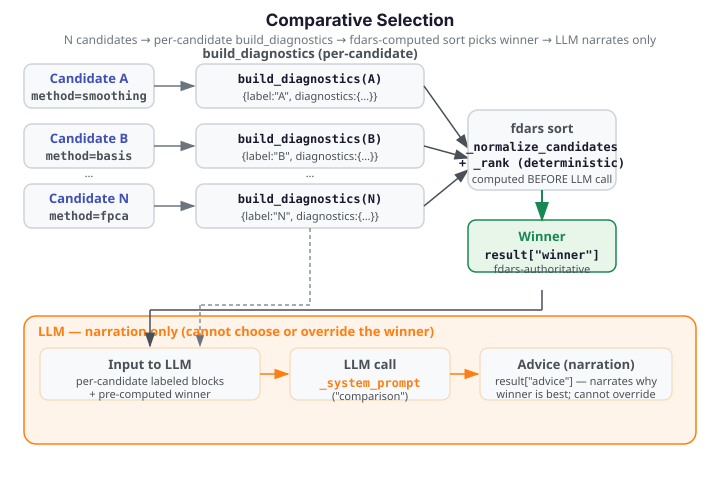

# Comparative Method Selection

When multiple fdars methods are plausible candidates for the same dataset — for example,
choosing between standard FPCA and elastic FPCA, or comparing GCV-based smoothers — the
advisor's comparative selection surface ranks them by a shared diagnostic metric and
identifies the **fdars-determined winner** before any LLM call.

{ .fdars-diagram }

## Method

`compare_methods` accepts N labeled candidate inputs, builds `build_diagnostics` for each
one, and sorts the resulting diagnostics by a shared metric. The ranking is **fully
deterministic and fdars-authoritative**: the winner is fixed by the sort before the LLM is
ever invoked. The LLM only narrates the already-computed ranking — it cannot change the
winner.

**Fdars-authoritative winner invariant (COMPARE-01):** The same inputs always produce the
same winner. The sort is stable so ties are broken by candidate insertion order. Two calls
on the same inputs return an equal `result["winner"]`.

**Incommensurability guard (COMPARE-03):** If candidates span more than one task family
(e.g. mixing clustering and regression results), or if the ranking metric is absent from any
candidate's diagnostics, `compare_methods` raises `ValueError` before producing any ranking.
No candidate is silently dropped or compared on a different metric.

**LLM narration path (run_llm=True):** Each candidate's diagnostics are sent to the LLM in
**separate labeled blocks** — never flat-merged into a single dict. This preserves
per-candidate provenance so the LLM can attribute evidence correctly (COMPARE-02). Union
grounding is checked once against all candidates' diagnostics combined, preventing
fabrication while allowing cross-candidate narration.

## Worked example

The fence below creates two synthetic smoothing candidates (different `n_basis` values) and
ranks them offline without an LLM call. No `ANTHROPIC_API_KEY` is needed — the fence runs
fully offline in the docs build.

```python exec="1" html="1" source="above"
import numpy as np
from fdars.advisor import build_diagnostics, compare_methods

# Small synthetic smoothing results — two candidate B-spline fits
rng = np.random.default_rng(0)
t = np.linspace(0, 1, 60)

# Candidate A: lower GCV (better fit)
diag_a = {
    "method": "smoothing",
    "lambda_values": [0.01, 0.1, 1.0],
    "gcv_curve": [0.12, 0.09, 0.14],
    "edf": [18.0, 12.0, 8.0],
    "gcv_aic_approx": None,
    "gcv_bic_approx": None,
    "optimal_lambda": 0.1,
    "optimal_gcv": 0.09,
    "optimal_edf": 12.0,
}

# Candidate B: higher GCV (worse fit)
diag_b = {
    "method": "smoothing",
    "lambda_values": [0.01, 0.1, 1.0],
    "gcv_curve": [0.18, 0.15, 0.22],
    "edf": [20.0, 15.0, 10.0],
    "gcv_aic_approx": None,
    "gcv_bic_approx": None,
    "optimal_lambda": 0.1,
    "optimal_gcv": 0.15,
    "optimal_edf": 15.0,
}

result = compare_methods(
    {"n_basis_10": diag_a, "n_basis_15": diag_b},
    metric="optimal_gcv",  # lower is better
    run_llm=False,
)

print(f"Task family:  {result['method']}")
print(f"Metric:       {result['metric']}")
print(f"Winner:       {result['winner']}")
for rank, entry in enumerate(result["ranking"], 1):
    print(f"  Rank {rank}: {entry['label']}  optimal_gcv={entry['metric_value']:.4f}")
print("FDARS_FENCE_OK")
```

---

## Functions

### `compare_methods`

```
compare_methods(candidates, method=None, *, metric=None, domain_context="",
                model="claude-opus-4-8", provider=None, run_llm=True,
                argvals=None, **kwargs) -> dict
```

Rank candidate fdars methods by a shared diagnostic metric. The winner is
determined by a deterministic fdars-computed sort — the LLM never chooses the
winner.

**Candidate input forms:**

| Form | Example |
|---|---|
| `dict` mapping label → value | `{"cand_a": diag_a, "cand_b": diag_b}` |
| List of (label, value) tuples | `[("cand_a", diag_a), ("cand_b", diag_b)]` |
| List of spec dicts with `"label"` key | `[{"label": "a", "value": diag_a}, ...]` |

Each *value* is either a **pre-built diagnostics dict** (has a `"method"` key — passed
through unchanged) or a **raw fdars result dict** (no `"method"` key — passed to
`build_diagnostics(value, method, ...)`). When passing raw result dicts, the `method`
parameter is required.

**Parameters**

| Parameter | Type | Default | Description |
|---|---|---|---|
| `candidates` | `dict` or `list` | — | Labeled candidate inputs (see forms above) |
| `method` | `str` or `None` | `None` | Task family (required when any candidate is a raw result dict without a `"method"` key) |
| `metric` | `str` or `None` | `None` | Ranking metric key. When omitted the per-family default is used (see table below) |
| `domain_context` | `str` | `""` | Free-text domain description forwarded to LLM narration (`run_llm=True` only) |
| `model` | `str` | `"claude-opus-4-8"` | LLM model identifier (`run_llm=True` only) |
| `provider` | `str` or Provider or `None` | `None` | LLM provider (`run_llm=True` only) |
| `run_llm` | `bool` | `True` | When `False`, return the raw deterministic ranking dict offline; no LLM call |
| `argvals` | `array_like` | `None` | Forwarded to `build_diagnostics` for raw result dicts (e.g. clustering/alignment aspects require `argvals` for distance metrics) |

**Returns**

```python
{
    "method": "<task family str>",
    "metric": "<metric key str>",
    "ranking": [
        {"label": <str>, "method": <str>,
         "metric_value": <float>, "diagnostics": <dict>},
        ...  # ordered best -> worst
    ],
    "winner": "<best label str>",
    # "advice": Advice  (only present when run_llm=True)
}
```

**Per-family default metrics**

| Task family | Default metric | Direction |
|---|---|---|
| `"clustering"` | `mean_amplitude_separation` | higher is better |
| `"smoothing"` | `optimal_gcv` | lower is better |
| `"basis"` | `optimal_edf` | lower is better |
| `"regression_cv"` | `min_cv_error` | lower is better |
| `"regression"` | `r_squared` | higher is better |
| `"scoring"` | `functional_mse` | lower is better |
| `"fpca"` | `cumulative_variance_explained` | higher is better |

**Raises**

- `ValueError` — empty candidates, unknown or missing metric, mixed task families, or metric absent from any candidate (COMPARE-03).
- `GroundingViolationError` — when `run_llm=True` and the LLM narration cites a value absent from all candidates' diagnostics.

---

## Caveats

**All candidates must share the same task family.** Comparing, for example, a clustering
result against a regression result raises `ValueError` before any ranking. The guard is
fail-closed: no partial ranking is returned.

**The LLM narrates; fdars ranks.** When `run_llm=True` the LLM receives the fdars-computed
ranking and winner, then narrates them. It cannot override the winner declared in
`result["winner"]`.

**`argvals` is required for distance-based metrics.** For `"clustering"` or `"alignment"`
aspects, `mean_amplitude_separation` (and related distance keys) are `None` when `argvals`
is not supplied. Passing `argvals` to `compare_methods` forwards it to each
`build_diagnostics` call automatically.

**`cumulative_variance_explained` (fpca) is list-valued.** The ranker extracts the last
element (total cumulative variance) as the scalar for comparison. Ensure the FPCA result
includes enough components for a meaningful last-element value.
