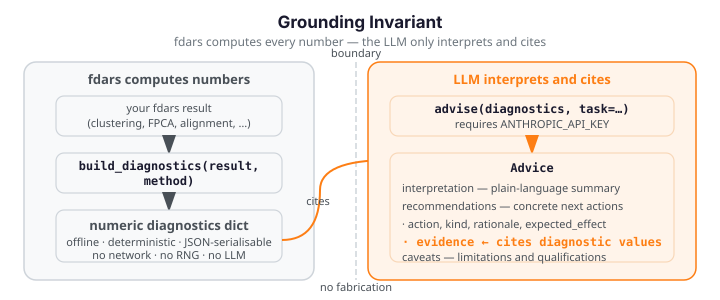
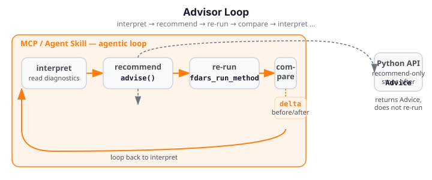

# AI Advisor

<div class="fdars-section-hero" markdown>
The fdars AI Advisor is a **grounded analysis advisor** that interprets computed fdars
diagnostics and recommends concrete parameter or method changes. Every number it
cites comes from fdars — the LLM never fabricates values.
</div>

## Grounding Invariant

fdars computes every number. The LLM only interprets and cites those values — it never fabricates numbers.

{ .fdars-diagram }

**fdars computes every number via `build_diagnostics` — offline and deterministic.**
**The LLM in `advise` only interprets and cites those diagnostic values in each**
**`Recommendation`'s `evidence` field. It never fabricates numbers.**

The invariant is enforced at two levels:

- **Schema:** `Recommendation.evidence` is a required `list[str]` field in the
  Pydantic model. The LLM cannot omit it; every recommendation must cite specific
  values present in the diagnostics dict.
- **System prompt:** the grounding prompt instructs the model to include at least
  one evidence item per recommendation, to omit any claim not supported by a
  provided value, and to never estimate or assume numerical results not explicitly
  given in the diagnostics.

## What the Advisor Does

The advisor works in two stages:

1. **Offline diagnostics** — `build_diagnostics(result, method)` takes your fdars
   result dict and computes a deterministic, JSON-serialisable diagnostics dict from
   fdars and NumPy only. No network call, no API key, no randomness. Two calls on
   the same input return the same dict. All 12 fdars aspects are covered —
   clustering, smoothing, alignment, basis, fpca, represent, depth, outliers,
   classification, regression, regression_cv, and spm — see
   [Per-Aspect Coverage](aspects.md) for the full diagnostics key sets.

2. **Grounded interpretation** — `advise(diagnostics, task=…)` routes those
   diagnostics through a uniform Provider protocol to any of four LLM backends
   (Anthropic, OpenAI/OpenAI-compatible, Google Gemini, or local Ollama) with a
   grounding-invariant system prompt, and returns a schema-validated `Advice` object
   whose every `Recommendation` cites specific values from the diagnostics dict.
   See [Provider Setup](providers.md) for backend selection and credentials.

The `describe_cluster_differences` function is a convenience wrapper that runs
both stages in sequence for clustering results.

## Three Surfaces

### Python API

The Python API is the **recommend-only** surface. Call `build_diagnostics` to
produce the offline diagnostics report, then call `advise` (or
`describe_cluster_differences`) to get a schema-validated `Advice` object with
`interpretation`, `recommendations`, and `caveats`. The Python API returns
`Advice` and stops — it does not re-run fdars or compute a before/after delta.

See [Python API](python-api.md) for worked examples.

### MCP Server

The MCP server exposes the advisor as three composable tools over stdio:

- `fdars_build_diagnostics` — builds offline diagnostics from a registered dataset
  handle (no API key required). Covers all 12 `build_diagnostics` aspects.
- `fdars_run_method` — runs an fdars method and returns an opaque result
  handle. Arrays stay in-process; only the handle ID is returned.
- `fdars_compare_run` — re-runs the method with new parameters and returns a
  before/after `delta` dict of scalar numeric differences — all fdars-computed.

The MCP surface supports the full agentic loop: interpret → recommend → re-run →
compare → interpret again.

See [MCP Server](mcp.md) for the tool reference.

### Agent Skill

The Agent Skill (`fdars-advisor`) packages the full interpret → recommend →
re-run → compare walkthrough as a reusable Claude skill. It orchestrates the MCP
tools automatically and produces a before/after delta block alongside the grounded
recommendations. Install via git URL until the `[mcp,advisor]` extras ship to PyPI.

See [Agent Skill](agent-skill.md) for the walkthrough.

## When to Use the Advisor

Use the advisor when you need:

- **Parameter tuning** — guidance on `lambda_`, `n_basis`, `n_comp`, cluster `k`,
  or alignment bandwidth, grounded in your diagnostic values.
- **Method choice** — to identify when the chosen method is a poor fit
  (e.g. linear FPCA absorbing phase variation) and to get a concrete alternative.
- **Interpreting diagnostics** — plain-language explanations of amplitude/phase
  balance, convergence, GCV curves, and explained variance.
- **Before/after comparison** — to confirm that an applied change improved the
  result by comparing the diagnostics delta across two runs.

## How It Works

The full agentic workflow forms a closed loop:

{ .fdars-diagram }

The **Python API** exits the loop after the *recommend* step — it returns an
`Advice` object and stops. The **MCP server** and **Agent Skill** continue through
*re-run* (`fdars_run_method`) and *compare* (`fdars_compare_run`), then feed the
updated diagnostics back into *interpret* for the next iteration.

## Installation

!!! info "Optional extras"

    The advisor is split into focused optional extras so you only install what you
    need. The core extra enables the Anthropic backend (default); additional extras
    unlock the other providers.

```bash
# Python API — Anthropic backend (default):
pip install "fdars[advisor]"

# OpenAI or OpenAI-compatible endpoints (vLLM, LM Studio, LocalAI):
pip install "fdars[openai]"

# Google Gemini (Python 3.10+ required):
pip install "fdars[gemini]"

# Local Ollama (no API key required):
pip install "fdars[ollama]"

# All four provider backends at once:
pip install "fdars[all-providers]"

# MCP server and Agent Skill (Python 3.10+ required):
pip install "fdars[mcp,advisor]"
```

The `[advisor]` extra installs `anthropic>=0.72.0` and `pydantic>=2.0`.
The `[mcp]` extra additionally installs `mcp>=2.0.0` and requires Python 3.10+.

See [Provider Setup](providers.md) for backend selection, environment variables,
and credential precedence.

!!! info "Offline core vs. env-gated LLM"

    `build_diagnostics` and the `run_llm=False` path of `describe_cluster_differences`
    work **fully offline** — no API key, no network connection. The grounded
    interpretation step (`advise`) requires the selected provider's credential to be
    set in your environment (none required for local Ollama). If the credential is
    absent the function raises a clear `ImportError` with the install hint.
