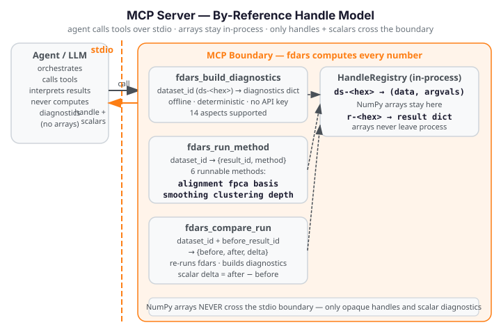

# MCP Server

!!! warning "Illustrative fences — not run in the docs build"
    All Python fences on this page are **illustrative only**. They require
    `pip install "fdars[mcp,advisor]"` (`mcp>=2.0.0`, Python 3.10+) and are
    **not** executed during the docs build. The docs build does not depend on
    the `[mcp]` extra or Python 3.10+.

The fdars-advisor MCP server extends the [Python API](python-api.md) with the
full interpret → recommend → **re-run → compare** agentic loop. Where the
Python API returns an `Advice` object and stops, the MCP server gives a
language model three composable tools so it can re-run fdars with adjusted
parameters and observe a deterministic, fdars-computed before/after delta —
without any fabricated numbers ever crossing the tool boundary.

See the [overview](index.md) for the grounding invariant and the three-surface
architecture. The [Agent Skill](agent-skill.md) page
documents the packaged skill that orchestrates these tools automatically.

{ .fdars-diagram }

---

## Handle model

The MCP server uses a **by-reference `HandleRegistry`** to keep large NumPy
arrays inside the process and out of the JSON transport layer.

### How handles work

Before calling any tool, the client registers a dataset (observation matrix +
evaluation grid) by calling `registry.store_dataset(data, argvals)`. The
registry stores the arrays in-process and returns an opaque **dataset handle**
of the form `ds-<8-hex-chars>`. From that point on, tools exchange only the
handle string — the arrays never appear in JSON output.

When a tool runs an fdars method and produces a result dict, the raw result
(which may contain NumPy arrays) is stored via `registry.store_result(result)`,
returning a **result handle** of the form `r-<8-hex-chars>`. Only this handle
— and scalar diagnostic values — ever cross the tool boundary.

```python
from fdars.mcp._registry import registry

# Register the dataset once before calling any tool
dataset_id = registry.store_dataset(data, argvals)
# dataset_id is e.g. "ds-3fa2c1b4"

# After a tool run, retrieve the stored result if needed in-process
result = registry.get_result(result_id)
```

### Registry methods

| Method | Signature | Returns |
|---|---|---|
| `store_dataset` | `store_dataset(data, argvals) -> str` | Dataset handle `ds-<hex>` |
| `get_dataset` | `get_dataset(ds_id) -> (data, argvals)` | `(np.ndarray, np.ndarray)` tuple |
| `store_result` | `store_result(result) -> str` | Result handle `r-<hex>` |
| `get_result` | `get_result(r_id) -> dict` | Stored result dict |
| `clear` | `clear() -> None` | Clears all datasets and results |

### Why by-reference

The grounding invariant requires that fdars computes every number. The
by-reference model enforces an additional **efficiency and grounding property**:
large NumPy arrays — smoothed curves, FPCA scores, cluster centers — stay in
the in-process registry and only opaque handle strings + scalar diagnostics
travel as JSON over the stdio transport. This keeps the tool boundary clean,
prevents arrays from being fabricated or rounded in transit, and avoids
serialising potentially megabyte-scale matrices into MCP messages.

The registry is a module-level singleton (`registry = HandleRegistry()` in
`fdars.mcp._registry`). Client and server share the same in-process dict over
stdio, so a handle registered before launching `run_stdio()` is immediately
accessible to all tool handlers.

---

## stdio setup

The fdars-advisor MCP server communicates over **stdio only** (v2.0). Start the
server with `run_stdio()` — the console-script entry point that blocks until
stdin is closed:

```python
from fdars.mcp.server import run_stdio

# Blocks — call from a console-script or __main__ guard, never from a tool handler
run_stdio()
```

The installed package registers a `fdars-mcp-server` console script that calls
`run_stdio()` directly. A client (e.g. Claude Desktop or a custom MCP host)
launches this process and communicates over stdin/stdout:

```bash
# Install the MCP extra (Python 3.10+ required):
pip install "fdars[mcp,advisor]"

# Start the server — the client writes JSON-RPC to its stdin and reads from stdout:
fdars-mcp-server
```

`run_stdio()` calls `mcp.run(transport="stdio")` on the `MCPServer("fdars-advisor")`
instance. The tool handlers (`fdars_build_diagnostics`, `fdars_run_method`,
`fdars_compare_run`) are **transport-agnostic** — they do not reference stdio in any
way. A future HTTP/SSE transport would only require changing the transport argument
in `run_stdio`, not in any tool code.

---

## Tools

Three tools are exposed over MCP. All tool handlers are synchronous (`def`, not
`async def`) — fdars methods are synchronous Rust calls via PyO3, and wrapping
in an executor is unnecessary.

**Supported methods** (all three tools):
`"alignment"`, `"fpca"`, `"basis"`, `"smoothing"`, `"clustering"` (case-insensitive).

---

### `fdars_build_diagnostics`

Build offline diagnostics for an fdars dataset or result. Delegates to
`advisor.build_diagnostics` — deterministic, offline, no API key required.

**Parameters**

| Parameter | Type | Default | Description |
|---|---|---|---|
| `dataset_id` | `str` | — | Handle to the registered dataset. Obtain via `registry.store_dataset(data, argvals)`. |
| `method` | `str` | — | One of `"alignment"`, `"fpca"`, `"basis"`, `"smoothing"`, `"clustering"`. |
| `result_id` | `str` or `None` | `None` | Handle to a stored result dict (e.g. from a prior `fdars_run_method` call). When `None`, the raw dataset data matrix is used as the result input. |
| `with_argvals` | `bool` | `True` | When `True`, passes the dataset's `argvals` array to `build_diagnostics` for distance metrics. |

**Returns**

A JSON-serialisable `dict` — the same shape as `advisor.build_diagnostics` output (per-method keys;
see the [Python API](python-api.md) for the key inventory per method). The diagnostics dict is also
stored as a new result handle in the registry (available via `registry.get_result`), though the
handle is not returned.

**Raises**

`ValueError` if `method` is not in the supported set.
`KeyError` if `dataset_id` or `result_id` is not found in the registry.

---

### `fdars_run_method`

Run any of the six supported fdars methods on a registered dataset. Returns
**only** an opaque result handle and the method name — arrays never leave the
tool boundary.

**Parameters**

| Parameter | Type | Default | Description |
|---|---|---|---|
| `dataset_id` | `str` | — | Opaque handle returned by `registry.store_dataset(data, argvals)`. The dataset must be pre-registered. |
| `method` | `str` | — | One of `"alignment"`, `"fpca"`, `"basis"`, `"smoothing"`, `"clustering"`. Case-insensitive. |
| `lambda_` | `float` or `None` | `None` | Warp penalty for `alignment` (default `0.0`) or regularisation for `smoothing`. Ignored for `fpca`, `basis`, `clustering`. |
| `n_basis` | `int` or `None` | `None` | Number of B-spline basis functions for `smoothing` (`pspline_fit_gcv`). Default `15`. Ignored for other methods. |
| `n_comp` | `int` or `None` | `None` | Number of FPCA components for `fpca`. Default `3`. Ignored for other methods. |
| `k` | `int` or `None` | `None` | Number of clusters for `clustering` (`kmeans_fd`). Default `3`. Ignored for other methods. |
| `seed` | `int` or `None` | `None` | RNG seed for `clustering`. Default `42`. Ignored for other methods. |

**Returns**

```python
{"result_id": str, "method": str}
```

The raw fdars result — which may contain NumPy arrays — is stored in the
registry under `result_id`. **Only the handle string and the method name are
returned.** Arrays never appear in JSON output (by-reference invariant).

**Per-method parameter mapping** (only the listed parameter is used; others are silently ignored):

| Method | fdars function | Active parameter(s) | Default(s) |
|---|---|---|---|
| `alignment` | `fdars.alignment.karcher_mean` | `lambda_` | `0.0` |
| `fpca` | `fdars.regression.fpca` | `n_comp` | `3` |
| `basis` | `fdars.basis.basis_nbasis_cv` | `lambda_` | `1.0` |
| `smoothing` | `fdars.basis.pspline_fit_gcv` | `n_basis` | `15` |
| `clustering` | `fdars.clustering.kmeans_fd` | `k`, `seed` | `3`, `42` |

**Raises**

`ValueError` if `method` is not in the supported set.
`KeyError` if `dataset_id` is not in the registry.

---

### `fdars_compare_run`

Re-run an fdars method with new parameters and return a deterministic before/after delta.
This is the TOOL-03 agentic re-run/compare tool — the key difference between the MCP surface
and the recommend-only Python API.

**Parameters**

| Parameter | Type | Default | Description |
|---|---|---|---|
| `dataset_id` | `str` | — | Opaque handle for the registered dataset. |
| `method` | `str` | — | One of `"alignment"`, `"fpca"`, `"basis"`, `"smoothing"`, `"clustering"`. |
| `before_result_id` | `str` | — | Handle ID for the prior run result (from `fdars_run_method` or `fdars_build_diagnostics`). |
| `lambda_` | `float` or `None` | `None` | After-run warp penalty for `alignment` or regularisation for `smoothing`. |
| `n_basis` | `int` or `None` | `None` | After-run basis function count for `smoothing`. Default `15`. |
| `n_comp` | `int` or `None` | `None` | After-run FPCA component count for `fpca`. Default `3`. |
| `k` | `int` or `None` | `None` | After-run cluster count for `clustering`. Default `3`. |
| `seed` | `int` or `None` | `None` | After-run RNG seed for `clustering`. Default `42`. |

**Returns**

A JSON-serialisable dict with five keys:

| Key | Type | Description |
|---|---|---|
| `before_result_id` | `str` | The handle ID of the before result (same as the input argument). |
| `after_result_id` | `str` | The handle ID of the newly stored after result. |
| `before` | `dict` | Full diagnostics dict from `advisor.build_diagnostics` for the before run. |
| `after` | `dict` | Full diagnostics dict from `advisor.build_diagnostics` for the after run. |
| `delta` | `dict` | Scalar numeric differences: `after[key] - before[key]` for every key where both values are a finite `float` or `int` (booleans excluded). |

The `delta` dict is the **observable**: every value is fdars-computed. An empty
`delta` means no finite scalar keys were shared between the two diagnostics dicts.

**Raises**

`ValueError` if `method` is not in the supported set, or if an after-parameter key is not in
`{"lambda_", "n_basis", "n_comp", "k", "seed"}`.
`KeyError` if `dataset_id` or `before_result_id` is not in the registry.

---

## Re-run / compare loop

The following example mirrors `examples/mcp_recipe.py` — the canonical
register → run → compare recipe shipped with the package. It uses the
Canadian Weather dataset (35 weather stations × 365 daily temperature points).

### Step 1 — Register the dataset

```python
import numpy as np
from fdars import datasets
from fdars.mcp._registry import registry

# Load the Canadian Weather dataset
ds = datasets.load_canadian_weather()
X = np.asarray(ds.data.data, dtype=float)    # shape (35, 365)
day = np.asarray(ds.argvals, dtype=float)    # shape (365,) — day-of-year grid

# Register in the handle registry before calling any tool
dataset_id = registry.store_dataset(X, day)
# dataset_id is e.g. "ds-3fa2c1b4"
```

### Step 2 — Run the before method

Call `fdars_run_method` (or the underlying `run_method` directly) with
`method="smoothing"` and `n_basis=15`. The tool maps `smoothing` to
`fdars.basis.pspline_fit_gcv`, stores the raw result in the registry, and
returns only the result handle:

```python
from fdars.mcp.server import fdars_run_method

before_handle = fdars_run_method(dataset_id, method="smoothing", n_basis=15)
# Returns: {"result_id": "r-a1b2c3d4", "method": "smoothing"}

before_result_id = before_handle["result_id"]
```

The raw result (fitted curves, EDF, GCV value, AIC, BIC) stays in the
registry. Only the handle ID crosses the tool boundary.

### Step 3 — Compare with new parameters

Call `fdars_compare_run` with the same dataset, the same method, the before
result handle, and the new after-parameter (`n_basis=25` — more basis
functions, potentially smoother fit):

```python
from fdars.mcp.server import fdars_compare_run

compare_result = fdars_compare_run(
    dataset_id,
    method="smoothing",
    before_result_id=before_result_id,
    n_basis=25,
)
```

`fdars_compare_run` re-runs `pspline_fit_gcv` with `n_basis=25`, builds
diagnostics for both the before and after runs via `advisor.build_diagnostics`,
and returns the full before/after dicts plus the scalar `delta`.

### Step 4 — Read the observable delta

```python
after_result_id = compare_result["after_result_id"]
before_diag = compare_result["before"]   # full diagnostics, n_basis=15 run
after_diag = compare_result["after"]    # full diagnostics, n_basis=25 run
delta = compare_result["delta"]          # after - before, finite scalar keys only

# delta contains scalar keys such as:
#   {"optimal_edf": 2.3, "optimal_gcv": -0.04, ...}
# Every value is fdars-computed — no fabricated numbers.

print(f"Delta [{len(delta)} scalar keys]:")
for key, change in delta.items():
    sign = "+" if change >= 0 else ""
    print(f"  {key}: {sign}{change:.6f}")
```

The delta covers every key present in both the before and after diagnostics
where both values are a finite scalar `float` or `int` (booleans and
non-scalar values are excluded). For `smoothing` via `pspline_fit_gcv`, the
scalar diagnostic keys typically include `optimal_edf`, `optimal_gcv`, `rss`,
`aic`, and `bic` — all fdars-computed, none fabricated.

### The closed loop

After reading the delta, a language model can feed the updated `after`
diagnostics back into `fdars_build_diagnostics` (for a fresh interpretation
pass) or call `fdars_compare_run` again with another parameter change — forming
the full **interpret → recommend → re-run → compare** loop described in the
[overview](index.md).

---

## Next steps

- [Python API](python-api.md) — the recommend-only surface (`build_diagnostics` + `advise`)
- [Overview](index.md) — grounding invariant and three-surface architecture
- [Agent Skill](agent-skill.md) — the packaged skill that orchestrates these tools automatically
