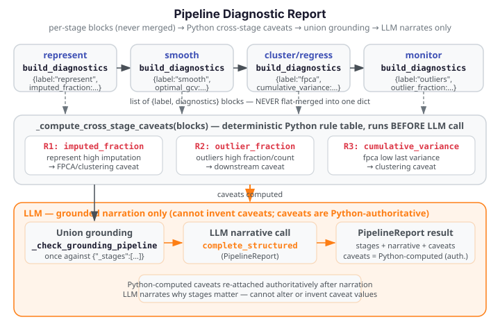

# Pipeline Diagnostic Report

A typical FDA workflow is a multi-stage pipeline: represent the raw data, smooth or align
curves, decompose with FPCA, then cluster or regress. Diagnostics from each stage provide
complementary information — and issues upstream (high missingness, many outliers, low
cumulative variance) propagate silently into downstream results unless they are surfaced
explicitly.

The pipeline diagnostic report aggregates per-stage diagnostics into an ordered, labeled
report. Cross-stage caveats are computed by **deterministic Python rules** before any LLM
call — the LLM narrates them but never invents them.

{ .fdars-diagram }

## Method

`build_pipeline_report` accepts an ordered list of stage entries, runs `build_diagnostics`
per stage (or accepts pre-built diagnostics dicts), and returns per-stage labeled blocks.

**Aggregation invariant:** Each stage's diagnostics live in their own labeled block —
`{"stage": str, "aspect": str, "diagnostics": dict}`. They are **never flat-merged**. Two
stages that share a key (e.g. `n_obs`) both survive with their individual values. A plain
`dict.update` or `{**a, **b}` would silently overwrite earlier values; this is prevented by
the list structure.

**Python-computed cross-stage caveats (PIPE-03):** Three deterministic rules fire before
the LLM call:

| Rule | Trigger | Caveat |
|---|---|---|
| R1 | `represent` stage: `imputed_fraction > 0.20` | High imputation rate may bias FPCA and clustering |
| R2 | `outliers` stage: derived outlier fraction `> 0.15` | Substantial outlier rate distorts downstream FPCA, clustering, regression |
| R3 | `fpca` stage: last `cumulative_variance_explained < 0.80` | Subspace captures too little variance for reliable clustering |

These caveats are **authoritative** — the LLM only narrates them; it cannot invent
additional caveats beyond these Python-computed ones.

**Union grounding:** Grounding is checked once against the union of all stages' diagnostics
(`{"_stages": [<diag>, ...]}`). A cited value is grounded when it appears in any stage's
diagnostics, allowing legitimate cross-stage narration (e.g. citing FPCA cumulative
variance in the context of a clustering caveat) without false rejection.

## Worked example

The fence below builds a synthetic three-stage pipeline (represent → fpca → clustering)
and runs the offline pipeline report. No `ANTHROPIC_API_KEY` is needed — the fence runs
fully offline in the docs build.

```python exec="1" html="1" source="above"
import numpy as np
from fdars.advisor import build_diagnostics, build_pipeline_report

# Small synthetic data (n=12 observations, m=50 grid points)
rng = np.random.default_rng(7)
n, m = 12, 50
t = np.linspace(0, 1, m)
X = np.array([np.sin(2 * np.pi * t + rng.uniform(-0.3, 0.3)) for _ in range(n)])

# Stage 1: represent diagnostics (pre-built)
diag_represent = {
    "method": "represent",
    "n_obs": n,
    "n_points": m,
    "argvals_min": 0.0,
    "argvals_max": 1.0,
    "argvals_spacing_mean": 1.0 / (m - 1),
    "argvals_spacing_std": 0.0,
    "is_uniform_grid": True,
    "data_range_min": float(X.min()),
    "data_range_max": float(X.max()),
    "data_range_mean": float(X.mean()),
    "nan_frac": None,
    "has_boundary_nans": None,
    "imputation_method": None,
    "imputed_fraction": None,
}

# Stage 2: FPCA diagnostics (pre-built)
from fdars import regression
fp = regression.fpca(X, t, n_comp=3)
diag_fpca = build_diagnostics(fp, method="fpca")

# Stage 3: clustering diagnostics (pre-built)
from fdars.clustering import kmeans_fd
cl = kmeans_fd(X, t, k=3, seed=0)
diag_cluster = build_diagnostics(cl, method="clustering", argvals=t)

stages = [
    {"stage_name": "represent", "aspect": "represent", "diagnostics": diag_represent},
    {"stage_name": "fpca",      "aspect": "fpca",      "diagnostics": diag_fpca},
    {"stage_name": "cluster",   "aspect": "clustering", "diagnostics": diag_cluster},
]

report = build_pipeline_report(stages, run_llm=False)

for block in report["stages"]:
    stage = block["stage"]
    aspect = block["aspect"]
    diag = block["diagnostics"]
    if aspect == "fpca":
        cv = diag["cumulative_variance_explained"]
        print(f"Stage '{stage}': cumulative_variance_explained[-1]={cv[-1]:.4f}")
    elif aspect == "clustering":
        amp = diag["mean_amplitude_separation"]
        print(f"Stage '{stage}': mean_amplitude_separation={amp:.4f}")
    else:
        print(f"Stage '{stage}': n_obs={diag['n_obs']}, is_uniform_grid={diag['is_uniform_grid']}")

print("cross_stage_caveats:", len(report.get("caveats", [])))
print("FDARS_FENCE_OK")
```

---

## Functions

### `build_pipeline_report`

```
build_pipeline_report(stages, *, argvals=None, run_llm=True,
                      domain_context="", model="claude-opus-4-8",
                      provider=None, **kwargs) -> dict
```

Aggregate per-stage diagnostics into an offline pipeline diagnostic report.

**Stage entry schema:** each entry in `stages` must be a `dict` with:

| Key | Type | Description |
|---|---|---|
| `"stage_name"` | `str` | Human-readable label (e.g. `"represent"`, `"smooth"`, `"fpca"`, `"cluster"`) |
| `"aspect"` | `str` | `build_diagnostics` aspect key for this stage |
| `"diagnostics"` / `"result"` / `"value"` | `dict` | Pre-built diagnostics dict (has `"method"` key) or raw fdars result dict |

When the stage value is a **pre-built diagnostics dict** (has a `"method"` key), it is
passed through without re-running `build_diagnostics`. When it is a **raw fdars result
dict**, `build_diagnostics(value, aspect, argvals=argvals, **kwargs)` is called.

**Parameters**

| Parameter | Type | Default | Description |
|---|---|---|---|
| `stages` | `list` | — | Ordered list of stage entry dicts |
| `argvals` | `array_like` | `None` | Shared evaluation grid forwarded to `build_diagnostics` (required for clustering/alignment aspects) |
| `run_llm` | `bool` | `True` | When `False`, return the raw aggregated dict of per-stage blocks offline |
| `domain_context` | `str` | `""` | Free-text domain description forwarded to LLM narration (`run_llm=True` only) |
| `model` | `str` | `"claude-opus-4-8"` | LLM model identifier |
| `provider` | `str` or Provider or `None` | `None` | LLM provider |

**Returns (offline, `run_llm=False`)**

```python
{
    "stages": [
        {"stage": <str>, "aspect": <str>, "diagnostics": <dict>},
        ...  # one labeled block per input stage, in caller order
    ]
}
```

**Returns (LLM path, `run_llm=True`)**

`PipelineReport` — schema-validated object with:

| Field | Type | Description |
|---|---|---|
| `stages` | `list[str]` | Per-stage narrative sections (one per input stage) |
| `narrative` | `str` | Overall pipeline health summary |
| `caveats` | `list[dict]` | Python-computed cross-stage caveats (authoritative) |

**Raises**

- `ValueError` — `stages` is empty, or a stage entry is missing `"stage_name"` or `"aspect"`.
- `GroundingViolationError` — when `run_llm=True` and the narration cites a value absent from all stages' diagnostics.

---

### `pipeline_report`

```
pipeline_report(stages, *, argvals=None, domain_context="",
                model="claude-opus-4-8", provider=None,
                thresholds=None, **kwargs) -> PipelineReport
```

LLM narrative entry point — called automatically by `build_pipeline_report(run_llm=True)`.
Direct access is useful when you need custom caveat thresholds.

**`thresholds` parameter:** override any of the three Python caveat rule constants for
this call only:

| Key | Default | Rule |
|---|---|---|
| `"imputed_fraction"` | `0.20` | R1 threshold |
| `"outlier_fraction"` | `0.15` | R2 threshold |
| `"cumulative_variance"` | `0.80` | R3 threshold |

---

## Caveats

**Per-stage blocks are never merged.** If two stages both report `n_obs`, both values
survive independently in their own list elements. A caller that flat-merges blocks (e.g.
`{**a, **b}`) risks silently dropping earlier values; use the labeled list structure instead.

**Python caveats are authoritative; LLM caveats are not.** The `caveats` field in the
returned `PipelineReport` always reflects the Python-computed R1/R2/R3 rules — even if
the LLM emitted different caveats. The LLM narrates what Python found; it cannot override.

**`argvals` propagation.** A shared `argvals` grid passed to `build_pipeline_report` is
forwarded to every `build_diagnostics` call for raw result dicts. For pre-built diagnostics
dicts it is ignored (they already carry the computed values). Distance-based metrics
(clustering, alignment) require `argvals` — pass it at the `build_pipeline_report` level
rather than per stage.

**Ordering matters.** Stages are processed in caller order; the LLM is told the stages
represent a pipeline in sequence. Reordering stages changes the caveat computation (R1 and
R3 can interact: a high imputation rate preceding a low-variance FPCA compounds the
downstream clustering reliability concern).
