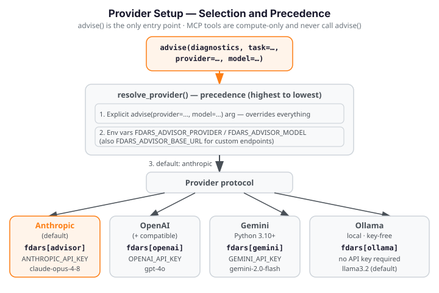

# Provider Setup

The fdars advisor routes every LLM call through a uniform `Provider` protocol.
`advise(provider=, model=)` is the **only** entry point for provider selection —
the MCP tools (`fdars_build_diagnostics`, `fdars_run_method`, `fdars_compare_run`)
are compute-only and never call `advise()`.

Four backends are supported: **Anthropic** (default), **OpenAI** (and
OpenAI-compatible endpoints), **Google Gemini**, and **local Ollama**. The
backend is selected at call time via explicit parameters or environment
variables; no configuration file is required.

{ .fdars-diagram }

---

## Backends

### Anthropic (default)

| Property | Value |
|---|---|
| Provider name | `"anthropic"` |
| Install extra | `pip install "fdars[advisor]"` |
| Required credential | `ANTHROPIC_API_KEY` |
| Default model | `claude-opus-4-8` |

Anthropic is the default backend. When `provider=None` (the default), the
advisor resolves to `"anthropic"` and reads `ANTHROPIC_API_KEY` from the
environment. This is the same behavior as the pre-v3.0 API — existing code
that does not pass `provider=` is unaffected.

The `[advisor]` extra installs `anthropic>=0.72.0` and `pydantic>=2.0`. These
are the only dependencies required for `build_diagnostics` (no LLM, fully
offline) and for `advise()` with the Anthropic backend.

---

### OpenAI and OpenAI-compatible endpoints

| Property | Value |
|---|---|
| Provider name | `"openai"` |
| Install extra | `pip install "fdars[openai]"` |
| Required credential | `OPENAI_API_KEY` |
| Default model | `gpt-4o` |

The OpenAI adapter calls the OpenAI Chat Completions API for structured output.
The same adapter works with any **OpenAI-compatible endpoint** — vLLM, LM
Studio, LocalAI, or any service that exposes the `/v1/chat/completions` API.
For compatible endpoints, set `FDARS_ADVISOR_BASE_URL` (or pass
`base_url=` to `resolve_provider` directly) to the custom base URL; the
adapter forwards it to the SDK.

The `[openai]` extra installs `openai>=1.40.0,<2.0`.

---

### Google Gemini

| Property | Value |
|---|---|
| Provider name | `"gemini"` |
| Install extra | `pip install "fdars[gemini]"` |
| SDK package | `google-genai>=1.0` |
| Required credential | `GEMINI_API_KEY` |
| Default model | `gemini-2.0-flash` |
| Python requirement | **Python 3.10+** |

The Gemini adapter uses `google-genai`'s native structured-output support
(`response_json_schema`). The `google-genai` SDK requires **Python 3.10 or
later**; attempting to use this backend on Python 3.9 raises a clear
`ImportError` pointing to the `[openai]` or `[ollama]` alternatives.

The `[gemini]` extra installs `google-genai>=1.0`.

---

### Local Ollama

| Property | Value |
|---|---|
| Provider name | `"ollama"` |
| Install extra | `pip install "fdars[ollama]"` |
| Required credential | **None** — no API key required |
| Default model | `llama3.2` |
| Default endpoint | `http://localhost:11434` |

Ollama runs entirely locally and requires **no API key**. The Ollama daemon
must be running before `advise()` is called. Endpoint can be customised via
`FDARS_ADVISOR_BASE_URL`.

The `[ollama]` extra installs `ollama>=0.6.2`.

---

### All providers

```bash
pip install "fdars[all-providers]"
```

The `[all-providers]` umbrella extra pulls every provider adapter at once:
`anthropic>=0.72.0`, `openai>=1.40.0,<2.0`, `google-genai>=1.0`, and
`ollama>=0.6.2`. Use this to avoid repeated installs when switching between
backends during development.

---

## Selection and precedence

`resolve_provider()` (called internally by `advise()`) applies a strict
precedence order:

1. **Explicit `advise(provider=, model=)` parameters** — highest priority;
   override everything else.
2. **Environment variables** — used when no explicit argument is given.
3. **Anthropic default** — `provider=None` resolves to `"anthropic"`, reproducing
   the pre-v3.0 behavior exactly.

Model resolution follows the same layering: explicit `model=` argument →
`FDARS_ADVISOR_MODEL` env var → provider default (e.g. `"claude-opus-4-8"` for
Anthropic, `"gpt-4o"` for OpenAI, `"gemini-2.0-flash"` for Gemini,
`"llama3.2"` for Ollama).

### Environment variables

| Variable | Purpose | Example values |
|---|---|---|
| `FDARS_ADVISOR_PROVIDER` | Provider name | `anthropic`, `openai`, `ollama`, `gemini` |
| `FDARS_ADVISOR_MODEL` | Model identifier | `claude-opus-4-8`, `gpt-4o`, `llama3.2` |
| `FDARS_ADVISOR_BASE_URL` | Custom API endpoint | `http://localhost:11434` |

Each provider also reads its own API-key variable from the environment when no
explicit `api_key=` is passed:

| Provider | API-key variable |
|---|---|
| `anthropic` | `ANTHROPIC_API_KEY` |
| `openai` | `OPENAI_API_KEY` |
| `gemini` | `GEMINI_API_KEY` |
| `ollama` | *(no key required)* |

---

## Install extras reference

| Provider | Extra | API-key variable | Notes |
|---|---|---|---|
| `anthropic` | `fdars[advisor]` | `ANTHROPIC_API_KEY` | Default; also installs `pydantic>=2.0` |
| `openai` | `fdars[openai]` | `OPENAI_API_KEY` | Also covers OpenAI-compatible endpoints |
| `gemini` | `fdars[gemini]` | `GEMINI_API_KEY` | Python 3.10+ required |
| `ollama` | `fdars[ollama]` | *(none)* | Requires running Ollama daemon |
| *(all)* | `fdars[all-providers]` | *(per provider)* | Installs all four adapter packages |

!!! info "Offline core with no extra installed"

    `build_diagnostics` and the `run_llm=False` escape hatch of
    `describe_cluster_differences` work **fully offline** with no provider
    extra installed — they import only NumPy and fdars itself. A missing extra
    raises a clear `ImportError` with the install hint only when `advise()` is
    called.

---

## Examples

!!! warning "Requires a provider SDK and API key — not run in the docs build"
    The examples below are **illustrative only**. Each requires the corresponding
    provider extra and API credential to be available. They are plain (unexecuted)
    fences and do **not** run during the docs build.

### Explicit parameters

```python
from fdars.advisor import build_diagnostics, advise

# build diagnostics offline first (no provider needed)
diag = build_diagnostics(result, method="clustering", argvals=day)

# call advise with an explicit provider and model
advice = advise(
    diag,
    task="interpretation",
    domain_context="35 Canadian weather stations, 4 climate-region groups.",
    provider="openai",
    model="gpt-4o",
)
```

### Local / offline path — Ollama

!!! warning "Requires a running Ollama daemon — not run in the docs build"
    Pull the model once with `ollama pull llama3.2` before running your script.
    No API key is needed.

```bash
# Start the Ollama daemon first: https://ollama.com
ollama pull llama3.2

FDARS_ADVISOR_PROVIDER=ollama \
FDARS_ADVISOR_MODEL=llama3.2 \
python my_analysis.py
```

### OpenAI-compatible endpoint (vLLM, LM Studio, LocalAI)

!!! warning "Requires an OpenAI-compatible server — not run in the docs build"
    Point `FDARS_ADVISOR_BASE_URL` at any endpoint that exposes the
    `/v1/chat/completions` API. `OPENAI_API_KEY` can be set to any non-empty
    string for key-free local servers.

```bash
FDARS_ADVISOR_PROVIDER=openai \
FDARS_ADVISOR_MODEL=meta-llama/Llama-3-8B-Instruct \
FDARS_ADVISOR_BASE_URL=http://localhost:8000/v1 \
python my_analysis.py
```
