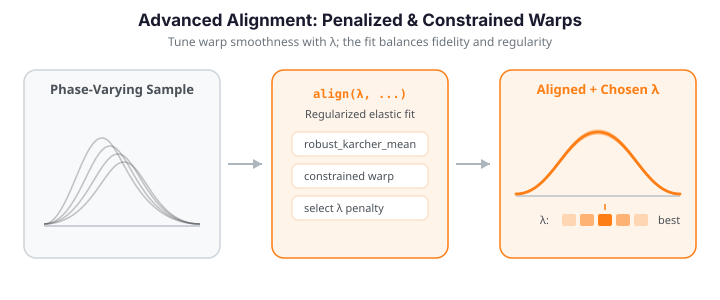

# Advanced Elastic Alignment

The baseline [`karcher_mean`](elastic-alignment.md#group-alignment-karcher-mean) and [`elastic_align_pair`](elastic-alignment.md#pairwise-alignment) cover the common case: a smooth warp minimizing the elastic distance with a single smoothness knob, `lambda_`. Real problems ask for more -- robust estimation under outliers, uncertainty quantification, specialized geometries (closed curves, partial matches), cross-population transfer, generative models, and automatic regularization selection. `fdars` provides a family of advanced aligners for exactly these cases. Every one operates on the elastic manifold through the SRSF representation $q(t)=\operatorname{sign}(\dot f(t))\sqrt{|\dot f(t)|}$, which turns the Fisher-Rao metric into the $L^2$ metric on the Hilbert sphere.


We build a working sample once and reuse it throughout.

{ .fdars-diagram }

```python exec="1" html="1"
import numpy as np
from docs_fig import fig, render
from fdars.alignment import karcher_mean, karcher_median, robust_karcher_mean

rng = np.random.default_rng(42)
n, m = 30, 160
t = np.linspace(0, 1, m)

# Amplitude + phase variability, plus two gross outliers
data = np.zeros((n, m))
for i in range(n):
    amp = rng.normal(3.0, 0.5)
    shift = rng.normal(0.5, 0.08)
    data[i] = amp * np.exp(-((t - shift) ** 2) / (2 * 0.12 ** 2))
data[0] += 2.0 * np.exp(-((t - 0.2) ** 2) / 0.002)   # spurious early spike
data[1] *= -0.6                                        # flipped, depressed

mean = np.asarray(karcher_mean(data, t, max_iter=15)["mean"])
median = np.asarray(karcher_median(data, t, max_iter=15)["mean"])
trimmed = np.asarray(robust_karcher_mean(data, t, trim_fraction=0.1, max_iter=15)["mean"])

f, ax = fig()
ax.plot(t, data.T, color="#adb5bd", lw=0.7, alpha=0.4)
ax.plot(t, mean, color="#dc3545", lw=2.2, label="Karcher mean")
ax.plot(t, median, color="#3f51b5", lw=2.2, label="Karcher median")
ax.plot(t, trimmed, color="#198754", lw=2.2, ls="--", label="trimmed mean (10%)")
ax.set(title="Robust vs. standard elastic central shape",
       xlabel="t", ylabel="f(t)")
ax.legend(fontsize=9)
print(render(f))
```

The two outliers pull the plain Karcher mean off the true bump; the median and trimmed mean resist them. The rest of this page walks through the advanced tools, grouped as the R reference organizes them.

---

## 1. Robust central shape: median and trimmed mean

The standard Karcher mean minimizes the *sum of squared* elastic distances and is therefore sensitive to outliers. Two robust alternatives:

- **Karcher median** minimizes the sum of *unsquared* distances via a Weiszfeld iteration on the manifold -- the functional analog of the geometric median.
- **Trimmed Karcher mean** discards the `trim_fraction` most distant curves before averaging.

$$
\tilde\mu = \arg\min_{\mu}\sum_{i=1}^n d_e(\mu, f_i)
\qquad\text{vs.}\qquad
\mu^\* = \arg\min_{\mu}\sum_{i=1}^n d_e(\mu, f_i)^2.
$$

```python
from fdars.alignment import karcher_median, robust_karcher_mean

kmed = karcher_median(data, t, max_iter=15)              # robust to outliers
ktrim = robust_karcher_mean(data, t, trim_fraction=0.1)  # drop 10% most distant

mu_median = kmed["mean"]      # elastic median
weights   = kmed["weights"]   # iteratively reweighted per-curve weight
mu_trim   = ktrim["mean"]
kept      = ktrim["weights"]  # 0 for trimmed curves
```

Both return the same keys as `karcher_mean` plus `weights`. See [Elastic Alignment](elastic-alignment.md#karcher-median-robust-central-shape) for the baseline discussion.

---

## 2. Elastic depth (phase-aware centrality)

Ordinary functional depth ignores phase: two curves can look equally "central" even though one is a time-warped copy of the other. **Elastic depth** measures centrality under the elastic metric and decomposes into amplitude and phase parts, so you can spot a curve that is central in shape but outlying in timing.

```python
from fdars.alignment import elastic_depth

ed = elastic_depth(data, t, lambda_=0.0)
amp_depth  = ed["amplitude_depth"]   # (n,)
ph_depth   = ed["phase_depth"]       # (n,)
comb_depth = ed["combined_depth"]    # (n,)
deepest = int(np.argmax(comb_depth))
print(f"Deepest (most central) curve: {deepest}")
```

Elastic depth is covered in detail, with figures, on the [Shape Analysis](shape-analysis.md#elastic-depth) page.

---

## 3. Outlier detection (amplitude vs. phase)

`elastic_outlier_detection` returns, for every curve, its **amplitude distance** (how unusual its *shape* is) and its **phase distance** (how unusual its *timing* is) relative to a robust reference. Classifying by type means fencing each of these separately -- a plain elastic-distance fence alone will not do it.

!!! warning "The elastic distance is phase-invariant"
    `out["distances"]` (and the default `out["outlier_indices"]`) measure the **amplitude** distance, which is invariant to time-warping. A curve that is only *shifted in time* has a near-zero amplitude distance, so it slips through that fence. To catch timing outliers you must look at `out["phase_distances"]`. Below we inject one amplitude outlier (curve 3, an enlarged bump) and one phase outlier (curve 7, a time-shifted copy) and recover **both** from the amplitude-vs-phase plane.

```python exec="1" html="1" source="above"
import numpy as np
from docs_fig import fig, render
from fdars.alignment import elastic_outlier_detection

rng = np.random.default_rng(7)
n, m = 28, 120
t = np.linspace(0, 1, m)
base = np.exp(-((t - 0.5) ** 2) / (2 * 0.12 ** 2))
data = np.array([rng.normal(1, 0.05) * np.interp(
    t, np.clip(t + rng.normal(0, 0.03), 0, 1), base) for _ in range(n)])
data[3] *= 1.8                                         # amplitude (shape) outlier
data[7] = np.interp(t, np.clip(t - 0.18, 0, 1), base)  # phase (timing) outlier

out = elastic_outlier_detection(data, t, alpha=0.05, use_median=True)
amp = np.asarray(out["amplitude_distances"])   # (n,) shape distance to the reference
pha = np.asarray(out["phase_distances"])       # (n,) timing distance to the reference

def fence(x):                                  # Tukey upper fence (2.0·IQR)
    q1, q3 = np.percentile(x, [25, 75]); return q3 + 2.0 * (q3 - q1)
fa, fp = fence(amp), fence(pha)
amp_out = np.where(amp > fa)[0]                 # unusual shape
pha_out = np.where(pha > fp)[0]                 # unusual timing

f, ax = fig()
ax.scatter(amp, pha, s=26, color="#adb5bd", zorder=2)
ax.axvline(fa, color="#3f51b5", ls="--", lw=1, label="amplitude fence")
ax.axhline(fp, color="#e8710a", ls="--", lw=1, label="phase fence")
for i in amp_out:
    ax.scatter(amp[i], pha[i], s=70, color="#3f51b5", zorder=3)
    ax.annotate(f"{i} · shape", (amp[i], pha[i]), (6, 4),
                textcoords="offset points", fontsize=8, color="#3f51b5")
for i in pha_out:
    ax.scatter(amp[i], pha[i], s=70, color="#e8710a", zorder=3)
    ax.annotate(f"{i} · timing", (amp[i], pha[i]), (6, -11),
                textcoords="offset points", fontsize=8, color="#e8710a")
ax.set(title="Outlier type: amplitude (shape) vs phase (timing)",
       xlabel="amplitude distance", ylabel="phase distance")
ax.legend(fontsize=8)
print(render(f))

print("shape (amplitude) outliers:", list(amp_out),
      " | timing (phase) outliers:", list(pha_out))
```

Curve 3 lands far to the right (large amplitude distance -> a **shape** outlier) while curve 7 lands high up (large phase distance -> a **timing** outlier). Neither fence alone finds both; the amplitude-vs-phase plane separates them cleanly.

| Key | Description |
|-----|-------------|
| `outlier_indices` | Curves past the **amplitude** fence (shape outliers only) |
| `distances` | Amplitude (elastic) distance of each curve to the reference, shape `(n,)` |
| `threshold` | Tukey fence on `distances` |
| `amplitude_distances` / `phase_distances` | Per-curve shape / timing distance to the reference, each shape `(n,)` |

---

## 4. Shape confidence intervals

After computing the Karcher mean, how certain is its shape? `shape_confidence_interval` gives a bootstrap band: resample the curves, recompute the Karcher mean of each resample, **align** the bootstrap means to the original mean, and take pointwise percentiles. The alignment step is essential -- without it, phase variability between bootstrap means inflates the band.

```python exec="1" html="1" source="above"
import numpy as np
from docs_fig import fig, render
from fdars.alignment import shape_confidence_interval

rng = np.random.default_rng(3)
n, m = 25, 120
t = np.linspace(0, 1, m)
base = np.exp(-((t - 0.5) ** 2) / (2 * 0.12 ** 2))
data = np.array([rng.normal(3, 0.4) * np.interp(
    t, np.clip(t + rng.normal(0, 0.06), 0, 1), base) for _ in range(n)])

ci = shape_confidence_interval(data, t, n_bootstrap=60, confidence_level=0.95,
                               max_iter=10)
mu = np.asarray(ci["mean"])
lo = np.asarray(ci["lower_band"])
hi = np.asarray(ci["upper_band"])

f, ax = fig()
ax.fill_between(t, lo, hi, color="#3f51b5", alpha=0.18, label="95% band")
ax.plot(t, mu, color="#3f51b5", lw=2.2, label="Karcher mean")
ax.set(title="Bootstrap shape confidence interval",
       xlabel="t", ylabel="f(t)")
ax.legend(fontsize=9)
print(render(f))
```

The shaded band is the pointwise 95% bootstrap envelope around the Karcher mean: where it is narrow the mean shape is well determined, and where it fans out the sample disagrees about amplitude. Because the resampling happens *after* alignment, the band reflects shape uncertainty rather than leftover phase spread.

| Key | Description |
|-----|-------------|
| `mean` | The Karcher mean the band is centered on |
| `lower_band` / `upper_band` | Pointwise percentile bands, shape `(m,)` |
| `bootstrap_means` | All bootstrap Karcher means, shape `(n_bootstrap, m)` |

---

## 5. Bayesian pairwise alignment

Dynamic-programming alignment gives a *point* estimate of the warp. `bayesian_align_pair` returns a *posterior* over warping functions via a Metropolis MCMC sampler on the Hilbert sphere, yielding credible bands and an acceptance rate for diagnostics.

```python exec="1" html="1" source="above"
import numpy as np
from docs_fig import fig, render
from fdars.alignment import bayesian_align_pair

t = np.linspace(0, 1, 120)
base = np.exp(-((t - 0.5) ** 2) / (2 * 0.10 ** 2))
f1 = base
f2 = np.interp(t, np.clip(t + 0.08, 0, 1), base)   # phase-shifted target

ba = bayesian_align_pair(f1, f2, t, n_samples=500, burn_in=100, seed=0, step_size=0.85)
f2_aligned = np.asarray(ba["f_aligned_mean"])
gam_lo = np.asarray(ba["credible_lower"])
gam_hi = np.asarray(ba["credible_upper"])
gam_mean = np.asarray(ba["posterior_mean_gamma"])

f, (a1, a2) = fig(ncols=2, figsize=(9.5, 4.0))
a1.plot(t, f1, color="#6c757d", lw=2, label="f1 (reference)")
a1.plot(t, f2, color="#dc3545", lw=1.6, ls="--", label="f2 (original)")
a1.plot(t, f2_aligned, color="#3f51b5", lw=2, label="f2 (aligned)")
a1.set(title=f"Bayesian alignment (accept. {float(ba['acceptance_rate']):.2f})",
       xlabel="t", ylabel="f(t)")
a1.legend(fontsize=8)

a2.fill_between(t, gam_lo, gam_hi, color="#6f42c1", alpha=0.2, label="95% credible")
a2.plot(t, gam_mean, color="#6f42c1", lw=2, label="posterior mean $\\gamma$")
a2.plot([0, 1], [0, 1], color="#6c757d", ls="--", lw=1.2)
a2.set(title="Posterior over the warp", xlabel="t",
       ylabel="$\\gamma(t)$", aspect="equal")
a2.legend(fontsize=8)
print(render(f))
```

The left panel shows the aligned `f2` tracking the reference, while the right panel replaces the single point-estimate warp with a full posterior: the purple band is the 95% credible region around the posterior-mean $\gamma$. Where the band hugs the diagonal the timing is confidently identity; where it widens the data are ambiguous about how much to warp -- uncertainty a point estimate simply cannot express.

| Key | Description |
|-----|-------------|
| `posterior_gammas` | MCMC draws of the warp, shape `(n_samples, m)` |
| `posterior_mean_gamma` | Posterior mean warp |
| `credible_lower` / `credible_upper` | Pointwise credible band on the warp |
| `acceptance_rate` | MCMC acceptance rate (aim for ~0.2--0.8) |
| `f_aligned_mean` | `f2` aligned under the posterior-mean warp |

!!! tip "Tuning the sampler"
    If the acceptance rate is too low, reduce `step_size`; if too high, raise it. Increase `n_samples`/`burn_in` for smoother credible bands.

---

## 6. Multiresolution alignment (long curves)

Dynamic programming is $O(m^2)$ per pair, slow for long grids. `elastic_align_pair_multires` aligns a coarsened copy first, then refines on the full grid -- faster and more robust to local minima on long, oscillatory curves. Below, a curve on a 400-point grid is aligned coarse-to-fine and timed against the exact DP solver.

```python exec="1" html="1" source="above"
import numpy as np
from time import perf_counter
from docs_fig import fig, render
from fdars.alignment import elastic_align_pair_multires, elastic_align_pair

m = 400                                    # long, oscillatory grid
t = np.linspace(0, 1, m)
base = np.sin(2 * np.pi * 2 * t) + 0.5 * np.sin(2 * np.pi * 5 * t)
f1 = base
f2 = np.interp(t, np.clip(t + 0.09 * np.sin(np.pi * t), 0, 1), base)   # nonlinear phase distortion

t0 = perf_counter()
res = elastic_align_pair_multires(f2, f1, t, coarsen_factor=2,
                                  n_refine_steps=40, step_size=0.1)
t_mr = perf_counter() - t0
f2_aligned = np.asarray(res["f_aligned"]); gamma = np.asarray(res["gamma"])

t0 = perf_counter(); elastic_align_pair(f2, f1, t); t_dp = perf_counter() - t0

f, (a1, a2) = fig(ncols=2, figsize=(9.5, 4.0))
a1.plot(t, f1, color="#6c757d", lw=1.4, label="f1 (reference)")
a1.plot(t, f2, color="#dc3545", lw=1.1, ls="--", alpha=0.8, label="f2 (distorted)")
a1.plot(t, f2_aligned, color="#fd7e14", lw=1.8, label="f2 (aligned)")
a1.set(title=f"Long curves (m={m}) aligned coarse-to-fine", xlabel="t", ylabel="f(t)")
a1.legend(fontsize=8)
a2.plot(t, gamma, color="#fd7e14", lw=2)
a2.plot([0, 1], [0, 1], color="#6c757d", ls="--", lw=1)
a2.set(title=f"Warp γ  ({t_dp / t_mr:.0f}× faster than exact DP)",
       xlabel="t", ylabel="γ(t)", aspect="equal")
print(render(f))
```

The coarse-to-fine result (orange) recovers the same aligned curve and warp as the exact DP solver but at a fraction of the cost -- the title reports the measured speedup. On a 400-point grid the multiresolution path avoids the full $O(m^2)$ cost while the S-shaped warp still captures the planted nonlinear phase distortion.

| Parameter | Description |
|-----------|-------------|
| `coarsen_factor` | Grid downsampling factor for the coarse solve (default `4`) |
| `n_refine_steps` | Gradient refinement steps (default `10`) |
| `step_size` | Refinement step size (default `0.01`) |

Returns `f_aligned`, `gamma`, `distance`. The coarse-to-fine result is an approximation of the exact DP solution: it trades a little fidelity for speed, so on short curves prefer the exact `elastic_align_pair`.

---

## 7. Closed and periodic curve alignment

A closed curve has no canonical starting point: the same shape can be parameterized from any point on its boundary. `elastic_align_pair_closed` optimizes over a cyclic start-point rotation $\theta$ in addition to the warp,

$$
d(f_1, f_2) = \min_{\gamma,\theta}\big\lVert q_1 - (q_2\circ R_\theta\circ\gamma)\sqrt{\dot\gamma}\big\rVert_{L^2},
$$

using a coarse-to-fine search over rotations.

```python
from fdars.alignment import elastic_align_pair_closed

c1 = np.sin(2 * np.pi * t) + 0.3 * np.sin(4 * np.pi * t)
c2 = np.sin(2 * np.pi * (t - 0.1)) + 0.4 * np.sin(4 * np.pi * (t - 0.1))

res = elastic_align_pair_closed(c1, c2, t, lambda_=0.0)
rotation = res["optimal_rotation"]   # best cyclic start-point offset
gamma    = res["gamma"]
distance = res["distance"]
```

Returns the usual `f_aligned`, `gamma`, `distance`, plus `optimal_rotation`.

!!! note "No group `periodic=True` mode"
    The R package also exposes a `periodic=True` circular-rotation mode inside `karcher_mean`/`elastic.align`. The Python bindings provide the *pairwise* closed aligner shown here but no group periodic mode. For a full periodic Karcher mean, pre-rotate each curve (e.g. so its global maximum sits at a fixed grid position) and then call the ordinary `karcher_mean`.

---

## 8. Partial matching (subsequence search)

When only a *portion* of a longer target matches a shorter query, full alignment is wrong. `elastic_partial_match` finds the best-aligned sub-interval of the target. Here a short query pattern is hidden (time-warped and buried in noise) inside a longer target, and the search recovers exactly where it sits.

```python exec="1" html="1" source="above"
import numpy as np
from docs_fig import fig, render
from fdars.alignment import elastic_partial_match

# short query pattern on its own grid
tt = np.linspace(0, 1, 80)
template = np.exp(-((tt - 0.5) ** 2) / (2 * 0.14 ** 2)) * np.sin(2 * np.pi * 2 * tt)

# longer, noisy target; the pattern is embedded (warped) on the sub-interval [0.45, 0.75]
tg = np.linspace(0, 1, 300)
rng = np.random.default_rng(0)
target = 0.15 * rng.standard_normal(300)
seg = (tg >= 0.45) & (tg <= 0.75); s = (tg[seg] - 0.45) / 0.30
target[seg] += 1.2 * np.interp(np.clip(s + 0.05 * np.sin(np.pi * s), 0, 1), tt, template)

pm = elastic_partial_match(template, target, tt, tg, min_span=0.25)
i0, i1 = pm["start_index"], pm["end_index"]

f, ax = fig()
ax.plot(tg, target, color="#adb5bd", lw=1, label="target (long)")
ax.plot(tg[i0:i1 + 1], target[i0:i1 + 1], color="#fd7e14", lw=2.4, label="matched sub-interval")
ax.axvspan(tg[i0], tg[i1], color="#fd7e14", alpha=0.10)
ax.axvspan(0.45, 0.75, color="#198754", alpha=0.06)     # true location (green)
ax.set(title=f"Query found in {pm['domain_fraction']:.0%} of the target  (d={pm['distance']:.2f})",
       xlabel="t", ylabel="f(t)")
ax.legend(fontsize=8)
print(render(f))

print(f"matched target indices {i0}..{i1}  (t = {tg[i0]:.2f}..{tg[i1]:.2f}; planted at 0.45..0.75)")
```

The orange sub-interval that the search selects overlaps the green planted region almost exactly, and the printed indices confirm it recovers the buried pattern despite the noise and time-warping. Crucially the match spans only a fraction of the target (see `domain_fraction`), which is what distinguishes partial matching from forcing a full-length alignment.

| Key | Description |
|-----|-------------|
| `start_index` / `end_index` | Best-matching sub-interval of the target |
| `domain_fraction` | Fraction of the target domain that matched |
| `gamma` | Warp on the matched segment |
| `distance` | Elastic distance of the match |

`min_span` sets the smallest fraction of the target the match may cover, guarding against trivial tiny matches.

---

## 9. Transfer alignment across populations

When curves come from two populations (healthy vs. diseased, two sites), the population-level shape difference confounds within-subject warping. `transfer_alignment` maps target curves into the source population's coordinate frame through a bridging warp: align the two Karcher means to get $\gamma_B$, then compose each target's within-population warp with $\gamma_B$.

```python
from fdars.alignment import transfer_alignment

source = data[:15]
target = data[15:]

tr = transfer_alignment(source, target, t, max_iter=10)
aligned  = tr["aligned_data"]    # target curves in the source frame
bridging = tr["bridging_gamma"]  # source<-target bridge warp
print(f"Aligned {np.asarray(aligned).shape[0]} target curves to the source frame")
```

| Key | Description |
|-----|-------------|
| `source_mean` | Karcher mean of the source population |
| `aligned_data` | Target curves placed in the source frame |
| `gammas` | Per-curve composed warps $\gamma_B\circ\gamma_i^T$ |
| `bridging_gamma` | The bridge warp aligning target mean to source mean |
| `distances` | Elastic distances after transfer |

---

## 10. Geodesic interpolation between curves

A **geodesic** on the elastic manifold is the shortest path between two shapes -- a natural morph that blends amplitude (in SRSF space) and phase (on the diffeomorphism group). `curve_geodesic` returns intermediate curves at parameters $\alpha\in[0,1]$.

```python exec="1" html="1" source="above"
import numpy as np
import matplotlib.cm as cm
from docs_fig import fig, render
from fdars.alignment import curve_geodesic

t = np.linspace(0, 1, 140)
f1 = np.exp(-((t - 0.35) ** 2) / 0.01)
f2 = 0.8 * np.exp(-((t - 0.7) ** 2) / 0.006) + 0.4 * np.exp(-((t - 0.3) ** 2) / 0.01)

geo = curve_geodesic(f1, f2, t, n_points=9)
curves = np.asarray(geo["curves"])
alphas = np.asarray(geo["parameter_values"])

f, ax = fig()
for c, a in zip(curves, alphas):
    ax.plot(t, c, color=cm.viridis(a), lw=1.4)
ax.plot(t, f1, color="#3f51b5", lw=2.4, label="$f_1$ ($\\alpha$=0)")
ax.plot(t, f2, color="#dc3545", lw=2.4, label="$f_2$ ($\\alpha$=1)")
ax.set(title="Elastic geodesic: smooth morph $f_1 \\to f_2$",
       xlabel="t", ylabel="f(t)")
ax.legend(fontsize=9)
print(render(f))
```

The viridis-graded intermediates morph $f_1$ into $f_2$ along the shortest elastic path, so the peak *migrates* smoothly rather than one bump fading while a second grows. That is the elastic geodesic doing its job: it blends amplitude in SRSF space and phase on the warping group simultaneously, unlike a naive pointwise average that would just cross-dissolve the two shapes.

| Key | Description |
|-----|-------------|
| `curves` | Interpolated curves, shape `(n_points, m)` |
| `warps` | The intermediate warps |
| `distances` | Cumulative elastic distance along the path |
| `parameter_values` | The $\alpha\in[0,1]$ for each curve |

---

## 11. Gaussian generative model

After separating amplitude and phase, you can *generate* new curves by sampling from the estimated score distributions -- useful for augmentation and simulation. `gauss_model` fits Gaussians to the vertical (amplitude) and horizontal (phase) FPC scores and draws new samples; `joint_gauss_model` fits a joint Gaussian that preserves amplitude-phase correlation.

```python exec="1" html="1" source="above"
import numpy as np
from docs_fig import fig, render
from fdars.alignment import gauss_model

rng = np.random.default_rng(1)
n, m = 30, 120
t = np.linspace(0, 1, m)
base = np.exp(-((t - 0.5) ** 2) / (2 * 0.12 ** 2))
data = np.array([rng.normal(3, 0.4) * np.interp(
    t, np.clip(t + rng.normal(0, 0.06), 0, 1), base) for _ in range(n)])

gm = gauss_model(data, t, ncomp=3, n_samples=20, max_iter=15, seed=0)
synth = np.asarray(gm["samples"])

f, ax = fig()
ax.plot(t, data.T, color="#3f51b5", lw=0.8, alpha=0.35)
ax.plot(t, synth.T, color="#e8710a", lw=0.8, alpha=0.5)
ax.plot([], [], color="#3f51b5", lw=2, label="original")
ax.plot([], [], color="#e8710a", lw=2, label="generated")
ax.set(title="Gaussian generative model: original vs. synthetic",
       xlabel="t", ylabel="f(t)")
ax.legend(fontsize=9)
print(render(f))
```

The orange synthetic curves occupy the same amplitude-and-timing envelope as the blue originals -- the generative model has learned the joint distribution of shape and phase rather than memorizing individual curves. This is the payoff of the amplitude/phase separation: sampling the two score distributions produces plausible *new* curves for augmentation or simulation.

| Key | Description |
|-----|-------------|
| `samples` | Synthetic curves, shape `(n_samples, m)` |
| `warps` | Warps applied to the synthetic amplitudes |
| `scores` | Sampled FPC scores |

---

## 12. Peak persistence for automatic $\lambda$

Choosing the regularization $\lambda$ is usually ad hoc. **Peak persistence** offers a topological criterion: sweep $\lambda$, track when peaks in the Karcher mean are born and die, and pick the $\lambda$ where persistent (genuine) peaks survive but transient (noise) peaks have merged away.

```python
from fdars.alignment import peak_persistence

lambdas = np.linspace(0.0, 3.0, 15)   # must be an ndarray
pers = peak_persistence(data, t, lambdas=lambdas, max_iter=8)
print(f"Optimal lambda: {float(pers['optimal_lambda']):.3f}")
print(f"Peak counts:    {list(np.asarray(pers['peak_counts'], dtype=int))}")
```

| Key | Description |
|-----|-------------|
| `lambdas` | The swept grid |
| `peak_counts` | Number of Karcher-mean peaks at each $\lambda$ |
| `optimal_lambda` / `optimal_index` | Selected regularization and its grid index |

Cross-validation (next section) optimizes a reconstruction score; peak persistence optimizes topological stability. They answer slightly different questions -- use CV when you have a clear predictive target, persistence when you care about recovering the right *number of features*.

---

## 13. Choosing $\lambda$ by cross-validation

`lambda_cv` scores a grid of regularization values by $K$-fold cross-validation over the whole dataset and reports the best one.

```python exec="1" html="1" source="above"
import numpy as np
from docs_fig import fig, render
from fdars.alignment import lambda_cv

rng = np.random.default_rng(7)
n, m = 20, 100
t = np.linspace(0, 1, m)
base = np.exp(-((t - 0.35) ** 2) / 0.01) + 0.6 * np.exp(-((t - 0.7) ** 2) / 0.008)
data = np.zeros((n, m))
for i in range(n):
    warp = t ** rng.uniform(0.7, 1.5)
    warp = (warp - warp.min()) / np.ptp(warp)
    data[i] = np.interp(t, warp, base)

lambdas = np.array([0.0, 0.001, 0.01, 0.05, 0.1, 0.5])   # must be an ndarray
cv = lambda_cv(data, t, lambdas=lambdas, n_folds=3, max_iter=10, tol=1e-3)

best = float(cv["best_lambda"])
f, ax = fig()
ax.plot(cv["lambdas"], cv["cv_scores"], "o-", color="#3f51b5", lw=1.8)
ax.axvline(best, color="#e8710a", ls="--", lw=1.5, label=f"best $\\lambda$={best:g}")
ax.set(title="Cross-validated warp regularization", xlabel="$\\lambda$",
       ylabel="CV score (lower is better)")
ax.legend(fontsize=9)
print(render(f))
```

The CV curve dips to a minimum at the selected $\lambda$ (orange line): too little regularization overfits the warps to noise, too much stiffens them toward the identity and leaves curves misaligned. The valley is the sweet spot that generalizes best across the held-out folds.

| Key | Description |
|-----|-------------|
| `best_lambda` | Regularization minimizing the CV score |
| `cv_scores` | Mean CV score for each candidate |
| `lambdas` | The candidate grid that was scored |

!!! warning "Array arguments must be `ndarray`"
    `lambda_cv`, `peak_persistence`, and `elastic_align_pair_constrained` reject plain Python lists for their array arguments (`lambdas`, `landmark_targets`, `landmark_sources`) with a `TypeError`. Wrap them with `np.array(...)`.

---

## Pairwise variants and their penalties

Beyond the specialized aligners above, `fdars` exposes the pairwise objective's regularization *directly*. Every pairwise aligner minimizes an elastic objective in SRSF space,

$$
\gamma^\* = \arg\min_{\gamma}\;\big\lVert q_1 - (q_2\circ\gamma)\sqrt{\dot\gamma}\big\rVert_{L^2}^2 \;+\; \lambda\,\mathcal{P}(\gamma),
$$

and the variants differ in the roughness penalty $\mathcal{P}$ and the constraints on $\gamma$. The figure shows how $\lambda$ moves the estimated warp between an unconstrained fit and the identity.

```python exec="1" html="1" source="above"
import numpy as np
from docs_fig import fig, render
from fdars.alignment import elastic_align_pair_penalized

t = np.linspace(0, 1, 120)
base = np.exp(-((t - 0.4) ** 2) / 0.01) + 0.7 * np.exp(-((t - 0.75) ** 2) / 0.006)
warp = t ** 1.5
warp = (warp - warp.min()) / np.ptp(warp)
target = base
source = np.interp(t, warp, base)

f, ax = fig()
colors = {"0.0": "#dc3545", "0.05": "#e8710a", "0.5": "#198754", "5.0": "#6f42c1"}
labels = {"0.0": "under (λ=0)", "0.05": "well (λ=0.05)",
          "0.5": "strong (λ=0.5)", "5.0": "over (λ=5)"}
for lam_s, c in colors.items():
    res = elastic_align_pair_penalized(source, target, t, lambda_=float(lam_s))
    ax.plot(t, np.asarray(res["gamma"]), color=c, lw=1.8, label=labels[lam_s])
ax.plot([0, 1], [0, 1], color="#6c757d", lw=1.3, ls="--", label="identity")
ax.set(title="Warp $\\gamma$ vs. penalty $\\lambda$", xlabel="t",
       ylabel="$\\gamma(t)$", aspect="equal")
ax.legend(fontsize=8)
print(render(f))
```

As $\lambda$ grows the warp is pulled toward the diagonal: too small and it over-fits noise, too large and it collapses to the identity (no alignment).

### Penalized

Choose the penalty functional. `first_order` penalizes the warp's departure from the identity in slope; `second_order` penalizes curvature (favoring smoother, gently bending warps); `second_order_weight` blends the two.

```python
from fdars.alignment import elastic_align_pair_penalized

res = elastic_align_pair_penalized(
    f2, f1, t, lambda_=0.1,
    penalty_type="second_order",   # or "first_order" (default)
    second_order_weight=0.1,
)
gamma = res["gamma"]
```

### Landmark-constrained

When you already know that specific features correspond (a shared peak), pin them. The warp is forced through the given `(source, target)` landmark pairs and optimized elastically between them.

```python
from fdars.alignment import elastic_align_pair_constrained

# landmark arrays MUST be ndarrays (a Python list raises TypeError)
src = np.array([0.55])   # landmark location in f2
tgt = np.array([0.50])   # where it should map to in f1

res = elastic_align_pair_constrained(f1, f2, t, tgt, src, lambda_=0.0)
gamma = res["gamma"]     # satisfies gamma(tgt) = src at the knots
```

| Parameter | Description |
|-----------|-------------|
| `landmark_targets` | Target landmark locations (must be `ndarray`) |
| `landmark_sources` | Source landmark locations (must be `ndarray`) |
| `lambda_` | Warp regularization |

!!! note "For pure landmark warping"
    `elastic_align_pair_constrained` pins landmarks within an *elastic* fit. For a pure monotone landmark warp with no elastic optimization, see [Landmark Registration](landmark-registration.md).

All pairwise variants return at least `f_aligned`, `gamma`, and `distance`; `closed` adds `optimal_rotation`.

---

## Binding gaps vs. the R reference

Two R advanced features have **no** Python binding and are omitted here rather than faked:

- **Multivariate (vector-valued) alignment** -- `karcher.mean.nd` / `pca.nd`. Even in R these are noted as "wrappers pending"; the `fdars` Python surface is scalar-curve only.
- **Group periodic mode** -- `periodic=True` inside `karcher_mean`. The pairwise [closed aligner](#7-closed-and-periodic-curve-alignment) is available; the group periodic Karcher mean is not (workaround noted there).

Horizontal FPNS (`horiz_fpns`) *is* bound and is covered on the [Shape Analysis](shape-analysis.md) page alongside horizontal FPCA.

---

See [Elastic Alignment](elastic-alignment.md) for the baseline aligner and the SRSF/Karcher-mean machinery, [TSRVF](tsrvf.md) for linearized statistics, [Shape Analysis](shape-analysis.md) for elastic FPCA and depth, and [Comparing Alignment Methods](alignment-comparison.md) for how these fits stack up against landmark registration.

## References

- Fletcher, P.T., Venkatasubramanian, S., Joshi, S. (2009). *The geometric median on Riemannian manifolds.* NeuroImage 45(1):S143-S152.
- Cheng, W., Dryden, I.L., Huang, X. (2016). *Bayesian registration of functions and curves.* Bayesian Analysis 11(2):447-481.
- Tucker, J.D., Wu, W., Srivastava, A. (2013). *Generative models for functional data using phase and amplitude separation.* Computational Statistics & Data Analysis 61:50-66.
- Srivastava, A., Klassen, E. (2016). *Functional and Shape Data Analysis.* Springer.
