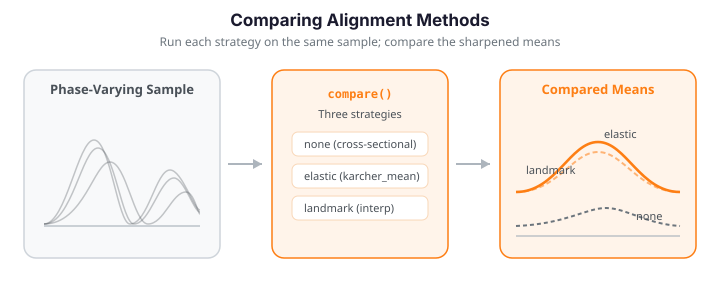

# Comparing Alignment Methods

Which registration method should you reach for? `fdars` (via its Python bindings and a little numpy) gives you four strategies with different trade-offs:

- **Elastic alignment** ([`karcher_mean`](elastic-alignment.md#group-alignment-karcher-mean)) -- global optimization by dynamic programming in SRSF space; smooth warps, no feature detection.
- **Landmark registration** (numpy, from [Landmark Registration](landmark-registration.md)) -- feature-based piecewise-linear warping; interpretable, needs reliable landmarks.
- **Constrained elastic** ([`elastic_align_pair_constrained`](advanced-alignment.md#landmark-constrained)) -- elastic optimization that passes *through* landmark anchors; smooth *and* feature-aware.
- **TSRVF** ([`tsrvf_transform`](tsrvf.md)) -- not an alignment per se, but a linearization of elastic alignment for downstream PCA/regression/clustering.

This page runs the first three on the same datasets, quantifies what they do to the mean and the variance, and gives a decision guide.

The headline result: on phase-varying data all three collapse the phase spread and sharpen the mean, while the naive cross-sectional mean stays flattened.


{ .fdars-diagram }

```python exec="1" html="1"
import numpy as np
from scipy.signal import find_peaks
from docs_fig import fig, render
from fdars.alignment import karcher_mean, elastic_align_pair_constrained

rng = np.random.default_rng(9)
n, m = 16, 150
t = np.linspace(0, 1, m)
base = np.exp(-((t - 0.35) ** 2) / 0.006) + 0.8 * np.exp(-((t - 0.70) ** 2) / 0.006)

data = np.zeros((n, m))
for i in range(n):
    w = t ** rng.uniform(0.7, 1.5)
    data[i] = np.interp(t, (w - w.min()) / np.ptp(w), base)

# --- Elastic ---
elastic = np.asarray(karcher_mean(data, t, lambda_=0.0, max_iter=20, tol=1e-4)["aligned_data"])

# --- Landmark (numpy) ---
def top_peaks(y, k, mp=0.2):
    idx, props = find_peaks(y, prominence=mp)
    order = np.argsort(props["prominences"])[::-1][:k]
    return np.sort(t[idx[order]])

L = np.array([top_peaks(r, 2) for r in data])
target = L.mean(0)

def register(y, s):
    kt = np.concatenate(([0.0], target, [1.0]))
    ks = np.concatenate(([0.0], s, [1.0]))
    return np.interp(np.interp(t, kt, ks), t, y)

landmark = np.array([register(data[i], L[i]) for i in range(n)])

# --- Constrained elastic (pin peaks, optimize between) ---
ref = data[0]
constrained = np.array([
    np.asarray(elastic_align_pair_constrained(ref, data[i], t, target, L[i], lambda_=0.0)["f_aligned"])
    for i in range(n)])

panels = [("No alignment", data, "#3f51b5", "#dc3545"),
          ("Elastic (Karcher)", elastic, "#198754", "#e8710a"),
          ("Landmark (numpy)", landmark, "#6f42c1", "#e8710a"),
          ("Constrained elastic", constrained, "#0dcaf0", "#e8710a")]

f, axes = fig(ncols=4, figsize=(13.5, 3.4))
for ax, (title, arr, c, cm) in zip(axes, panels):
    ax.plot(t, arr.T, color=c, lw=0.9, alpha=0.4)
    ax.plot(t, arr.mean(0), color=cm, lw=2.2, label="mean")
    ax.set(title=title, xlabel="t", ylim=(-0.1, 2.0))
    ax.legend(fontsize=8)
axes[0].set(ylabel="f(t)")
print(render(f))
```

The three aligners each recover a sharp two-peak mean; the constrained method matches the elastic one here because the peaks are the dominant features.

---

## What is being compared: distances and warp metrics

To compare methods *quantitatively* rather than by eye, we need the geometry underneath elastic alignment. It rests on the **square-root slope function (SRSF)**. For an absolutely continuous curve $f:[0,1]\to\mathbb{R}$,

$$
q(t) \;=\; \operatorname{sgn}\!\big(\dot f(t)\big)\,\sqrt{\,\lvert \dot f(t)\rvert\,}.
$$

The point of this transform is that the awkward, non-invariant $\mathbb{L}^2$ distance between curves becomes the well-behaved **Fisher-Rao metric**, which the SRSF turns into a plain $\mathbb{L}^2$ distance. Crucially, under a warp $\gamma$ (a boundary-preserving diffeomorphism of $[0,1]$, i.e. $\gamma(0)=0,\ \gamma(1)=1,\ \dot\gamma>0$), the SRSF transforms by the isometric group action

$$
(q\ast\gamma)(t) \;=\; q\big(\gamma(t)\big)\,\sqrt{\dot\gamma(t)} .
$$

Because the action is by isometries, $\lVert q_1\ast\gamma - q_2\ast\gamma\rVert = \lVert q_1 - q_2\rVert$, and every distance below is invariant to simultaneous rewarping.

**Amplitude distance** — the residual *shape* difference after optimal time-warping. It is the Fisher-Rao distance minimized over the warping group $\Gamma$:

$$
d_a(f_1,f_2) \;=\; \min_{\gamma\in\Gamma}\; \big\lVert\, q_1 \;-\; (q_2\ast\gamma) \,\big\rVert_{\mathbb{L}^2}.
$$

This is exactly the objective elastic alignment solves by dynamic programming, so `elastic_distance` and `amplitude_distance` coincide (verify below: both return the same value).

**Phase distance** — the amount of *timing* difference removed to achieve that match. Warps live on a sphere in SRSF coordinates via $\psi=\sqrt{\dot\gamma}$ with $\lVert\psi\rVert=1$, so phase difference is the geodesic (arc) distance on that sphere between the optimal warp $\gamma^\ast$ and the identity, measured through the Fisher-Rao angle:

$$
d_p(f_1,f_2) \;=\; \cos^{-1}\!\Big(\textstyle\int_0^1 \sqrt{\dot\gamma^\ast(t)}\;dt\Big).
$$

Together the pair splits total variation into *what the curve looks like* ($d_a$) and *when it happens* ($d_p$) — the amplitude-phase separation that alignment exists to produce.

**Warp complexity** — how far a single warp $\gamma$ departs from doing nothing, again as a Fisher-Rao geodesic distance but now between $\gamma$ and the identity $\gamma_{\mathrm{id}}(t)=t$:

$$
c(\gamma) \;=\; d_{FR}(\gamma,\gamma_{\mathrm{id}})
\;=\; \cos^{-1}\!\Big(\textstyle\int_0^1 \sqrt{\dot\gamma(t)}\;dt\Big)\in[0,\tfrac{\pi}{2}).
$$

Larger $c$ means more time-warping was applied; $c=0$ means the curve was already aligned.

**Warp smoothness** — the *roughness* (bending energy) of a warp, penalizing kinks:

$$
s(\gamma) \;=\; \int_0^1 \big(\ddot\gamma(t)\big)^2\,dt .
$$

A smooth diffeomorphism has small $s$; a piecewise-linear landmark warp has $\ddot\gamma$ concentrated at its kinks, so its bending energy is large — the mechanistic reason landmark and elastic warps look different in the next section.

The figure below computes all four quantities on the phase-varying dataset, each curve measured against the elastic Karcher mean.

```python exec="1" html="1" source="above"
import numpy as np
from docs_fig import fig, render
from fdars.alignment import (karcher_mean, amplitude_distance, phase_distance,
                             elastic_distance, warp_complexity, warp_smoothness)

rng = np.random.default_rng(11)
n, m = 14, 150
t = np.linspace(0, 1, m)
base = np.exp(-((t - 0.35) ** 2) / 0.006) + 0.8 * np.exp(-((t - 0.70) ** 2) / 0.006)
data = np.zeros((n, m))
for i in range(n):
    w = t ** rng.uniform(0.7, 1.6)
    data[i] = np.interp(t, (w - w.min()) / np.ptp(w), base)

km = karcher_mean(data, t, max_iter=20)
mu = np.asarray(km["mean"])
gam = np.asarray(km["gammas"])

amp = np.array([amplitude_distance(data[i], mu, t) for i in range(n)])
pha = np.array([phase_distance(data[i], mu, t) for i in range(n)])
cx = np.array([warp_complexity(gam[i], t) for i in range(n)])
sm = np.array([warp_smoothness(gam[i], t) for i in range(n)])

f, axes = fig(ncols=2, figsize=(11, 3.8))
axes[0].scatter(amp, pha, c=cx, cmap="viridis", s=45, edgecolor="k", lw=0.4)
axes[0].set(title="Per-curve split to the elastic mean",
            xlabel=r"amplitude distance $d_a$", ylabel=r"phase distance $d_p$")
cb = f.colorbar(axes[0].collections[0], ax=axes[0])
cb.set_label("warp complexity $c(\\gamma)$", fontsize=8)

axes[1].scatter(cx, sm, color="#6f42c1", s=45, edgecolor="k", lw=0.4)
axes[1].set(title="Warp complexity vs. bending energy",
            xlabel=r"complexity $c(\gamma)$", ylabel=r"smoothness $s(\gamma)$")
print(render(f))

# amplitude distance IS the minimized elastic distance
d_el = np.array([elastic_distance(data[i], mu, t) for i in range(n)])
print(f"max |amplitude_distance - elastic_distance| = {np.abs(amp - d_el).max():.2e}")
print(f"mean phase distance d_p = {pha.mean():.4f} rad "
      f"({np.degrees(pha.mean()):.1f} deg on the warp sphere)")
```

The left panel shows the amplitude-phase split per curve, coloured by how much warping each needed; curves needing large warps (bright) sit high on the phase axis. The right panel confirms these elastic warps are simultaneously non-trivial (positive complexity) yet smooth (modest bending energy) — the property landmark warps lack. The printout verifies $d_a$ equals the minimized elastic distance to machine precision.

---

## Warping functions: the mechanism differs

The warps expose the fundamental difference. Elastic produces smooth diffeomorphisms; landmark produces piecewise-linear paths kinked at the landmarks; constrained is smooth *but passes through the landmark anchors*.

```python exec="1" html="1" source="above"
import numpy as np
from scipy.signal import find_peaks
from docs_fig import fig, render
from fdars.alignment import karcher_mean, elastic_align_pair_constrained

rng = np.random.default_rng(9)
n, m = 16, 150
t = np.linspace(0, 1, m)
base = np.exp(-((t - 0.35) ** 2) / 0.006) + 0.8 * np.exp(-((t - 0.70) ** 2) / 0.006)
data = np.zeros((n, m))
for i in range(n):
    w = t ** rng.uniform(0.7, 1.5)
    data[i] = np.interp(t, (w - w.min()) / np.ptp(w), base)

# elastic warps
gam_el = np.asarray(karcher_mean(data, t, max_iter=20)["gammas"])

# landmark warps
def top_peaks(y, k, mp=0.2):
    idx, props = find_peaks(y, prominence=mp)
    return np.sort(t[idx[np.argsort(props["prominences"])[::-1][:k]]])
L = np.array([top_peaks(r, 2) for r in data]); target = L.mean(0)
gam_lm = np.array([np.interp(t, np.concatenate(([0.], target, [1.])),
                             np.concatenate(([0.], L[i], [1.]))) for i in range(n)])

# constrained warps
ref = data[0]
gam_c = np.array([np.asarray(elastic_align_pair_constrained(
    ref, data[i], t, target, L[i], lambda_=0.0)["gamma"]) for i in range(n)])

f, axes = fig(ncols=3, figsize=(12, 3.6))
for ax, (g, title, c) in zip(axes, [
        (gam_el, "Elastic (smooth)", "#198754"),
        (gam_lm, "Landmark (kinked)", "#6f42c1"),
        (gam_c, "Constrained (smooth + anchored)", "#0dcaf0")]):
    ax.plot(t, g.T, color=c, lw=1.0, alpha=0.6)
    ax.plot([0, 1], [0, 1], color="#6c757d", ls="--", lw=1.2)
    for x in target:
        ax.axvline(x, color="#adb5bd", ls=":", lw=0.8)
    ax.set(title=title, xlabel="t", aspect="equal")
axes[0].set(ylabel="$\\gamma(t)$")
print(render(f))
```

The landmark warps have visible corners at the landmark times (dotted verticals); the elastic and constrained warps are smooth, but only the constrained one is pinned to pass through those same times.

---

## Quantifying alignment quality

The distances above act *per pair*; to score a whole method we aggregate. Sharper means come from lower cross-sectional variance, so the headline metric is **variance reduction**

$$
\mathrm{VR} \;=\; 1-\frac{\overline{\operatorname{Var}}_{\text{aligned}}}{\overline{\operatorname{Var}}_{\text{original}}},
\qquad
\overline{\operatorname{Var}} = \frac{1}{m}\sum_{j=1}^{m}\operatorname{Var}_i\!\big(f_i(t_j)\big),
$$

the fraction of mean pointwise variance each method removes ($\mathrm{VR}=1$ is perfect collapse; $\mathrm{VR}=0$ is no help). We compare all three on **two** datasets: smooth global phase shifts, and distinct independently-shifting features.

```python exec="1" html="1" source="above"
import numpy as np
from scipy.signal import find_peaks
from docs_fig import fig, render
from fdars.alignment import karcher_mean, elastic_align_pair_constrained

t = np.linspace(0, 1, 160)

def make_smooth(seed):
    rng = np.random.default_rng(seed)
    out = np.zeros((15, len(t)))
    for i in range(15):
        s = rng.uniform(-0.1, 0.1); a = rng.normal(1, 0.15)
        out[i] = a * np.sin(2 * np.pi * (t - s)) + 0.4 * a * np.sin(4 * np.pi * (t - 0.7 * s))
    return out

def make_features(seed):
    rng = np.random.default_rng(seed)
    out = np.zeros((15, len(t)))
    for i in range(15):
        p1 = rng.uniform(0.15, 0.35); p2 = rng.uniform(0.55, 0.75)
        out[i] = rng.normal(1, 0.2) * np.exp(-200 * (t - p1) ** 2) + \
                 rng.normal(0.8, 0.15) * np.exp(-200 * (t - p2) ** 2)
    return out

def vr(orig, aligned):
    return 1 - np.var(aligned, axis=0).mean() / np.var(orig, axis=0).mean()

def top_peaks(y, k, mp):
    idx, props = find_peaks(y, prominence=mp)
    if len(idx) == 0:
        return np.array([t[np.argmax(y)]] * k)
    o = np.argsort(props["prominences"])[::-1][:k]
    pk = np.sort(t[idx[o]])
    return np.pad(pk, (0, k - len(pk)), constant_values=pk[-1]) if len(pk) < k else pk

def landmark_align(data, k, mp):
    L = np.array([top_peaks(r, k, mp) for r in data]); target = L.mean(0)
    def reg(y, s):
        kt = np.concatenate(([0.], target, [1.])); ks = np.concatenate(([0.], s, [1.]))
        return np.interp(np.interp(t, kt, ks), t, y)
    return np.array([reg(data[i], L[i]) for i in range(len(data))]), L, target

def constrained_align(data, L, target):
    ref = data[0]
    return np.array([np.asarray(elastic_align_pair_constrained(
        ref, data[i], t, target, L[i], lambda_=0.0)["f_aligned"]) for i in range(len(data))])

results = {}
for name, mk, k, mp in [("smooth", make_smooth, 1, 0.3), ("features", make_features, 2, 0.2)]:
    data = mk(42)
    el = np.asarray(karcher_mean(data, t, max_iter=20)["aligned_data"])
    lm, L, target = landmark_align(data, k, mp)
    cn = constrained_align(data, L, target)
    results[name] = {"Elastic": vr(data, el), "Landmark": vr(data, lm), "Constrained": vr(data, cn)}

methods = ["Elastic", "Landmark", "Constrained"]
x = np.arange(len(methods)); w = 0.38
f, ax = fig()
ax.bar(x - w / 2, [results["smooth"][m] for m in methods], w,
       color="#3f51b5", label="smooth shifts")
ax.bar(x + w / 2, [results["features"][m] for m in methods], w,
       color="#e8710a", label="distinct features")
ax.set(title="Variance reduction by method and dataset",
       ylabel="VR (higher = better)", xticks=x, ylim=(0, 1.05))
ax.set_xticklabels(methods)
ax.legend(fontsize=9)
print(render(f))

for ds in ("smooth", "features"):
    print(ds, {m: round(results[ds][m], 3) for m in methods})
```

The pattern mirrors the R reference: on **smooth global shifts**, elastic and constrained lead and landmark trails (broad oscillations give it few clean anchors); on **distinct features**, all three do well, with elastic and constrained excellent because the peaks are unambiguous.

### Elastic diagnostics

For the elastic method, `alignment_quality` decomposes the variance and `warp_statistics` summarizes the warps -- reporting *how much* work alignment did and *how* the total splits into amplitude and phase.

```python exec="1" html="1" source="above"
import numpy as np
from docs_fig import fig, render
from fdars.alignment import karcher_mean, alignment_quality, warp_statistics

rng = np.random.default_rng(9)
n, m = 16, 140
t = np.linspace(0, 1, m)
base = np.exp(-((t - 0.35) ** 2) / 0.006) + 0.8 * np.exp(-((t - 0.70) ** 2) / 0.006)
data = np.zeros((n, m))
for i in range(n):
    w = t ** rng.uniform(0.7, 1.5)
    data[i] = np.interp(t, (w - w.min()) / np.ptp(w), base)

q = alignment_quality(data, t, lambda_=0.0, max_iter=15)
km = karcher_mean(data, t, max_iter=20)
ws = warp_statistics(np.asarray(km["gammas"]), t, confidence_level=0.95)

f, ax = fig()
labels = ["amplitude\nvariance", "phase\nvariance"]
vals = [float(q["amplitude_variance"]), float(q["phase_variance"])]
ax.bar(labels, vals, color=["#198754", "#6f42c1"])
for i, v in enumerate(vals):
    ax.text(i, v, f"{v:.4f}", ha="center", va="bottom", fontsize=9)
ax.set(title=f"Variance decomposition "
             f"(phase share {float(q['phase_amplitude_ratio']):.0%})",
       ylabel="variance")
print(render(f))

print(f"mean variance reduction : {float(q['mean_variance_reduction']):.4f}")
print(f"phase / amplitude ratio : {float(q['phase_amplitude_ratio']):.4f}")
print(f"mean warp complexity    : {float(q['mean_warp_complexity']):.4f}")
print(f"mean geodesic dist warps: {np.asarray(ws['geodesic_distances']).mean():.4f}")
```

| `alignment_quality` key | Meaning |
|-------------------------|---------|
| `mean_variance_reduction` | Fraction of pointwise variance removed (the VR metric) |
| `total_variance` | Total variance before decomposition |
| `amplitude_variance` / `phase_variance` | Variance attributed to amplitude / to phase |
| `phase_amplitude_ratio` | Phase share of total -- high means phase-dominated |
| `mean_warp_complexity` / `mean_warp_smoothness` | Average warp magnitude / roughness |
| `pointwise_variance_ratio` | Per-point post/pre variance ratio, shape `(m,)` |

A high `phase_amplitude_ratio` (near 1) confirms the variation is mostly timing -- precisely where alignment helps most.

---

## When each method succeeds -- and fails

Real data is messier than tidy examples. These scenarios show where each method shines and where it breaks.

```python exec="1" html="1" source="above"
import numpy as np
from scipy.signal import find_peaks
from docs_fig import fig, render
from fdars.alignment import karcher_mean

t = np.linspace(0, 1, 200)

# Scenario A: smooth global warp -- no clean features (elastic wins, landmark struggles)
rng = np.random.default_rng(101)
smooth = np.zeros((12, 200))
for i in range(12):
    ws_ = rng.uniform(-0.15, 0.15)
    tw = t + ws_ * np.sin(np.pi * t)
    tw = (tw - tw.min()) / np.ptp(tw)
    smooth[i] = np.sin(2 * np.pi * tw) + 0.3 * np.cos(6 * np.pi * tw)

# Scenario B: mixed 1-peak & 2-peak curves (elastic handles, landmark forced-template fails)
rng = np.random.default_rng(7)
mixed = np.zeros((12, 200))
for i in range(12):
    if i < 6:
        mixed[i] = 1.5 * np.exp(-300 * (t - rng.uniform(0.3, 0.5)) ** 2)
    else:
        mixed[i] = np.exp(-300 * (t - rng.uniform(0.2, 0.35)) ** 2) + \
                   np.exp(-300 * (t - rng.uniform(0.6, 0.75)) ** 2)

# Scenario C: noisy -- raw vs pre-smoothed elastic
rng = np.random.default_rng(3)
noisy = np.array([np.sin(2 * np.pi * (t - rng.uniform(-0.08, 0.08))) + rng.normal(0, 0.35, 200)
                  for _ in range(12)])
# simple moving-average pre-smoothing
kern = np.ones(11) / 11
smoothed = np.array([np.convolve(y, kern, mode="same") for y in noisy])

el_smooth = np.asarray(karcher_mean(smooth, t, max_iter=20)["aligned_data"])
el_mixed = np.asarray(karcher_mean(mixed, t, max_iter=20)["aligned_data"])
el_noisy_raw = np.asarray(karcher_mean(noisy, t, max_iter=20)["aligned_data"])
el_noisy_sm = np.asarray(karcher_mean(smoothed, t, max_iter=20)["aligned_data"])

f, axes = fig(ncols=3, figsize=(12.5, 3.6))
axes[0].plot(t, el_smooth.T, color="#198754", lw=0.9, alpha=0.5)
axes[0].plot(t, el_smooth.mean(0), color="#e8710a", lw=2.2)
axes[0].set(title="A: smooth warp -> elastic aligns cleanly", xlabel="t", ylabel="f(t)")

axes[1].plot(t, el_mixed.T, color="#3f51b5", lw=0.9, alpha=0.5)
axes[1].plot(t, el_mixed.mean(0), color="#e8710a", lw=2.2)
axes[1].set(title="B: mixed 1-/2-peak -> elastic copes", xlabel="t")

axes[2].plot(t, el_noisy_raw.mean(0), color="#dc3545", lw=2.0, label="raw (over-warps)")
axes[2].plot(t, el_noisy_sm.mean(0), color="#198754", lw=2.0, label="smooth then align")
axes[2].set(title="C: noisy -> smooth first", xlabel="t")
axes[2].legend(fontsize=8)
print(render(f))
```

- **A -- elastic excels on smooth warping.** Broad overlapping oscillations have no clear anchors, so landmark detection has nothing to grab; the Fisher-Rao metric captures the continuous phase change naturally.
- **B -- elastic copes with a variable feature count.** Half the curves have one peak, half have two. Elastic makes no template assumption; a landmark method with a fixed `expected_count=2` would force a spurious second peak onto the single-peak curves.
- **C -- smooth before aligning noisy data.** The SRSF differentiates the curve, so noise drives over-warping. Pre-smoothing (here a moving average; splines or a kernel smoother work too) or a larger `lambda_` tames it.

### Scenario summary

| Scenario | Best method | Why |
|----------|-------------|-----|
| Smooth global warping | Elastic | No features to anchor; optimal continuous warp |
| Independent feature shifts | Landmark | Guarantees feature-to-feature correspondence |
| Noisy data | Elastic (with `lambda_`) or pre-smoothing | Penalty / smoothing controls over-warping |
| Variable number of features | Elastic | No feature template required |
| Features + smooth variation between them | Constrained elastic | Anchors features *and* smooths between them |

---

## Decision guide

| | Warping | Automation | Cost | Smoothness | Feature control |
|--|---------|-----------|------|-----------|-----------------|
| **Elastic** | Smooth diffeomorphism | Fully automatic | $O(nm^2)$ | High | None |
| **Landmark** | Piecewise-linear | Needs feature type | $O(nm+nk)$ | Low (corners) | Full |
| **Constrained** | Smooth with anchors | Needs feature type | $O(nm^2/k)$ | High between anchors | Partial |
| **TSRVF** | (uses elastic) | Fully automatic | $O(nm^2)$ + PCA | High | None |

| Situation | Recommended |
|-----------|-------------|
| No prior on which features correspond; smooth timing differences | **Elastic** (`karcher_mean`) |
| Want a principled metric / amplitude-phase decomposition | **Elastic** + [Shape Analysis](shape-analysis.md) |
| Well-defined, domain-meaningful features; need guaranteed correspondence | **Landmark** ([Landmark Registration](landmark-registration.md)) |
| Features must align exactly *and* the warp between them should be smooth | **Constrained** ([`elastic_align_pair_constrained`](advanced-alignment.md#landmark-constrained)) |
| PCA / regression / clustering on aligned curves | **Elastic** + [TSRVF](tsrvf.md) |

### Pitfalls

| Method | Common pitfall | Mitigation |
|--------|----------------|-----------|
| Elastic | Over-warping ("pinching") on noisy data | Increase `lambda_`, or pre-smooth |
| Landmark | Mismatched landmark correspondence | Use a fixed count, raise the prominence threshold |
| Constrained | Too few landmarks = barely constrained | Detect more / multiple landmark types |
| TSRVF | Linearization error for curves far from the mean | Check reconstruction quality |

---

## A worked workflow

A typical analysis chains the methods: explore, detect features to *understand structure*, align with the method the structure suggests, then linearize with TSRVF for downstream statistics.

```python
import numpy as np
from scipy.signal import find_peaks
from fdars.alignment import karcher_mean, tsrvf_transform

# 1) explore, 2) understand structure via landmark counts
counts = [len(find_peaks(row, prominence=0.2)[0]) for row in data]
print("peaks per curve:", counts)   # variable count -> prefer elastic

# 3) align (elastic here, since the feature count varies)
km = karcher_mean(data, t, max_iter=15)

# 4) linearize for PCA on the tangent vectors
V = np.asarray(tsrvf_transform(data, t, max_iter=15)["tangent_vectors"])
Vc = V - V.mean(0)
s = np.linalg.svd(Vc, compute_uv=False)
cum = np.cumsum(s ** 2) / np.sum(s ** 2)
print("variance explained (first 3 PCs):", (cum[:3] * 100).round(1))
```

---

See [Elastic Alignment](elastic-alignment.md), [Advanced Elastic Alignment](advanced-alignment.md), [Landmark Registration](landmark-registration.md), and [TSRVF](tsrvf.md) for the individual methods, and [Shape Analysis](shape-analysis.md) for the amplitude/phase decomposition that alignment enables.

---

## References

The elastic framework, SRSF transform, Fisher-Rao metric, and the amplitude/phase distances used above:

- Srivastava, A. and Klassen, E. P. (2016). *Functional and Shape Data Analysis*. Springer Series in Statistics. Springer, New York. (Canonical reference for the SRSF, the Fisher-Rao metric, and the amplitude-phase geometry; see Ch. 4-8.)
- Srivastava, A., Wu, W., Kurtek, S., Klassen, E., and Marron, J. S. (2011). *Registration of Functional Data Using Fisher-Rao Metric*. arXiv:1103.3817. (Introduces the elastic alignment objective $\min_\gamma \lVert q_1 - (q_2\ast\gamma)\rVert$ and the amplitude/phase separation.)
- Tucker, J. D., Wu, W., and Srivastava, A. (2013). *Generative models for functional data using phase and amplitude separation*. Computational Statistics & Data Analysis, 61, 50-66. doi:10.1016/j.csda.2012.12.001. (Karcher mean under the elastic metric, variance decomposition, and the alignment-quality diagnostics.)
- Marron, J. S., Ramsay, J. O., Sangalli, L. M., and Srivastava, A. (2015). *Functional Data Analysis of Amplitude and Phase Variation*. Statistical Science, 30(4), 468-484. doi:10.1214/15-STS524. (Survey contrasting landmark registration with metric-based elastic alignment.)
- Kneip, A. and Gasser, T. (1992). *Statistical Tools to Analyze Data Representing a Sample of Curves*. The Annals of Statistics, 20(3), 1266-1305. (Foundational treatment of landmark registration and structural averaging.)

fdars companions: `vignette("elastic-alignment")`, `vignette("landmark-registration")`, `vignette("tsrvf")`, and `vignette("distance-metrics")` in the [R package](https://sipemu.github.io/fdars-r/).
