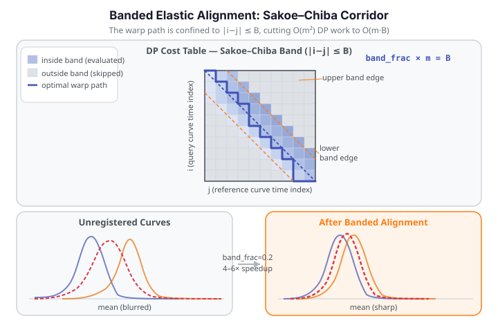

# Banded Elastic Alignment

`karcher_mean_with_band` computes the same Fisher-Rao Karcher mean as [`karcher_mean`](elastic-alignment.md#group-alignment-karcher-mean), but restricts the dynamic-programming alignment step to a **Sakoe–Chiba band** — a diagonal corridor around the main diagonal of the DP cost table. Cells outside the band are never evaluated, cutting the per-pair alignment cost from $O(m^2)$ to $O(m \cdot B)$ where $B = \text{band\_frac} \times m$. For smooth functional data with moderate phase variation, the global optimum lies inside a narrow band, so the constrained search is both fast and accurate. Measured speedup: **4–6× over the unbanded version**.

{ .fdars-diagram }

The DP table in the diagram has `m × m` cells. The blue diagonal stripe is the Sakoe–Chiba band: cells inside are evaluated (colour-coded by accumulated alignment cost), cells outside (grey) are skipped entirely. The orange boundary lines mark the band edges at `|i − j| = B`. The bold warp path travels within the stripe from the top-left corner to the bottom-right corner. Setting `band_frac=None` fills the entire grid — reproducing the exact unbanded Karcher mean.

---

## How it works

The Sakoe–Chiba constraint (Sakoe & Chiba, 1978) restricts the dynamic programming search at each step to the diagonal strip:

$$
|i - j| \leq B, \quad B = \lfloor \text{band\_frac} \times m \rfloor.
$$

Inside the band the algorithm is identical to the unconstrained version: it accumulates squared SRSF distance and backtracks to find the optimal monotone warp. Outside the band, no costs are computed. The resulting warp is the best monotone path within the constraint — not globally optimal, but for smooth functional data with mild phase variation, the constraint is rarely active.

When `band_frac=None`, the full $m \times m$ grid is searched and the result is mathematically identical to calling `karcher_mean` directly.

---

## API reference

### `karcher_mean_with_band`

```python
from fdars import alignment

result = alignment.karcher_mean_with_band(
    data,       # ndarray (n, m) — curves on the shared grid
    argvals,    # ndarray (m,) — evaluation grid
    band_frac,  # float in (0, 1] — Sakoe-Chiba half-width as fraction of m
                # (None = unbanded, exact Karcher mean)
)
```

The result dict has exactly the same keys as `karcher_mean`:

| Key | Type | Description |
|-----|------|-------------|
| `"mean"` | `ndarray (m,)` | Karcher mean function |
| `"mean_srsf"` | `ndarray (m,)` | Mean in SRSF representation |
| `"aligned_data"` | `ndarray (n, m)` | All curves aligned to the mean |
| `"gammas"` | `ndarray (n, m)` | Warping functions for each curve |
| `"n_iter"` | `int` | Number of Karcher iterations taken |
| `"converged"` | `bool` | Whether the algorithm converged |

### Banded distance matrices

The same Sakoe–Chiba constraint applies to the banded pairwise distance variants:

```python
# Self-distance matrix (n × n) with band constraint
D_self = alignment.elastic_self_distance_matrix_with_band(
    data, argvals, band_frac=0.2
)

# Cross-distance matrix (n_train × n_test)
D_cross = alignment.elastic_cross_distance_matrix_with_band(
    data_train, data_test, argvals, band_frac=0.2
)
```

These mirror `elastic_self_distance_matrix` and `elastic_cross_distance_matrix` — only the per-pair DP is banded.

---

## Choosing `band_frac`

There is no automatic band selection — `band_frac` is an explicit parameter because the optimal value depends on the *magnitude of phase variation* in your data.

| Guideline | `band_frac` |
|-----------|-------------|
| Mild phase variation (small warps, smooth data) | 0.1 – 0.2 |
| Moderate phase variation | 0.2 – 0.4 |
| Large phase variation | 0.4 – 1.0 (or use unbanded) |
| Quality degraded vs. unbanded result | widen `band_frac` |

**Starting point:** try `band_frac=0.2` and compare quality scores (e.g., `pairwise_correlation_score`) against the unbanded result. Widen the band until the quality stabilises.

`band_frac=None` gives the exact unbanded result and is the right choice when accuracy matters more than speed (small datasets) or when the phase variation is large enough to push the optimal warp outside any narrow band.

---

## Worked example

The example below loads the Canadian Weather temperature dataset and runs `karcher_mean_with_band` on a lightweight subset (8 stations), then also computes the banded self-distance matrix.

```python exec="1" html="1" source="above"
import numpy as np
from docs_data import load_canadian_weather
from fdars import alignment

rng = np.random.default_rng(7)

# Load Canadian Weather — 35 stations × 365 days
day, X, meta = load_canadian_weather("temperature")

# Lightweight subset: 8 stations (fast, deterministic)
n_sub = 8
idx = rng.choice(X.shape[0], n_sub, replace=False)
Xs = X[idx]

# Banded Karcher mean — band_frac=0.2 (≈73-day band on a 365-point grid)
res = alignment.karcher_mean_with_band(Xs, day, band_frac=0.2)

mean   = np.asarray(res["mean"])
gammas = np.asarray(res["gammas"])

print(f"Dataset:     {n_sub} stations x {day.shape[0]} days")
print(f"band_frac:   0.2  (B = {int(0.2 * len(day))} grid points)")
print(f"Converged:   {res['converged']} in {res['n_iter']} iterations")
print(f"Mean range:  [{mean.min():.1f}, {mean.max():.1f}] °C")
print(f"Gammas shape: {gammas.shape}")
print()

# Banded self-distance matrix (n × n)
D = np.asarray(alignment.elastic_self_distance_matrix_with_band(Xs, day, band_frac=0.2))
print(f"Distance matrix shape: {D.shape}")
print(f"Symmetric:             {np.max(np.abs(D - D.T)) < 1e-8}")
print(f"Max pairwise distance: {D[np.triu_indices(n_sub, k=1)].max():.4f}")
print()
print("FDARS_FENCE_OK")
```

The `converged` flag confirms the banded Karcher iteration settled to a fixed point, and the distance matrix symmetry check validates the banded DP is producing a proper (pseudo-)metric.

---

## Speed / accuracy tradeoff

The band constraint is a **computational shortcut, not a different alignment model**. For smooth functional data with mild phase variation, the unconstrained optimal warp lies well within the band, so the banded result is numerically indistinguishable from the exact result. As phase variation grows relative to `band_frac`, the constraint becomes active and the aligned curves diverge from the exact solution.

Practical workflow:

1. Start with `band_frac=0.2` for any dataset with $n \geq 50$ or $m \geq 200$.
2. Compute `pairwise_correlation_score` on the banded result and compare against a small-sample unbanded run.
3. If the quality score degrades more than a few percent, widen `band_frac` to 0.4 or 0.5.
4. If quality is acceptable, the 4–6× speedup is free.

---

## See also

- [Elastic Alignment](elastic-alignment.md) — the unbanded Karcher mean; full DP; reference for all keys
- [Shift Registration](shift-registration.md) — rigid horizontal shift; fastest alignment baseline
- [Landmark Registration](landmark-registration.md) — classical feature-based alignment
- [Alignment Comparison](alignment-comparison.md) — head-to-head on the same dataset

## References

- Sakoe, H., Chiba, S. (1978). *Dynamic programming algorithm optimization for spoken word recognition.* IEEE Transactions on Acoustics, Speech, and Signal Processing 26(1):43–49.
- Srivastava, A., Klassen, E., Joshi, S.H., Jermyn, I.H. (2011). *Shape analysis of elastic curves in Euclidean spaces.* IEEE TPAMI 33(7):1415–1428.
