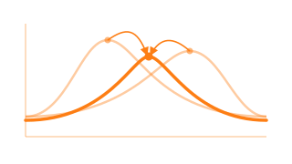
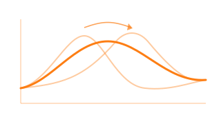
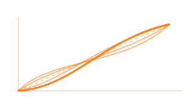
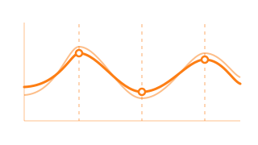
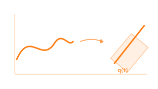
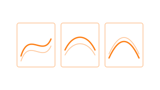
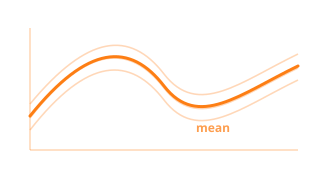

# Align

**Register and align curves to separate amplitude from phase variability.**

Functional observations often exhibit two fundamentally different sources of variation: *amplitude* (how tall or deep the features are) and *phase* (when those features occur). Standard statistical methods conflate the two, leading to washed-out means and inflated variance estimates. The Align module provides elastic alignment tools built on the Fisher-Rao metric and the Square Root Slope Function (SRSF) framework to cleanly decompose these sources of variability.

<a class="fdars-gallery-item" href="elastic-alignment/">

Elastic Alignment

SRSF registration, Karcher mean, and amplitude/phase separation.

</a>
<a class="fdars-gallery-item" href="advanced-alignment/">

Advanced Elastic Alignment

Closed, constrained, penalized, and multi-resolution alignment.

</a>
<a class="fdars-gallery-item" href="landmark-registration/">

Landmark Registration

Align curves by matching landmark locations with monotone warps.

</a>
<a class="fdars-gallery-item" href="tsrvf/">

TSRVF

Linearized elastic analysis in a transported tangent space.

</a>
<a class="fdars-gallery-item" href="alignment-comparison/">

Comparing Methods

No alignment vs elastic vs landmark, side by side.

</a>
<a class="fdars-gallery-item" href="shape-analysis/">

Shape Analysis

Shape-preserving registration and geodesic computations.

</a>

!!! info "Scope & limitations"

    fdars alignment operates on **real-valued curves sampled on a single shared grid** (`argvals`) common to every observation — the `Fdata` constructor and `stack` enforce this. Keep these boundaries in mind:

    - **Sparse or irregular per-curve sampling is not supported.** Pre-smooth each curve onto the shared grid first. The one exception is `elastic_partial_match`, which accepts two mismatched grids but is strictly pairwise.
    - **The elastic machinery is 1-D (SRSF / Fisher–Rao).** For ordinary real-valued curves in Euclidean space, TSRVF collapses to SRVF. Genuinely *manifold-valued* trajectories (sphere, SPD/covariance-over-time, shapes, rotations) are **not supported** — there are no exp/log maps, geodesic mean, or PGA.
    - **Constrained-range or density-valued curves are not supported.** Transform them to an unconstrained space before aligning.
    - **Supported beyond the basics:** closed/periodic curves (`elastic_align_pair_closed`, `karcher_mean_closed`) and landmark-constrained alignment (`elastic_align_pair_constrained`).
