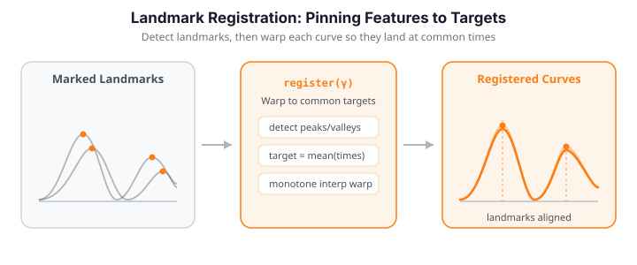

# Landmark Registration

Landmark registration is the oldest and most transparent way to remove phase variation: identify a handful of *landmarks* on each curve -- a peak, a valley, a zero-crossing, an inflection -- and time-warp every curve so that its landmarks land at common target locations. Like lining up sheet music by its bar lines, you *dictate* the correspondence rather than search for it. That makes it fast and interpretable, at the cost of needing reliably detectable features up front.

It is the natural choice for curves with identifiable, meaningful features: the P/QRS/T waves of an ECG, the peak force of a gait cycle, an absorbance band in a spectrum. Where elastic alignment optimizes the whole curve automatically under the Fisher-Rao metric, landmark registration anchors the warp at a few feature times and interpolates linearly between them.


Detection, matching, target-averaging, and warping are all handled by the native
`alignment.landmark_detect_and_register`: pass the curves and the feature `kind`, and it
returns the registered curves, the warping functions, the detected landmarks per curve,
and the common target positions. For an elastic aligner that can instead *pin* landmarks
inside a Fisher-Rao fit, see
[`elastic_align_pair_constrained`](advanced-alignment.md#landmark-constrained).

The figure below shows a two-peak sample whose peaks drift in time (left), and the same curves after each peak has been warped onto the common target location (right). The cross-sectional mean sharpens because the phase spread is gone.

{ .fdars-diagram }

```python exec="1" html="1"
import numpy as np
from docs_fig import fig, render
from fdars import alignment

rng = np.random.default_rng(3)
n, m = 12, 150
t = np.linspace(0, 1, m)
base = np.exp(-((t - 0.35) ** 2) / 0.006) + 0.8 * np.exp(-((t - 0.70) ** 2) / 0.006)

# Phase-varying sample: compose the base with random monotone warps of argvals
data = np.zeros((n, m))
for i in range(n):
    warp = t ** rng.uniform(0.7, 1.5)
    warp = (warp - warp.min()) / np.ptp(warp)
    data[i] = np.interp(t, warp, base)

# Detect the two peaks per curve and register them to a common target — one call.
res = alignment.landmark_detect_and_register(
    data, t, kind="peak", min_prominence=0.1, expected_count=2
)
registered = res["registered"]        # (n, m) aligned curves
target = res["target_landmarks"]      # common peak times

f, (a1, a2) = fig(ncols=2, figsize=(9.5, 4.0))
a1.plot(t, data.T, color="#3f51b5", lw=1, alpha=0.5)
a1.plot(t, data.mean(0), color="#dc3545", lw=2.4, label="cross-sec. mean")
for x in target:
    a1.axvline(x, color="#6c757d", ls=":", lw=1)
a1.set(title="Unregistered (peaks drift)", xlabel="t", ylabel="f(t)")
a1.legend(fontsize=8)

a2.plot(t, registered.T, color="#198754", lw=1, alpha=0.5)
a2.plot(t, registered.mean(0), color="#e8710a", lw=2.4, label="mean")
for x in target:
    a2.axvline(x, color="#6c757d", ls=":", lw=1)
a2.set(title="Landmark-registered", xlabel="t")
a2.legend(fontsize=8)
print(render(f))
```

On the left the two peaks arrive at different times across curves, so the red cross-sectional mean is flattened and smeared -- an artefact of phase, not shape. On the right, once every peak is warped onto its common target (dotted lines), the curves overlap and the mean recovers the true two-peak amplitude. That sharpening of the mean is the whole payoff of removing phase variation.

---

## How it works (intuition)

The recipe is four steps:

1. **Detect** features in each curve (e.g. the tallest peak).
2. **Match** corresponding features across curves (the "first peak" on every curve must mean the same thing).
3. **Choose targets** by averaging each feature's location across the sample.
4. **Warp** each curve so its features move to the targets, with straight-line interpolation between landmarks.

The upside is speed and interpretability -- you know exactly which features were aligned. The downside is that the warp is piecewise-linear, with corners at the landmarks rather than a smooth diffeomorphism, and it lives or dies by the reliability of feature detection.

---

## Mathematical framework

### The registration problem

Given curves $f_1,\dots,f_n$ on $[a,b]$, registration seeks warps $\gamma_i:[a,b]\to[a,b]$ so the registered curves $\tilde f_i(t)=f_i(\gamma_i(t))$ have aligned features. In the landmark approach we identify corresponding feature times $\tau_{i,1}<\dots<\tau_{i,K}$ in each curve and common target times $\tau_1^\*<\dots<\tau_K^\*$, and require

$$
\gamma_i(\tau_j^\*) = \tau_{i,j}, \qquad \gamma_i(a)=a,\quad \gamma_i(b)=b.
$$

### Piecewise-linear warping

Setting $\tau_0^\*=a$, $\tau_{K+1}^\*=b$ (and likewise for the observed times), the warp interpolates linearly between anchors: for $t\in[\tau_j^\*,\tau_{j+1}^\*]$,

$$
\gamma_i(t) = \tau_{i,j} + \frac{\tau_{i,j+1}-\tau_{i,j}}{\tau_{j+1}^\*-\tau_j^\*}\,(t-\tau_j^\*).
$$

Because the knots increase on both axes, $\gamma_i$ is **monotone** (order-preserving) -- it never folds time back on itself. Its slope $\dot\gamma_i$ is piecewise constant, equal to $(\tau_{i,j+1}-\tau_{i,j})/(\tau_{j+1}^\*-\tau_j^\*)$ on each segment. Concretely, `np.interp` between the knot pairs gives $\gamma_i$, and a second `np.interp` samples the curve at the warped times -- the classic "landmark registration by linear interpolation" of Ramsay & Silverman, in two lines.

### Target landmark selection

The common targets are the per-landmark sample means,

$$
\tau_j^\* = \frac{1}{n}\sum_{i=1}^n \tau_{i,j},
$$

which minimize the total squared warping and give representative positions. Any fixed target works (e.g. a reference curve's landmarks); the mean is the conventional default.

### Prominence and feature detection

A **peak** at $t_0$ is a local maximum. Its **prominence** measures how far it stands out from the surrounding curve,

$$
\operatorname{prom}(t_0) = f(t_0) - \max\!\Big(\min_{t\in[t_L,t_0]} f(t),\ \min_{t\in[t_0,t_R]} f(t)\Big),
$$

where $t_L,t_R$ are the nearest higher peaks (or the domain ends). A bump on a big peak's flank has low prominence; an isolated peak has high prominence. **Valleys** are peaks of $-f$; **zero-crossings** are sign changes of $f$; **inflections** are sign changes of $f''$. Filtering by a minimum prominence is how you keep only the salient features.

---

## Detecting landmarks

`scipy.signal.find_peaks` implements exactly the prominence rule above, so we use it as the detector. It returns peak indices and their prominences; raising the prominence threshold prunes minor bumps.

```python exec="1" html="1" source="above"
import numpy as np
from scipy.signal import find_peaks
from docs_fig import fig, render

rng = np.random.default_rng(42)
n, m = 12, 200
t = np.linspace(0, 1, m)
# a dominant shifted peak riding on a small oscillation (spurious minor peaks)
peak_locs = rng.uniform(0.3, 0.7, n)
data = np.array([np.exp(-100 * (t - p) ** 2) + 0.3 * np.sin(4 * np.pi * t)
                 for p in peak_locs])

def detect_peaks(y, min_prominence):
    idx, props = find_peaks(y, prominence=min_prominence)
    return t[idx], props["prominences"]

f, ax = fig()
ax.plot(t, data.T, color="#6c757d", lw=0.8, alpha=0.35)
for i in range(n):
    pk_t, _ = detect_peaks(data[i], 0.5)   # prominent peaks only
    ax.plot(pk_t, np.interp(pk_t, t, data[i]), "^",
            color="#dc3545", ms=8, zorder=5)
ax.plot([], [], "^", color="#dc3545", ms=8, label="detected peaks (prom > 0.5)")
ax.set(title="Landmark detection via prominence", xlabel="t", ylabel="f(t)")
ax.legend(fontsize=9)
print(render(f))

# Prominence filtering prunes the minor oscillation peaks
for thr in (0.0, 0.2, 0.5):
    npk = len(detect_peaks(data[0], thr)[0])
    print(f"curve 0, min_prominence={thr}: {npk} peaks")
```

Only the one dominant peak per curve is flagged (red triangles); the small sinusoidal ripple never clears the `prom > 0.5` bar. The printed counts make the mechanism explicit: at `min_prominence=0.0` every local maximum survives, but raising the threshold to `0.5` collapses each curve down to its single salient landmark -- exactly the pruning registration needs.

| Landmark kind | numpy / scipy detector |
|---------------|------------------------|
| Peak | `find_peaks(y, prominence=p)` |
| Valley | `find_peaks(-y, prominence=p)` |
| Zero-crossing | `np.where(np.diff(np.sign(y)))[0]` |
| Inflection | sign changes of a discrete second derivative |

```python
import numpy as np
from scipy.signal import find_peaks

# Valleys are peaks of -y
valley_idx, _ = find_peaks(-y, prominence=0.1)

# Zero-crossings: where the sign of y flips
zero_idx = np.where(np.diff(np.sign(y)) != 0)[0]

# Inflections: sign changes of the discrete second derivative
d2 = np.gradient(np.gradient(y, t), t)
infl_idx = np.where(np.diff(np.sign(d2)) != 0)[0]
```

!!! tip "Match features, don't just count them"
    Detection gives *positions*; registration needs *correspondence*. Sort landmarks by time and keep the same number per curve (the `expected_count` idea below). If curves genuinely differ in their feature count, prominence filtering or a fixed target template is safer than blind matching.

---

## Registration

The registration is three self-contained numpy steps: detect one time per landmark per curve, choose targets, warp.

```python
import numpy as np
from scipy.signal import find_peaks
from fdars import Fdata

t = np.linspace(0, 1, 200)
# ... `data` is an (n, m) array of phase-varying curves ...

# 1) detect the most prominent peak per curve  ->  L has shape (n, 1)
def top_peaks(y, k, min_prominence=0.3):
    idx, props = find_peaks(y, prominence=min_prominence)
    order = np.argsort(props["prominences"])[::-1][:k]   # k most prominent
    return np.sort(t[idx[order]])

L = np.array([top_peaks(row, k=1) for row in data])

# 2) target locations: sample-mean of each landmark (any fixed target works)
target = L.mean(axis=0)

# 3) piecewise-linear monotone warp, applied to every curve
def register(y, src_lm):
    knots_tgt = np.concatenate(([0.0], target, [1.0]))
    knots_src = np.concatenate(([0.0], src_lm, [1.0]))
    src_time = np.interp(t, knots_tgt, knots_src)
    return np.interp(src_time, t, y)

registered = np.array([register(data[i], L[i]) for i in range(len(data))])
fd_reg = Fdata(registered, argvals=t)   # back into an fdars container
```

| Step | numpy / scipy primitive | Role |
|------|-------------------------|------|
| Detect | `find_peaks(..., prominence)` | Salient feature times per curve |
| Match | sort + `expected_count` | One landmark time per feature per curve |
| Target | `mean(axis=0)` | Common location every curve maps onto |
| Warp | `np.interp` (twice) | Monotone $\gamma_i$, then resample $f_i\circ\gamma_i$ |
| Wrap | `Fdata(...)` | Registered curves as functional data |

!!! note "Endpoint anchoring matters"
    Always include the domain endpoints as fixed knots (the `0.0`/`1.0` above). Without them the warp is undefined outside the outermost landmarks and the registered curves lose their edges.

### Expected count: registering two peaks

When each curve has a known number of corresponding features, pick the top-`k` most prominent peaks per curve and register them jointly. Below, two drifting peaks are each pulled onto their own sample-mean target.

```python exec="1" html="1" source="above"
import numpy as np
from scipy.signal import find_peaks
from docs_fig import fig, render
from fdars import Fdata

rng = np.random.default_rng(5)
n, m = 12, 200
t = np.linspace(0, 1, m)
data = np.zeros((n, m))
for i in range(n):
    p1 = rng.uniform(0.2, 0.4)
    p2 = rng.uniform(0.6, 0.8)
    data[i] = np.exp(-100 * (t - p1) ** 2) + np.exp(-100 * (t - p2) ** 2)

def top_peaks(y, k, min_prominence=0.3):
    idx, props = find_peaks(y, prominence=min_prominence)
    order = np.argsort(props["prominences"])[::-1][:k]
    return np.sort(t[idx[order]])

L = np.array([top_peaks(row, k=2) for row in data])   # (n, 2)
target = L.mean(0)

def register(y, src):
    kt = np.concatenate(([0.0], target, [1.0]))
    ks = np.concatenate(([0.0], src, [1.0]))
    return np.interp(np.interp(t, kt, ks), t, y)

reg = np.array([register(data[i], L[i]) for i in range(n)])

f, (a1, a2) = fig(ncols=2, figsize=(9.5, 4.0))
a1.plot(t, data.T, color="#3f51b5", lw=1, alpha=0.5)
for x in target:
    a1.axvline(x, color="#6c757d", ls=":", lw=1)
a1.set(title="Original (two drifting peaks)", xlabel="t", ylabel="f(t)")
a2.plot(t, reg.T, color="#198754", lw=1, alpha=0.5)
for x in target:
    a2.axvline(x, color="#6c757d", ls=":", lw=1)
a2.set(title=f"Registered to targets {target.round(3)}", xlabel="t")
print(render(f))
```

Both peaks are pinned simultaneously: on the left each of the two bumps wanders within its own band, while on the right every curve's first and second peak sit squarely on the two dotted targets. Note that the inter-peak region is stretched or compressed independently on each side of the anchors -- a direct consequence of the piecewise-linear warp.

!!! success "Numerical validation: the warp is exact at the landmarks"
    The whole point of landmark registration is that each warp *pins* the landmarks: by construction $\gamma_i(\tau_j^\*) = \tau_{i,j}$, so evaluating the piecewise-linear warp at a target time returns the source landmark time exactly. Because the targets are the interpolation knots, `numpy.interp` reproduces them to machine precision -- there is no optimization error, unlike elastic alignment. We assert this directly, then confirm the registered curves' peaks land on the common targets to within one grid step.

    ```python exec="1"
    import numpy as np
    from scipy.signal import find_peaks

    rng = np.random.default_rng(5)
    n, m = 12, 200
    t = np.linspace(0, 1, m)
    data = np.zeros((n, m))
    for i in range(n):
        p1, p2 = rng.uniform(0.2, 0.4), rng.uniform(0.6, 0.8)
        data[i] = np.exp(-100 * (t - p1) ** 2) + np.exp(-100 * (t - p2) ** 2)

    def top_peaks(y, k, mp=0.3):
        idx, props = find_peaks(y, prominence=mp)
        order = np.argsort(props["prominences"])[::-1][:k]
        return np.sort(t[idx[order]])

    L = np.array([top_peaks(row, 2) for row in data])   # (n, 2) source landmark times
    target = L.mean(0)                                   # common targets

    # (1) exactness: gamma_i(target_j) == source landmark_ij  (knots reproduced exactly)
    max_lm_err = 0.0
    for i in range(n):
        knots_tgt = np.concatenate(([0.0], target, [1.0]))
        knots_src = np.concatenate(([0.0], L[i], [1.0]))
        gamma_at_targets = np.interp(target, knots_tgt, knots_src)  # evaluated at knots
        max_lm_err = max(max_lm_err, np.max(np.abs(gamma_at_targets - L[i])))
    assert max_lm_err < 1e-12, max_lm_err
    print(f"warp exactness  max|gamma(target)-source|: {max_lm_err:.2e}  (< 1e-12 required)")

    # (2) after registering, the peaks sit on the common targets (within one grid step)
    def register(y, src):
        src_time = np.interp(t, np.concatenate(([0.0], target, [1.0])),
                             np.concatenate(([0.0], src, [1.0])))
        return np.interp(src_time, t, y)

    reg_peaks = np.array([top_peaks(register(data[i], L[i]), 2) for i in range(n)])
    peak_err = np.max(np.abs(reg_peaks - target))
    assert peak_err <= t[1] - t[0], (peak_err, t[1] - t[0])
    print(f"registered peaks vs targets: {peak_err:.4f}  (grid step = {t[1] - t[0]:.4f})")
    ```

Both checks pass: the warp reproduces its knots to $\sim10^{-16}$ (pure interpolation, no solver), and every registered peak lands within a single grid step of its target. This is the defining contrast with elastic alignment -- there is no optimization residual to converge, only interpolation error bounded by the sampling grid.

---

## Landmark warps as phase

The warps themselves *are* the phase variation that registration removes. Plotting $\gamma_i$ against the identity shows how much each curve's clock had to be stretched or compressed to bring its landmarks into register -- the same interpretation used for elastic warps in [Elastic Alignment](elastic-alignment.md#interpreting-warping-functions), but here obtained deterministically from the landmarks.

```python exec="1" html="1" source="above"
import numpy as np
from docs_fig import fig, render

rng = np.random.default_rng(3)
n, m = 12, 150
t = np.linspace(0, 1, m)
base = np.exp(-((t - 0.35) ** 2) / 0.006) + 0.8 * np.exp(-((t - 0.70) ** 2) / 0.006)
data = np.zeros((n, m))
for i in range(n):
    w = t ** rng.uniform(0.7, 1.5)
    data[i] = np.interp(t, (w - w.min()) / np.ptp(w), base)

def landmarks(y):
    interior = np.where((y[1:-1] > y[:-2]) & (y[1:-1] > y[2:]))[0] + 1
    return np.sort(t[interior[np.argsort(y[interior])[::-1]][:2]])

L = np.array([landmarks(row) for row in data])
target = L.mean(0)

f, ax = fig()
for i in range(n):
    knots_tgt = np.concatenate(([0.0], target, [1.0]))
    knots_src = np.concatenate(([0.0], L[i], [1.0]))
    gamma = np.interp(t, knots_tgt, knots_src)     # gamma(target time)
    ax.plot(t, gamma, color="#6f42c1", lw=1.1, alpha=0.7)
ax.plot([0, 1], [0, 1], color="#6c757d", ls="--", lw=1.4, label="identity")
for x in target:
    ax.axvline(x, color="#adb5bd", ls=":", lw=0.9)
ax.set(title="Landmark warps $\\gamma_i$", xlabel="registered time $\\tau$",
       ylabel="original time $\\gamma_i(\\tau)$", aspect="equal")
ax.legend(fontsize=8)
print(render(f))
```

The warps kink at the landmark times (dotted verticals) -- the signature of piecewise-linear registration. Between landmarks each warp is a straight segment, so timing is distorted uniformly within every inter-landmark interval.

---

## Quantifying the phase removal

The visual "sharpening of the mean" has a numerical counterpart: registration collapses the cross-sectional variance $\operatorname{Var}_i f_i(t)$ at each $t$, because at a fixed time the curves now share the same phase. Plotting the pointwise variance before and after registration turns the qualitative claim into a measured one -- the shaded area between the two curves is the phase variance removed.

```python exec="1" html="1" source="above"
import numpy as np
from scipy.signal import find_peaks
from docs_fig import fig, render

rng = np.random.default_rng(5)
n, m = 24, 200
t = np.linspace(0, 1, m)
data = np.zeros((n, m))
for i in range(n):
    p1, p2 = rng.uniform(0.2, 0.4), rng.uniform(0.6, 0.8)
    data[i] = np.exp(-100 * (t - p1) ** 2) + np.exp(-100 * (t - p2) ** 2)

def top_peaks(y, k, mp=0.3):
    idx, props = find_peaks(y, prominence=mp)
    order = np.argsort(props["prominences"])[::-1][:k]
    return np.sort(t[idx[order]])

L = np.array([top_peaks(row, 2) for row in data])
target = L.mean(0)

def register(y, src):
    src_time = np.interp(t, np.concatenate(([0.0], target, [1.0])),
                         np.concatenate(([0.0], src, [1.0])))
    return np.interp(src_time, t, y)

reg = np.array([register(data[i], L[i]) for i in range(n)])

var_before = data.var(0)
var_after = reg.var(0)

f, ax = fig()
ax.plot(t, var_before, color="#dc3545", lw=2.0, label="before (unregistered)")
ax.plot(t, var_after, color="#198754", lw=2.0, label="after (registered)")
ax.fill_between(t, var_after, var_before, where=var_before >= var_after,
                color="#dc3545", alpha=0.12)
for x in target:
    ax.axvline(x, color="#adb5bd", ls=":", lw=0.9)
ax.set(title="Pointwise cross-sectional variance", xlabel="t",
       ylabel=r"$\mathrm{Var}_i\, f_i(t)$")
ax.legend(fontsize=9)
print(render(f))

tot_before = np.trapezoid(var_before, t)
tot_after = np.trapezoid(var_after, t)
print(f"integrated variance  before: {tot_before:.4f}  after: {tot_after:.4f}  "
      f"({100 * (1 - tot_after / tot_before):.0f}% removed)")
```

The variance before registration peaks near the drifting landmark locations -- precisely where phase misalignment is largest -- and collapses toward zero after each peak is pinned. The integrated-variance line quantifies the reduction: for this pure-phase sample almost all cross-sectional variance is phase, and registration removes the bulk of it.

---

## Landmark vs. elastic registration

| | Landmark (numpy) | Elastic ([`karcher_mean`](elastic-alignment.md#group-alignment-karcher-mean)) |
|---|---|---|
| Correspondence | You specify it (landmarks) | Found automatically (Fisher-Rao) |
| Warp shape | Piecewise-linear, kinked at knots | Smooth diffeomorphism |
| Needs feature detection | Yes | No |
| Cost | Trivial (`np.interp`) | Iterative optimization |
| Best when | Landmarks are obvious and reliable | Landmarks are ambiguous or absent |

Landmark registration is ideal when the features to align are unambiguous (a clear systolic peak, a known stimulus onset). When landmarks are noisy, hard to detect, or the curves have no obvious features, prefer the elastic aligners -- they optimize the whole curve rather than a few points. A middle ground is [`elastic_align_pair_constrained`](advanced-alignment.md#landmark-constrained), which *pins* landmarks (like landmark registration) but fills in the rest with a smooth elastic warp.

See [Comparing Alignment Methods](alignment-comparison.md) for a head-to-head on the same dataset, with variance-reduction metrics.

## References

- Ramsay, J.O., Silverman, B.W. (2005). *Functional Data Analysis*, 2nd ed. Springer. (Landmark registration by linear interpolation.)
- Kneip, A., Gasser, T. (1992). *Statistical tools to analyze data representing a sample of curves.* Annals of Statistics 20(3):1266-1305.
- Gasser, T., Kneip, A. (1995). *Searching for structure in curve samples.* Journal of the American Statistical Association 90(432):1179-1188.
