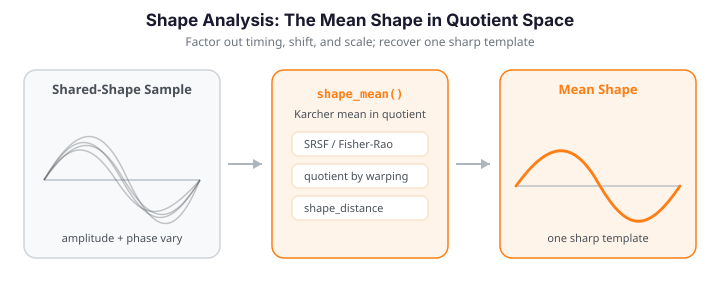

# Shape Analysis

Two curves can look different point-by-point yet share the same *shape* -- when the difference is only a matter of parameterization (timing), a vertical baseline shift, or an overall magnitude. Shape analysis studies the geometry of functional data *after* factoring out such nuisance transformations. The formal device is a **quotient space**: curves that differ only by a nuisance transformation are identified as the same point. The elastic (Fisher-Rao) framework, via the SRSF representation, makes this quotient geometry computable.

`fdars` provides tools for shape representatives and distances (this quotient geometry), for the **shape mean** (a Karcher mean in quotient space), and -- going beyond the quotient basics -- for elastic depth and elastic FPCA that decompose variability into amplitude and phase components.


| Function | Role |
|----------|------|
| `shape_distance` | Elastic distance between curves modulo warping |
| `shape_mean` | Karcher mean (average shape) in a chosen quotient |
| `shape_self_distance_matrix` | All pairwise shape distances (for clustering/MDS) |
| `reparameterize_curve` | Apply a warp $\gamma$ to a curve (move within an orbit) |

A sample of curves that share a common *shape* but differ in amplitude and timing (left) collapses onto a single sharp template once the warping is factored out. The elastic **mean shape** -- the Karcher mean under the Fisher-Rao metric (right, orange) -- recovers that template, whereas the naive cross-sectional mean (right, dashed) is flattened by the phase spread.

{ .fdars-diagram }

```python exec="1" html="1"
import numpy as np
from docs_fig import fig, render
from fdars import Fdata
from fdars.alignment import karcher_mean

rng = np.random.default_rng(7)
n, m = 18, 120
t = np.linspace(0, 1, m)
base = np.sin(2 * np.pi * t)          # common underlying shape

data = np.zeros((n, m))
for i in range(n):
    amp = 1.0 + 0.25 * rng.standard_normal()                 # amplitude variation
    warp = np.clip(t + 0.13 * rng.standard_normal() * np.sin(np.pi * t), 0, 1)
    data[i] = amp * np.interp(t, warp, base)                  # phase variation

fd = Fdata(data, argvals=t)
km = karcher_mean(fd.data, fd.argvals, lambda_=0.0, max_iter=20, tol=1e-4)
mean_shape = np.asarray(km["mean"])

f, (a1, a2) = fig(ncols=2, figsize=(9.5, 4.0))
a1.plot(t, data.T, color="#3f51b5", lw=1, alpha=0.5)
a1.set(title="Sample of curves (shared shape)", xlabel="t", ylabel="f(t)")

a2.plot(t, data.T, color="#6c757d", lw=0.8, alpha=0.25)
a2.plot(t, data.mean(0), color="#dc3545", lw=2.0, ls="--", label="cross-sec. mean")
a2.plot(t, mean_shape, color="#e8710a", lw=2.6, label="elastic mean shape")
a2.set(title="Mean shape vs. cross-sectional mean", xlabel="t")
a2.legend(fontsize=8)
print(render(f))
```

---

## The quotient geometry

Shape analysis lives in a **quotient space**. Write a curve as a function $f:[0,1]\to\mathbb{R}$. The nuisance transformations form a group $\Gamma$ of orientation-preserving diffeomorphisms (warps) $\gamma:[0,1]\to[0,1]$ with $\gamma(0)=0$, $\gamma(1)=1$ and $\dot\gamma>0$. The group acts on curves by composition,

$$
(f,\gamma)\;\longmapsto\; f\circ\gamma ,
$$

and the set of all curves reachable from $f$ this way is its **orbit** $[f]=\{\,f\circ\gamma : \gamma\in\Gamma\,\}$. Two curves have the *same shape* iff they lie in the same orbit. The shape space is the quotient $\mathcal{F}/\Gamma$, and a shape distance must be a proper distance on that quotient.

### Why the $\mathbb{L}^2$ metric fails

The naive attempt — align by minimizing $\|f_1 - f_2\circ\gamma\|_{\mathbb{L}^2}$ over $\gamma$ — is *not* a distance on the quotient, because the $\mathbb{L}^2$ inner product is not preserved by warping:

$$
\langle f\circ\gamma,\; g\circ\gamma\rangle_{\mathbb{L}^2}
= \int_0^1 f(\gamma(t))\,g(\gamma(t))\,dt \;\neq\; \langle f,g\rangle_{\mathbb{L}^2}.
$$

Reparameterizing both curves changes the value, so the "distance" depends on where in each orbit you happen to sit. This produces the **pinching** pathology: the optimizer buys artificially small residuals by warping mass into a thin spike. The elastic (Fisher-Rao) framework fixes this.

### The square-root slope function (SRSF)

Represent a curve by its **square-root slope function** (also called SRVF in the curve setting),

$$
q(t) \;=\; \operatorname{sgn}\bigl(\dot f(t)\bigr)\,\sqrt{\bigl|\dot f(t)\bigr|},
\qquad q \in \mathbb{L}^2([0,1],\mathbb{R}),
$$

with inverse $f(t)=f(0)+\int_0^t q(s)\,|q(s)|\,ds$. The map $f\mapsto q$ trades the original curve for its (signed square-rooted) velocity. The decisive property is how the *group action transforms* in this representation. If $\tilde f = f\circ\gamma$, its SRSF is

$$
\tilde q(t) \;=\; (q\circ\gamma)(t)\,\sqrt{\dot\gamma(t)}
\;\;=:\;\; (q,\gamma).
$$

The extra $\sqrt{\dot\gamma}$ Jacobian factor is exactly what is needed to make the action an **isometry** of $\mathbb{L}^2$:

$$
\bigl\langle (q,\gamma),\,(r,\gamma)\bigr\rangle_{\mathbb{L}^2}
= \int_0^1 q(\gamma(t))\,r(\gamma(t))\,\dot\gamma(t)\,dt
= \int_0^1 q(s)\,r(s)\,ds
= \langle q,r\rangle_{\mathbb{L}^2},
$$

by the change of variables $s=\gamma(t)$. So the complicated **Fisher-Rao Riemannian metric** on curve space becomes the flat $\mathbb{L}^2$ metric on SRSF space — and warping is a norm-preserving rotation there. This is the whole point of the SRSF transform: it linearizes the elastic geometry.

```python exec="1" html="1" source="above"
import numpy as np
from docs_fig import fig, render
from fdars.alignment import srsf_transform, reparameterize_curve

t = np.linspace(0, 1, 200)
f = np.sin(2 * np.pi * t) + 0.4 * np.sin(4 * np.pi * t)

# a warp and the warped curve
gamma = t ** 1.8
gamma = (gamma - gamma.min()) / np.ptp(gamma)
f_w = reparameterize_curve(f, t, gamma)

q   = np.asarray(srsf_transform(f, t))
q_w = np.asarray(srsf_transform(f_w, t))

# L2 norms: preserved in SRSF space, not in curve space
nrm = lambda a: np.sqrt(np.trapezoid(a ** 2, t))
f_norms = (nrm(f), nrm(f_w))
q_norms = (nrm(q), nrm(q_w))

f_, (a1, a2) = fig(ncols=2, figsize=(9.8, 4.0))
a1.plot(t, f,   color="#3f51b5", lw=2.0, label="$f$")
a1.plot(t, f_w, color="#e8710a", lw=2.0, label=r"$f\circ\gamma$")
a1.set(title=f"Curve space: $\\|f\\|$={f_norms[0]:.3f}, "
             f"$\\|f\\circ\\gamma\\|$={f_norms[1]:.3f}",
       xlabel="t", ylabel="f(t)")
a1.legend(fontsize=9)

a2.plot(t, q,   color="#3f51b5", lw=2.0, label="$q$")
a2.plot(t, q_w, color="#e8710a", lw=2.0, label=r"$(q,\gamma)$")
a2.set(title=f"SRSF space: $\\|q\\|$={q_norms[0]:.3f}, "
             f"$\\|(q,\\gamma)\\|$={q_norms[1]:.3f}",
       xlabel="t", ylabel="q(t)")
a2.legend(fontsize=9)
print(render(f_))
```

The two curves on the left have visibly different $\mathbb{L}^2$ norms; their SRSFs on the right have (to discretization error) the *same* norm — the $\sqrt{\dot\gamma}$ factor makes warping an isometry, which is precisely why the elastic metric behaves.

### Geodesic distance in shape space

On the SRSF sphere the geodesic distance between two representatives is the arc length

$$
d(q_1,q_2)=\cos^{-1}\!\Bigl(\langle q_1,q_2\rangle_{\mathbb{L}^2}\Bigr),
$$

and the **shape (elastic) distance** minimizes this over the warping orbit of one curve:

$$
d_{\mathrm{shape}}\bigl([f_1],[f_2]\bigr)
\;=\; \inf_{\gamma\in\Gamma}\;
d\bigl(q_1,\;(q_2,\gamma)\bigr)
\;=\; \inf_{\gamma\in\Gamma}\;
\cos^{-1}\!\Bigl(\bigl\langle q_1,\,(q_2\circ\gamma)\sqrt{\dot\gamma}\bigr\rangle\Bigr).
$$

Because the action is by isometries, this infimum is a genuine distance on the quotient $\mathcal{F}/\Gamma$: it is symmetric, non-negative, zero exactly when the orbits coincide, and satisfies the triangle inequality. The optimization over $\gamma$ is solved by dynamic programming. `curve_geodesic` returns the whole minimizing path, not just its endpoints.

```python exec="1" html="1" source="above"
import numpy as np
from docs_fig import fig, render
from fdars.alignment import curve_geodesic

t = np.linspace(0, 1, 120)
f1 = np.exp(-((t - 0.35) ** 2) / 0.01)          # bump on the left
f2 = np.exp(-((t - 0.65) ** 2) / 0.01)          # bump on the right

geo = curve_geodesic(f1, f2, t, n_points=7)
path = np.asarray(geo["curves"])                # (7, m) curves along geodesic
s    = np.asarray(geo["parameter_values"])      # path parameter in [0, 1]
darc = np.asarray(geo["distances"])             # cumulative arc length

f_, (a1, a2) = fig(ncols=2, figsize=(9.8, 4.0))
cmap = __import__("matplotlib").cm.viridis
for k in range(path.shape[0]):
    a1.plot(t, path[k], color=cmap(s[k]), lw=1.8)
a1.plot(t, f1, color="#3f51b5", lw=2.8, label="$f_1$ (start)")
a1.plot(t, f2, color="#e8710a", lw=2.8, label="$f_2$ (end)")
a1.set(title="Geodesic path in shape space", xlabel="t", ylabel="f(t)")
a1.legend(fontsize=9)

a2.plot(s, darc, "o-", color="#3f51b5")
a2.set(title="Cumulative geodesic arc length",
       xlabel="path parameter s", ylabel="distance from start")
print(render(f_))

print(f"total shape geodesic distance: {darc[-1]:.4f}")
```

Each intermediate curve is a *shape* between the two bumps — the peak migrates continuously from left to right rather than one bump fading while the other grows (which is what a naive $\mathbb{L}^2$ straight line would do). The arc length grows roughly linearly, as expected for a constant-speed geodesic.

### The Karcher mean as a shape average

There is no linear "average orbit," so the **mean shape** is defined intrinsically as the Karcher (Fréchet) mean — the orbit that minimizes the sum of squared shape distances:

$$
[\mu] \;=\; \operatorname*{arg\,min}_{[f]}\;
\sum_{i=1}^{n} d_{\mathrm{shape}}\bigl([f],[f_i]\bigr)^2 .
$$

It is computed by alternating between (i) aligning every curve's SRSF to the current mean by dynamic programming, and (ii) updating the mean to the $\mathbb{L}^2$ average of the aligned SRSFs — a gradient descent on the shape manifold. `shape_mean` and `karcher_mean` implement this; the penalty $\lambda\!\ge\!0$ regularizes the warps to prevent pinching on noisy data.

---

## Shape distance (quotient space)

The **shape distance** measures how different two curves are in the quotient space obtained by modding out the group of warping functions. Unlike the raw elastic distance, the shape distance factors out both amplitude scaling and phase variation, leaving only the intrinsic "shape" of the curve.

```python
import numpy as np
from fdars.alignment import shape_distance

t = np.linspace(0, 1, 101)
f1 = np.sin(2 * np.pi * t)
f2 = 1.5 * np.sin(2 * np.pi * (t - 0.1))  # scaled and shifted

result = shape_distance(f1, f2, t)

d          = result["distance"]     # shape distance (scalar)
gamma      = result["gamma"]        # optimal warping function
f2_aligned = result["f2_aligned"]   # f2 after alignment
```

| Key | Type | Description |
|-----|------|-------------|
| `distance` | `float` | Shape distance in quotient space |
| `gamma` | `ndarray (m,)` | Optimal warping function |
| `f2_aligned` | `ndarray (m,)` | Second curve aligned to first |

!!! info "Shape vs. elastic distance"
    The elastic distance preserves amplitude differences. The shape distance removes them, so two curves with identical shape but different heights have shape distance near zero.

### Orbits and quotient choices

Each curve belongs to an **orbit** -- the set of all curves reachable from it by the nuisance transformations. `reparameterize_curve` moves a curve *within* its reparameterization orbit by applying a warp $\gamma$; the shape tools compare curves *across* orbits. The quotient controls which transformations are factored out:

| `quotient` | Factors out | Use when |
|------------|-------------|----------|
| `"reparameterization"` | Warping (timing differences) | Curves traversed at different speeds |
| `"translation"` | Vertical baseline shifts | Curves at different baselines |
| `"scale"` | Reparameterization + magnitude | Curves of different overall size |

```python
from fdars.alignment import reparameterize_curve

t = np.linspace(0, 1, 101)
f = np.sin(2 * np.pi * t)
gamma = t ** 1.4; gamma = (gamma - gamma.min()) / np.ptp(gamma)  # a monotone warp
f_warped = reparameterize_curve(f, t, gamma)   # same orbit, different parameterization
```

### A two-group worked example

The shape distance really earns its keep on curves that differ *only* in phase within a group. Below, two groups of bump curves (a left bump vs. a right bump) have their peak positions jitter within each group. Shape distance factors out that jitter, so within-group distances are small and cross-group distances are large -- and the distance matrix shows a clean block structure that ordinary hierarchical clustering separates perfectly.

```python exec="1" html="1" source="above"
import numpy as np
from docs_fig import fig, render
from fdars.alignment import shape_distance, shape_mean, shape_self_distance_matrix

rng = np.random.default_rng(42)
n, m = 30, 50
t = np.linspace(0, 1, m)
X = np.zeros((n, m))
for i in range(15):                       # left-bump group
    X[i] = np.exp(-((t - (0.3 + rng.normal(0, 0.05))) ** 2) / 0.02) + rng.normal(0, 0.05, m)
for i in range(15, 30):                   # right-bump group
    X[i] = np.exp(-((t - (0.7 + rng.normal(0, 0.05))) ** 2) / 0.02) + rng.normal(0, 0.05, m)

# within-group vs cross-group shape distance
d_same = shape_distance(X[0], X[5], t)["distance"]
d_diff = shape_distance(X[0], X[20], t)["distance"]

# shape means per group (Karcher mean in quotient space)
mu_left = np.asarray(shape_mean(X[:15], t, quotient="reparameterization", max_iter=20)["mean"])
mu_right = np.asarray(shape_mean(X[15:], t, quotient="reparameterization", max_iter=20)["mean"])

# full pairwise shape-distance matrix -> block structure
D = np.asarray(shape_self_distance_matrix(X, t, quotient="reparameterization"))

f, (a1, a2) = fig(ncols=2, figsize=(9.8, 4.0))
a1.plot(t, X[:15].T, color="#3f51b5", lw=0.7, alpha=0.3)
a1.plot(t, X[15:].T, color="#e8710a", lw=0.7, alpha=0.3)
a1.plot(t, mu_left, color="#3f51b5", lw=2.6, label="left shape mean")
a1.plot(t, mu_right, color="#e8710a", lw=2.6, label="right shape mean")
a1.set(title="Two shape groups + Karcher shape means", xlabel="t", ylabel="f(t)")
a1.legend(fontsize=8)

im = a2.imshow(D, cmap="plasma", origin="lower")
a2.set(title="Shape-distance matrix (block structure)",
       xlabel="curve", ylabel="curve")
f.colorbar(im, ax=a2, fraction=0.046, shrink=0.85)
print(render(f))

print(f"within-group shape distance (1 vs 5):  {d_same:.4f}")
print(f"cross-group  shape distance (1 vs 20): {d_diff:.4f}")

# hierarchical clustering on the shape distances recovers the two groups
from scipy.cluster.hierarchy import linkage, fcluster
from scipy.spatial.distance import squareform
Z = linkage(squareform(D, checks=False), method="complete")
labels = fcluster(Z, t=2, criterion="maxclust")
group = np.array([0] * 15 + [1] * 15)
acc = max((labels == group + 1).mean(), (labels == 2 - group).mean())
print(f"2-cluster agreement with true groups: {acc:.0%}")
```

The within-group distance is smaller than the cross-group distance because the only within-group difference -- peak location -- is exactly the phase variation the quotient factors out. The distance matrix's two dark diagonal blocks confirm it, and complete-linkage clustering recovers the groups.

`shape_mean` returns the same keys as `karcher_mean` (`mean`, `mean_srsf`, `aligned_data`, `gammas`, `n_iter`, `converged`); pass `quotient=` to choose which nuisance to factor out.

!!! tip "Best practices"
    - Pick the quotient to match the nuisance: `"reparameterization"` for timing, add `"translation"`/`"scale"` for baseline/magnitude.
    - Check `shape_mean`'s `converged`; raise `max_iter` if it is `False`.
    - Use `lambda_ > 0` to prevent extreme warps on noisy or sparse data.
    - Smooth curves on a common grid before analysis, and inspect the returned `gammas` to gauge how much reparameterization was needed.

### Uncertainty of the mean shape

A point estimate of the mean shape is not enough — we want a **confidence band** around it. `shape_confidence_interval` bootstraps the sample: it resamples curves with replacement, recomputes the shape mean of each resample, and reports pointwise percentile bands of those bootstrap means. Because the mean is estimated *after* factoring out phase, the band reflects genuine shape (amplitude-in-quotient) uncertainty rather than being inflated by misalignment.

```python exec="1" html="1" source="above"
import numpy as np
from docs_fig import fig, render
from fdars.alignment import shape_confidence_interval

rng = np.random.default_rng(11)
n, m = 24, 80
t = np.linspace(0, 1, m)
base = np.exp(-((t - 0.5) ** 2) / 0.03)         # common bump shape
data = np.zeros((n, m))
for i in range(n):
    warp = np.clip(t + 0.10 * rng.standard_normal() * np.sin(np.pi * t), 0, 1)
    data[i] = (1.0 + 0.15 * rng.standard_normal()) * np.interp(t, warp, base) \
              + 0.03 * rng.standard_normal(m)

ci = shape_confidence_interval(data, t, n_bootstrap=120, confidence_level=0.90,
                               max_iter=12, seed=1)
mu    = np.asarray(ci["mean"])
lower = np.asarray(ci["lower_band"])
upper = np.asarray(ci["upper_band"])

f, ax = fig()
ax.plot(t, data.T, color="#6c757d", lw=0.7, alpha=0.25)
ax.fill_between(t, lower, upper, color="#e8710a", alpha=0.25,
                label="90% bootstrap band")
ax.plot(t, mu, color="#e8710a", lw=2.6, label="mean shape")
ax.set(title="Mean shape with bootstrap confidence band",
       xlabel="t", ylabel="f(t)")
ax.legend(fontsize=9)
print(render(f))

width = float(np.trapezoid(upper - lower, t))
print(f"mean band width (integrated): {width:.4f}")
```

| Key | Type | Description |
|-----|------|-------------|
| `mean` | `ndarray (m,)` | Estimated mean shape |
| `lower_band` | `ndarray (m,)` | Pointwise lower confidence limit |
| `upper_band` | `ndarray (m,)` | Pointwise upper confidence limit |
| `bootstrap_means` | `ndarray (B, m)` | The `n_bootstrap` resampled mean shapes |

!!! warning "Pointwise, not simultaneous"
    `shape_confidence_interval` returns *pointwise* percentile bands from the bootstrap distribution of the mean shape. They are not simultaneous (family-wise) bands and do not correct for multiplicity across `t`; for simultaneous coverage of an aligned mean, see the tolerance/simultaneous-band tools in `fdars.tolerance`.

---

## Elastic depth

**Elastic depth** ranks functional observations from center to periphery using the elastic metric. It decomposes into amplitude and phase components, enabling separate outlier detection in each source of variability.

```python
import numpy as np
from fdars import Fdata
from fdars.alignment import elastic_depth

np.random.seed(0)
n, m = 40, 101
t = np.linspace(0, 1, m)
fd = Fdata(
    np.array([
        np.sin(2 * np.pi * (t - 0.1 * np.random.randn()))
        + 0.3 * np.random.randn()
        for _ in range(n)
    ]),
    argvals=t,
)

result = elastic_depth(fd.data, fd.argvals, lambda_=0.0)

amp_depth  = result["amplitude_depth"]    # (n,)
ph_depth   = result["phase_depth"]        # (n,)
comb_depth = result["combined_depth"]     # (n,)
amp_dists  = result["amplitude_distances"]  # (n, n)
ph_dists   = result["phase_distances"]      # (n, n)

# Most central curve (highest combined depth)
median_idx = np.argmax(comb_depth)
print(f"Elastic median: curve {median_idx}")
print(f"  Amplitude depth: {amp_depth[median_idx]:.4f}")
print(f"  Phase depth:     {ph_depth[median_idx]:.4f}")

# Potential outliers (lowest depth)
outlier_idx = np.argmin(comb_depth)
print(f"Most outlying:  curve {outlier_idx}")
```

| Key | Type | Description |
|-----|------|-------------|
| `amplitude_depth` | `ndarray (n,)` | Depth based on amplitude distances |
| `phase_depth` | `ndarray (n,)` | Depth based on phase distances |
| `combined_depth` | `ndarray (n,)` | Joint amplitude+phase depth |
| `amplitude_distances` | `ndarray (n, n)` | Pairwise amplitude distance matrix |
| `phase_distances` | `ndarray (n, n)` | Pairwise phase distance matrix |

!!! tip "Diagnostic plots"
    Plot amplitude depth vs. phase depth in a scatter plot. Curves far from the cluster center in either dimension are outlying in that specific source of variability.

Shading each curve by its combined elastic depth turns the sample into a visual centre-outward ordering: the deepest curve (the elastic median, orange) sits at the heart of the band, while shallow curves fade toward the edges.

```python exec="1" html="1"
import numpy as np
from docs_fig import fig, render
from fdars import Fdata
from fdars.alignment import elastic_depth

rng = np.random.default_rng(3)
n, m = 25, 120
t = np.linspace(0, 1, m)
base = np.sin(2 * np.pi * t)
data = np.zeros((n, m))
for i in range(n):
    warp = np.clip(t + 0.12 * rng.standard_normal() * np.sin(np.pi * t), 0, 1)
    data[i] = (1.0 + 0.3 * rng.standard_normal()) * np.interp(t, warp, base)

fd = Fdata(data, argvals=t)
res = elastic_depth(fd.data, fd.argvals, lambda_=0.0)
depth = np.asarray(res["combined_depth"])
order = np.argsort(depth)                          # shallow -> deep
rng_d = np.ptp(depth) + 1e-9

f, ax = fig()
for i in order:
    ax.plot(t, data[i], color="#3f51b5", lw=1.2,
            alpha=0.15 + 0.75 * (depth[i] - depth.min()) / rng_d)
ax.plot(t, data[order[-1]], color="#e8710a", lw=2.6, label="elastic median")
ax.set(title="Curves shaded by combined elastic depth",
       xlabel="t", ylabel="f(t)")
ax.legend()
print(render(f))
```

---

## Elastic FPCA

Standard FPCA conflates amplitude and phase variation into a single set of principal components. **Elastic FPCA** performs PCA in the aligned (elastic) space, yielding separate decompositions of amplitude and phase variability.

### Vertical (amplitude) FPCA

Extracts the principal modes of **amplitude** variation from the aligned curves.

```python
from fdars.alignment import vert_fpca

result = vert_fpca(fd.data, fd.argvals, n_comp=3, lambda_=0.0, max_iter=20, tol=1e-4)

scores      = result["scores"]              # (n, 3) -- amplitude PC scores
eigfun_q    = result["eigenfunctions_q"]     # (3, m+1) -- eigenfunctions in SRSF space
eigfun_f    = result["eigenfunctions_f"]     # (3, m) -- eigenfunctions in original space
eigenvalues = result["eigenvalues"]          # (3,)
cum_var     = result["cumulative_variance"]  # (3,)
mean_q      = result["mean_q"]              # (m+1,) -- mean SRSF

print(f"Amplitude variance explained: {cum_var[-1]*100:.1f}%")
```

| Key | Type | Description |
|-----|------|-------------|
| `scores` | `ndarray (n, k)` | Amplitude FPC scores |
| `eigenfunctions_q` | `ndarray (k, m+1)` | Eigenfunctions in SRSF space |
| `eigenfunctions_f` | `ndarray (k, m)` | Eigenfunctions in function space |
| `eigenvalues` | `ndarray (k,)` | Eigenvalues |
| `cumulative_variance` | `ndarray (k,)` | Cumulative proportion of variance |
| `mean_q` | `ndarray (m+1,)` | Mean SRSF |

### Horizontal (phase) FPCA

Extracts the principal modes of **phase** variation from the estimated warping functions.

```python
from fdars.alignment import horiz_fpca

result = horiz_fpca(fd.data, fd.argvals, n_comp=3, lambda_=0.0, max_iter=20, tol=1e-4)

scores      = result["scores"]                # (n, 3) -- phase PC scores
eigfun_psi  = result["eigenfunctions_psi"]     # (3, m) -- in psi space
eigfun_gam  = result["eigenfunctions_gam"]     # (3, m) -- in gamma space
eigenvalues = result["eigenvalues"]            # (3,)
cum_var     = result["cumulative_variance"]    # (3,)
mean_psi    = result["mean_psi"]               # (m,) -- mean psi
shooting    = result["shooting_vectors"]       # (n, m) -- shooting vectors

print(f"Phase variance explained: {cum_var[-1]*100:.1f}%")
```

| Key | Type | Description |
|-----|------|-------------|
| `scores` | `ndarray (n, k)` | Phase FPC scores |
| `eigenfunctions_psi` | `ndarray (k, m)` | Eigenfunctions in $\psi$ representation |
| `eigenfunctions_gam` | `ndarray (k, m)` | Eigenfunctions as warping functions |
| `eigenvalues` | `ndarray (k,)` | Eigenvalues |
| `cumulative_variance` | `ndarray (k,)` | Cumulative proportion of variance |
| `mean_psi` | `ndarray (m,)` | Mean $\psi$ |
| `shooting_vectors` | `ndarray (n, m)` | Shooting vectors (tangent space) |

### Joint FPCA

Combines amplitude and phase variation into a **single joint decomposition**, weighting the two sources via a balance parameter $c$.

```python
from fdars.alignment import joint_fpca

result = joint_fpca(fd.data, fd.argvals, n_comp=3, lambda_=0.0, max_iter=20, tol=1e-4)

scores     = result["scores"]              # (n, 3)
eigenvalues = result["eigenvalues"]        # (3,)
cum_var    = result["cumulative_variance"]  # (3,)
balance_c  = result["balance_c"]           # automatic balance parameter
vert_comp  = result["vert_component"]      # (k, m) -- amplitude part
horiz_comp = result["horiz_component"]     # (k, m) -- phase part

print(f"Balance parameter c = {balance_c:.4f}")
print(f"Joint variance explained: {cum_var[-1]*100:.1f}%")
```

| Key | Type | Description |
|-----|------|-------------|
| `scores` | `ndarray (n, k)` | Joint FPC scores |
| `eigenvalues` | `ndarray (k,)` | Eigenvalues |
| `cumulative_variance` | `ndarray (k,)` | Cumulative proportion of variance |
| `balance_c` | `float` | Balance between amplitude and phase |
| `vert_component` | `ndarray (k, m)` | Amplitude part of each eigenfunction |
| `horiz_component` | `ndarray (k, m)` | Phase part of each eigenfunction |

!!! info "When to use which?"
    - **Vertical FPCA** -- when you care only about amplitude variability (e.g., peak heights).
    - **Horizontal FPCA** -- when you care only about timing variability (e.g., event onset).
    - **Joint FPCA** -- when you want a unified low-dimensional representation for downstream tasks like regression or clustering.

---

## Full example: amplitude vs. phase decomposition

```python
import numpy as np
from fdars import Fdata
from fdars.alignment import (
    karcher_mean,
    vert_fpca,
    horiz_fpca,
    elastic_depth,
)

# --- Simulate ---
np.random.seed(123)
n, m = 60, 151
t = np.linspace(0, 1, m)

data = np.zeros((n, m))
for i in range(n):
    amp = 1.0 + 0.4 * np.random.randn()           # amplitude variation
    shift = 0.08 * np.random.randn()               # phase variation
    t_warp = np.clip(t + shift * np.sin(np.pi * t), 0, 1)
    data[i] = amp * np.sin(2 * np.pi * np.interp(t, t_warp, t))

fd = Fdata(data, argvals=t)

# --- Alignment ---
km = karcher_mean(fd.data, fd.argvals, lambda_=0.05)
print(f"Karcher mean converged: {km['converged']}")

# --- Amplitude FPCA ---
vfpca = vert_fpca(fd.data, fd.argvals, n_comp=3, lambda_=0.05)
print(f"Amplitude variance (3 PCs): {vfpca['cumulative_variance'][-1]*100:.1f}%")

# --- Phase FPCA ---
hfpca = horiz_fpca(fd.data, fd.argvals, n_comp=3, lambda_=0.05)
print(f"Phase variance (3 PCs):     {hfpca['cumulative_variance'][-1]*100:.1f}%")

# --- Elastic depth ---
depth = elastic_depth(fd.data, fd.argvals)
median_idx = np.argmax(depth["combined_depth"])
print(f"Elastic median: curve {median_idx}")
print(f"  Amp depth:  {depth['amplitude_depth'][median_idx]:.4f}")
print(f"  Phase depth: {depth['phase_depth'][median_idx]:.4f}")
```

---

## See also

- [Elastic alignment](elastic.md) — the pairwise/`karcher_mean` machinery underlying the shape mean.
- [Amplitude & phase](amplitude-phase.md) — the separated distances that shape distance and elastic depth are built from.
- `fdars.tolerance` — simultaneous confidence/tolerance bands for aligned means.

## References

1. Srivastava, A. and Klassen, E. (2016). *Functional and Shape Data Analysis*. Springer Series in Statistics. Springer, New York. — The standard reference for the SRSF/SRVF representation, the Fisher-Rao metric, and quotient-space geometry.
2. Srivastava, A., Klassen, E., Joshi, S. H. and Jermyn, I. H. (2011). "Shape Analysis of Elastic Curves in Euclidean Spaces." *IEEE Transactions on Pattern Analysis and Machine Intelligence*, 33(7), 1415–1428. — Introduces the elastic shape metric and geodesic computation via dynamic programming.
3. Kurtek, S., Srivastava, A., Klassen, E. and Ding, Z. (2012). "Statistical Modeling of Curves Using Shapes and Related Features." *Journal of the American Statistical Association*, 107(499), 1152–1165. — Karcher-mean estimation and statistical modeling in shape space.
4. Tucker, J. D., Wu, W. and Srivastava, A. (2013). "Generative models for functional data using phase and amplitude separation." *Computational Statistics & Data Analysis*, 61, 50–66. — Amplitude/phase decomposition and elastic FPCA.
