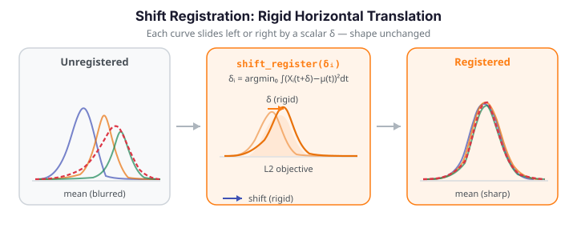

# Shift Registration

Shift registration is the entry-level alignment baseline: it asks only whether the phase variation in a sample can be explained by a single scalar time delay per curve. If two curves are identical except that one starts three days later, shift registration captures that perfectly. It is fast, interpretable, and makes no assumption about the *shape* of warping — only that the shape does not change as the curve shifts.

Before reaching for elastic alignment, which searches over all possible monotone warps of the time axis, check whether rigid shifts explain enough of the phase spread. On many real datasets (temperature cycles with a seasonal lag, growth spurts differing by a constant offset) they do.

{ .fdars-diagram }

The key distinction from elastic alignment is illustrated in the legend: a **shift** moves the entire curve left or right without changing its shape (straight horizontal arrow), while an **elastic warp** can compress and stretch different portions of the time axis differently (curved arrow). Shift registration is appropriate when phase variation is *rigid*; elastic alignment handles arbitrary monotone reparameterisation.

---

## How it works

For each curve $X_i$ in the sample, shift registration finds the scalar shift $\delta_i \in [-\Delta, \Delta]$ that minimises the Simpson-weighted $L^2$ distance between the time-shifted curve and the cross-sectional mean $\mu$:

$$
\delta_i = \arg\min_{\delta \in [-\Delta,\Delta]} \int \bigl(X_i(t + \delta) - \mu(t)\bigr)^2\, dt.
$$

The parameter $\Delta$ (`max_shift`) bounds how far each curve can slide. A golden-section search locates the minimum along this one-dimensional bracket (the objective is assumed unimodal). After the shift is found, the registered curve is re-evaluated at the original grid via linear interpolation.

Contrast with `karcher_mean` (elastic alignment), which finds arbitrary **monotone** warp functions $\gamma_i : [a,b] \to [a,b]$, $\gamma(a)=a$, $\gamma(b)=b$ — it can independently stretch and compress every segment. Shift registration is the special case where every $\gamma_i$ is a simple translation: $\gamma_i(t) = t + \delta_i$.

---

## API reference

### `least_squares_shift_registration`

```python
from fdars import alignment

result = alignment.least_squares_shift_registration(
    data,       # ndarray (n, m) — curves on the shared grid
    argvals,    # ndarray (m,) — sorted evaluation grid
    max_shift,  # float — maximum allowed shift in each direction
)

registered = result["registered_data"]  # ndarray (n, m) — registered curves
shifts = result["shifts"]               # ndarray (n,) — per-curve shift δ_i
```

| Key | Type | Description |
|-----|------|-------------|
| `"registered_data"` | `ndarray (n, m)` | Curves after applying the optimal shift |
| `"shifts"` | `ndarray (n,)` | Per-curve scalar shift $\delta_i$; positive = shifted right |

**Recommended** `max_shift = 0.25 × (argvals[-1] − argvals[0])`.

### `fd.shift_register()` — convenience method

The `Fdata` class wraps `least_squares_shift_registration` in a method:

```python
from fdars import Fdata

fd = Fdata(data, argvals=argvals)
fd_reg, shifts = fd.shift_register(max_shift=max_shift)
# fd_reg is a new Fdata with the registered curves
# shifts is an ndarray (n,) of per-curve δ_i values
```

---

## Registration quality scores

After registration, three scalar quality metrics measure how well the curves are aligned. They can also compare shift registration against elastic alignment on the same data.

| Function | Formula (sketch) | Range | Better when |
|----------|------------------|-------|-------------|
| `least_squares_score(reg, t)` | $(1/n)\sum_i \int (\tilde X_i - \mu)^2\,dt$ | $\geq 0$ | **lower** |
| `pairwise_correlation_score(reg, t)` | mean centered $L^2$ cosine over all pairs $(i < k)$ | $[-1, 1]$ | **higher** |
| `sobolev_least_squares_score(reg, t, lambda_)` | LS score + $\lambda \cdot$ derivative penalty | $\geq 0$ | **lower** |

The Sobolev score adds a derivative term that penalises rough registrations; it requires a **uniform grid** when $\lambda > 0$. At $\lambda = 0$ it reduces to `least_squares_score` exactly.

```python
from fdars.alignment import (
    least_squares_score,
    pairwise_correlation_score,
    sobolev_least_squares_score,
)

ls  = least_squares_score(registered, argvals)
pc  = pairwise_correlation_score(registered, argvals)
sob = sobolev_least_squares_score(registered, argvals, lambda_=0.01)  # uniform grid only

print(f"LS score (lower = better spread):   {ls:.4f}")
print(f"Pairwise corr (higher = better):    {pc:.4f}")
print(f"Sobolev score (lower = better):     {sob:.4f}")
```

A `pairwise_corr_score` below 0.7 after shift registration suggests that the phase variation is **not purely rigid** — elastic alignment (`karcher_mean`) will likely produce a better result.

### Interpreting quality score values

The scores have different scales and directions, and absolute thresholds must be interpreted relative to the data. The following guidance is approximate — calibrate against an unbanded elastic alignment result on your specific dataset.

**`pairwise_correlation_score` (higher = better, range approximately [−1, 1]):**

| Value | Interpretation |
|-------|----------------|
| ≥ 0.9 | Well aligned — rigid shifts explain most of the phase spread; elastic alignment unlikely to improve much |
| 0.7 – 0.9 | Grey zone — some non-rigid phase variation may remain; consider comparing against elastic alignment |
| < 0.7 | Rigid shifts are insufficient — non-rigid phase variation dominates; move to `karcher_mean` or `karcher_mean_with_band` |

Note that `pairwise_correlation_score` measures the *mean pairwise cosine similarity* in the centered $L^2$ sense. A score near 1.0 means the registered curves point in the same direction in function space; a score near 0 means they are pairwise uncorrelated after registration.

**`least_squares_score` and `sobolev_least_squares_score` (lower = better, ≥ 0):**

These are absolute residual scores — they depend on the amplitude scale of your data and are only meaningful when compared to:
- The pre-registration score (to assess improvement from shifting), or
- The elastic alignment score on the same data (to quantify the rigid-vs-elastic tradeoff).

There is no universal threshold. Compute both before and after registration: a large proportional drop (e.g. `ls_score` reduced by > 50 %) indicates shift registration was beneficial.

The `sobolev_least_squares_score` adds a $\lambda \cdot \int (\dot{\tilde X})^2\,dt$ derivative penalty. At `lambda_=0` it equals `least_squares_score` exactly. It requires a **uniform grid** when `lambda_ > 0`. Use it to penalise rough post-registration curves when smoothness is important.

---

## Worked example

The example below loads the Canadian Weather temperature dataset (35 stations × 365 days, uniform grid), runs `least_squares_shift_registration` on a small subset of stations, and reports the per-station shifts and the three quality scores.

```python exec="1" html="1" source="above"
import numpy as np
from docs_data import load_canadian_weather
from fdars import alignment

rng = np.random.default_rng(7)

# Load Canadian Weather — uniform daily grid (365 points), n=35 stations
day, X, meta = load_canadian_weather("temperature")

# Use a lightweight subset: 8 stations with a fixed seed
n_sub = 8
idx = rng.choice(X.shape[0], n_sub, replace=False)
Xs = X[idx]

# Shift registration — max_shift = 25% of the domain (≈91 days)
max_shift = 0.25 * (day[-1] - day[0])
res = alignment.least_squares_shift_registration(Xs, day, max_shift)
registered = np.asarray(res["registered_data"])
shifts = np.asarray(res["shifts"])

print(f"Dataset: {n_sub} stations x {day.shape[0]} days")
print(f"Per-station shifts (days): {shifts.round(1)}")
print(f"Mean shift:    {shifts.mean():.2f} days")
print(f"Max |shift|:   {np.abs(shifts).max():.2f} days")
print()

# Registration quality scores (all three; uniform grid -> sobolev OK)
ls  = alignment.least_squares_score(registered, day)
pc  = alignment.pairwise_correlation_score(registered, day)
sob = alignment.sobolev_least_squares_score(registered, day, lambda_=0.01)

print(f"least_squares_score     (lower = better): {ls:.2f}")
print(f"pairwise_corr_score   (higher = better): {pc:.4f}")
print(f"sobolev_score           (lower = better): {sob:.2f}")
print()
print("FDARS_FENCE_OK")
```

The shifts are positive for stations whose annual temperature cycle starts late (shifted right) and negative for early-peaking stations. The `pairwise_corr_score` near 1.0 confirms that the registered station curves are well aligned — the phase variation in this subset is predominantly rigid. The `least_squares_score` reflects absolute L2 spread after alignment; compare it against an elastic-alignment result (see [Elastic Alignment](elastic-alignment.md)) to quantify the rigid-vs-elastic tradeoff.

---

## Comparison with landmark registration

[Landmark registration](landmark-registration.md) (`fdars.alignment.register`) uses identified feature points (landmarks) to construct a piecewise-linear monotone warp between corresponding features. It sits between shift registration and full elastic alignment in the space of methods:

| Method | Warp type | Flexibility | Requirement |
|--------|-----------|-------------|-------------|
| Shift registration | Rigid translation $\gamma(t)=t+\delta$ | Lowest | None (automatic) |
| Landmark registration | Piecewise-linear monotone | Moderate | User-identified landmark locations |
| Elastic alignment | Full diffeomorphism (Karcher / Fisher-Rao) | Highest | None (automatic) |

**When to prefer shift registration over landmark registration:**
- Phase variation is a constant time offset across the whole domain (a seasonal lag, a reaction delay, an age offset).
- No clear anatomical or functional landmarks exist in the curves.
- Speed is paramount — shift registration runs in $O(n \cdot m)$; landmark registration requires manually specifying landmark locations.

**When to prefer landmark registration over shift registration:**
- Curves have clearly identifiable features (peaks, inflection points, onsets) at identifiable but variable locations.
- Phase variation is *not* a uniform shift — different parts of the domain shift by different amounts (e.g. the rising phase starts early but the falling phase ends late).
- You want a more flexible warp than a rigid shift but do not need the full diffeomorphism group.

Use shift registration as a **diagnostic first step**: if `pairwise_corr_score` is high (≥ 0.9) after shifting, you likely do not need landmark or elastic alignment. If it is in the grey zone (0.7 – 0.9) and identifiable landmarks exist, try landmark registration next. If it is low (< 0.7) with no clear landmarks, go directly to elastic alignment (`karcher_mean`).

## Mathematical note: rigid vs. elastic registration

Shift registration is the $\ell^\infty$-constrained special case of functional registration:

$$
\delta_i \in [-\Delta, \Delta] \subset \mathbb{R}, \quad \gamma_i(t) = t + \delta_i.
$$

Elastic alignment (Karcher mean) searches over the full diffeomorphism group $\Gamma = \{\gamma : [a,b]\to[a,b] \mid \gamma(a)=a,\, \gamma(b)=b,\, \dot\gamma>0\}$, finding the warp that minimises the Fisher-Rao distance. Shift registration is equivalent to restricting $\Gamma$ to just the one-parameter family of constant translations — exponentially cheaper but unable to handle non-constant phase variation (a curve that is early in one segment and late in another needs a non-constant warp).

Use shift registration as a **diagnostic first step**: if `pairwise_corr_score` is high after shifting, you likely do not need elastic alignment. If it is low, move on to [`karcher_mean`](elastic-alignment.md#group-alignment-karcher-mean).

---

## See also

- [Elastic Alignment](elastic-alignment.md) — arbitrary monotone warp; Fisher-Rao / SRVF framework
- [Landmark Registration](landmark-registration.md) — classical feature-based alignment with piecewise-linear warps
- [Banded Elastic Alignment](banded-alignment.md) — Karcher mean with Sakoe–Chiba speed constraint
- [Alignment Comparison](alignment-comparison.md) — head-to-head across methods on the same dataset

## References

- Ramsay, J.O., Silverman, B.W. (2005). *Functional Data Analysis*, 2nd ed. Springer. (Shift registration as the simplest phase-removal method.)
- Srivastava, A., Klassen, E. (2016). *Functional and Shape Data Analysis.* Springer. (Contrast with elastic / Fisher-Rao framework.)
