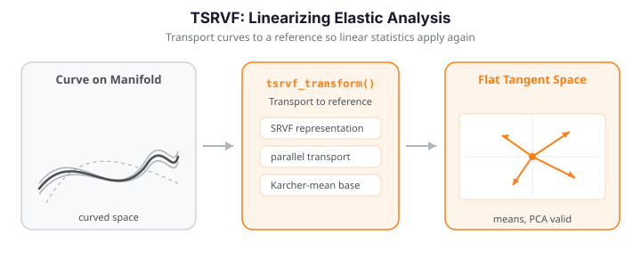

# TSRVF: Linearized Elastic Analysis

Elastic alignment lives on a curved manifold: the space of functions modulo warping is not a vector space, so ordinary sums, means, and PCA do not apply directly. The **Transported Square-Root Velocity Function (TSRVF)** representation solves this by parallel-transporting every curve's SRVF to a single reference point -- the Karcher mean -- so that the resulting tangent vectors live in a common linear (Euclidean) space. Once curves are represented as TSRVF tangent vectors, standard linear statistics -- means, covariances, principal components -- become valid again.

The figure below shows a phase-varying sample, its SRSF representation (where the elastic metric becomes the $L^2$ metric), and the mean SRSF recovered by the TSRVF procedure.


{ .fdars-diagram }

```python exec="1" html="1"
import numpy as np
from docs_fig import fig, render
from fdars.alignment import tsrvf_transform, srsf_transform

rng = np.random.default_rng(4)
n, m = 16, 120
t = np.linspace(0, 1, m)
base = np.sin(2 * np.pi * t) + 0.5 * np.sin(4 * np.pi * t)

# Phase-varying sample: compose the base with random monotone warps
data = np.zeros((n, m))
for i in range(n):
    warp = t ** rng.uniform(0.7, 1.5)
    warp = (warp - warp.min()) / np.ptp(warp)
    data[i] = np.interp(t, warp, base)

res = tsrvf_transform(data, t, max_iter=20, tol=1e-4)
mean_srsf = np.asarray(res["mean_srsf"])
q = np.array([srsf_transform(data[i], t) for i in range(n)])

f, (a1, a2) = fig(ncols=2, figsize=(9.5, 4.0))
a1.plot(t, data.T, color="#3f51b5", lw=1, alpha=0.5)
a1.set(title="Phase-varying curves $f_i$", xlabel="t", ylabel="f(t)")

a2.plot(t, q.T, color="#6f42c1", lw=1, alpha=0.35)
a2.plot(t, mean_srsf, color="#e8710a", lw=2.6, label="mean SRSF $\\mu_q$")
a2.set(title="SRSF representation", xlabel="t", ylabel="q(t)")
a2.legend(fontsize=8)
print(render(f))
```

---

## How it works (intuition)

After elastic alignment the curve *shapes* live on a curved surface -- the quotient manifold $\mathcal{F}/\Gamma$. Ordinary statistics assumes flat, Euclidean data, so applying PCA or regression directly distorts the geometry. The TSRVF fixes this by projecting each curve onto a flat tangent plane at the mean shape -- like laying a flat map tangent to the globe at a single point. Near the point of contact the map faithfully approximates the sphere.

Each curve becomes a **tangent vector** measuring its deviation from the mean shape, and these vectors live in ordinary Euclidean space. That unlocks PCA (to find the dominant modes of shape variation), regression (tangent vectors as predictors), and clustering/classification with any Euclidean method. The projection is invertible, so tangent vectors -- or PC scores, or model predictions -- can be mapped back onto the manifold to reconstruct curves.

---

## Concepts

### From SRSF to a shared tangent space

The **Square-Root Velocity Function (SRVF)**, also called the SRSF, maps a function $f$ to

$$
q(t) = \operatorname{sign}\!\big(\dot f(t)\big)\,\sqrt{\lvert \dot f(t)\rvert}.
$$

Under this map the Fisher-Rao elastic metric becomes the ordinary $L^2$ metric, so distances and geodesics can be computed with straightforward $L^2$ geometry. However, SRVFs of *misaligned* curves still differ by their warping, so their $L^2$ average blurs phase structure just like a cross-sectional mean.

The TSRVF construction fixes this in two steps:

1. **Align.** Compute the Karcher mean $\mu$ under the elastic metric and the optimal warp $\gamma_i$ that registers each curve to $\mu$.
2. **Transport.** Represent each aligned curve by its SRVF and parallel-transport it to the tangent space at $\mu_q$ (the mean's SRVF). The transported vectors

   $$
   v_i \;=\; \log_{\mu_q}\!\big(q_i \circ \gamma_i\big)
   $$

   are the **tangent vectors** returned by the transform. They live in a single Euclidean space $T_{\mu_q}$, so their sample mean, covariance, and principal components are meaningful.

Because $v_i$ are ordinary vectors, downstream analysis -- regression on scores, Gaussian modelling, hypothesis tests -- can proceed with classical multivariate tools while still respecting the elastic geometry that generated the data.

### The log and exp maps on the sphere

Unit SRSFs live on the Hilbert sphere $\mathbb{S}^\infty\subset L^2$, where the log map has a closed form. Writing $\tilde q_i=(q_i\circ\gamma_i)\sqrt{\dot\gamma_i}$ for the aligned SRSF, $\bar q$ for the mean SRSF, and $\theta_i=\cos^{-1}\langle\tilde q_i,\bar q\rangle_{L^2}$ for the geodesic angle between them, the tangent vector is

$$
v_i = \log_{\bar q}(\tilde q_i) = \frac{\theta_i}{\sin\theta_i}\,\big(\tilde q_i - \cos\theta_i\,\bar q\big),
$$

which is orthogonal to $\bar q$ and satisfies $\lVert v_i\rVert_{L^2}=\theta_i$, so tangent-space distances equal geodesic distances *exactly at* the mean and approximately nearby. The inverse (exponential) map reconstructs the aligned SRSF from any tangent vector $v$,

$$
\tilde q = \exp_{\bar q}(v) = \cos(\lVert v\rVert)\,\bar q + \sin(\lVert v\rVert)\,\frac{v}{\lVert v\rVert},
$$

and `srsf_inverse` then turns $\tilde q$ back into a curve (using the recovered $f_i(0)$). This exp map is exactly the reconstruction used in the [Inverse transform](#inverse-transform-reconstruction) section below.

### Log-map vs. shooting representation

`tsrvf_transform_with_method` exposes the choice of how curves are mapped into the tangent space. The `log_map` method uses the Riemannian logarithm at $\mu_q$ (the default, geometrically exact for the sphere of unit SRSFs); alternative shooting-based representations trade a small amount of fidelity for speed and are useful when only the linear scores matter.

---

## Usage

`tsrvf_transform(data, argvals, ...)` returns the mean, its SRSF, and the transported tangent vectors in one call.

```python
import numpy as np
from fdars.alignment import tsrvf_transform

t = np.linspace(0, 1, 120)
# ... build an (n, m) array `data` of phase-varying curves ...

res = tsrvf_transform(data, t, max_iter=20, tol=1e-4, lambda_=0.0)

V          = res["tangent_vectors"]   # (n, m) -- transported tangent vectors
mu         = res["mean"]              # (m,)   -- Karcher mean function
mu_q       = res["mean_srsf"]         # (m,)   -- mean in SRSF space
srsf_norms = res["srsf_norms"]        # (n,)   -- ||q_i|| for each curve
gammas     = res["gammas"]            # (n, m) -- warps to the mean
converged  = res["converged"]         # bool
```

| Parameter | Type | Description |
|-----------|------|-------------|
| `data` | `ndarray (n, m)` | Sample of $n$ curves on a common grid |
| `argvals` | `ndarray (m,)` | Evaluation grid (strictly increasing) |
| `max_iter` | `int` | Maximum Karcher-mean iterations (default `20`) |
| `tol` | `float` | Convergence tolerance (default `1e-4`) |
| `lambda_` | `float` | Warp regularization (default `0.0`) |

| Key | Type | Description |
|-----|------|-------------|
| `tangent_vectors` | `ndarray (n, m)` | Transported SRVF tangent vectors $v_i$ |
| `mean` | `ndarray (m,)` | Karcher mean function $\mu$ |
| `mean_srsf` | `ndarray (m,)` | Mean SRSF $\mu_q$ (the tangent-space origin) |
| `mean_srsf_norm` | `float` | Norm of the mean SRSF |
| `srsf_norms` | `ndarray (n,)` | SRSF norm of each curve |
| `initial_values` | `ndarray (n,)` | Recovered $f_i(0)$ (SRSF drops the offset) |
| `gammas` | `ndarray (n, m)` | Optimal warps to the mean |
| `converged` | `bool` | Whether the Karcher mean converged |

To select the tangent-space mapping explicitly, use the method variant:

```python
from fdars.alignment import tsrvf_transform_with_method

res = tsrvf_transform_with_method(data, t, method="log_map")   # or a shooting method
V = res["tangent_vectors"]     # same keys as tsrvf_transform
```

---

## Linear statistics in the tangent space

The point of the TSRVF is that the transported vectors behave like ordinary data. Their sample covariance has interpretable eigenvectors, and an SVD of the stacked tangent vectors yields **elastic principal components** -- a linear PCA that nonetheless respects the warping geometry, because it operates *after* transport.

```python exec="1" html="1" source="above"
import numpy as np
from docs_fig import fig, render
from fdars.alignment import tsrvf_transform

rng = np.random.default_rng(11)
n, m = 24, 120
t = np.linspace(0, 1, m)
base = np.sin(2 * np.pi * t) + 0.5 * np.sin(4 * np.pi * t)
data = np.zeros((n, m))
for i in range(n):
    warp = t ** rng.uniform(0.6, 1.6)
    warp = (warp - warp.min()) / np.ptp(warp)
    data[i] = (1.0 + 0.2 * rng.standard_normal()) * np.interp(t, warp, base)

res = tsrvf_transform(data, t, max_iter=20, tol=1e-4)
V = np.asarray(res["tangent_vectors"])
mu_q = np.asarray(res["mean_srsf"])

# Linear PCA on the transported tangent vectors
Vc = V - V.mean(0)
U, S, Wt = np.linalg.svd(Vc, full_matrices=False)
var_ratio = S**2 / np.sum(S**2)
pc1, pc2 = Wt[0], Wt[1]

f, (a1, a2) = fig(ncols=2, figsize=(9.5, 4.0))
a1.plot(t, mu_q, color="#e8710a", lw=2.2, label="$\\mu_q$")
a1.plot(t, pc1, color="#3f51b5", lw=1.8, label="PC1")
a1.plot(t, pc2, color="#198754", lw=1.8, label="PC2")
a1.set(title="Elastic PCs (tangent space)", xlabel="t", ylabel="component")
a1.legend(fontsize=8)

scores = Vc @ np.vstack([pc1, pc2]).T
a2.scatter(scores[:, 0], scores[:, 1], color="#6f42c1", s=28, alpha=0.8)
a2.set(title=f"Scores (PC1 {var_ratio[0]*100:.0f}%, PC2 {var_ratio[1]*100:.0f}%)",
       xlabel="PC1 score", ylabel="PC2 score")
print(render(f))
```

The scores are ordinary coordinates: cluster them, regress a response on them, or feed them to a Gaussian model. Because they were computed after transport to $T_{\mu_q}$, distances between scores approximate elastic distances between the original curves.

!!! tip "Why transport at all?"
    Averaging SRVFs without alignment reintroduces phase blur. Transport to a *common* base point is what makes the tangent vectors comparable -- it is the step that turns a curved problem into a flat one.

---

## Raw FPCA vs. TSRVF FPCA

The payoff of transport is dimensionality. Standard FPCA on *unaligned* curves conflates amplitude and phase, so variance spreads across many components. TSRVF FPCA operates on aligned shapes, so the components capture amplitude variation alone -- and the cumulative-variance curve rises faster, needing fewer components for the same coverage.

```python exec="1" html="1" source="above"
import numpy as np
from docs_fig import fig, render
from fdars.alignment import tsrvf_transform

rng = np.random.default_rng(42)
n, m = 24, 100
t = np.linspace(0, 1, m)
# amplitude + phase variation on a common shape
data = np.zeros((n, m))
for i in range(n):
    amp = rng.normal(1.0, 0.2)
    shift = rng.uniform(-0.1, 0.1)
    data[i] = amp * np.sin(2 * np.pi * (t - shift))

def cum_var(X):
    Xc = X - X.mean(0)
    s = np.linalg.svd(Xc, compute_uv=False)
    return np.cumsum(s ** 2) / np.sum(s ** 2)

raw = cum_var(data)                                    # FPCA on unaligned curves
V = np.asarray(tsrvf_transform(data, t, max_iter=20, tol=1e-4)["tangent_vectors"])
tsrvf = cum_var(V)                                     # FPCA on tangent vectors

k = np.arange(1, 6)
f, ax = fig()
ax.plot(k, 100 * raw[:5], "o-", color="#6c757d", lw=1.8, label="Raw FPCA")
ax.plot(k, 100 * tsrvf[:5], "o-", color="#3f51b5", lw=1.8, label="TSRVF FPCA")
ax.set(title="Cumulative variance explained", xlabel="number of PCs",
       ylabel="cumulative % variance", ylim=(None, 101))
ax.legend(fontsize=9)
print(render(f))

print(f"PCs to reach 95%  -- raw: {int(np.searchsorted(raw, 0.95)) + 1}, "
      f"TSRVF: {int(np.searchsorted(tsrvf, 0.95)) + 1}")
```

TSRVF FPCA typically needs fewer components: it has already removed phase variation, leaving lower-dimensional amplitude variation behind.

---

## Inverse transform (reconstruction)

The transform is invertible -- aligned curves can be rebuilt from their tangent vectors via the [exponential map](#the-log-and-exp-maps-on-the-sphere). There is **no dedicated `tsrvf_inverse` binding** in the Python surface, but the reconstruction is two transparent lines: apply the exp map to get the aligned SRSF, then `srsf_inverse` (with the recovered initial value) to get the curve.

```python exec="1" html="1" source="above"
import numpy as np
from docs_fig import fig, render
from fdars.alignment import tsrvf_transform, srsf_inverse

rng = np.random.default_rng(4)
n, m = 12, 100
t = np.linspace(0, 1, m)
base = np.sin(2 * np.pi * t) + 0.5 * np.sin(4 * np.pi * t)
data = np.zeros((n, m))
for i in range(n):
    warp = t ** rng.uniform(0.7, 1.5)
    data[i] = np.interp(t, (warp - warp.min()) / np.ptp(warp), base)

res = tsrvf_transform(data, t, max_iter=20, tol=1e-4)
V = np.asarray(res["tangent_vectors"])
mu_q = np.asarray(res["mean_srsf"])
iv = np.asarray(res["initial_values"])

def exp_map(v, mu_q, t):
    norm = np.sqrt(np.trapezoid(v ** 2, t))
    if norm < 1e-9:
        return mu_q.copy()
    return np.cos(norm) * mu_q + np.sin(norm) * (v / norm)

recon = np.array([srsf_inverse(exp_map(V[i], mu_q, t), t, initial_value=float(iv[i]))
                  for i in range(n)])
mu = np.asarray(res["mean"])

f, ax = fig()
ax.plot(t, recon.T, color="#198754", lw=1, alpha=0.5)
ax.plot(t, mu, color="#e8710a", lw=2.4, label="Karcher mean")
ax.set(title="Curves reconstructed from TSRVF tangent vectors",
       xlabel="t", ylabel="f(t)")
ax.legend(fontsize=9)
print(render(f))
```

Reconstruction from PC scores works the same way: form a tangent vector as mean-plus-a-few-eigenvectors, exp-map it, and invert. This is what lets you *synthesize* new aligned curves from a fitted low-dimensional model.

---

## When to use TSRVF

| Scenario | Recommended approach |
|----------|----------------------|
| Exploratory alignment & visualization | [`karcher_mean`](elastic-alignment.md#group-alignment-karcher-mean) |
| PCA on aligned data | `tsrvf_transform` + SVD (or [`vert_fpca`](shape-analysis.md#elastic-fpca)) |
| Regression with aligned predictors | `tsrvf_transform` + standard regression on scores |
| Clustering aligned curves | `tsrvf_transform` + any Euclidean clustering |
| Classification | TSRVF scores as features |

The one-liner: TSRVF converts a nonlinear shape-analysis problem into a standard multivariate one, at the cost of a single up-front alignment step.

!!! info "Relationship to elastic FPCA"
    `tsrvf_transform` supplies the transported representation that vertical (amplitude) FPCA operates on. If you want ready-made eigenfunctions and cumulative-variance summaries, use [`vert_fpca`](shape-analysis.md#elastic-fpca); use the raw tangent vectors here when you need full control over the downstream linear model.

See also [Elastic Alignment](elastic-alignment.md) for the underlying SRSF machinery and Karcher mean, and [Shape Analysis](shape-analysis.md) for the amplitude/phase decomposition built on this representation.

## References

- Srivastava, A., Klassen, E., Joshi, S.H., Jermyn, I.H. (2011). *Shape analysis of elastic curves in Euclidean spaces.* IEEE TPAMI 33(7):1415-1428.
- Srivastava, A., Klassen, E. (2016). *Functional and Shape Data Analysis.* Springer. (Exp/log maps on the SRVF sphere.)
