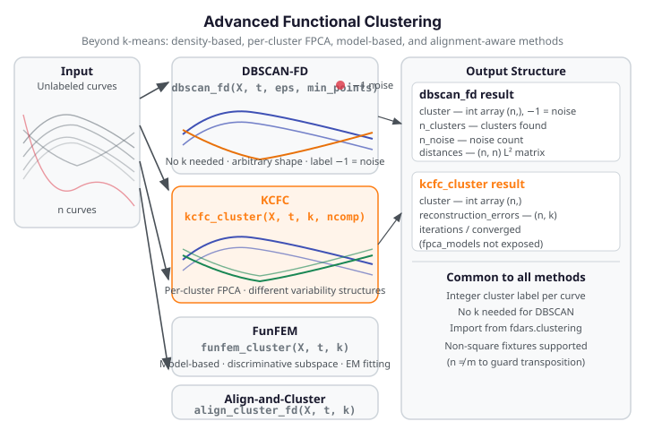

# Advanced Clustering

Beyond standard $k$-means and fuzzy $c$-means, `fdars` provides four advanced
functional clustering algorithms that handle density-based outlier detection, per-cluster
structure discovery, model-based grouping, and simultaneous alignment with clustering.
These methods are suited to datasets where curves are not cleanly separated by centroid
distance alone.

{ .fdars-diagram }

## Core Concept

Standard $k$-means assigns each curve to the nearest centroid and minimizes within-cluster
$L^2$ distance. Advanced methods address its limitations:

- **DBSCAN-FD** identifies clusters of arbitrary shape and marks low-density curves as
  noise (label $-1$), with no need to specify $k$ in advance.
- **KCFC** fits a separate FPCA model per cluster, so each group has its own
  low-dimensional representation — ideal when clusters differ in both mean shape and
  variability structure.
- **FunFEM** uses a mixture model in a cluster-specific functional subspace (discriminative
  functional subspace clustering).
- **Align-and-Cluster** simultaneously warps curves and assigns cluster membership,
  producing phase-aligned cluster templates.

```python exec="1" source="above"
import numpy as np
from fdars.clustering import dbscan_fd, kcfc_cluster

rng = np.random.default_rng(42)
n, m = 25, 40     # non-square: n != m (transposition guard)
t = np.linspace(0, 1, m)
# Two well-separated clusters: sin-family and cos-family
X = np.vstack([
    np.array([np.sin(2 * np.pi * t + rng.uniform(-0.2, 0.2)) for _ in range(13)]),
    np.array([np.cos(2 * np.pi * t + rng.uniform(-0.2, 0.2)) for _ in range(12)]),
])

db  = dbscan_fd(X, t, eps=0.5, min_points=3)
kfc = kcfc_cluster(X, t, k=2)

print(f"dbscan n_clusters: {db['n_clusters']}")
print(f"kcfc cluster shape: {np.asarray(kfc['cluster']).shape}  FDARS_FENCE_OK")
```

DBSCAN finds two clusters with no noise points for this clean fixture. KCFC returns
integer cluster labels for all 25 curves.

## API Reference

### `dbscan_fd` — Density-Based Spatial Clustering

```python
from fdars.clustering import dbscan_fd

db = dbscan_fd(data, argvals, eps=0.5, min_points=3)
```

| Parameter | Type | Description |
|-----------|------|-------------|
| `data` | `np.ndarray` (n, m) | Functional observations |
| `argvals` | `np.ndarray` (m,) | Evaluation grid |
| `eps` | `float` | Neighbourhood radius in $L^2$ distance units (default: 0.5) |
| `min_points` | `int` | Minimum neighbours for a core point (default: 3) |

| Key | Meaning |
|-----|---------|
| `cluster` | 1D int array, shape `(n,)`; $-1$ indicates a noise point, $0, \ldots, k-1$ are cluster ids |
| `n_clusters` | Number of clusters found (excluding noise) |
| `n_noise` | Number of noise points |
| `distances` | Pairwise $L^2$ distance matrix, shape `(n, n)` |

---

### `kcfc_cluster` — K-Centres Functional Clustering

```python
from fdars.clustering import kcfc_cluster

kfc = kcfc_cluster(data, argvals, k=2, ncomp=3, max_iter=50, seed=42)
```

| Parameter | Type | Description |
|-----------|------|-------------|
| `data` | `np.ndarray` (n, m) | Functional observations |
| `argvals` | `np.ndarray` (m,) | Evaluation grid |
| `k` | `int` | Number of clusters (default: 2) |
| `ncomp` | `int` | FPC components per cluster (default: 3) |
| `max_iter` | `int` | Maximum iterations (default: 50) |
| `seed` | `int` | Random seed (default: 42) |

| Key | Meaning |
|-----|---------|
| `cluster` | 1D int array, shape `(n,)`; cluster labels $0 \ldots k-1$ |
| `reconstruction_errors` | Per-observation reconstruction error per cluster, shape `(n, k)` |
| `iterations` | Number of iterations performed |
| `converged` | Whether the algorithm converged |

---

### Additional Clustering Functions

| Function | Description |
|----------|-------------|
| `funfem_cluster(data, argvals, k, ...)` | Model-based clustering via discriminative functional subspaces |
| `align_cluster_fd(data, argvals, k, ...)` | Simultaneous alignment and clustering; returns `templates` (list of 1D arrays) |

All functions are importable from `fdars.clustering`.

## References

- Ester, M., Kriegel, H.-P., Sander, J. and Xu, X. (1996). A density-based algorithm for
  discovering clusters in large spatial databases with noise. *KDD* 96(34), 226–231.
- Chiou, J.-M. and Li, P.-L. (2007). Functional clustering and identifying substructures
  of longitudinal data. *Journal of the Royal Statistical Society: Series B* 69(4), 679–699.
- Bouveyron, C. and Jacques, J. (2011). Model-based clustering of time series in group-specific
  functional subspaces. *Advances in Data Analysis and Classification* 5(4), 281–300.
