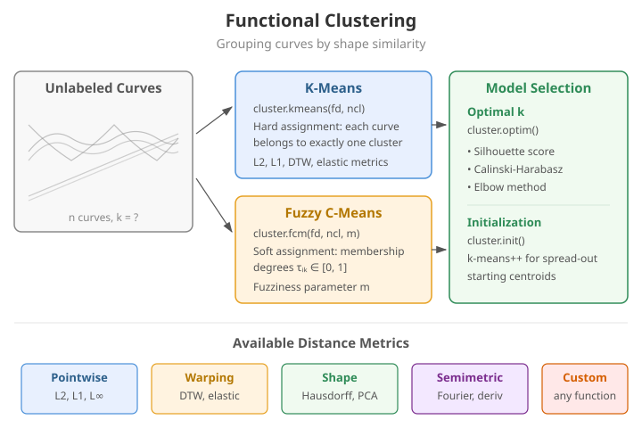

# Clustering

Partition a set of functional observations into homogeneous groups. `fdars` provides three clustering algorithms -- hard (k-means), soft (fuzzy c-means), and model-based (GMM) -- together with two cluster-quality indices for selecting the number of clusters.

---

{ .fdars-diagram }

## K-means for functional data

The functional k-means algorithm minimises the total within-cluster $L^2$ distance, iterating between assignment and centroid update until convergence.

```python
import numpy as np
from fdars import Fdata
from fdars.simulation import simulate
from fdars.clustering import kmeans_fd

# Two well-separated groups
argvals = np.linspace(0, 1, 100)
group_a = simulate(30, argvals, n_basis=5, seed=1)
group_b = simulate(30, argvals, n_basis=5, seed=2) + 3.0
fd = Fdata(np.vstack([group_a, group_b]), argvals=argvals)

result = kmeans_fd(fd.data, fd.argvals, k=2, max_iter=100, tol=1e-6, seed=42)
```

```python exec="1" html="1"
import numpy as np
from docs_fig import fig, render
from fdars.simulation import simulate
from fdars.clustering import kmeans_fd

t = np.linspace(0, 1, 100)
g1 = np.asarray(simulate(20, t, n_basis=5, seed=1))
g2 = np.asarray(simulate(20, t, n_basis=5, seed=2)) + 3.0
X = np.vstack([g1, g2])

km = kmeans_fd(X, t, k=2, seed=42)
labels = np.asarray(km["cluster"])
centers = np.asarray(km["centers"])
palette = ["#3f51b5", "#e8710a"]

f, ax = fig()
for i, xi in enumerate(X):
    ax.plot(t, xi, color=palette[labels[i]], lw=0.9, alpha=0.4)
for k, c in enumerate(centers):
    ax.plot(t, c, color=palette[k], lw=2.8, label=f"cluster {k} center")
ax.set(title="Functional k-means: two groups colored by cluster",
       xlabel="t", ylabel="X(t)")
ax.legend()
print(render(f))
```

**Parameters**

| Parameter | Type | Default | Description |
|---|---|---|---|
| `data` | `ndarray (n, m)` | -- | Functional observations |
| `argvals` | `ndarray (m,)` | -- | Evaluation grid |
| `k` | `int` | -- | Number of clusters |
| `max_iter` | `int` | `100` | Maximum iterations |
| `tol` | `float` | `1e-6` | Convergence tolerance |
| `seed` | `int` | `42` | Random seed for initialisation |

**Returns** a dictionary:

| Key | Shape / Type | Description |
|---|---|---|
| `cluster` | `(n,)` int | Cluster label for each observation |
| `centers` | `(k, m)` | Cluster centroid curves |
| `tot_withinss` | `float` | Total within-cluster sum of squares |
| `iter` | `int` | Number of iterations performed |
| `converged` | `bool` | Whether the algorithm converged |

---

## Fuzzy C-means

Fuzzy c-means assigns each observation a *membership degree* for every cluster rather than a hard label, controlled by the fuzziness parameter $m$ (default 2).

```python
from fdars.clustering import fuzzy_cmeans_fd

result_fcm = fuzzy_cmeans_fd(
    fd.data, fd.argvals, k=2, fuzziness=2.0, max_iter=100, tol=1e-6, seed=42
)
```

**Parameters**

| Parameter | Type | Default | Description |
|---|---|---|---|
| `data` | `ndarray (n, m)` | -- | Functional observations |
| `argvals` | `ndarray (m,)` | -- | Evaluation grid |
| `k` | `int` | -- | Number of clusters |
| `fuzziness` | `float` | `2.0` | Fuzziness exponent ($> 1$) |
| `max_iter` | `int` | `100` | Maximum iterations |
| `tol` | `float` | `1e-6` | Convergence tolerance |
| `seed` | `int` | `42` | Random seed |

**Returns** a dictionary:

| Key | Shape / Type | Description |
|---|---|---|
| `cluster` | `(n,)` int | Hard assignment (argmax of membership) |
| `membership` | `(n, k)` | Membership degree matrix |
| `centers` | `(k, m)` | Cluster centroid curves |

!!! tip "Interpreting membership"
    A membership value of 0.95 for cluster 1 and 0.05 for cluster 2 indicates a clearly assigned point. Values near 0.50/0.50 indicate boundary observations that sit between clusters.

---

### The fuzziness parameter $m$

The fuzziness exponent controls how soft the memberships are:

- $m \to 1^+$: memberships collapse toward hard 0/1 assignments (like k-means);
- $m = 2$: the standard default -- soft, well-behaved memberships;
- $m > 2$: softer, more overlapping memberships.

Sweeping $m$ shows the average maximum membership decreasing as $m$ grows -- the clusters
become progressively fuzzier.

```python exec="1" html="1" source="above"
import numpy as np
from docs_fig import fig, render
from fdars.simulation import simulate
from fdars.clustering import fuzzy_cmeans_fd

t = np.linspace(0, 1, 80)
X = np.vstack([
    np.asarray(simulate(20, t, n_basis=5, seed=1)),
    np.asarray(simulate(20, t, n_basis=5, seed=2)) + 3.0,
    np.asarray(simulate(20, t, n_basis=5, seed=3)) - 3.0,
])

ms = [1.1, 1.5, 2.0, 2.5, 3.0]
avg_max = [
    float(np.asarray(fuzzy_cmeans_fd(X, t, k=3, fuzziness=m, seed=42)["membership"]).max(1).mean())
    for m in ms
]

f, ax = fig(figsize=(7.0, 3.6))
ax.plot(ms, avg_max, "-o", color="#6f42c1", lw=1.8)
ax.set(title="Average maximum membership vs. fuzziness m",
       xlabel="fuzziness m", ylabel="mean of row-max membership", ylim=(0.4, 1.02))
print(render(f))
```

At $m = 1.1$ nearly every curve is essentially hard-assigned (mean max membership close
to 1); by $m = 3$ the memberships are much softer.

!!! tip "Membership as an outlier signal"
    A curve with a *low* maximum membership belongs strongly to no cluster -- it sits on a
    boundary or is an outlier. Flagging the lowest-membership decile is a cheap,
    model-based outlier screen (see [Outlier detection](outlier-detection.md) for
    dedicated methods).

---

## Model-based clustering

For a *probabilistic* mixture model -- posterior membership probabilities and automatic
selection of the number of components via BIC/ICL -- see the dedicated
[GMM clustering](gmm-clustering.md) page (`gmm_cluster`). For clustering that first aligns
curves to remove phase variation, see [Elastic clustering](elastic-clustering.md).

---

## Cluster quality indices

### Silhouette score

The silhouette score measures how similar each observation is to its own cluster compared with the nearest neighbouring cluster. Values range from $-1$ (misclassified) to $+1$ (perfectly clustered).

```python
from fdars.clustering import silhouette_score
from fdars.metric import lp_self_1d

dist_matrix = lp_self_1d(fd.data, fd.argvals, p=2.0)
labels = result["cluster"].astype(np.int64)
sil = silhouette_score(dist_matrix, labels)
print(f"Mean silhouette: {np.mean(sil):.3f}")
```

### Calinski-Harabasz index

A higher Calinski-Harabasz index indicates better-defined clusters (larger between-cluster variance relative to within-cluster variance).

```python
from fdars.clustering import calinski_harabasz

ch = calinski_harabasz(dist_matrix, labels)
print(f"Calinski-Harabasz: {ch:.1f}")
```

!!! tip "Convenience variants that skip the distance matrix"
    `silhouette_score_data(data, argvals, labels)` and
    `calinski_harabasz_data(data, argvals, labels)` compute the $L^2$ distance matrix
    internally, so you can pass the raw curves directly instead of precomputing
    `lp_self_1d`.

---

## Selecting the optimal number of clusters

A common strategy is to run k-means for several values of $k$ and pick the one that maximises the mean silhouette score.

```python
import numpy as np
from fdars import Fdata
from fdars.simulation import simulate
from fdars.clustering import kmeans_fd, silhouette_score
from fdars.metric import lp_self_1d

# Three-group data
argvals = np.linspace(0, 1, 100)
g1 = simulate(25, argvals, n_basis=5, seed=1)
g2 = simulate(25, argvals, n_basis=5, seed=2) + 3.0
g3 = simulate(25, argvals, n_basis=5, seed=3) - 3.0
fd = Fdata(np.vstack([g1, g2, g3]), argvals=argvals)

dist = lp_self_1d(fd.data, fd.argvals, p=2.0)

scores = {}
for k in range(2, 9):
    res = kmeans_fd(fd.data, fd.argvals, k=k, seed=42)
    labels = res["cluster"].astype(np.int64)
    sil = silhouette_score(dist, labels)
    scores[k] = float(np.mean(sil))
    print(f"k={k}  silhouette={scores[k]:.3f}")

best_k = max(scores, key=scores.get)
print(f"\nOptimal k = {best_k}")
```

```python exec="1" html="1"
import numpy as np
from docs_fig import fig, render
from fdars.simulation import simulate
from fdars.clustering import kmeans_fd, silhouette_score
from fdars.metric import lp_self_1d

t = np.linspace(0, 1, 100)
g1 = np.asarray(simulate(15, t, n_basis=5, seed=1))
g2 = np.asarray(simulate(15, t, n_basis=5, seed=2)) + 3.0
g3 = np.asarray(simulate(15, t, n_basis=5, seed=3)) - 3.0
X = np.vstack([g1, g2, g3])
dist = np.asarray(lp_self_1d(X, t, p=2.0))

ks = list(range(2, 8))
scores = []
for k in ks:
    res = kmeans_fd(X, t, k=k, seed=42)
    labels = np.asarray(res["cluster"]).astype(np.int64)
    scores.append(float(np.mean(np.asarray(silhouette_score(dist, labels)))))
best = int(np.argmax(scores))

f, ax = fig(figsize=(7.0, 3.6))
ax.plot(ks, scores, "-o", color="#3f51b5", lw=1.8)
ax.plot(ks[best], scores[best], "o", color="#e8710a", ms=11,
        label=f"best k = {ks[best]}")
ax.set(title="Mean silhouette vs. number of clusters (3 true groups)",
       xlabel="k", ylabel="mean silhouette")
ax.legend()
print(render(f))
```

A complementary diagnostic is the **elbow method**: plot the total within-cluster sum of
squares (`tot_withinss`) against $k$ and look for the "elbow" where adding clusters stops
buying much reduction in scatter. For three well-separated groups both criteria agree at
$k = 3$.

```python exec="1" html="1" source="above"
import numpy as np
from docs_fig import fig, render
from fdars.simulation import simulate
from fdars.clustering import kmeans_fd

t = np.linspace(0, 1, 80)
X = np.vstack([
    np.asarray(simulate(15, t, n_basis=5, seed=1)),
    np.asarray(simulate(15, t, n_basis=5, seed=2)) + 3.0,
    np.asarray(simulate(15, t, n_basis=5, seed=3)) - 3.0,
])

ks = list(range(1, 8))
wss = [float(kmeans_fd(X, t, k=k, seed=42)["tot_withinss"]) for k in ks]

f, ax = fig(figsize=(7.0, 3.6))
ax.plot(ks, wss, "-o", color="#198754", lw=1.8)
ax.axvline(3, color="#e8710a", ls="--", lw=1.2, label="elbow at k = 3")
ax.set(title="Elbow method: total within-cluster SS vs. k",
       xlabel="k", ylabel="tot_withinss")
ax.legend()
print(render(f))
```

---

## Using different distance metrics

`kmeans_fd` uses $L^2$ distance internally. When clusters differ mainly by a *phase
shift* (a horizontal translation), $L^2$ can be misled -- two curves that are identical
up to a small time shift look far apart pointwise. Computing a shift-tolerant distance
matrix (DTW, Hausdorff) and feeding the resulting labels to the quality indices lets you
compare how well a labeling holds up under an alternative metric.

```python exec="1" html="1" source="above"
import numpy as np
from docs_fig import fig, render
from fdars.metric import lp_self_1d, dtw_self_1d
from fdars.clustering import silhouette_score, kmeans_fd

rng = np.random.default_rng(456)
t = np.linspace(0, 1, 80)
# Two groups that differ only by a phase shift of 0.5 rad
X = np.vstack([
    np.array([np.sin(2 * np.pi * t) + rng.normal(0, 0.3, t.size) for _ in range(30)]),
    np.array([np.sin(2 * np.pi * t + 0.5) + rng.normal(0, 0.3, t.size) for _ in range(30)]),
])
labels = np.array([0] * 30 + [1] * 30)

d_l2 = np.asarray(lp_self_1d(X, t, p=2.0))
d_dtw = np.asarray(dtw_self_1d(X, p=2.0, w=10))
sil_l2 = float(np.mean(np.asarray(silhouette_score(d_l2, labels))))
sil_dtw = float(np.mean(np.asarray(silhouette_score(d_dtw, labels))))

f, ax = fig(figsize=(6.5, 3.6))
ax.bar(["L2", "DTW"], [sil_l2, sil_dtw], color=["#3f51b5", "#e8710a"], width=0.55)
ax.set(title="Silhouette of the true labels under two metrics\n(phase-shifted groups)",
       ylabel="mean silhouette")
for i, v in enumerate([sil_l2, sil_dtw]):
    ax.text(i, v, f"{v:.3f}", ha="center", va="bottom")
print(render(f))
```

Under DTW the two phase-shifted groups score a higher silhouette than under $L^2$,
because DTW absorbs the timing difference. If your groups genuinely differ by *shape* and
not by *timing*, consider the [elastic clustering](elastic-clustering.md) methods, which
separate amplitude from phase explicitly.

---

## Full example -- recovering three known groups

With a labeled simulation we can check that k-means recovers the true partition. Cluster
labels are arbitrary up to a permutation, so accuracy is the best match over all label
permutations -- exactly the "confusion-matrix accuracy" used in the R reference.

```python exec="1" source="above"
import numpy as np
from itertools import permutations
from fdars.simulation import simulate
from fdars.clustering import kmeans_fd, fuzzy_cmeans_fd

# Three well-separated groups
t = np.linspace(0, 1, 80)
X = np.vstack([
    np.asarray(simulate(30, t, n_basis=5, seed=10)),
    np.asarray(simulate(30, t, n_basis=5, seed=20)) + 4.0,
    np.asarray(simulate(30, t, n_basis=5, seed=30)) - 4.0,
])
true = np.array([0] * 30 + [1] * 30 + [2] * 30)

km = kmeans_fd(X, t, k=3, seed=42)
pred = np.asarray(km["cluster"])
print("K-means converged:", km["converged"])

# Accuracy over the best label permutation
acc = max(np.mean([p[c] for c in pred] == true) for p in permutations(range(3)))
print(f"Best-match accuracy: {acc:.3f}")

# Fuzzy c-means: membership entropy as an uncertainty summary
fcm = fuzzy_cmeans_fd(X, t, k=3, seed=42)
mem = np.asarray(fcm["membership"])
entropy = -np.sum(mem * np.log(mem + 1e-12), axis=1)
print(f"Mean membership entropy: {entropy.mean():.3f}")
```

## See also

- [GMM clustering](gmm-clustering.md) -- probabilistic model-based clustering with BIC/ICL
  model selection.
- [Elastic clustering](elastic-clustering.md) -- clustering that separates amplitude from
  phase before grouping.
- [Outlier detection](outlier-detection.md) -- dedicated functional outlier methods.

## References

- Jacques, J., Preda, C. (2014). *Functional data clustering: a survey.* Advances in Data Analysis and Classification, 8(3), 231–255.
- Abraham, C., Cornillon, P.A., Matzner-Løber, E., Molinari, N. (2003). *Unsupervised curve clustering using B-splines.* Scandinavian Journal of Statistics, 30(3), 581–595.
- Bezdek, J.C. (1981). *Pattern Recognition with Fuzzy Objective Function Algorithms.* Plenum Press.
