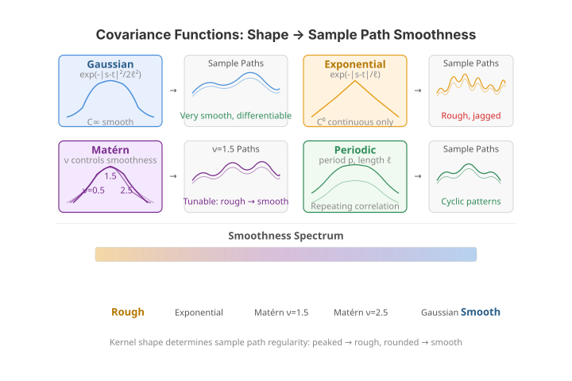

# Covariance Functions

Covariance functions (kernels) describe the correlation structure of a stochastic process. They are the building blocks for Gaussian process simulation, Kriging, and kernel-based smoothing. `fdars` provides kernel-based covariance matrix construction and Gaussian process sample generation, all computed in Rust.

---

{ .fdars-diagram }

## Available kernels

| Kernel | Formula | Character |
|---|---|---|
| **Gaussian** (squared exponential) | $C(s,t) = \sigma^2 \exp\!\bigl(-\tfrac{(s-t)^2}{2\ell^2}\bigr)$ | Infinitely smooth sample paths |
| **Exponential** | $C(s,t) = \sigma^2 \exp\!\bigl(-\tfrac{|s-t|}{\ell}\bigr)$ | Continuous but non-differentiable (Ornstein-Uhlenbeck) |
| **Matern** ($\nu=1.5$) | $C(s,t) = \sigma^2 \bigl(1 + \tfrac{\sqrt{3}\,|s-t|}{\ell}\bigr) \exp\!\bigl(-\tfrac{\sqrt{3}\,|s-t|}{\ell}\bigr)$ | Once-differentiable; realistic for physical processes |
| **Periodic** | $C(s,t) = \sigma^2 \exp\!\bigl(-\tfrac{2\sin^2(\pi|s-t|/p)}{\ell^2}\bigr)$ | Repeating patterns with period $p$ |

In all formulas, $\ell$ is the **length scale** and $\sigma^2$ is the **variance**.

---

## Computing a covariance matrix

```python
import numpy as np
from fdars.simulation import covariance_matrix

argvals = np.linspace(0, 1, 100)

# Gaussian kernel
cov_gauss = covariance_matrix(argvals, kernel="gaussian", length_scale=0.2, variance=1.0)

# Exponential kernel
cov_exp = covariance_matrix(argvals, kernel="exponential", length_scale=0.2, variance=1.0)

print(f"Shape: {cov_gauss.shape}")           # (100, 100)
print(f"Symmetric: {np.allclose(cov_gauss, cov_gauss.T)}")  # True

# Ground-truth checks against the closed-form Gaussian kernel:
S, T = np.meshgrid(argvals, argvals, indexing="ij")
ref = np.exp(-(S - T) ** 2 / (2 * 0.2 ** 2))            # σ²=1, ℓ=0.2
assert np.allclose(cov_gauss, ref)                     # matches the analytic formula
assert np.allclose(np.diag(cov_gauss), 1.0)            # C(t, t) = σ²
```

**Parameters**

| Parameter | Type | Default | Description |
|---|---|---|---|
| `argvals` | `ndarray (m,)` | -- | Evaluation grid |
| `kernel` | `str` | `"gaussian"` | `"gaussian"` or `"exponential"` |
| `length_scale` | `float` | `0.2` | Kernel length scale $\ell$ |
| `variance` | `float` | `1.0` | Kernel variance $\sigma^2$ |

**Returns** an `ndarray` of shape `(m, m)`.

The Gaussian and exponential kernels have very different off-diagonal decay, which is
visible as broader vs. sharper structure around the diagonal of the covariance surface.

```python exec="1" html="1"
import numpy as np
from docs_fig import fig, render
from fdars.simulation import covariance_matrix

t = np.linspace(0, 1, 100)
kernels = ["gaussian", "exponential"]

f, axes = fig(1, 2, figsize=(9.5, 4.0))
for ax, kern in zip(axes, kernels):
    cov = np.asarray(covariance_matrix(t, kernel=kern, length_scale=0.15, variance=1.0))
    im = ax.imshow(cov, origin="lower", extent=(0, 1, 0, 1),
                   cmap="viridis", aspect="equal")
    ax.grid(False)
    ax.set(title=f"{kern.title()} kernel  C(s, t)", xlabel="s", ylabel="t")
    f.colorbar(im, ax=ax, fraction=0.046, pad=0.04)
print(render(f))
```

The Gaussian surface is smooth and broad -- correlation decays gradually away from the
diagonal -- whereas the exponential surface is visibly sharper, concentrating correlation
tightly along $s = t$. That contrast in off-diagonal decay is exactly what makes Gaussian
paths smooth and exponential paths rough.

!!! tip "Effect of length scale"
    A small $\ell$ produces rapidly varying (wiggly) functions; a large $\ell$ produces smooth, slowly varying functions.

The length scale $\ell$ is the single most important knob: it sets the distance over which
function values stay correlated. The panels below draw the *same* seed at three length
scales, so the only difference is how quickly the paths wiggle.

```python exec="1" html="1" source="above"
import numpy as np
from docs_fig import fig, render
from fdars.simulation import gaussian_process

t = np.linspace(0, 1, 200)
scales = [0.05, 0.2, 0.5]

f, axes = fig(1, 3, figsize=(11.5, 3.4), sharey=True)
for ax, ls in zip(axes, scales):
    paths = np.asarray(gaussian_process(5, t, kernel="gaussian",
                                        length_scale=ls, variance=1.0, seed=42))
    ax.plot(t, paths.T, lw=1.1, alpha=0.85)
    ax.set(title=f"length_scale = {ls}", xlabel="t")
axes[0].set_ylabel("X(t)")
print(render(f))
```

As $\ell$ grows from 0.05 to 0.5 the sample paths go from jagged to gently undulating,
even though the seed (and hence the underlying randomness) is identical.

---

## Generating Gaussian process samples

`gaussian_process` draws $n$ sample paths from a zero-mean GP with the specified kernel. The function internally constructs the covariance matrix and performs a Cholesky decomposition.

```python
from fdars import Fdata
from fdars.simulation import gaussian_process

argvals = np.linspace(0, 1, 200)

# 50 smooth curves (Gaussian kernel)
fd_gauss = Fdata(gaussian_process(50, argvals, kernel="gaussian", length_scale=0.15, seed=1), argvals=argvals)

# 50 rough curves (exponential kernel)
fd_exp = Fdata(gaussian_process(50, argvals, kernel="exponential", length_scale=0.15, seed=1), argvals=argvals)

# 50 Matern curves
fd_mat = Fdata(gaussian_process(50, argvals, kernel="matern", length_scale=0.15, seed=1), argvals=argvals)

# 50 periodic curves
fd_per = Fdata(gaussian_process(50, argvals, kernel="periodic", length_scale=0.15, seed=1), argvals=argvals)
```

**Parameters**

| Parameter | Type | Default | Description |
|---|---|---|---|
| `n` | `int` | -- | Number of sample paths |
| `argvals` | `ndarray (m,)` | -- | Evaluation grid |
| `kernel` | `str` | `"gaussian"` | `"gaussian"`, `"exponential"`, `"matern"`, or `"periodic"` |
| `length_scale` | `float` | `0.2` | Kernel length scale |
| `variance` | `float` | `1.0` | Kernel variance |
| `seed` | `int` | `None` | Random seed (omit for non-deterministic) |

**Returns** an `ndarray` of shape `(n, m)`.

---

## Comparing kernel shapes

Sample paths reveal each kernel's character: the Gaussian kernel gives infinitely
smooth curves, the exponential kernel rough (non-differentiable) ones, the Matern kernel
sits in between, and the periodic kernel produces repeating structure.

```python exec="1" html="1"
import numpy as np
from docs_fig import fig, render
from fdars.simulation import gaussian_process

t = np.linspace(0, 1, 200)
kernels = ["gaussian", "exponential", "matern", "periodic"]

f, axes = fig(2, 2, figsize=(9.5, 5.6), sharex=True)
for ax, kern in zip(axes.ravel(), kernels):
    paths = np.asarray(gaussian_process(6, t, kernel=kern,
                                        length_scale=0.15, seed=42))
    ax.plot(t, paths.T, lw=1.0, alpha=0.85)
    ax.set_title(f"{kern.title()} kernel")
for ax in axes[-1]:
    ax.set_xlabel("t")
print(render(f))
```

Looking at a single **row** of the covariance matrix -- $C(0.5, t)$, the correlation of
the midpoint with every other point -- makes the decay rate explicit: the Gaussian kernel
falls off smoothly and quadratically near the diagonal, while the exponential kernel has a
sharp cusp at $s = t$, which is exactly why its sample paths are non-differentiable.

```python exec="1" html="1" source="above"
import numpy as np
from docs_fig import fig, render
from fdars.simulation import covariance_matrix

t = np.linspace(0, 1, 200)
mid = len(t) // 2

f, ax = fig(figsize=(7.2, 3.6))
for kern, color in [("gaussian", "#3f51b5"), ("exponential", "#e8710a")]:
    cov = np.asarray(covariance_matrix(t, kernel=kern, length_scale=0.15, variance=1.0))
    ax.plot(t, cov[mid, :], color=color, lw=1.8, label=f"{kern} C(0.5, t)")
ax.set(title="Covariance cross-section at s = 0.5", xlabel="t", ylabel="C(0.5, t)")
ax.legend()
print(render(f))
```

The cross-section makes the roughness mechanism concrete: the Gaussian curve leaves the
diagonal with zero slope (a rounded top), so nearby values are almost perfectly
correlated, while the exponential curve descends with a sharp corner at $t = 0.5$, and it
is precisely that non-smooth peak in the covariance that transmits non-differentiability
to the sample paths.

---

## Empirical covariance and its eigenstructure

Given an observed sample, the **empirical covariance** $\hat C(s,t)$ is the sample
covariance of the curve values across observations, estimated from $n$ centred curves as

$$
\hat C(s, t) = \frac{1}{n-1} \sum_{i=1}^{n} \bigl(X_i(s) - \bar X(s)\bigr)\bigl(X_i(t) - \bar X(t)\bigr).
$$

Its spectral decomposition $\hat C\,\phi_k = \lambda_k\,\phi_k$ is the
basis of functional PCA: the leading eigenfunctions $\phi_k$ are the dominant modes of variation
and the eigenvalues $\lambda_k$ give the variance each mode explains. (`covariance_matrix` builds a
*theoretical* kernel; here we estimate $\hat C$ from data with plain numpy.)

```python exec="1" html="1" source="above"
import numpy as np
from docs_fig import fig, render
from fdars.simulation import gaussian_process

t = np.linspace(0, 1, 100)
X = np.asarray(gaussian_process(120, t, kernel="gaussian",
                                length_scale=0.15, variance=1.0, seed=1))

# Empirical covariance surface and its eigendecomposition
Xc = X - X.mean(0)
C = (Xc.T @ Xc) / (X.shape[0] - 1)
evals, evecs = np.linalg.eigh(C)
evals, evecs = evals[::-1], evecs[:, ::-1]          # descending
explained = evals[:5] / evals.sum()

f, (a0, a1) = fig(1, 2, figsize=(10.5, 4.0))
im = a0.imshow(C, origin="lower", extent=(0, 1, 0, 1), cmap="viridis", aspect="equal")
a0.grid(False)
a0.set(title="Empirical covariance Ĉ(s, t)", xlabel="s", ylabel="t")
f.colorbar(im, ax=a0, fraction=0.046, pad=0.04)
for k in range(3):
    a1.plot(t, evecs[:, k], lw=1.8, label=f"φ{k+1} ({explained[k]:.0%})")
a1.set(title="Leading eigenfunctions of Ĉ", xlabel="t", ylabel="φ(t)")
a1.legend()
print(render(f))
```

The first three eigenfunctions here already account for the bulk of the variance -- a GP
with a moderate length scale is effectively low-dimensional, which is what makes FPCA and
the FPCA-based methods elsewhere in this section work so well.

---

## Karhunen--Loève simulation

The flip side of the eigendecomposition is *synthesis*: the Karhunen--Loève expansion
builds curves as

$$
X(t) = \sum_{k=1}^{M} \sqrt{\lambda_k}\,\xi_k\,\phi_k(t), \qquad \xi_k \stackrel{\text{iid}}{\sim} \mathcal{N}(0, 1),
$$

with independent standard-normal scores $\xi_k$. `sim_kl` does this given a set of basis
functions $\phi_k$ (columns) and eigenvalues $\lambda_k$ -- letting you dial the
smoothness directly through the eigenvalue decay rather than through a kernel.

```python exec="1" html="1" source="above"
import numpy as np
from docs_fig import fig, render
from fdars.simulation import eigenfunctions, eigenvalues, sim_kl

t = np.linspace(0, 1, 120)
n_basis = 6
phi = np.asarray(eigenfunctions(t, n_basis, efun_type="fourier"))   # (m, n_basis)
lam = np.asarray(eigenvalues(n_basis, eval_type="linear"))          # decay 1, 1/2, 1/3, ...

X = np.asarray(sim_kl(8, phi, n_basis, lam, seed=1))                # (8, m)

f, ax = fig()
ax.plot(t, X.T, lw=1.2, alpha=0.85)
ax.set(title=f"Karhunen–Loève samples ({n_basis} Fourier modes, linear eigenvalue decay)",
       xlabel="t", ylabel="X(t)")
print(render(f))
```

Faster eigenvalue decay concentrates variance in the first few modes and yields smoother
curves; slower decay spreads energy into higher-frequency modes and roughens them. This is
the same trade-off the kernel length scale controls, expressed in the spectral domain.

!!! note "Kernel coverage"
    `covariance_matrix` supports the string kernels `"gaussian"` and `"exponential"`,
    and `gaussian_process` additionally accepts `"matern"` and `"periodic"`. For the
    full R kernel library -- including Brownian, linear, polynomial and white-noise
    kernels, plus composition -- use the `fdars.covariance` module. It exposes
    `kernel_gaussian`, `kernel_exponential`, `kernel_matern`, `kernel_periodic`,
    `kernel_brownian`, `kernel_linear`, `kernel_polynomial` and `kernel_whitenoise`
    as callable kernels, the combinators `kernel_add` / `kernel_mult`, and
    `make_gaussian_process` to draw samples from any of them (matching the R
    `kernel.add`/`kernel.mult` API).

The callable kernels let you compose spectra directly rather than reaching for
`sim_kl`. Here a Matern process (`nu=1.5`) is drawn on its own, and a composite
kernel -- a smooth Matern trend **plus** a periodic component via `kernel_add` --
is sampled through `make_gaussian_process`:

```python exec="1" html="1" source="above"
import numpy as np
from docs_fig import fig, render
from fdars.covariance import (
    kernel_matern, kernel_periodic, kernel_add, make_gaussian_process,
)

t = np.linspace(0, 1, 200)

# A plain Matern(nu=1.5) process.
k_matern = kernel_matern(lengthscale=0.15, nu=1.5)
X_matern = np.asarray(make_gaussian_process(t, k_matern, n=6, seed=1))

# Compose: smooth Matern trend + periodic seasonal wiggle.
k_composite = kernel_add(
    kernel_matern(lengthscale=0.40, nu=2.5),
    kernel_periodic(lengthscale=0.5, period=0.2, variance=0.3),
)
X_composite = np.asarray(make_gaussian_process(t, k_composite, n=6, seed=2))

f, (ax1, ax2) = fig(ncols=2)
ax1.plot(t, X_matern.T, lw=1.2, alpha=0.85)
ax1.set(title="Matern (nu=1.5)", xlabel="t", ylabel="X(t)")
ax2.plot(t, X_composite.T, lw=1.2, alpha=0.85)
ax2.set(title="kernel_add(Matern, periodic)", xlabel="t")
print(render(f))
```

The left panel shows the once-differentiable roughness typical of `nu=1.5`; the
right panel keeps that smooth trend but overlays a period-0.2 oscillation, the
additive kernel showing through as a repeating ripple on each realisation.

---

## Using GP samples for simulation studies

GP samples provide a convenient way to create realistic synthetic functional data for benchmarking FDA methods. Here is a complete example that generates data from two different kernels and compares clustering results.

```python
import numpy as np
from fdars import Fdata
from fdars.simulation import gaussian_process
from fdars.clustering import kmeans_fd, silhouette_score
from fdars.metric import lp_self_1d

argvals = np.linspace(0, 1, 150)

# Group 1: smooth Gaussian kernel
g1 = gaussian_process(30, argvals, kernel="gaussian", length_scale=0.25, seed=1)

# Group 2: rough exponential kernel + vertical shift
g2 = gaussian_process(30, argvals, kernel="exponential", length_scale=0.10, seed=2) + 2.0

fd = Fdata(np.vstack([g1, g2]), argvals=argvals)

# Cluster
km = kmeans_fd(fd.data, fd.argvals, k=2, seed=42)
print(f"Converged: {km['converged']}, iterations: {km['iter']}")

# Evaluate
dist = lp_self_1d(fd.data, fd.argvals)
labels = km["cluster"].astype(np.int64)
sil = silhouette_score(dist, labels)
print(f"Mean silhouette: {np.mean(sil):.3f}")
```

!!! info "Performance"
    Generating 1000 GP samples on a 500-point grid takes roughly 50 ms. The bottleneck is the Cholesky decomposition of the $m \times m$ covariance matrix, which is $O(m^3)$.

## See also

- [Tolerance bands](tolerance-bands.md) and [GMM clustering](gmm-clustering.md) -- both
  rely on the eigenstructure of $\hat C$ (FPCA scores) shown above.
- [Seasonal analysis](seasonal-analysis.md) -- the periodic kernel is the stochastic
  counterpart of the deterministic periodicity analysed there.

## References

- Rasmussen, C.E., Williams, C.K.I. (2006). *Gaussian Processes for Machine Learning.* MIT Press.
- Ramsay, J.O., Silverman, B.W. (2005). *Functional Data Analysis*, 2nd ed. Springer.
- Yao, F., Müller, H.G., Wang, J.L. (2005). *Functional data analysis for sparse longitudinal data.* Journal of the American Statistical Association, 100(470), 577–590.
