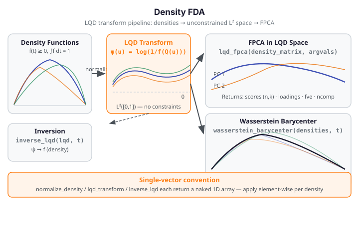

# Density FDA

Density FDA treats probability density functions as functional observations and applies
functional data analysis techniques to them. The key challenge is that densities live in a
constrained Bayes space — they must be non-negative and integrate to one — which rules out
standard Euclidean methods. The **Log-Quantile-Density (LQD) transform** maps each density
to an unconstrained $L^2([0,1])$ function, enabling Euclidean FPCA, regression, and
barycenter computation in that transformed space.

{ .fdars-diagram }

## Core Concept

Let $f$ be a probability density on a bounded interval $[a, b]$. Define its quantile
function $Q(u)$ as the inverse of its CDF $F$. The **Log-Quantile-Density (LQD)
transform** maps $f$ to:

$$
\psi(u) = \log\!\left(\frac{1}{f(Q(u))}\right), \quad u \in (0, 1)
$$

The transformation is invertible via $f(x) = \exp(-\psi(F(x)))$, and it maps the
non-negative constraint of the density space to the unconstrained $L^2([0,1])$ space.
Operations that are not geometrically meaningful in density space — such as pointwise
averaging — become correct in LQD space. FPCA in LQD space identifies the principal
modes of density shape variation, and the **Wasserstein barycenter** computes the
geometric mean of a collection of densities.

```python exec="1" source="above"
import numpy as np
from fdars.density_fda import normalize_density, lqd_transform, lqd_fpca

rng = np.random.default_rng(42)
m = 50
t = np.linspace(0, 1, m)
# Simulate 10 density-like functions (non-negative; will be normalized)
densities = np.array([np.abs(np.sin(np.pi * t + rng.uniform(0, 0.5))) + 0.01
                      for _ in range(10)])
norm = np.array([normalize_density(densities[i], t) for i in range(10)])
lqd  = np.array([lqd_transform(norm[i], t) for i in range(10)])
fp   = lqd_fpca(norm, t, ncomp=2)

print(f"normalized density sum (approx 1): {np.trapezoid(norm[0], t):.4f}")
print(f"lqd_fpca ncomp: {fp['ncomp']}  FDARS_FENCE_OK")
```

`normalize_density`, `lqd_transform`, and `inverse_lqd` each return a **naked 1D
numpy array** (not a dict). Apply them element-wise when processing a collection of
densities. `lqd_fpca` takes the full matrix and returns a 6-key dict.

## API Reference

### `normalize_density` — Normalize to a Valid Density

```python
from fdars.density_fda import normalize_density

norm = normalize_density(density, argvals)
```

| Parameter | Type | Description |
|-----------|------|-------------|
| `density` | `np.ndarray` (m,) | Non-negative density values (need not integrate to 1) |
| `argvals` | `np.ndarray` (m,) | Evaluation grid |

Returns a 1D array normalized so that $\int f\,dt \approx 1$.

---

### `lqd_transform` — Log-Quantile-Density Transform

```python
from fdars.density_fda import lqd_transform

lqd = lqd_transform(density, argvals)
```

| Parameter | Type | Description |
|-----------|------|-------------|
| `density` | `np.ndarray` (m,) | Strictly positive, normalized density |
| `argvals` | `np.ndarray` (m,) | Evaluation grid |

Returns a 1D array in the unconstrained LQD representation space.

---

### `inverse_lqd` — Invert the LQD Transform

```python
from fdars.density_fda import inverse_lqd

f = inverse_lqd(lqd, argvals)
```

Recovers the density from its LQD representation; returns a 1D array.

---

### `wasserstein_barycenter` — Wasserstein Barycenter

```python
from fdars.density_fda import wasserstein_barycenter

bary = wasserstein_barycenter(densities, argvals, weights=None)
```

| Parameter | Type | Description |
|-----------|------|-------------|
| `densities` | `np.ndarray` (n, m) | Collection of normalized densities |
| `argvals` | `np.ndarray` (m,) | Evaluation grid |
| `weights` | `np.ndarray` (n,) or `None` | Barycenter weights (uniform if `None`) |

Returns a 1D array — the geometric mean density in Wasserstein space.

---

### `lqd_fpca` — Functional PCA of Densities

```python
from fdars.density_fda import lqd_fpca

fp = lqd_fpca(density_matrix, argvals, ncomp=3)
```

| Parameter | Type | Description |
|-----------|------|-------------|
| `density_matrix` | `np.ndarray` (n, m) | n strictly positive, normalized densities |
| `argvals` | `np.ndarray` (m,) | Evaluation grid |
| `ncomp` | `int` | Number of principal components (default: 3) |

| Key | Meaning |
|-----|---------|
| `mean` | Mean LQD function, shape `(n_q,)` |
| `singular_values` | Singular values, shape `(ncomp,)` |
| `loadings` | Principal component loadings (rotation), shape `(n_q, ncomp)` |
| `scores` | FPCA scores, shape `(n, ncomp)` |
| `fve` | Fraction of variance explained (cumulative), shape `(ncomp,)` |
| `ncomp` | Number of retained components |

## References

- Petersen, A. and Müller, H.-G. (2016). Functional data analysis for density functions
  by transformation to a Hilbert space. *Annals of Statistics* 44(1), 183–218.
- van den Boogaart, K. G., Egozcue, J. J. and Pawlowsky-Glahn, V. (2014). Bayes Hilbert
  spaces. *Australian & New Zealand Journal of Statistics* 56(2), 171–194.
