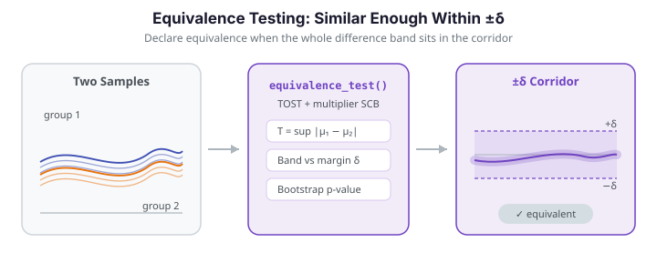

# Equivalence Testing

Classical hypothesis tests ask "are these two groups different?" Equivalence testing flips the question: **are these two groups similar enough to be considered practically the same?**

This is critical in manufacturing (batch-to-batch consistency), bioequivalence studies (generic vs. brand-name drugs), and any domain where you need to demonstrate that a change or substitution has *no meaningful effect* on the functional response.

---

{ .fdars-diagram }

## The TOST framework

The functional equivalence test in `fdars` implements a **Two One-Sided Tests (TOST)** procedure adapted for functional data:

1. Define an equivalence margin $\delta > 0$.
2. Test $H_0^-: \|\mu_1 - \mu_2\|_\infty \ge \delta$ against $H_1^-: \|\mu_1 - \mu_2\|_\infty < \delta$.
3. If $H_0^-$ is rejected at level $\alpha$, the two groups are declared **equivalent** within margin $\delta$.

Equivalently, the test constructs a simultaneous confidence band (SCB) for the mean
difference $\mu_1 - \mu_2$ and declares equivalence when the *entire* band sits inside
the corridor $[-\delta, \delta]$. The null distribution of the test statistic is
estimated via a Gaussian multiplier bootstrap.

$$
T = \sup_{t \in \mathcal{T}} \left| \bar X_1(t) - \bar X_2(t) \right|
$$

Equivalence is concluded when $T < \delta - c_\alpha$, where $c_\alpha$ is the $(1-\alpha)$ quantile from the bootstrap.

!!! note "Returned fields"
    `equivalence_test` returns `equivalent` (bool), `p_value`, and `test_statistic`
    (the observed sup-norm $T$). The R reference additionally prints a critical value
    and the SCB range in its summary; the Python binding exposes the decision, the
    p-value, and the statistic. Compare $T$ against $\delta$ directly, or sweep $\delta$
    (below) to locate the decision threshold, which is where $c_\alpha$ effectively sits.

Visually, equivalence holds when the second group's mean stays inside the $\pm\delta$
corridor drawn around the first group's mean. The left panel shows two groups that
remain within the margin; the right panel shows a shifted group that escapes it.

```python exec="1" html="1"
import numpy as np
from docs_fig import fig, render
from fdars.simulation import simulate
from fdars.tolerance import equivalence_test

t = np.linspace(0, 1, 100)
delta = 1.5
base = np.asarray(simulate(40, t, n_basis=5, seed=10))

cases = [
    ("Equivalent", np.asarray(simulate(40, t, n_basis=5, seed=20)) + 0.3),
    ("Not equivalent", np.asarray(simulate(40, t, n_basis=5, seed=20)) + 5.0),
]

f, axes = fig(1, 2, figsize=(11.0, 3.8), sharey=True)
m_a = base.mean(0)
for ax, (name, other) in zip(axes, cases):
    m_b = other.mean(0)
    res = equivalence_test(base, other, delta=delta, nb=500, seed=42)
    ax.fill_between(t, m_a - delta, m_a + delta, color="#3f51b5", alpha=0.15,
                    label=f"mean A ± δ ({delta})")
    ax.plot(t, m_a, color="#3f51b5", lw=2.0, label="mean A")
    ax.plot(t, m_b, color="#e8710a", lw=2.0, label="mean B")
    ax.set(title=f"{name}  (T = {res['test_statistic']:.2f})", xlabel="t")
axes[0].set_ylabel("X(t)")
axes[0].legend(loc="lower left")
print(render(f))
```

---

## Usage

```python
import numpy as np
from fdars import Fdata
from fdars.simulation import simulate
from fdars.tolerance import equivalence_test

argvals = np.linspace(0, 1, 100)

# Two groups with very similar means
fd_a = Fdata(simulate(50, argvals, n_basis=5, seed=1), argvals=argvals)
fd_b = Fdata(simulate(50, argvals, n_basis=5, seed=2) + 0.2, argvals=argvals)  # small offset

result = equivalence_test(
    data1=fd_a.data,
    data2=fd_b.data,
    delta=1.0,       # equivalence margin
    alpha=0.05,      # significance level
    nb=1000,         # bootstrap replicates
    seed=42,
)
```

**Parameters**

| Parameter | Type | Default | Description |
|---|---|---|---|
| `data1` | `ndarray (n1, m)` | -- | First group of functional observations |
| `data2` | `ndarray (n2, m)` | -- | Second group of functional observations |
| `delta` | `float` | -- | Equivalence margin ($\delta > 0$) |
| `alpha` | `float` | `0.05` | Significance level |
| `nb` | `int` | `1000` | Number of bootstrap replicates |
| `seed` | `int` | `42` | Random seed |

**Returns** a dictionary:

| Key | Type | Description |
|---|---|---|
| `equivalent` | `bool` | `True` if equivalence is established at level $\alpha$ |
| `p_value` | `float` | Bootstrap p-value |
| `test_statistic` | `float` | Observed sup-norm of the mean difference |

```python
print(f"Equivalent: {result['equivalent']}")
print(f"p-value:    {result['p_value']:.4f}")
print(f"Sup-norm:   {result['test_statistic']:.4f}")
```

---

## Choosing the margin $\delta$

The margin $\delta$ is the maximum allowable pointwise difference between the two mean functions. It should be set **before looking at the data**, based on domain knowledge:

!!! warning "Do not choose $\delta$ from the data"
    Setting $\delta$ to be just larger than the observed difference inflates the Type I error. Always specify $\delta$ based on what constitutes a practically meaningful difference in your application.

| Domain | Typical $\delta$ guidance |
|---|---|
| Manufacturing | Specification tolerance / 2 |
| Bioequivalence | 20 % of the reference mean (FDA guidance) |
| Environmental monitoring | Regulatory action threshold |

---

## Example -- equivalent vs. non-equivalent groups

```python exec="1" source="above"
import numpy as np
from fdars import Fdata
from fdars.simulation import simulate
from fdars.tolerance import equivalence_test

argvals = np.linspace(0, 1, 100)
delta = 2.0

# ── Case 1: Similar groups (should be equivalent) ────────────
fd_a = Fdata(np.asarray(simulate(40, argvals, n_basis=5, seed=10)), argvals=argvals)
fd_b = Fdata(np.asarray(simulate(40, argvals, n_basis=5, seed=20)) + 0.1, argvals=argvals)

r1 = equivalence_test(fd_a.data, fd_b.data, delta=delta, alpha=0.05, nb=2000, seed=42)
print(f"Case 1 — Equivalent: {r1['equivalent']}  p={r1['p_value']:.4f}")

# ── Case 2: Different groups (should NOT be equivalent) ──────
fd_c = Fdata(np.asarray(simulate(40, argvals, n_basis=5, seed=10)), argvals=argvals)
fd_d = Fdata(np.asarray(simulate(40, argvals, n_basis=5, seed=20)) + 5.0, argvals=argvals)  # large shift

r2 = equivalence_test(fd_c.data, fd_d.data, delta=delta, alpha=0.05, nb=2000, seed=42)
print(f"Case 2 — Equivalent: {r2['equivalent']}  p={r2['p_value']:.4f}")
```

!!! warning "Choosing $\delta$ relative to sampling uncertainty"
    Equivalence requires the entire $(1-\alpha)$ simultaneous confidence band for
    $\mu_1 - \mu_2$ to sit inside the $\pm\delta$ corridor — and that band has a
    half-width of roughly $c_\alpha \cdot \mathrm{SE}$, driven by the sample size,
    **not** by the raw mean difference. So two samples from the *same* distribution
    are **not** automatically equivalent: if $\delta$ is smaller than the band
    half-width, the verdict is (correctly) `False`. Here the groups differ by only
    $0.1$, yet $\delta$ must clear the band's reach — `delta = 1.0` returns `False`,
    while `delta = 2.0` returns `True`. Always choose $\delta$ from a
    practically-meaningful tolerance and sanity-check it against the band width.

---

## Sensitivity to $\delta$

Because $\delta$ is a modelling choice, it is worth sweeping over a range of margins to
locate the decision threshold -- the value of $\delta$ at which the verdict flips from
"not equivalent" to "equivalent". Plotting the decision as a step function makes the
threshold obvious.

```python exec="1" html="1" source="above"
import numpy as np
from docs_fig import fig, render
from fdars.simulation import simulate
from fdars.tolerance import equivalence_test

rng = np.random.default_rng(1)
t = np.linspace(0, 1, 80)
X1 = np.array([np.sin(2 * np.pi * t) + rng.normal(0, 0.3, t.size) for _ in range(30)])
X2 = np.array([np.sin(2 * np.pi * t) + 0.3 + rng.normal(0, 0.3, t.size) for _ in range(25)])

deltas = np.arange(0.1, 1.01, 0.05)
decided = np.array([
    equivalence_test(X1, X2, delta=float(d), nb=400, seed=42)["equivalent"]
    for d in deltas
])

f, ax = fig()
ax.step(deltas, decided.astype(int), where="post", color="#3f51b5", lw=1.6)
ax.scatter(deltas[decided], np.ones(decided.sum()), color="#198754", zorder=3,
           label="equivalent")
ax.scatter(deltas[~decided], np.zeros((~decided).sum()), color="#dc3545", zorder=3,
           label="not equivalent")
ax.set(title="Decision as a function of the equivalence margin δ",
       xlabel="δ", ylabel="equivalence declared", yticks=[0, 1],
       yticklabels=["No", "Yes"])
ax.legend(loc="center right")
print(render(f))
```

The step from "No" to "Yes" marks the smallest margin under which these two groups are
declared equivalent -- a compact summary of how much difference the data can tolerate.

---

## One-sample test

`equivalence_test_one_sample` tests whether a *single* sample's mean is equivalent to a
known reference function $\mu_0$ -- for example, checking that a new production run
matches a fixed specification curve. The hypotheses and TOST machinery are identical;
only the second group is replaced by the fixed target.

```python exec="1" source="above"
import numpy as np
from fdars.tolerance import equivalence_test_one_sample

rng = np.random.default_rng(42)
t = np.linspace(0, 1, 80)
X = np.array([np.sin(2 * np.pi * t) + rng.normal(0, 0.3, t.size) for _ in range(30)])

mu0 = np.sin(2 * np.pi * t)   # reference / specification curve
res = equivalence_test_one_sample(X, mu0, delta=0.5, alpha=0.05, nb=1000, seed=42)

print(f"Equivalent to reference: {res['equivalent']}")
print(f"Sup-norm |mean - mu0|:   {res['test_statistic']:.4f}")
print(f"p-value:                 {res['p_value']:.4f}")
```

**Parameters** (`equivalence_test_one_sample`)

| Parameter | Type | Default | Description |
|---|---|---|---|
| `data` | `ndarray (n, m)` | -- | Sample of functional observations |
| `mu0` | `ndarray (m,)` | -- | Reference / target mean function |
| `delta` | `float` | -- | Equivalence margin ($\delta > 0$) |
| `alpha` | `float` | `0.05` | Significance level |
| `nb` | `int` | `1000` | Bootstrap replicates |
| `seed` | `int` | `42` | Random seed |

**Returns** the same `equivalent` / `p_value` / `test_statistic` dictionary as the
two-sample test.

## See also

- [Tolerance bands](tolerance-bands.md) -- the confidence and tolerance bands that
  underlie the SCB used here.
