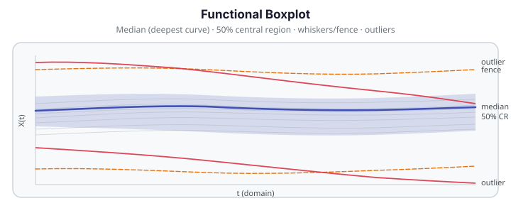

# Functional Boxplot

The functional boxplot (López-Pintado & Romo, 2009) is the canonical method for summarising
a sample of curves in the same spirit as Tukey's scalar boxplot: a depth-ranked
median curve, a shaded 50 % central region, whisker/fence lines, and flagged
outlier curves. `fdars.depth.functional_boxplot` implements this construction
using any of the four depth measures shipped in `fdars.depth`.

{ .fdars-diagram }

## Theory

### Functional depth and ranking

Every curve $X_i$ in the sample is assigned a *functional depth score* $D(X_i)$.
A larger score means the curve is more central relative to the sample; a score
near zero means the curve is extreme or peripheral. `functional_boxplot` supports
four depth measures via the `method` parameter:

| `method` | Description |
|---|---|
| `"fraiman_muniz"` | Pointwise CDF-based depth (Fraiman & Muniz, 2001) |
| `"band"` | Band depth — proportion of curve inside sample bands |
| `"modified_band"` | Modified band depth (default); faster, avoids degenerate bands |
| `"random_projection"` | Projection depth via random half-space projections |

### Median

The **median** is the observed curve with the highest depth score:

$$
i^* = \operatorname*{argmax}_{i \in \{1,\dots,n\}} D(X_i), \qquad
\text{median}(t) = X_{i^*}(t).
$$

It is always an observed sample curve (not a synthetic average).

### 50 % central region

Rank all $n$ curves by depth and keep the deepest half. The **central region**
$C_{0.5}$ is the pointwise envelope of those $\lceil n/2 \rceil$ most-central curves:

$$
C_{0.5}(t) = \bigl[\,\mathrm{central\_lower}(t),\; \mathrm{central\_upper}(t)\,\bigr],
$$

$$
\mathrm{central\_lower}(t) = \min_{i \in S_{0.5}} X_i(t), \quad
\mathrm{central\_upper}(t) = \max_{i \in S_{0.5}} X_i(t),
$$

where $S_{0.5}$ is the index set of the deepest half. The central region plays
the role of the interquartile range in a scalar boxplot.

### Whiskers / fence

The fence is formed by inflating the central region by `factor` times its
pointwise width:

$$
w(t) = \mathrm{central\_upper}(t) - \mathrm{central\_lower}(t),
$$

$$
\mathrm{whisker\_upper}(t) = \mathrm{central\_upper}(t) + \texttt{factor} \cdot w(t),
\qquad
\mathrm{whisker\_lower}(t) = \mathrm{central\_lower}(t) - \texttt{factor} \cdot w(t).
$$

The default `factor = 1.5` follows the Tukey convention. Sun & Genton (2011)
recommend `factor = 1.5` for detecting genuine outliers while avoiding swamping.

### Outlier flagging

A curve is an outlier if it exceeds the fence at **any** evaluation point:

$$
X_i \text{ is an outlier} \iff
\exists\, t :\; X_i(t) > \mathrm{whisker\_upper}(t) \;\text{or}\; X_i(t) < \mathrm{whisker\_lower}(t).
$$

Outlier indices are returned as a Python `list` of `int` (0-based row indices).

## API

```python
from fdars.depth import functional_boxplot

result = functional_boxplot(data, method="modified_band", factor=1.5)
```

**Parameters**

| Parameter | Type | Default | Description |
|---|---|---|---|
| `data` | `ndarray (n, m)` | — | Functional data matrix; rows are observations. Requires $n \ge 2$. |
| `method` | `str` | `"modified_band"` | Depth measure: `"fraiman_muniz"`, `"band"`, `"modified_band"`, or `"random_projection"`. |
| `factor` | `float` | `1.5` | Fence inflation factor (Tukey convention). Must be $\ge 0$. |
| `scale` | `bool` | `True` | Passed to `"fraiman_muniz"` depth. |
| `nproj` | `int` | `50` | Number of random projection directions for `"random_projection"`. |
| `seed` | `int \| None` | `None` | RNG seed for `"random_projection"` (`None` resolves to `0`). |

**Returns** — a dict with seven keys:

| Key | Shape | Description |
|---|---|---|
| `"median"` | `(m,)` | The deepest observed curve's values. |
| `"central_lower"` | `(m,)` | Pointwise lower bound of the 50 % central region. |
| `"central_upper"` | `(m,)` | Pointwise upper bound of the 50 % central region. |
| `"whisker_lower"` | `(m,)` | Lower fence: `central_lower − factor × width`. |
| `"whisker_upper"` | `(m,)` | Upper fence: `central_upper + factor × width`. |
| `"outliers"` | Python `list[int]` | 0-based row indices of curves outside the fence. |
| `"depths"` | `(n,)` | Per-curve depth scores (the ranking used to build the boxplot). |

## Worked example

The fence below loads Canadian daily temperature curves (35 stations × 365 days),
downsamples to every other day to keep compute tiny, and runs
`functional_boxplot` with default settings. It then plots the canonical
López-Pintado–Romo picture and reports the flagged outlier stations.

```python exec="1" html="1" source="above"
import numpy as np
from docs_data import load_canadian_weather
from docs_fig import fig, render
from fdars.depth import functional_boxplot

day, X, meta = load_canadian_weather("temperature")
# X: 35 stations × 365 days  → downsample to every other day (183 pts) for speed
X_sub = X[:, ::2]
day_sub = day[::2]

bp = functional_boxplot(X_sub)

median = np.asarray(bp["median"])
cl     = np.asarray(bp["central_lower"])
cu     = np.asarray(bp["central_upper"])
wl     = np.asarray(bp["whisker_lower"])
wu     = np.asarray(bp["whisker_upper"])
out_idx = bp["outliers"]

f, ax = fig(figsize=(10.0, 4.2))

# All curves faint
for i, xi in enumerate(X_sub):
    color = "#dc3545" if i in out_idx else "#adb5bd"
    lw    = 1.8       if i in out_idx else 0.6
    alpha = 0.9       if i in out_idx else 0.35
    ax.plot(day_sub, xi, color=color, lw=lw, alpha=alpha)

# 50 % central region shaded
ax.fill_between(day_sub, cl, cu, color="#3f51b5", alpha=0.18, label="50 % central region")

# Fence lines
ax.plot(day_sub, wu, color="#e8710a", lw=1.4, ls="--", label=f"whisker (factor={1.5})")
ax.plot(day_sub, wl, color="#e8710a", lw=1.4, ls="--")

# Median curve bold
ax.plot(day_sub, median, color="#3f51b5", lw=2.4, label="median (deepest curve)")

ax.set(title="Functional Boxplot — Canadian Weather Temperature",
       xlabel="day of year", ylabel="temperature (°C)")
ax.legend(fontsize=9)
print(render(f))

n_out = len(out_idx)
if n_out:
    names = [meta["station"].iloc[i] for i in out_idx]
    print(f"Flagged outliers ({n_out}): indices {out_idx} → {names}  FDARS_FENCE_OK")
else:
    print(f"Flagged outliers: none at factor=1.5  FDARS_FENCE_OK")
```

!!! tip "Interpreting the result"
    Stations flagged as outliers exceed the fence at at least one point in the
    year. For Canadian temperatures this typically picks out arctic stations
    (very cold winters) or Pacific-coast stations (unusually mild winters).
    Increase `factor` to 2.0 to suppress borderline cases; decrease it to
    flag more.

!!! note "Numeric only — no plot helper yet"
    `functional_boxplot` returns the numeric dict. `fdars.plot` does not yet
    ship a `plot_functional_boxplot()` convenience function. Build your own
    figure from the seven keys as shown above.

## See also

- [Outlier Detection](outlier-detection.md) — LRT-based, outliergram, and
  magnitude-shape outlier detectors.
- [Depth Functions](../represent/depth-functions.md) — the depth measures
  (`fraiman_muniz`, `band`, `modified_band`, `random_projection`) used to rank
  curves in the boxplot.

## References

1. López-Pintado, S., and Romo, J. (2009). "On the concept of depth for
   functional data." *Journal of the American Statistical Association*,
   104(486), 718–734. — the depth-fence functional boxplot this page
   implements.
2. Sun, Y., and Genton, M. G. (2011). "Functional boxplots." *Journal of
   Computational and Graphical Statistics*, 20(2), 316–334. — enhanced
   functional boxplot with the `factor = 1.5` fence convention and
   visualisation refinements.
