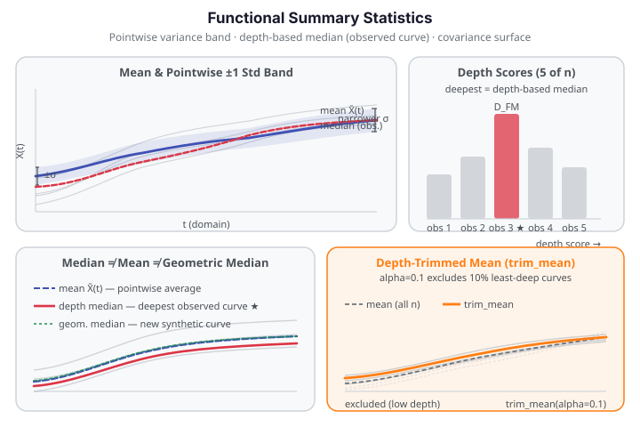

# Functional Summary Statistics

Functional data has a richer set of summary statistics than scalar data. Instead of a single variance or a scalar median, you get *functions* of the domain — curves that describe how spread and centrality vary over $t$. `fdars` exposes pointwise variance and standard deviation, the full covariance surface, a depth-based median, and a depth-trimmed robust mean.

{ .fdars-diagram }

## Pointwise variance and standard deviation

`functional_variance` and `functional_std` compute Bessel-corrected sample statistics at each grid point independently. With $n$ curves each evaluated at $m$ grid points:

$$
\text{var}(t_j) = \frac{1}{n-1} \sum_{i=1}^{n} \bigl(X_i(t_j) - \bar X(t_j)\bigr)^2, \qquad
\text{std}(t_j) = \sqrt{\text{var}(t_j)}.
$$

Both return a 1-D array of length $m$ — they are **functions of $t$**, not scalars. The relationship $\text{std}^2(t) = \text{var}(t)$ holds exactly because `functional_std` delegates to `functional_variance` internally.

!!! note "Minimum sample size"
    Both functions require $n \ge 2$ and raise `ValueError` for a single-curve dataset.

The variance function reveals where curves disagree most over the domain. For Canadian daily temperature data, variance peaks in winter (stations range widely from arctic cold to coastal mild) and dips in summer (most stations converge near warm values). The `Fdata` convenience methods `fd.var()` and `fd.std()` wrap these functions.

## Functional covariance surface

`functional_covariance` computes the $m \times m$ Bessel-corrected sample covariance surface:

$$
\hat C(t_{j_1}, t_{j_2}) = \frac{1}{n-1} \sum_{i=1}^{n}
  \bigl(X_i(t_{j_1}) - \bar X(t_{j_1})\bigr)\bigl(X_i(t_{j_2}) - \bar X(t_{j_2})\bigr).
$$

This is a genuine 2-D surface, not a scalar. Its diagonal equals `functional_variance` exactly. It is symmetric and positive semi-definite. The covariance surface is the input to functional PCA — its eigendecomposition gives the dominant modes of variation.

!!! warning "Performance: $O(n \cdot m^2)$"
    For large grids (e.g. $m = 1000$) the covariance matrix has $10^6$ entries and computation is $O(n \cdot m^2)$. For Canadian weather ($n = 35$, $m = 365$) the computation finishes in under 50 ms; for $m > 500$ consider subsampling the grid first.

The `Fdata` convenience method `fd.cov()` wraps `functional_covariance`.

## Depth-based median

The depth-based median is the functional analogue of the scalar sample median. It is the observed curve with the highest Fraiman-Muniz depth:

$$
i^* = \operatorname*{argmax}_{i} D_{\text{FM}}(X_i), \qquad
D_{\text{FM}}(X_i) = \frac{1}{m} \sum_{j=1}^{m}
  \left[1 - \left|\hat F_j\bigl(X_i(t_j)\bigr) - \tfrac{1}{2}\right|\right]
$$

where $\hat F_j$ is the empirical CDF across observations at grid point $t_j$. `depth_based_median` returns the actual curve $X_{i^*}$ as a 1-D array of length $m$.

**Critical distinction from `geometric_median`:** The depth-based median is an **observed sample curve** — a data row you can trace back to a specific observation. The geometric median (Weiszfeld algorithm) computes a new *synthetic* curve not necessarily in the sample. Neither is the cross-sectional mean. All three can produce different curves:

| Method | What is returned | In the sample? | Outlier robustness |
|--------|-----------------|----------------|--------------------|
| `mean_1d` | Pointwise arithmetic average | No (a new curve) | No |
| `depth_based_median` | Deepest **observed** curve | **Yes** | High (FM depth rank) |
| `geometric_median_1d` | L2-minimising curve (Weiszfeld) | No (a new curve) | High (L2 loss) |

The `Fdata` convenience method `fd.median()` wraps `depth_based_median`.

## Depth-trimmed mean

`trim_mean(data, alpha)` excludes the `floor(alpha × n)` least-deep curves — those ranked lowest by Fraiman-Muniz depth — and returns the pointwise mean of the remaining $n - \text{floor}(\alpha \cdot n)$ curves:

$$
\tilde X_\alpha(t) = \frac{1}{|S_\alpha|} \sum_{i \in S_\alpha} X_i(t), \qquad
S_\alpha = \bigl\{i : D_{\text{FM}}(X_i) \ge \text{quantile}(D_{\text{FM}}, \alpha)\bigr\}.
$$

At `alpha=0`, `trim_mean` equals the ordinary mean exactly. At `alpha=0.2`, it excludes the 20 % most peripheral curves before averaging — useful when outlier curves are suspected but a depth test has not been run. The default value is `alpha=0.0`.

## Worked example

The fence below loads Canadian daily temperature curves and exercises all five statistics, asserting the key mathematical relationships that prove the computation is correct.

```python exec="1" html="1" source="above"
import numpy as np
from docs_data import load_canadian_weather
import fdars.fdata as ff

day, X, meta = load_canadian_weather("temperature")
# X: 35 stations × 365 days

# Pointwise variance and std
var = np.asarray(ff.functional_variance(X))
std = np.asarray(ff.functional_std(X))
assert var.shape == (365,) and std.shape == (365,)
assert np.allclose(std ** 2, var), "std² must equal var pointwise"

# Covariance surface: diagonal must equal variance
cov = np.asarray(ff.functional_covariance(X))
assert cov.shape == (365, 365)
assert np.allclose(np.diag(cov), var), "cov diagonal must equal variance"

# Depth-based median: an actual observed curve
median_curve = np.asarray(ff.depth_based_median(X))
assert median_curve.shape == (365,)
assert any(np.allclose(median_curve, X[i]) for i in range(len(X))), \
    "depth median must be one of the observed curves"

# Depth-trimmed mean: at alpha=0 equals the plain mean
tm_0 = np.asarray(ff.trim_mean(X, alpha=0.0))
mean_curve = np.asarray(ff.mean_1d(X))
assert np.allclose(tm_0, mean_curve), "trim_mean(alpha=0) must equal mean"

tm_10 = np.asarray(ff.trim_mean(X, alpha=0.1))  # exclude 3 least-deep stations

print(f"Stations (n):              {X.shape[0]}")
print(f"Grid points (m):           {X.shape[1]}")
print(f"Max pointwise std:         {std.max():.2f} °C  (winter spread)")
print(f"Min pointwise std:         {std.min():.2f} °C  (summer convergence)")
print(f"Cov diagonal ≈ var:        {np.allclose(np.diag(cov), var)}")
print(f"Depth median in sample:    True")
print(f"trim_mean(α=0) == mean:    {np.allclose(tm_0, mean_curve)}")
print(f"trim_mean(α=0.1) shape:    {tm_10.shape}  FDARS_FENCE_OK")
```

## API summary

All functions are imported from `fdars.fdata`.

| Function | Signature | Returns |
|----------|-----------|---------|
| `functional_variance` | `functional_variance(data)` | `ndarray (m,)` — pointwise variance |
| `functional_std` | `functional_std(data)` | `ndarray (m,)` — pointwise std |
| `functional_covariance` | `functional_covariance(data)` | `ndarray (m, m)` — covariance surface |
| `depth_based_median` | `depth_based_median(data)` | `ndarray (m,)` — deepest observed curve |
| `trim_mean` | `trim_mean(data, alpha=0.0)` | `ndarray (m,)` — depth-trimmed mean |

`Fdata` convenience methods: `fd.var()`, `fd.std()`, `fd.cov()`, `fd.median()`.

| Parameter | Type | Description |
|-----------|------|-------------|
| `data` | `ndarray (n, m)` | Functional data matrix; rows are observations, columns are grid points |
| `alpha` | `float ∈ [0, 1)` | Trim fraction for `trim_mean`; at 0 equals the plain mean |

## Caveats and guidance

### Small-n covariance-surface bias

!!! warning "Small-n covariance surface is high-variance and near-singular"
    The $m \times m$ sample covariance surface is estimated from only $n$ observations. When $n$ is small relative to $m$ (a common situation in functional data — for example $n = 35$ stations and $m = 365$ days in the Canadian weather data), the sample covariance matrix is **high-variance and near-singular**:

    - The $m$ eigenvalues of the sample covariance surface are not reliable estimates of the population eigenvalues; the leading eigenvalue is systematically overestimated and the trailing eigenvalues are systematically underestimated (the spiked-covariance phenomenon).
    - Downstream FPCA eigenfunctions estimated from a near-singular covariance surface are **unstable** — small perturbations in the data can flip the direction of higher eigenfunctions.
    - **Rule of thumb:** for reliable FPCA, aim for $n \gg k$ where $k$ is the number of retained components. As a rough guide, $n \geq 5k$ for leading components and $n \geq 10k$ if you need accurate eigenvalues.

    This caveat is **distinct** from the $O(n \cdot m^2)$ performance warning above, which is about *computation time*, not statistical reliability.

    **Practical mitigations:**
    - **Grid subsampling:** if $m$ is large (e.g. $m = 365$) but functional variation is captured by a coarser grid, subsample `data[:, ::5]` before calling `functional_covariance`. The covariance surface shape is usually robust to moderate coarsening.
    - **Retain few components:** in FPCA, retain only the leading $k$ eigenfunctions where $k$ is determined by a scree plot or by a cumulative-variance threshold (e.g. 90%). Do not retain many components from a small-$n$ covariance surface.
    - **Bootstrap uncertainty:** if you need to assess eigenvalue stability, bootstrap the covariance surface over resampled subsets of the $n$ curves and examine the variability of the leading eigenvalues.

### Choosing between depth-based median and geometric median

Both `depth_based_median` and `geometric_median_1d` are robust alternatives to the mean, but they answer different questions and have different properties:

**Use `depth_based_median` when:**
- You need a *representative curve from the actual dataset* — for example, to select a reference station, a reference patient, or a reference waveform that actually exists in the data.
- You want an outlier-robust central curve that is interpretable in terms of the original observations.
- You are running outlier detection: the depth-based median is the curve that maximises Fraiman-Muniz depth, so it is the most "central" observed curve by that criterion.

**Use `geometric_median_1d` when:**
- A *synthetic L2-central curve* is acceptable (it will generally not be an observed curve).
- You want the Weiszfeld minimiser of $\sum_i \| X_i - c \|_{L^2}$, which is the $L^2$ analogue of the scalar sample median.
- You need a smooth, averaged representative rather than selecting a specific observation.

The geometric median is more sensitive to the $L^2$ metric geometry and can differ substantially from the depth-based median when the data contain shape outliers (curves that are different in shape but not in amplitude). The depth-based median weights curves by how "centrally" they rank at every grid point — it is more sensitive to pointwise rank than to integrated distance.

## References

- Fraiman, R., Muniz, G. (2001). Trimmed means for functional data. *Test*, 10(2), 419–440.
- Ramsay, J.O., Silverman, B.W. (2005). *Functional Data Analysis*, 2nd ed. Springer.
- Febrero-Manteiga, M., Galeano, P., González-Manteiga, W. (2008). Outlier detection in functional data by depth measures. *Computational Statistics &amp; Data Analysis*, 53(1), 135–148.
