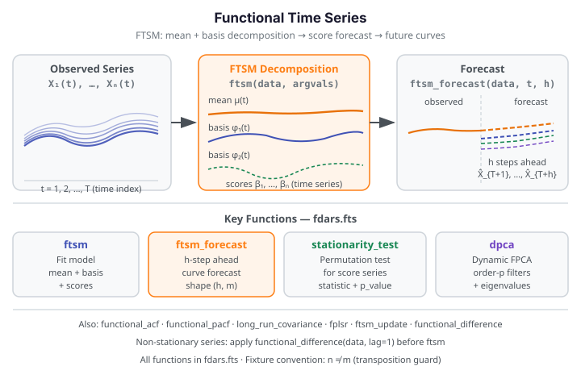

# Functional Time Series

Functional time series (FTS) treat a sequence of curves — each observed at one time point
— as realizations of a stochastic process indexed by time. The **Functional Time Series
Model (FTSM)** decomposes each observed curve into a shared mean function plus a linear
combination of estimated basis functions (functional principal components), then models the
scalar score trajectories as a multivariate time series to produce forecasts for future
curves.

{ .fdars-diagram }

## Core Concept

Let $X_1(t), X_2(t), \ldots, X_T(t)$ be a sequence of $T$ observed functional observations
indexed by time. FTSM estimates a mean function $\mu(t)$ and $K$ orthogonal basis functions
$\phi_1(t), \ldots, \phi_K(t)$ such that:

$$
X_i(t) \approx \mu(t) + \sum_{k=1}^{K} \beta_{ik} \phi_k(t)
$$

The scalar score vectors $\boldsymbol{\beta}_i = (\beta_{i1}, \ldots, \beta_{iK})$ are then
modelled as a multivariate time series. Forecasts $h$ steps ahead are obtained by projecting
the predicted scores back through the basis functions:

$$
\hat{X}_{T+h}(t) = \mu(t) + \sum_{k=1}^{K} \hat{\beta}_{T+h,k} \phi_k(t)
$$

The stationarity of the score series can be assessed with a permutation-based test
(`stationarity_test`). For non-stationary series, first-differencing the scores before
modelling is recommended.

```python exec="1" source="above"
import numpy as np
from fdars.fts import ftsm, ftsm_forecast, stationarity_test

rng = np.random.default_rng(42)
n, m = 20, 30       # non-square: n != m (transposition guard)
t = np.linspace(0, 1, m)
data = np.array([np.sin(2 * np.pi * t + rng.uniform(0, 0.5)) +
                 0.1 * rng.standard_normal(m) for _ in range(n)])

fit = ftsm(data, t, ncomp=3)
fc  = ftsm_forecast(data, t, h=3, ncomp=3)
st  = stationarity_test(data, t, n_perm=19, seed=42)

print(f"ftsm ncomp:     {fit['ncomp']}")
print(f"forecast shape: {np.asarray(fc['forecast']).shape}")
print(f"stationarity p: {st['p_value']:.3f}  FDARS_FENCE_OK")
```

The model extracts `ncomp=3` functional principal components from the 20-curve series. The
`ftsm_forecast` call produces a `(3, 30)` forecast array — 3 future curves, each evaluated
on the 30-point grid. The stationarity p-value indicates whether the score trajectory can
be treated as stationary.

## API Reference

### `ftsm` — Functional Time Series Model

```python
from fdars.fts import ftsm

fit = ftsm(data, argvals, ncomp=3)
```

| Parameter | Type | Description |
|-----------|------|-------------|
| `data` | `np.ndarray` (n, m) | Functional observations arranged in time order (n curves, m grid points) |
| `argvals` | `np.ndarray` (m,) | Evaluation grid |
| `ncomp` | `int` | Number of basis components to retain (default: 3) |

| Key | Meaning |
|-----|---------|
| `mean` | Estimated mean function, shape `(m,)` |
| `rotation` | Basis (eigenvector) matrix, shape `(m, ncomp)` |
| `scores` | Score matrix, shape `(n, ncomp)` |
| `fitted` | Fitted curves, shape `(n, m)` |
| `weights` | Component weights (explained variance fractions) |
| `ncomp` | Number of components retained |

---

### `ftsm_forecast` — One-Step and Multi-Step Forecast

```python
from fdars.fts import ftsm_forecast

fc = ftsm_forecast(data, argvals, h, ncomp=3)
```

| Parameter | Type | Description |
|-----------|------|-------------|
| `data` | `np.ndarray` (n, m) | Historical functional observations |
| `argvals` | `np.ndarray` (m,) | Evaluation grid |
| `h` | `int` | Number of forecast horizons |
| `ncomp` | `int` | Number of components (default: 3) |

| Key | Meaning |
|-----|---------|
| `forecast` | Forecast curves, shape `(h, m)` |

---

### `stationarity_test` — Permutation Stationarity Test

```python
from fdars.fts import stationarity_test

st = stationarity_test(data, argvals, n_perm=99, seed=42)
```

| Parameter | Type | Description |
|-----------|------|-------------|
| `data` | `np.ndarray` (n, m) | Functional time series |
| `argvals` | `np.ndarray` (m,) | Evaluation grid |
| `n_perm` | `int` | Number of permutations (default: 99) |
| `seed` | `int` | Random seed for reproducibility (default: 42) |

| Key | Meaning |
|-----|---------|
| `statistic` | Observed test statistic |
| `p_value` | Permutation p-value; low values suggest non-stationarity |

---

### Additional Functions

| Function | Description |
|----------|-------------|
| `ftsm_forecast_multistep(data, argvals, h_list, ncomp=3)` | Forecast at multiple horizons given as a list |
| `ftsm_update(data, argvals, new_obs, ncomp=3)` | Online update of the FTSM with a new observation |
| `fplsr(data, argvals, y, ncomp=3)` | Functional partial least squares regression |
| `functional_acf(data, argvals, lags, seed=42)` | Functional autocorrelation function |
| `functional_pacf(data, argvals, lags, seed=42)` | Functional partial autocorrelation function |
| `long_run_covariance(data, argvals, bandwidth=1.0)` | Long-run covariance estimation |
| `spectral_density(data, argvals, freq)` | Spectral density at a given frequency |
| `dpca(data, argvals, ncomp=3, order=1)` | Dynamic functional PCA |
| `dpca_reconstruct(data, argvals, ncomp=3, order=1)` | DPCA reconstruction with error |
| `functional_difference(data, lag=1)` | First-difference the functional time series |

All functions are importable from `fdars.fts`.

## References

- Hyndman, R. J. and Ullah, M. S. (2007). Robust forecasting of mortality and fertility rates:
  A functional data approach. *Computational Statistics & Data Analysis* 51(10), 4942–4956.
- Aue, A., Norinho, D. D. and Hörmann, S. (2015). On the prediction of stationary functional
  time series. *Journal of the American Statistical Association* 110(509), 378–392.
- Hörmann, S. and Kokoszka, P. (2010). Weakly dependent functional data.
  *Annals of Statistics* 38(3), 1845–1884.
