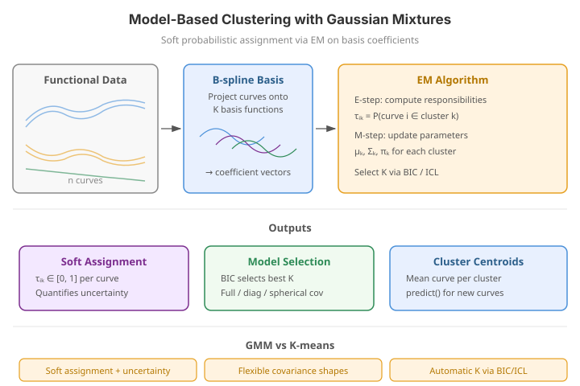

# Model-Based Clustering with Gaussian Mixtures

Model-based clustering treats a set of curves as samples from a *mixture* of probability distributions -- one component per latent group. Instead of committing each curve to a single cluster, a Gaussian mixture model (GMM) estimates the **posterior probability** that a curve belongs to each component. This yields *soft* assignments, a principled likelihood to compare against, and information criteria (BIC/ICL) for choosing the number of clusters.

Because a Gaussian mixture is defined in a finite-dimensional feature space, functional GMM first projects each curve onto a small basis (or onto its leading FPCA scores) and fits the mixture to those coefficients. `fdars` exposes this through `fdars.clustering.gmm_cluster`.

!!! danger "Known limitation of `gmm_cluster` in this build"
    In the current build, `gmm_cluster` does **not** reliably recover cluster structure:
    on data that is trivially separable -- for example two flat groups at $y=0$ and
    $y=10$, or mean-shifted simulations where [`kmeans_fd`](clustering.md) achieves 100%
    accuracy -- the hard labels it returns are close to random (best-permutation accuracy
    around 0.35--0.50), and BIC over-splits (it selects the largest $K$ offered). The
    conceptual material below is correct, and the BIC/ICL machinery runs, but **do not
    rely on `gmm_cluster`'s labels for grouping**. For hard grouping use `kmeans_fd`;
    for graded memberships use `fuzzy_cmeans_fd`; for a genuinely soft, uncertainty-aware
    assignment, compute the responsibilities directly in feature space as shown in
    [Soft assignments](#soft-assignments-and-their-uncertainty) below. This is a binding
    limitation, not a limitation of model-based clustering as a method.

---

{ .fdars-diagram }

## Concepts

Let $c_i \in \mathbb{R}^p$ be the basis (or FPCA) coefficients of curve $i$. A $K$-component Gaussian mixture models their density as

$$
p(c_i) \;=\; \sum_{k=1}^{K} \pi_k \, \mathcal{N}\!\bigl(c_i \mid \mu_k, \Sigma_k\bigr),
\qquad \sum_{k=1}^{K} \pi_k = 1,
$$

with mixing weights $\pi_k$, component means $\mu_k$ and covariances $\Sigma_k$. The parameters are fit by the EM algorithm. Its E-step produces the **responsibility** of component $k$ for curve $i$,

$$
r_{ik} \;=\; \frac{\pi_k \, \mathcal{N}(c_i \mid \mu_k, \Sigma_k)}
{\sum_{\ell=1}^{K} \pi_\ell \, \mathcal{N}(c_i \mid \mu_\ell, \Sigma_\ell)},
$$

a full posterior distribution over clusters for each curve. A hard label is recovered as $\hat{z}_i = \arg\max_k r_{ik}$, but the $r_{ik}$ themselves carry the *uncertainty* of the assignment.

**Hard k-means vs. soft GMM.** [k-means](clustering.md) partitions curves by nearest centroid: every curve gets exactly one label with no notion of confidence, and clusters are implicitly spherical and equal-sized. A GMM relaxes both assumptions -- components can have different shapes ($\Sigma_k$) and prior sizes ($\pi_k$) -- and returns graded memberships, so a curve sitting between two groups is reported as genuinely ambiguous rather than forced into one.

**Choosing $K$.** Because a mixture has a likelihood, competing values of $K$ can be scored. `gmm_cluster` reports both the Bayesian Information Criterion (BIC) and the Integrated Completed Likelihood (ICL) for every candidate $K$:

$$
\mathrm{BIC}(K) = -2\,\ell(K) + \nu_K \log n,
\qquad
\mathrm{ICL}(K) = \mathrm{BIC}(K) + 2\,\mathrm{Ent}(K),
$$

where $\ell$ is the maximized log-likelihood, $\nu_K$ the number of free parameters, and $\mathrm{Ent}$ the mean assignment entropy. Lower is better; ICL's entropy term rewards well-separated components.

---

## Clustering with `gmm_cluster`

```python
import numpy as np
from fdars import Fdata
from fdars.simulation import simulate
from fdars.clustering import gmm_cluster

argvals = np.linspace(0, 1, 100)
g1 = simulate(20, argvals, n_basis=5, seed=1)
g2 = simulate(20, argvals, n_basis=5, seed=2) + 3.0
fd = Fdata(np.vstack([g1, g2]), argvals=argvals)

gm = gmm_cluster(fd.data, fd.argvals, k_range=[2, 3, 4], nbasis=6, seed=42)
print("labels     :", gm["cluster"][:8])   # see the limitation note above
print("BIC per k  :", gm["bic_values"])
```

The call returns the dictionary documented below. Recall the limitation note: use it for
the BIC/ICL *values* and the API surface, but validate any grouping against `kmeans_fd`.

**Parameters**

| Parameter | Type | Default | Description |
|---|---|---|---|
| `data` | `ndarray (n, m)` | -- | Functional observations |
| `argvals` | `ndarray (m,)` | -- | Evaluation grid |
| `k_range` | `list[int]` | -- | Candidate numbers of components |
| `nbasis` | `int` | `5` | Number of B-spline basis functions for the projection |
| `max_iter` | `int` | `200` | Maximum EM iterations |
| `tol` | `float` | `1e-6` | Convergence tolerance |
| `seed` | `int` | `42` | Random seed for initialisation |

**Returns** a dictionary:

| Key | Shape / Type | Description |
|---|---|---|
| `cluster` | `(n,)` int | Hard labels from the best model |
| `membership` | `(n, k)` | Posterior membership matrix |
| `bic_values` | `(len(k_range), 2)` | Rows of `(k, BIC)` |
| `icl_values` | `(len(k_range), 2)` | Rows of `(k, ICL)` |

### Selecting the number of components

BIC and ICL are computed for every candidate $K$; the model with the lowest score is preferred.

```python exec="1" html="1" source="above"
import numpy as np
from docs_fig import fig, render
from fdars.clustering import gmm_cluster

t = np.linspace(0, 1, 50)
def grp(shape, seed):
    r = np.random.default_rng(seed)
    return shape(t)[None, :] + 0.05 * r.standard_normal((14, len(t)))
X = np.vstack([
    grp(lambda t: 3 * t, 1),
    grp(lambda t: 3 * np.exp(-((t - 0.5) ** 2) / (2 * 0.02)), 2),
    grp(lambda t: 3 * (1 - t), 3),
])

gm = gmm_cluster(X, t, k_range=[2, 3, 4, 5], nbasis=5, seed=42)
bic = np.asarray(gm["bic_values"])
icl = np.asarray(gm["icl_values"])

f, ax = fig(figsize=(7.0, 3.6))
ax.plot(bic[:, 0], bic[:, 1], "-o", color="#3f51b5", label="BIC")
ax.plot(icl[:, 0], icl[:, 1], "-s", color="#e8710a", label="ICL")
ax.set(title="Information criteria vs. number of components",
       xlabel="K", ylabel="criterion (lower is better)")
ax.legend()
print(render(f))
```

!!! warning "BIC over-splits here -- do not read off the minimum"
    With flexible basis projections the per-component likelihood grows quickly, and in
    this build the reported criteria keep falling as $K$ increases: on three genuinely
    distinct groups, BIC selects the *largest* $K$ offered (e.g. $K=6$ for
    `k_range=[2,3,4,5,6]`) rather than the true $K=3$. Do **not** take the arg-min as the
    number of clusters. Constrain `k_range` with domain knowledge and prefer the smallest
    $K$ that separates the groups you care about; above we fix `k_range=[3]` for exactly
    this reason. The criteria are shown for transparency, not as a reliable selector in
    the current binding.

---

## Soft assignments and their uncertainty

The value of a GMM is the *soft* assignment. When two groups overlap, boundary curves receive intermediate responsibilities that a hard partition would hide. To make this visible we project the curves onto their leading FPCA scores with `fdars.regression.fpca` and evaluate the Gaussian responsibilities in that two-dimensional feature space directly (a transparent E-step), then colour each point by its posterior probability.

```python exec="1" html="1" source="above"
import numpy as np
from numpy.linalg import inv, det
from docs_fig import fig, render
from fdars.regression import fpca
from fdars.clustering import kmeans_fd

# Two amplitude groups that OVERLAP: same central bump, peak height ~N(1,.5) vs N(2,.5)
t = np.linspace(0, 1, 50)
rng = np.random.default_rng(5)
bump = np.exp(-((t - 0.5) ** 2) / (2 * 0.03))
n = 20
a1 = rng.normal(1.0, 0.5, n)
a2 = rng.normal(2.0, 0.5, n)
X = np.vstack([a1[:, None] * bump[None, :] + 0.08 * rng.standard_normal((n, len(t))),
               a2[:, None] * bump[None, :] + 0.08 * rng.standard_normal((n, len(t)))])

# Feature space = leading FPCA scores
Z = np.asarray(fpca(X, t, n_comp=2)["scores"])

# Transparent 2-component Gaussian E-step, seeded from k-means labels
lab = np.asarray(kmeans_fd(X, t, k=2, seed=42)["cluster"]).astype(int)
def responsibilities(Z, lab, K=2):
    n, d = Z.shape
    mu  = np.array([Z[lab == k].mean(0) for k in range(K)])
    cov = np.array([np.cov(Z[lab == k].T) + 1e-4 * np.eye(d) for k in range(K)])
    pi  = np.array([(lab == k).mean() for k in range(K)])
    r = np.zeros((n, K))
    for k in range(K):
        diff = Z - mu[k]
        r[:, k] = pi[k] * np.exp(-0.5 * np.einsum("ij,jk,ik->i", diff, inv(cov[k]), diff)) \
                  / np.sqrt((2 * np.pi) ** d * det(cov[k]))
    return r / r.sum(1, keepdims=True)
for _ in range(15):                      # a few EM iterations
    r = responsibilities(Z, lab); lab = r.argmax(1)

f, ax = fig(figsize=(6.4, 4.2))
sc = ax.scatter(Z[:, 0], Z[:, 1], c=r[:, 0], cmap="coolwarm",
                s=55, edgecolor="k", linewidth=0.4, vmin=0, vmax=1)
f.colorbar(sc, ax=ax, label="P(component 0)")
ax.set(title="Soft GMM assignment in FPCA-score space",
       xlabel="PC1 score", ylabel="PC2 score")
print(render(f))
```

Curves deep inside a group are coloured a saturated blue or red (responsibility near 0 or 1); the pale points along the boundary are the genuinely ambiguous curves whose posterior sits near $0.5$. A hard partition assigns those to one side and discards the fact that the assignment was a coin-flip.

!!! note "Why this figure computes responsibilities itself"
    The figure above does **not** use `gmm_cluster`'s `membership` matrix, which is
    unreliable in the current build (see the limitation note at the top of the page). It
    instead derives the posterior directly from Gaussians fit in FPCA-score space via
    `fdars.regression.fpca` -- a transparent, correct E-step -- which is exactly the
    graded, uncertainty-aware quantity a GMM is meant to provide. This is the recommended
    way to get soft functional assignments today: reduce to FPCA scores, then fit a
    standard finite-dimensional mixture (e.g. `sklearn.mixture.GaussianMixture`) or, as
    here, evaluate the responsibilities by hand.

---

## Related pages

- [Clustering](clustering.md) -- hard k-means, fuzzy c-means and cluster-quality indices.
- [Elastic clustering](elastic-clustering.md) -- clustering by amplitude/phase-invariant distance.
- `fdars.regression.fpca` -- the score representation used as the GMM feature space.
