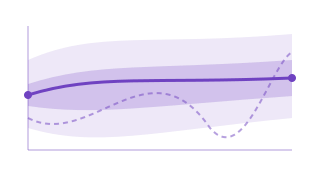
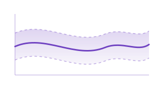
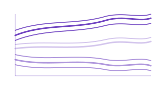
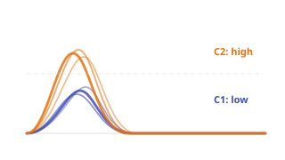
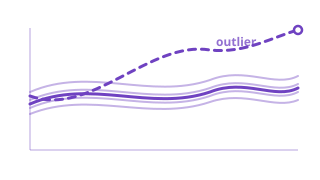
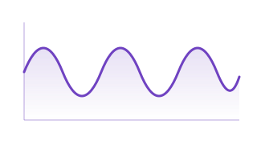
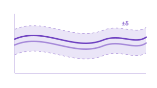
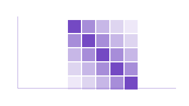

# Analyze

**Infer, cluster, detect outliers, and test functional data.**

The Analyze module collects the tools you reach for once your curves are represented and aligned: find groups via clustering, flag anomalous observations, construct tolerance bands, test whether two populations are equivalent, decompose seasonal patterns, and explore covariance structure. Every algorithm runs in Rust for maximum throughput.

<a class="fdars-gallery-item" href="tolerance-bands/">

Tolerance Bands

FPCA-based tolerance bands, conformal bands, and Degras SCBs.

</a>
<a class="fdars-gallery-item" href="clustering/">

Clustering

K-means, fuzzy c-means, and GMM clustering for functional data.

</a>
<a class="fdars-gallery-item" href="gmm-clustering/">

GMM Clustering

Model-based clustering with Gaussian mixtures and soft assignments.

</a>
<a class="fdars-gallery-item" href="elastic-clustering/">

Elastic Clustering

Cluster by amplitude/phase-invariant elastic distance.

</a>
<a class="fdars-gallery-item" href="outlier-detection/">

Outlier Detection

LRT, outliergram, and magnitude-shape anomaly detection.

</a>
<a class="fdars-gallery-item" href="seasonal-analysis/">

Seasonal Analysis

SAZED, autoperiod, STL, and peak detection for periodic data.

</a>
<a class="fdars-gallery-item" href="equivalence-testing/">

Equivalence Testing

TOST-based equivalence tests for functional means.

</a>
<a class="fdars-gallery-item" href="covariance-functions/">

Covariance Functions

Gaussian, exponential, Matern, and periodic covariance kernels.

</a>

