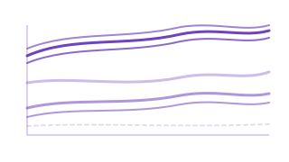
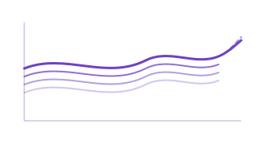
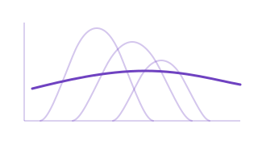
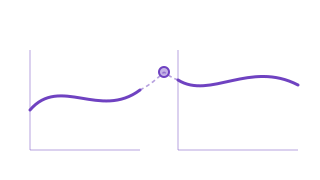
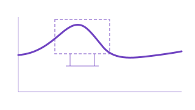
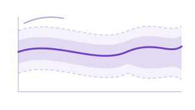
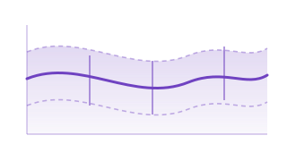
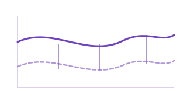

# Analyze

**Infer, cluster, detect outliers, and test functional data.**

The Analyze module collects the tools you reach for once your curves are represented and aligned: find groups via clustering, flag anomalous observations, construct tolerance bands, test whether two populations are equivalent, decompose seasonal patterns, and explore covariance structure. Every algorithm runs in Rust for maximum throughput.

<a class="fdars-gallery-item" href="tolerance-bands/">

Tolerance Bands

FPCA-based tolerance bands, conformal bands, and Degras SCBs.

</a>
<a class="fdars-gallery-item" href="clustering/">

Clustering

K-means, fuzzy c-means, and GMM clustering for functional data.

</a>
<a class="fdars-gallery-item" href="gmm-clustering/">

GMM Clustering

Model-based clustering with Gaussian mixtures and soft assignments.

</a>
<a class="fdars-gallery-item" href="elastic-clustering/">

Elastic Clustering

Cluster by amplitude/phase-invariant elastic distance.

</a>
<a class="fdars-gallery-item" href="advanced-clustering/">

Advanced Clustering

Density-based, structure-aware, and alignment-coupled clustering methods.

</a>
<a class="fdars-gallery-item" href="outlier-detection/">

Outlier Detection

LRT, outliergram, and magnitude-shape anomaly detection.

</a>
<a class="fdars-gallery-item" href="seasonal-analysis/">

Seasonal Analysis

SAZED, autoperiod, STL, and peak detection for periodic data.

</a>
<a class="fdars-gallery-item" href="equivalence-testing/">

Equivalence Testing

TOST-based equivalence tests for functional means.

</a>
<a class="fdars-gallery-item" href="covariance-functions/">

Covariance Functions

Gaussian, exponential, Matern, and periodic covariance kernels.

</a>
<a class="fdars-gallery-item" href="functional-time-series/">

Functional Time Series

Forecast, test stationarity, and model autocorrelation for curve sequences.

</a>
<a class="fdars-gallery-item" href="density-fda/">

Density FDA

Analyze probability densities as functional objects via the LQD transform.

</a>
<a class="fdars-gallery-item" href="multi-domain/">

Multi-Domain FDA

Joint FPCA across multiple functional variables per subject.

</a>
<a class="fdars-gallery-item" href="shapelets/">

Shapelets

Discriminative subsequences that separate classes by minimum-distance matching.

</a>
<a class="fdars-gallery-item" href="functional-boxplot/">

Functional Boxplot

Depth-based central region, fences, and outlier detection for curves.

</a>
<a class="fdars-gallery-item" href="functional-statistics/">

Functional Statistics

Pointwise variance, covariance surface, and depth-based median of curves.

</a>
<a class="fdars-gallery-item" href="scoring-metrics/">

Scoring Metrics

Integrated prediction-error metrics: MAE, MSE, MAPE, MSLE, explained variance.

</a>

