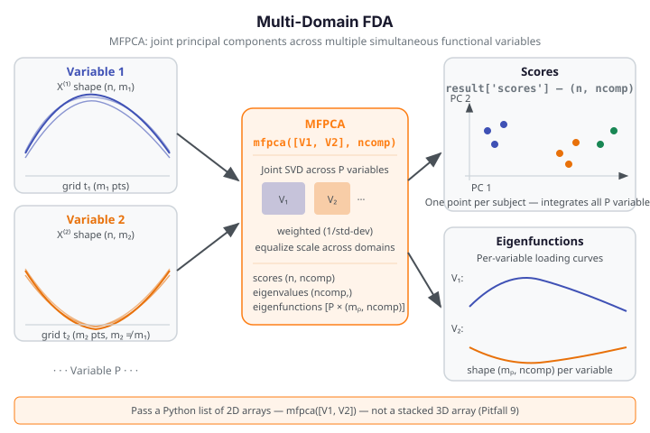

# Multi-Domain FDA

Multi-Domain FDA handles subjects observed simultaneously on multiple functional
variables — for example, a patient with temperature, pressure, and flow curves measured
at the same time points (or different ones). **Multivariate Functional PCA (MFPCA)**
extracts shared principal components across all domains, giving a single low-dimensional
score per subject that summarizes variation across every variable. **FAMM** (Functional
Additive Mixed Models) adds a mixed-effects structure for repeated-measures designs.

{ .fdars-diagram }

## Core Concept

Let subject $i$ be observed on $P$ functional variables $X_i^{(1)}, \ldots, X_i^{(P)}$,
each evaluated on its own grid of length $m_p$. Stack the observations into a multivariate
functional object. MFPCA seeks $K$ multivariate eigenfunctions
$\boldsymbol{\phi}_k = (\phi_k^{(1)}, \ldots, \phi_k^{(P)})$ such that the projections

$$
s_{ik} = \sum_{p=1}^P \int X_i^{(p)}(t)\,\phi_k^{(p)}(t)\,dt
$$

capture maximum joint variance. The scores $s_{ik}$ are directly comparable across
subjects because they integrate information from all domains.

```python exec="1" source="above"
import numpy as np
from fdars.spm import mfpca

rng = np.random.default_rng(42)
n, m1, m2 = 20, 30, 25   # non-square variable grids (n observations, different grid lengths)
t1 = np.linspace(0, 1, m1)
t2 = np.linspace(0, 1, m2)
V1 = np.array([np.sin(2 * np.pi * t1 + rng.uniform(0, 0.3)) for _ in range(n)])
V2 = np.array([np.cos(np.pi * t2 + rng.uniform(0, 0.3))     for _ in range(n)])

# Pass a LIST of 2D arrays — one per variable (NOT a stacked 3D array)
result = mfpca([V1, V2], ncomp=2)

n_comp = len(result['eigenvalues'])
print(f"mfpca scores shape:  {np.asarray(result['scores']).shape}")
print(f"eigenvalues:         {[round(e, 4) for e in np.asarray(result['eigenvalues'])[:2].tolist()]}  FDARS_FENCE_OK")
```

The scores matrix is `(n, ncomp)` — one row per subject, one column per multivariate
principal component. Derive the number of retained components from
`len(result['eigenvalues'])` — there is **no** `n_comp` key in the `mfpca` result.

!!! warning "Pass a list, not a stacked array"
    `mfpca([V1, V2], ncomp=2)` works; `mfpca(np.stack([V1, V2]), ncomp=2)` raises
    a `ValueError`. Each variable is a separate 2D array in a Python list.

## API Reference

### `mfpca` — Multivariate Functional PCA

```python
from fdars.spm import mfpca

result = mfpca(variables, ncomp=5, weighted=True)
```

| Parameter | Type | Description |
|-----------|------|-------------|
| `variables` | `list` of `np.ndarray` (n, m_p) | One 2D array per functional variable; variables may have different grid lengths |
| `ncomp` | `int` | Number of multivariate principal components (default: 5) |
| `weighted` | `bool` | Weight each variable by 1/std-dev before joint SVD (default: `True`) |

| Key | Meaning |
|-----|---------|
| `scores` | Multivariate scores, shape `(n, ncomp)` |
| `eigenfunctions` | List of P arrays, each shape `(m_p, ncomp)` — per-variable loadings |
| `eigenvalues` | Eigenvalues, shape `(ncomp,)` — use `len(eigenvalues)` to get component count |
| `means` | List of P arrays, each shape `(m_p,)` — per-variable mean functions |
| `scales` | Scale factors, shape `(P,)` — used for weighted normalization |
| `grid_sizes` | List of P ints — number of evaluation points per variable |

---

### `multi_fdata_from_components` — Construct Multi-Domain Object

```python
from fdars.multi_fdata import multi_fdata_from_components

mfd = multi_fdata_from_components(data_list, argvals_list)
```

Returns a `PyMultiFunData` opaque handle usable as input to `dense_flmm` and
`multi_famm`. `data_list` is a list of 2D arrays (one per domain); `argvals_list` is a
list of 1D arrays.

---

### FAMM Functions (require `PyMultiFunData` handle)

| Function | Description |
|----------|-------------|
| `dense_flmm(y, multi_fdata, ...)` | Functional linear mixed model on longitudinal data; returns a 14-key dict |
| `multi_famm(y, multi_fdata, ...)` | Multi-domain functional additive mixed model; returns a dict |

These require a longitudinal $y$-vector and a `PyMultiFunData` handle. See the
`fdars.famm` module for full parameter documentation.

## References

- Happ, C. and Greven, S. (2018). Multivariate functional principal component analysis for
  data observed on different (dimensional) domains.
  *Journal of the American Statistical Association* 113(522), 649–659.
- Scheipl, F., Staicu, A.-M. and Greven, S. (2015). Functional additive mixed models.
  *Journal of Computational and Graphical Statistics* 24(2), 477–501.
