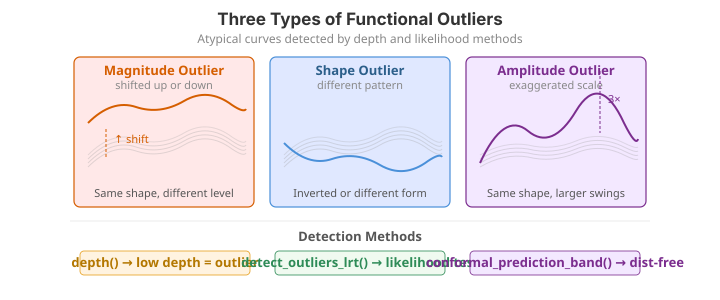

# Outlier Detection

Functional outliers come in three flavours:

| Type | Description | Example |
|---|---|---|
| **Magnitude** | The curve lies far above or below the bulk of the data | A temperature sensor reading 20 degrees higher than all others |
| **Shape** | The curve has an unusual pattern even if its overall level is normal | A growth curve that dips where all others rise |
| **Amplitude** | The curve has exaggerated peaks and troughs | A vibration signal with double the usual amplitude |

The distinction is not merely descriptive. A magnitude outlier is a curve $X_i(t)$
whose *level* is shifted, $X_i(t) \approx \mu(t) + c$ with $|c|$ large; a shape outlier
tracks the population mean in level but departs in its *form*, and an amplitude outlier
scales the variation, $X_i(t) \approx \mu(t) + \gamma\,[\,g(t)-\mu(t)\,]$ with $\gamma$
far from $1$. No single scalar summary separates all three, so `fdars` provides several
complementary detectors, each best at a different quadrant of this space.

| Method | Function | Targets | Output geometry |
|---|---|---|---|
| Likelihood-ratio test | `detect_outliers_lrt` | magnitude | 1-D distance vs. bootstrap threshold |
| Outliergram | `outliergram` | shape | MEI–MBD plane, parabolic boundary |
| Magnitude–shape plot | `magnitude_shape` | magnitude **and** shape | 2-D directional-outlyingness plane |

---

{ .fdars-diagram }

## LRT-based detection

### Theory

Following Febrero, Galeano & González-Manteiga (2008), each curve is scored by its
distance from a robust centre and compared against a bootstrap null. Let $D_i$ be a
functional depth (larger = more central) and let the reference set be the $1-\alpha_{\text{trim}}$
deepest curves, so that the trimmed mean $\hat\mu_{\text{trim}}(t)$ excludes the least
central `trim`-fraction. Each curve's outlyingness is its $L^2$ distance from that robust
centre,

$$
d_i \;=\; \lVert X_i - \hat\mu_{\text{trim}} \rVert_2
      \;=\; \left( \int_{\mathcal T} \bigl(X_i(t) - \hat\mu_{\text{trim}}(t)\bigr)^2 \, dt \right)^{1/2}.
$$

The test statistic is the *maximum* distance $M = \max_i d_i$. Its null distribution —
what $M$ looks like when there are **no** outliers — is obtained by a smoothed bootstrap:
resample curves from the trimmed reference, add Gaussian noise with bandwidth `smo`
(this is the $\gamma$ smoothing that widens the resampled population so the null is not
degenerate), recompute $M^{(b)}$ for $b = 1,\dots,B$, and take the threshold as the
$(1-\alpha)$ quantile

$$
\hat C_{1-\alpha} \;=\; \operatorname{quantile}_{1-\alpha}\!\bigl(M^{(1)},\dots,M^{(B)}\bigr).
$$

Any curve with $d_i > \hat C_{1-\alpha}$ is flagged. Because the reference is trimmed and
the null is smoothed, the test targets **magnitude** outliers — curves shifted up or down —
and is comparatively blind to pure shape or amplitude anomalies. A per-curve p-value is
the tail mass $\hat p_i = \tfrac1B\sum_b \mathbf 1\{M^{(b)} \ge d_i\}$.

```python exec="1" html="1" source="above"
import numpy as np
from docs_fig import fig, render
from fdars.outliers import detect_outliers_lrt_with_dist

# Low-noise sinusoids with one magnitude outlier (curve 0 shifted up by 3)
rng = np.random.default_rng(1)
t = np.linspace(0, 1, 100)
X = np.array([np.sin(2 * np.pi * t) + rng.normal(0, 0.1, t.size) for _ in range(30)])
X[0] = np.sin(2 * np.pi * t) + 3.0

res = detect_outliers_lrt_with_dist(X, alpha=0.05, n_bootstrap=300, smo=0.1, seed=1)
null = np.asarray(res["null_distribution"])
thr = float(res["threshold"])
flagged = np.where(np.asarray(res["outliers"]))[0]

f, (a0, a1) = fig(1, 2, figsize=(11.0, 3.8))
for i, xi in enumerate(X):
    a0.plot(t, xi, color="#dc3545" if i in flagged else "#6c757d",
            lw=1.6 if i in flagged else 0.7, alpha=0.9 if i in flagged else 0.35)
a0.set(title=f"Curves (LRT flagged: {flagged.tolist()})", xlabel="t", ylabel="X(t)")

a1.hist(null, bins=25, color="#3f51b5", alpha=0.7)
a1.axvline(thr, color="#dc3545", ls="--", lw=1.6, label=f"threshold {thr:.1f}")
a1.set(title="Bootstrap null distribution of max distance",
       xlabel="max distance from robust centre", ylabel="count")
a1.legend()
print(render(f))
```

**Parameters**

| Parameter | Type | Default | Description |
|---|---|---|---|
| `data` | `ndarray (n, m)` | -- | Functional observations |
| `alpha` | `float` | `0.05` | Significance level |
| `n_bootstrap` | `int` | `200` | Number of bootstrap replicates for threshold estimation |
| `trim` | `float` | `0.1` | Trimming proportion for the robust mean |
| `smo` | `float` | `0.02` | Smoothing parameter for the likelihood ratio |

`detect_outliers_lrt` returns `{"outliers": bool[n], "threshold": float}`;
`detect_outliers_lrt_with_dist` additionally returns `null_distribution` (the bootstrap
max-distances used to set the threshold), as plotted above.

!!! warning "The LRT can mask a lone outlier at the default smoothing"
    Two behaviours are worth knowing before you trust a negative result:

    - **Smoothing matters.** With the default `smo=0.02`, even a large single magnitude
      outlier can go undetected; raising `smo` to about `0.1` restores detection in the
      example above. Sweep `smo` if the LRT reports nothing.
    - **Masking/swamping.** A single very extreme curve inflates the bootstrap null (it
      is resampled into the reference), pushing the threshold up so far that it hides
      itself. This is a known limitation of single-pass outlier tests; corroborate the LRT
      with the outliergram and the magnitude--shape plot below rather than relying on it
      alone.

!!! note "Depth-based detectors are R-only for now"
    The R reference also offers packaged depth-based detectors (`outliers.depth.pond`,
    `outliers.depth.trim`) that flag curves with unusually low functional depth. These have
    **no one-call Python binding** in the current `fdars` build. You can reproduce the idea
    faithfully, though, with `fdars.depth` plus a robust cutoff on the depths, as below.

### Depth distribution and a depth-based cutoff (numpy)

Febrero et al.'s depth detectors rest on a simple premise: outliers are curves of
*unusually low functional depth*. We compute a Fraiman–Muniz depth for every curve and
flag those below a robust median-minus-$k\cdot$MAD fence — the same `mad` threshold rule
the R `outliers.depth.pond` exposes. This mirrors the R article's depth-distribution
figure while being fully transparent about the (numpy) cutoff.

```python exec="1" html="1" source="above"
import numpy as np
from docs_fig import fig, render
from fdars.simulation import simulate
from fdars.depth import fraiman_muniz_1d

t = np.linspace(0, 1, 100)
X = np.asarray(simulate(40, t, n_basis=5, seed=11))
X[0] += 6.0                          # magnitude outlier -> shallow depth
X[1] = 3.0 * np.sign(np.sin(2 * np.pi * 4 * t))  # square-wave shape outlier

depth = np.asarray(fraiman_muniz_1d(X, X))
med, mad = np.median(depth), np.median(np.abs(depth - np.median(depth)))
cutoff = med - 2.5 * mad                 # robust "mad" fence, k = 2.5
low = depth < cutoff

f, (a0, a1) = fig(1, 2, figsize=(11.0, 3.8))
for i, xi in enumerate(X):
    a0.plot(t, xi, color="#dc3545" if low[i] else "#6c757d",
            lw=1.6 if low[i] else 0.7, alpha=0.9 if low[i] else 0.3)
a0.set(title=f"Curves (low-depth flagged: {np.where(low)[0].tolist()})",
       xlabel="t", ylabel="X(t)")

a1.hist(depth, bins=20, color="#3f51b5", alpha=0.7)
a1.axvline(cutoff, color="#dc3545", ls="--", lw=1.6,
           label=f"median - 2.5·MAD = {cutoff:.2f}")
a1.set(title="Fraiman-Muniz depth distribution", xlabel="depth", ylabel="count")
a1.legend()
print(render(f))
```

The fence catches both the injected outliers: curve `0` (the level-shifted magnitude
outlier) and curve `1` (the square-wave shape outlier, which repeatedly runs out to the
pointwise extremes and so earns a low Fraiman–Muniz depth). It also flags one *extra*
curve near the bottom of the bundle -- a genuine but unremarkable member of the sample
that simply lives on the low-depth tail. That is characteristic of a raw MAD fence:
Fraiman–Muniz depth is a pointwise-centrality measure, so a shape outlier is only caught
when it strays far from the cross-sectional median, and a tight fence will occasionally
swamp a normal-but-peripheral curve. Corroborate with the band-depth outliergram and the
magnitude--shape plot below, which are built for shape departures.

---

## Outliergram (MEI vs MBD)

### Theory

The outliergram (Arribas-Gil & Romo, 2014) is a shape detector built from two
band-depth statistics. For a sample of $n$ curves the **Modified Band Depth** of curve
$X_i$ measures, across all pairs of reference curves, the *proportion of the domain* on
which $X_i$ lies inside the band they span:

$$
\mathrm{MBD}(X_i) \;=\; \binom{n}{2}^{-1}\!\!\sum_{r<s}\;
   \frac{1}{|\mathcal T|}\,\lambda\!\Bigl\{\, t : \min(X_r,X_s)(t) \le X_i(t) \le \max(X_r,X_s)(t) \Bigr\},
$$

where $\lambda$ is Lebesgue measure on the domain. The **Modified Epigraph Index** is the
average proportion of the domain on which curve $X_i$ lies *below* the other curves,

$$
\mathrm{MEI}(X_i) \;=\; \frac{1}{n}\sum_{j=1}^{n}\;
   \frac{1}{|\mathcal T|}\,\lambda\!\bigl\{\, t : X_i(t) \le X_j(t) \bigr\}.
$$

The key fact that makes the plot work: for **non-crossing** curves MBD and MEI satisfy an
exact quadratic relationship. Every well-behaved curve sits on the parabola

$$
\mathrm{MBD}(X_i) \;=\; a_0 + a_1\,\mathrm{MEI}(X_i) + a_2\,\mathrm{MEI}(X_i)^2,
\qquad a_0 = a_2 = -\frac{2n}{(n-1)^2},\;\; a_1 = \frac{2(n+1)}{n-1}.
$$

A curve that *crosses* others — the signature of a shape outlier — has lower band depth
than its epigraph index predicts and therefore falls **below** the parabola. The
outliergram flags curves by their vertical distance to the parabola,
$d_i = \hat{\mathrm{MBD}}(\mathrm{MEI}_i) - \mathrm{MBD}_i$, using a boxplot-style rule:
$d_i$ exceeding the upper quartile by `factor` times the interquartile range marks an
outlier (the classic $Q_3 + \texttt{factor}\cdot\mathrm{IQR}$ fence, `factor = 1.5` by
default).

!!! note "Depth scaling differs across implementations"
    The coefficients above are the canonical Arribas-Gil & Romo normalisation. The MBD
    returned by `fdars.depth.modified_band_1d` uses its own internal scaling, so the raw
    `mbd`/`mei` values from `outliergram` will not lie on *exactly* that parabola — the
    detector fits and applies the boundary internally. Treat the formula as the geometry
    the method exploits, not a literal check on the returned numbers.

```python
from fdars.outliers import outliergram

result_og = outliergram(fd.data, factor=1.5)
```

**Parameters**

| Parameter | Type | Default | Description |
|---|---|---|---|
| `data` | `ndarray (n, m)` | -- | Functional observations |
| `factor` | `float` | `1.5` | Outlier factor (analogous to the IQR multiplier in a boxplot) |

**Returns** a dictionary:

| Key | Shape | Description |
|---|---|---|
| `mei` | `(n,)` | Modified Epigraph Index |
| `mbd` | `(n,)` | Modified Band Depth |
| `outliers` | `(n,)` bool | Outlier flags |

The left panel shows the raw curves with a few injected anomalies; the right panel is
the outliergram itself, where flagged curves sit far from the central parabola.

```python exec="1" html="1"
import numpy as np
from docs_fig import fig, render
from fdars.simulation import simulate
from fdars.outliers import outliergram

t = np.linspace(0, 1, 100)
X = np.asarray(simulate(40, t, n_basis=5, seed=42))
X[0] += 6.0        # magnitude outlier
X[1] = -X[1]       # shape outlier (reversed)
X[2] *= 2.5        # amplitude outlier

og = outliergram(X, factor=1.5)
mei, mbd, flag = (np.asarray(og[k]) for k in ("mei", "mbd", "outliers"))

f, (a0, a1) = fig(1, 2, figsize=(11.0, 3.8))
for i, xi in enumerate(X):
    a0.plot(t, xi, color="#dc3545" if flag[i] else "#6c757d",
            lw=1.4 if flag[i] else 0.7, alpha=0.9 if flag[i] else 0.35)
a0.set(title="Curves (outliers in red)", xlabel="t", ylabel="X(t)")

a1.scatter(mei[~flag], mbd[~flag], s=22, color="#3f51b5", label="normal")
a1.scatter(mei[flag], mbd[flag], s=55, color="#dc3545", label="outlier")
a1.set(title="Outliergram (MEI vs MBD)", xlabel="MEI", ylabel="MBD")
a1.legend()
print(render(f))
```

The red curves in the left panel are exactly the points the outliergram isolates on the
right: shape outliers fall away from the parabolic MEI--MBD band that the bulk of the
sample traces out, so a departure in the scatter plot corresponds to an atypical curve.

!!! tip "Choosing the factor"
    A factor of 1.5 (the default) mirrors the classic boxplot rule. Increase it to 2.0 or 3.0 if you want to be more conservative and only flag extreme shape departures.

---

## Magnitude-shape outlyingness

### Theory

The magnitude–shape plot (Dai & Genton, 2018) is built on **directional outlyingness**.
At each time $t$ define the pointwise outlyingness of curve $X_i$ using a robust depth
$d$ (e.g. the halfspace or projection depth of $X_i(t)$ within the cross-section
$\{X_1(t),\dots,X_n(t)\}$), scaled and *signed* by the direction $\mathbf v_i(t)$ pointing
from the pointwise median toward $X_i(t)$:

$$
\mathbf O(X_i, t) \;=\; \left( \frac{1}{d\bigl(X_i(t)\bigr)} - 1 \right)\, \mathbf v_i(t).
$$

Integrating over the domain splits this into a location term and a variability term. The
**mean directional outlyingness** captures *magnitude* (how far, and in which direction, a
curve sits from the centre on average),

$$
\mathrm{MO}(X_i) \;=\; \frac{1}{|\mathcal T|}\int_{\mathcal T} \mathbf O(X_i,t)\,dt,
$$

while the **variation of directional outlyingness** captures *shape* (how much a curve's
outlyingness fluctuates across the domain — large when a curve crosses the bulk),

$$
\mathrm{VO}(X_i) \;=\; \frac{1}{|\mathcal T|}\int_{\mathcal T}
   \bigl\lVert \mathbf O(X_i,t) - \mathrm{MO}(X_i) \bigr\rVert^2 \, dt.
$$

`magnitude_shape` returns $\lVert\mathrm{MO}\rVert$ as `magnitude` and $\mathrm{VO}$ as
`shape`. A pure magnitude outlier has large $\lVert\mathrm{MO}\rVert$ but small
$\mathrm{VO}$; a shape outlier has the reverse. Because both live on one plane, a single
scatter tells you *why* a curve is outlying, not just *that* it is. The two statistics can
be combined into a Mahalanobis-type distance whose null is approximately $\chi^2$, giving
a principled cutoff, but here we threshold each axis directly.

```python
from fdars.outliers import magnitude_shape

result_ms = magnitude_shape(fd.data)
```

**Parameters**

| Parameter | Type | Default | Description |
|---|---|---|---|
| `data` | `ndarray (n, m)` | -- | Functional observations |

**Returns** a dictionary:

| Key | Shape | Description |
|---|---|---|
| `magnitude` | `(n,)` | Magnitude outlyingness score for each curve |
| `shape` | `(n,)` | Shape outlyingness score for each curve |

You can flag outliers by thresholding either component (e.g., values above the 97.5th percentile):

```python
mag_threshold = np.percentile(result_ms["magnitude"], 97.5)
shape_threshold = np.percentile(result_ms["shape"], 97.5)
mag_outliers = result_ms["magnitude"] > mag_threshold
shape_outliers = result_ms["shape"] > shape_threshold
print(f"Magnitude outliers: {np.where(mag_outliers)[0]}")
print(f"Shape outliers:     {np.where(shape_outliers)[0]}")
```

The magnitude-shape plot spreads outlyingness across two axes, so magnitude anomalies
separate horizontally and shape anomalies vertically.

```python exec="1" html="1"
import numpy as np
from docs_fig import fig, render
from fdars.simulation import simulate
from fdars.outliers import magnitude_shape

t = np.linspace(0, 1, 100)
X = np.asarray(simulate(40, t, n_basis=5, seed=42))
X[0] += 7.0        # magnitude outlier
X[1] = -X[1]       # shape outlier

ms = magnitude_shape(X)
mag, shp = np.asarray(ms["magnitude"]), np.asarray(ms["shape"])
flag = (mag > np.percentile(mag, 95)) | (shp > np.percentile(shp, 95))

f, ax = fig(figsize=(6.6, 4.2))
ax.scatter(mag[~flag], shp[~flag], s=26, color="#3f51b5", label="normal")
ax.scatter(mag[flag], shp[flag], s=60, color="#dc3545", label="flagged")
for i in (0, 1):
    ax.annotate(f"curve {i}", (mag[i], shp[i]), fontsize=9,
                color="#dc3545", xytext=(6, 4), textcoords="offset points")
ax.set(title="Magnitude-shape outlyingness",
       xlabel="magnitude outlyingness", ylabel="shape outlyingness")
ax.legend()
print(render(f))
```

The two axes separate two failure modes: points far to the right are *magnitude* outliers
(shifted up or down as a whole), while points high up the vertical axis are *shape*
outliers (atypical curvature at a normal level), and a curve extreme on either axis is
flagged.

---

## The three outlier types, in isolation

To see which method responds to which anomaly, inject a *single* outlier of each type
into an otherwise clean low-noise sinusoidal sample and show all three side by side: a
magnitude shift (+3), a shape inversion, and a 3x amplitude scaling.

```python exec="1" html="1" source="above"
import numpy as np
from docs_fig import fig, render

t = np.linspace(0, 1, 100)

def clean(seed, n=30):
    rng = np.random.default_rng(seed)
    return np.array([np.sin(2 * np.pi * t) + rng.normal(0, 0.1, t.size) for _ in range(n)])

cases = [
    ("Magnitude (+3 shift)", lambda X: X.__setitem__(0, np.sin(2 * np.pi * t) + 3.0)),
    ("Shape (inverted)",     lambda X: X.__setitem__(0, -np.sin(2 * np.pi * t))),
    ("Amplitude (3x)",       lambda X: X.__setitem__(0, 3.0 * np.sin(2 * np.pi * t))),
]

f, axes = fig(1, 3, figsize=(12, 3.4), sharex=True)
for ax, (title, inject) in zip(axes, cases):
    X = clean(7)
    inject(X)
    ax.plot(t, X[1:].T, color="#6c757d", lw=0.6, alpha=0.4)
    ax.plot(t, X[0], color="#dc3545", lw=2.0, label="outlier")
    ax.set(title=title, xlabel="t")
    ax.legend(loc="upper right")
axes[0].set_ylabel("X(t)")
print(render(f))
```

The magnitude outlier stands off vertically (LRT territory), the shape outlier tracks the
same level but runs anti-phase (outliergram territory), and the amplitude outlier keeps
the same phase but oscillates harder. No single detector is best at all three, which is
why the recommendation below is to run more than one.

---

## Full example -- detect and visualize outliers

Run all three detectors on the same contaminated sample and compare what each flags.
We use a low-noise sinusoidal base (the regime where the LRT is well-behaved) with one
magnitude, one shape, and one amplitude outlier.

```python exec="1" source="above"
import numpy as np
from fdars.outliers import detect_outliers_lrt, outliergram, magnitude_shape

t = np.linspace(0, 1, 100)
rng = np.random.default_rng(42)
X = np.array([np.sin(2 * np.pi * t) + rng.normal(0, 0.1, t.size) for _ in range(30)])
X[0] = np.sin(2 * np.pi * t) + 3.0     # magnitude outlier
X[1] = -np.sin(2 * np.pi * t)          # shape outlier (inverted)
X[2] = 3.0 * np.sin(2 * np.pi * t)     # amplitude outlier

# LRT (raise smo so a lone magnitude outlier is not masked)
lrt = detect_outliers_lrt(X, alpha=0.05, n_bootstrap=300, smo=0.1)
print("LRT outliers        :", np.where(lrt["outliers"])[0].tolist())

# Outliergram (shape)
og = outliergram(X, factor=1.5)
print("Outliergram outliers:", np.where(np.asarray(og["outliers"]))[0].tolist())

# Magnitude-shape ranking
ms = magnitude_shape(X)
mag, shp = np.asarray(ms["magnitude"]), np.asarray(ms["shape"])
print("Top |magnitude| idx :", np.argsort(np.abs(mag))[-3:][::-1].tolist())
print("Top |shape| idx     :", np.argsort(np.abs(shp))[-3:][::-1].tolist())
```

The three detectors flag overlapping but distinct index sets: LRT and the magnitude ranking
converge on the level-shifted curve, while the outliergram and the shape ranking pick out
the curvature anomaly -- confirming that no single method dominates and that they are best
read together.

!!! info "Which method to use?"
    - **LRT** (`detect_outliers_lrt`): magnitude outliers, but tune `smo` (≈0.1) and treat a
      negative result cautiously (masking). Use `detect_outliers_lrt_with_dist` when you
      want to see the bootstrap null.
    - **Outliergram** (`outliergram`): the go-to for shape outliers; interpretable 2D plot.
    - **Magnitude-shape** (`magnitude_shape`): decomposes outlyingness onto two axes, so you
      can tell *why* a curve is outlying.
    - Run at least two, and corroborate. No single functional detector catches every
      outlier type.

### Comparing outlierness scores across methods

The R article closes with a bar chart contrasting the per-curve outlierness assigned by
each method. Here is the Python analogue: for the same contaminated sample we normalise
each detector's score to $[0,1]$ and place the three side by side. The three injected
curves (indices 0–2) should light up, but *which* method scores them highest reveals the
division of labour — the magnitude distance peaks on the shifted curve, `shape` (VO) on
the inverted curve, and both flag the amplitude curve to a degree.

!!! note "The LRT binding returns flags, not per-curve distances"
    `detect_outliers_lrt_with_dist` exposes `outliers`, `threshold`, and
    `null_distribution` — but **not** the individual curve distances $d_i$. For a
    per-curve *score* we therefore stand in the underlying quantity transparently: the
    $L^1$ distance of each curve from the pointwise median, which is what the LRT
    thresholds a robust version of.

```python exec="1" html="1" source="above"
import numpy as np
from docs_fig import fig, render
from fdars.outliers import outliergram, magnitude_shape

t = np.linspace(0, 1, 100)
rng = np.random.default_rng(3)
X = np.array([np.sin(2 * np.pi * t) + rng.normal(0, 0.1, t.size) for _ in range(30)])
X[0] = np.sin(2 * np.pi * t) + 3.0     # magnitude
X[1] = -np.sin(2 * np.pi * t)          # shape
X[2] = 3.0 * np.sin(2 * np.pi * t)     # amplitude

def unit(v):
    v = np.asarray(v, float)
    return (v - v.min()) / (np.ptp(v) + 1e-12)

og = outliergram(X, factor=1.5)
ms = magnitude_shape(X)

scores = {
    "Magnitude (L1 to median)": unit(np.abs(X - np.median(X, 0)).mean(1)),
    "Outliergram (|MEI-0.5|)": unit(np.abs(np.asarray(og["mei"]) - 0.5)),
    "MS shape (VO)": unit(ms["shape"]),
}

f, ax = fig(figsize=(9.5, 3.8))
idx = np.arange(len(X)); w = 0.27
for k, (name, s) in enumerate(scores.items()):
    ax.bar(idx + (k - 1) * w, s, width=w, label=name, alpha=0.85)
ax.axvspan(-0.5, 2.5, color="#dc3545", alpha=0.08)
ax.set(title="Per-curve outlierness by method (curves 0-2 are the injected outliers)",
       xlabel="curve index", ylabel="normalised score")
ax.legend(fontsize=8)
print(render(f))
```

The grouped bars over the shaded region (curves 0--2) show each method spiking on the
anomaly it is designed to catch: the magnitude score peaks on curve 0, the outliergram
score on the shape-inverted curve 1, and the MS shape score on the amplitude-scaled curve
2 -- a compact confirmation that the three diagnostics are complementary.

## See also

- [Tolerance bands](tolerance-bands.md) -- a curve outside a tolerance band is, by
  construction, an outlier relative to the fitted population.
- `fdars.depth` -- the band-depth and epigraph-index machinery underlying the outliergram.

## References

1. Febrero, M., Galeano, P., and González-Manteiga, W. (2008). "Outlier detection in
   functional data by depth measures, with application to identify abnormal NOx levels."
   *Environmetrics*, 19(4), 331–345. — the trimmed-depth + bootstrap LRT this page's
   `detect_outliers_lrt` implements.
2. Arribas-Gil, A., and Romo, J. (2014). "Shape outlier detection and visualization for
   functional data: the outliergram." *Biostatistics*, 15(4), 603–619. — defines MEI, MBD,
   and the MBD–MEI parabola used by `outliergram`.
3. Dai, W., and Genton, M. G. (2018). "Multivariate functional outlier detection." (with
   discussion) *Statistical Methods & Applications*, 27, 3–27; and Dai, W., and Genton,
   M. G. (2018), "Functional boxplots for multivariate curves," — the directional-
   outlyingness magnitude/shape decomposition behind `magnitude_shape`.
4. Hyndman, R. J., and Shang, H. L. (2010). "Rainbow plots, bagplots, and boxplots for
   functional data." *Journal of Computational and Graphical Statistics*, 19(1), 29–45. —
   functional depth ranking and visual outlier diagnostics.
