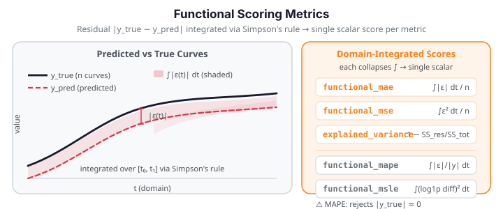

# Functional Scoring Metrics

Evaluating functional predictions requires metrics that respect the continuous nature of the data. `fdars.scoring` provides five domain-integrated prediction-scoring functions: `functional_mae`, `functional_mse`, `functional_mape`, `functional_msle`, and `functional_explained_variance`. All share the same uniform signature and return a single scalar.

{ .fdars-diagram }

## Why functional metrics?

Scalar regression metrics applied column-wise to a functional dataset (e.g., averaging per-grid-point MSE) treat each evaluation point as equally important regardless of grid spacing. `fdars.scoring` integrates the error over the domain using Simpson's rule, giving a **domain-weighted scalar** that properly accounts for non-uniform grids.

For $n$ pairs of true and predicted curves with shared evaluation grid $t_1, \ldots, t_m$:

$$
\text{functional\_mae} = \frac{1}{n} \sum_{i=1}^{n} \int_{t_1}^{t_m} \bigl|y_{\text{true},i}(t) - y_{\text{pred},i}(t)\bigr|\, dt
$$

$$
\text{functional\_mse} = \frac{1}{n} \sum_{i=1}^{n} \int_{t_1}^{t_m} \bigl(y_{\text{true},i}(t) - y_{\text{pred},i}(t)\bigr)^2\, dt
$$

Each integral is approximated via Simpson's rule over the argvals grid. A model that performs badly over a *wide* domain region is penalised more than one with a narrow spike error — unlike a simple column-wise average.

## The five metrics

### functional_mae

Mean absolute integrated error. Robust to outlier curves; same units as the data.

### functional_mse

Mean squared integrated error. Penalises large errors more heavily; squared units.

### functional_explained_variance

$$
\text{EV} = \frac{1}{n} \sum_{i=1}^{n} \Biggl(1 - \frac{\int(\varepsilon_i(t) - \bar\varepsilon_i)^2\,dt}{\int(y_{\text{true},i}(t) - \bar y_{\text{true},i})^2\,dt}\Biggr)
$$

where $\varepsilon_i = y_{\text{true},i} - y_{\text{pred},i}$ and bars denote per-curve means. Range: $(-\infty, 1]$. A value of 1 means the model explains all variation; values near or below 0 indicate a poor fit.

### functional_mape

Mean absolute percentage integrated error:

$$
\text{MAPE} = \frac{1}{n} \sum_{i=1}^{n} \int_{t_1}^{t_m} \frac{|y_{\text{true},i}(t) - y_{\text{pred},i}(t)|}{|y_{\text{true},i}(t)|}\, dt.
$$

!!! danger "MAPE raises on near-zero truths"
    `functional_mape` raises `ValueError` when any `|y_true(t)| < ε` for any curve and any grid point (no epsilon-in-denominator fallback — the library correctly rejects inputs near zero rather than producing numerically undefined results). **Do not use MAPE on data that crosses or approaches zero.** For zero-crossing data, use `functional_mae` or `functional_mse` instead. For non-negative data, `functional_msle` is a better relative-error metric.

### functional_msle

Mean squared log-error:

$$
\text{MSLE} = \frac{1}{n} \sum_{i=1}^{n} \int_{t_1}^{t_m} \bigl(\ln(1 + y_{\text{true},i}(t)) - \ln(1 + y_{\text{pred},i}(t))\bigr)^2\, dt.
$$

!!! danger "MSLE raises when any value ≤ −1"
    `functional_msle` raises `ValueError` when any value in `y_true` or `y_pred` is ≤ −1 (since $\ln(1 + v)$ is undefined at $v = -1$). Ensure all values are strictly greater than −1 before calling this metric.

## Uniform signature

All five functions share the same call signature:

```python
from fdars.scoring import (
    functional_mae,
    functional_mse,
    functional_mape,
    functional_msle,
    functional_explained_variance,
)

score = functional_mae(y_true, y_pred, argvals)  # same for the other four
```

| Parameter | Type | Description |
|-----------|------|-------------|
| `y_true` | `ndarray (n, m)` | True functional observations; rows are curves |
| `y_pred` | `ndarray (n, m)` | Predicted functional observations; must have the same shape |
| `argvals` | `ndarray (m,)` | Shared evaluation grid; used for Simpson integration weights |

**Returns:** Python `float` — the curve-averaged integrated score.

## Worked example

The fence below uses the Tecator NIR absorbance dataset (240 spectra, 100 wavelength channels, all values positive) as a predict-vs-true setup. The cross-sectional mean is used as a baseline predictor — anything informative should beat it. All three domain-safe metrics are demonstrated; MAPE and MSLE are described in prose only because their domain restrictions are documented above.

```python exec="1" html="1" source="above"
import numpy as np
from docs_data import load_tecator
import fdars.fdata as ff
from fdars.scoring import (
    functional_mae,
    functional_mse,
    functional_explained_variance,
)

wl, X, meta = load_tecator()
# X: 240 spectra × 100 wavelength channels, values in [2, 5.5] (positive — safe for all metrics)
# Use 12 held-out curves as y_true; predict each with the training-set mean (baseline)
rng = np.random.default_rng(42)
idx = rng.choice(len(X), size=12, replace=False)
y_true = X[idx]

# Baseline: predict the overall mean for every curve (deliberately uninformative)
mean_curve = np.asarray(ff.mean_1d(X))
y_pred = np.tile(mean_curve, (12, 1))

mae = functional_mae(y_true, y_pred, wl)
mse = functional_mse(y_true, y_pred, wl)
ev  = functional_explained_variance(y_true, y_pred, wl)

print(f"Dataset:              Tecator NIR spectra (n=12, m={X.shape[1]})")
print(f"Baseline predictor:   cross-sectional mean (worst-case uninformative)")
print(f"functional_mae:       {mae:.4f}  (integrated absolute error)")
print(f"functional_mse:       {mse:.4f}  (integrated squared error)")
print(f"explained_variance:   {ev:.4f}  (1 = perfect; 0 = mean-level)")
print(f"FDARS_FENCE_OK")
```

!!! note "Choosing the right metric"
    - **General purpose:** `functional_mae` or `functional_mse` — no domain restrictions.
    - **Relative error, positive data only:** `functional_mape` (raises on |y_true| ≈ 0) or `functional_msle` (requires all values > −1).
    - **Variance explained:** `functional_explained_variance` — interpretable scale (0 to 1 for non-negative fits); negative values indicate the predictor is worse than the mean.

## References

- Ramsay, J.O., Silverman, B.W. (2005). *Functional Data Analysis*, 2nd ed. Springer.
- Ferraty, F., Vieu, P. (2006). *Nonparametric Functional Data Analysis.* Springer.
