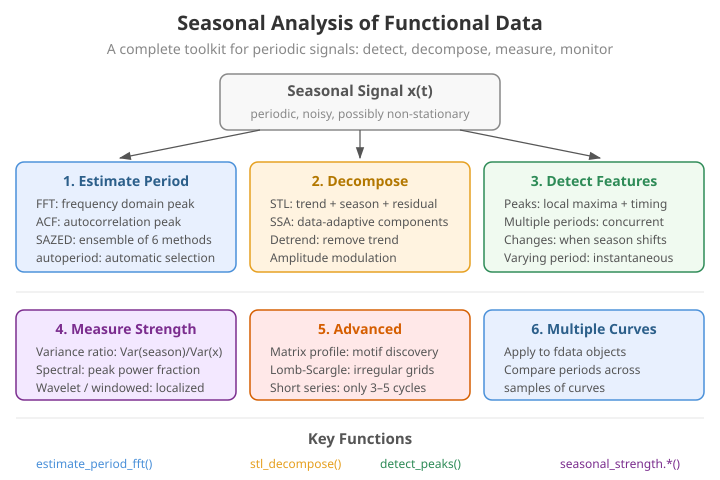

# Seasonal Analysis

Many real-world functional datasets exhibit periodic patterns -- daily temperature cycles, weekly traffic flows, annual growth curves. The seasonal analysis module provides tools for detecting, decomposing, and measuring periodicity in functional data.

---

{ .fdars-diagram }

## The periodogram: spectral view of a period

Every period-detection method here rests on the same idea: a periodic signal concentrates its
energy at a single frequency (and its harmonics). For a centred, uniformly-sampled series
$x_0,\dots,x_{m-1}$ on a grid of spacing $\Delta t$, the discrete Fourier transform is

$$
X_k = \sum_{n=0}^{m-1} x_n\, e^{-2\pi i k n / m},
\qquad k = 0,\dots,m-1 ,
$$

and the **periodogram** is its squared magnitude,

$$
I(f_k) = \frac{1}{m}\,\bigl|X_k\bigr|^2 ,
\qquad f_k = \frac{k}{m\,\Delta t}.
$$

The frequency $\hat f = \arg\max_{f_k} I(f_k)$ that maximises spectral power gives the estimated
period $\hat T = 1/\hat f$. `estimate_period_fft` does exactly this: it removes the mean, computes
$I(f_k)$ with an FFT, and returns the peak. The reported `confidence` is the fraction of total
spectral power carried by the winning peak, $I(\hat f)\big/\sum_k I(f_k)$ — a signal-to-noise
ratio in the frequency domain.

```python exec="1" html="1" source="above"
import numpy as np
from docs_fig import fig, render
from fdars.seasonal import estimate_period_fft

rng = np.random.default_rng(3)
t = np.linspace(0, 24, 720)
dt = t[1] - t[0]
# fundamental period 2.5 plus a weaker 2nd harmonic
x = np.sin(2 * np.pi * t / 2.5) + 0.4 * np.sin(2 * np.pi * t / 1.25)
X = x[None, :] + rng.normal(0, 0.25, (5, 720))

res = estimate_period_fft(X, t)

# periodogram of the (centred) sample mean, for display
xm = X.mean(0) - X.mean()
power = np.abs(np.fft.rfft(xm)) ** 2 / xm.size
freqs = np.fft.rfftfreq(xm.size, d=dt)
periods = np.divide(1.0, freqs, out=np.full_like(freqs, np.inf), where=freqs > 0)
keep = (periods > 0.5) & (periods < 6)

f, ax = fig(figsize=(7.4, 3.6))
ax.plot(periods[keep], power[keep], color="#3f51b5", lw=1.6)
ax.axvline(res["period"], color="#e8710a", ls="--", lw=1.5,
           label=f"peak $\\hat T$ = {res['period']:.3f}")
ax.axvline(2.5, color="#198754", ls=":", lw=1.4, label="true period 2.5")
ax.set(title="Periodogram: power vs. candidate period",
       xlabel="candidate period", ylabel="spectral power $I(f)$")
ax.legend()
print(render(f))
```

The dominant spike sits at the true period; the smaller companion at $1.25$ is the second
harmonic. Naive peak-picking can be fooled by such harmonics and by spectral leakage, which is
why the algorithms below add validation steps (autocorrelation, clustering, gradient refinement)
on top of the raw periodogram.

---

## Period detection

`fdars` offers three period-detection algorithms, each with different strengths:

### SAZED

SAZED (Seasonal And Zero-crossing Estimation of Periodicity via Distance) combines multiple period estimates from different signal features (zero crossings, peaks, autocorrelation) and returns a consensus period. The method is *parameter-free* by design: rather than trusting any single estimator, it forms an ensemble of periodicity cues and takes their agreement as the answer.

Two of the cues have simple closed forms. If a centred signal of length $L$ (in time units)
crosses zero $Z$ times, a pure sinusoid crosses zero twice per cycle, so

$$
\hat T_{\text{zero}} = \frac{2L}{Z}.
$$

A second cue comes from the (biased) sample **autocorrelation**

$$
\hat\rho(\tau) = \frac{\sum_{n} (x_n - \bar x)(x_{n+\tau} - \bar x)}{\sum_n (x_n - \bar x)^2},
$$

whose first prominent lag $\tau^\star>0$ estimates the period, $\hat T_{\text{acf}} = \tau^\star\,\Delta t$.
SAZED also draws a spectral estimate from the periodogram peak above. The consensus period is the
one to which the largest number of cues agree within the relative `tolerance`; `confidence` is that
count divided by the number of estimators (`agreeing_components`).

```python
import numpy as np
from fdars import Fdata
from fdars.seasonal import sazed

argvals = np.linspace(0, 10, 500)
# Create data with a known period
fd = Fdata(
    np.sin(2 * np.pi * argvals / 2.5)[None, :] + np.random.default_rng(1).normal(0, 0.1, (10, 500)),
    argvals=argvals,
)

result = sazed(fd.data, fd.argvals, tolerance=0.05)
print(f"Detected period: {result['period']:.3f}")
print(f"Confidence:      {result['confidence']:.3f}")
print(f"Agreeing comps:  {result['agreeing_components']}")
```

**Parameters**

| Parameter | Type | Default | Description |
|---|---|---|---|
| `data` | `ndarray (n, m)` | -- | Functional observations |
| `argvals` | `ndarray (m,)` | -- | Evaluation points |
| `tolerance` | `float` | `0.05` | Relative tolerance for period matching |

**Returns** a dictionary:

| Key | Type | Description |
|---|---|---|
| `period` | `float` | Estimated period |
| `confidence` | `float` | Confidence score (fraction of agreeing components) |
| `agreeing_components` | `int` | Number of estimation methods that agree |

### Autoperiod

Autoperiod (Vlachos, Yu & Castelli, 2005) is a two-stage estimator that pairs the frequency
domain with the time domain to reject the spurious peaks a raw periodogram produces. Stage one
scans the periodogram and keeps only *candidate* frequencies whose power exceeds a data-driven
threshold — an "hint" set. Stage two validates each candidate $T_c = 1/f_c$ against the
autocorrelation $\hat\rho(\tau)$: a genuine period sits on a **hill** (local maximum) of the ACF,
whereas a leakage artefact does not. The surviving candidate is refined by gradient ascent on the
ACF hill,

$$
\tau_{i+1} = \tau_i + \eta\,\frac{\mathrm{d}\hat\rho}{\mathrm{d}\tau}\Big|_{\tau_i},
\qquad i = 1,\dots,\texttt{gradient\_steps},
$$

and the returned `fft_power` and `acf_validation` are the two evidence scores. Best for clean,
well-defined periodic signals.

```python
from fdars.seasonal import autoperiod

result_ap = autoperiod(fd.data, fd.argvals, n_candidates=5, gradient_steps=10)
print(f"Period: {result_ap['period']:.3f}")
print(f"FFT power: {result_ap['fft_power']:.3f}")
print(f"ACF validation: {result_ap['acf_validation']:.3f}")
```

**Parameters**

| Parameter | Type | Default | Description |
|---|---|---|---|
| `data` | `ndarray (n, m)` | -- | Functional observations |
| `argvals` | `ndarray (m,)` | -- | Evaluation points |
| `n_candidates` | `int` | `5` | Maximum number of FFT peaks to consider |
| `gradient_steps` | `int` | `10` | Gradient ascent refinement steps |

**Returns** a dictionary:

| Key | Type | Description |
|---|---|---|
| `period` | `float` | Estimated period |
| `confidence` | `float` | Confidence score |
| `fft_power` | `float` | Spectral power at the detected frequency |
| `acf_validation` | `float` | Autocorrelation validation score |

### CFD Autoperiod

CFD-Autoperiod (Puech et al., 2020) extends autoperiod to signals with several concurrent
cycles. It gathers many periodogram hints, then **clusters** the surviving candidates: periods
within the relative `cluster_tolerance` of one another are merged, and each cluster is represented
by its density-weighted centre. Clusters smaller than `min_cluster_size` are discarded as noise.
Because harmonics of a true period $T$ appear near $T, T/2, T/3,\dots$, clustering collapses a
harmonic family to one representative while genuinely distinct cycles survive as separate clusters
— returned in `periods` with their per-cluster `confidences`. Use it when you suspect, for example,
both a daily and a weekly rhythm in the same record.

```python
from fdars.seasonal import cfd_autoperiod

result_cfd = cfd_autoperiod(fd.data, fd.argvals, cluster_tolerance=0.1, min_cluster_size=1)
print(f"Primary period: {result_cfd['period']:.3f}")
print(f"All periods:    {result_cfd['periods']}")
```

**Parameters**

| Parameter | Type | Default | Description |
|---|---|---|---|
| `data` | `ndarray (n, m)` | -- | Functional observations |
| `argvals` | `ndarray (m,)` | -- | Evaluation points |
| `cluster_tolerance` | `float` | `0.1` | Tolerance for clustering candidate periods |
| `min_cluster_size` | `int` | `1` | Minimum cluster size to keep |

**Returns** a dictionary:

| Key | Type | Description |
|---|---|---|
| `period` | `float` | Primary (strongest) period |
| `confidence` | `float` | Confidence for the primary period |
| `periods` | `ndarray` | All detected periods |
| `confidences` | `ndarray` | Confidence for each detected period |

### Multiple periods by residual peeling

When several *independent* cycles coexist — say a fast and a slow rhythm — a single
peak is not enough. `detect_multiple_periods` (the R `detect.periods`) extracts them
one at a time: it finds the strongest sinusoid, **subtracts** its fitted contribution,
and repeats on the residual, so a strong cycle cannot mask a weaker co-existing one. It
returns a list of dicts, each with the extracted `period`, its `confidence`
(peak-to-mean spectral power), `strength` (variance explained), `amplitude`, `phase`,
and the `iteration` at which it was peeled off. Thresholds `min_confidence` and
`min_strength` stop the peeling once the residual is noise.

```python exec="1" html="1" source="above"
import numpy as np
from docs_fig import fig, render
from fdars.seasonal import detect_multiple_periods

rng = np.random.default_rng(3)
t = np.linspace(0, 48, 960)
# two genuinely distinct cycles (4 and 9 -- not harmonics of each other)
signal = np.sin(2 * np.pi * t / 4.0) + 0.7 * np.sin(2 * np.pi * t / 9.0)
X = signal[None, :] + rng.normal(0, 0.25, (6, 960))

found = detect_multiple_periods(X, t, max_periods=2, min_confidence=3.0, min_strength=0.15)
for r in found:
    print(f"iter {r['iteration']}: period={r['period']:.2f}  "
          f"strength={r['strength']:.2f}  amplitude={r['amplitude']:.2f}")

# periodogram of the sample mean, with the peeled periods marked
xm = X.mean(0) - X.mean()
dt = t[1] - t[0]
power = np.abs(np.fft.rfft(xm)) ** 2 / xm.size
freqs = np.fft.rfftfreq(xm.size, d=dt)
per = np.divide(1.0, freqs, out=np.full_like(freqs, np.inf), where=freqs > 0)
keep = (per > 2.0) & (per < 16.0)

f, ax = fig(figsize=(7.4, 3.6))
ax.plot(per[keep], power[keep], color="#3f51b5", lw=1.6)
for i, r in enumerate(found):
    ax.axvline(r["period"], color="#e8710a", ls="--", lw=1.5,
               label=f"peeled #{r['iteration']}: T={r['period']:.2f}")
for pt, c in ((4.0, "#198754"), (9.0, "#198754")):
    ax.axvline(pt, color=c, ls=":", lw=1.2)
ax.set(title="detect_multiple_periods: residual peeling recovers both cycles",
       xlabel="candidate period", ylabel="spectral power $I(f)$")
ax.legend()
print(render(f))
```

The two dashed lines sit on (or, for the longer period, within one FFT bin of) the two
dotted true periods (4 and 9): the first pass peels the dominant period-4 cycle, and the
second recovers the weaker period-9 one from the residual — a cycle that a single-peak
detector, dominated by the period-4 spike, would have missed.

---

## Lomb–Scargle periodogram

The classical periodogram assumes a perfectly uniform grid. The **Lomb–Scargle** periodogram
(Lomb, 1976; Scargle, 1982) generalises it to *unevenly sampled* data by fitting a sinusoid
$a\cos(2\pi f t)+b\sin(2\pi f t)$ at each trial frequency by least squares. With a time offset
$\tau$ chosen per frequency so the estimator is time-shift invariant,

$$
2\pi f\,\tau = \arctan\!\left(\frac{\sum_n \sin(4\pi f t_n)}{\sum_n \cos(4\pi f t_n)}\right),
$$

the normalised power is

$$
P_{\mathrm{LS}}(f) = \frac{1}{2}\left[
\frac{\bigl(\sum_n x_n \cos 2\pi f (t_n-\tau)\bigr)^2}{\sum_n \cos^2 2\pi f (t_n-\tau)}
+
\frac{\bigl(\sum_n x_n \sin 2\pi f (t_n-\tau)\bigr)^2}{\sum_n \sin^2 2\pi f (t_n-\tau)}
\right].
$$

A tall, isolated peak in $P_{\mathrm{LS}}$ marks the dominant period. Under the null hypothesis of
Gaussian noise, a single power value has an exponential distribution, so the **false-alarm
probability** for the highest of $N_{\text{eff}}$ independent frequencies is approximately

$$
\mathrm{FAP} \approx 1 - \bigl(1 - e^{-P_{\max}}\bigr)^{N_{\text{eff}}} ,
$$

which `lomb_scargle_fdata` returns as `false_alarm_probability` (and `significance` $=1-\mathrm{FAP}$).
`oversampling` controls the frequency grid density; `nyquist_factor` how far past the pseudo-Nyquist
frequency to search.

```python exec="1" html="1" source="above"
import numpy as np
from docs_fig import fig, render
from fdars.seasonal import lomb_scargle_fdata

rng = np.random.default_rng(7)
t = np.linspace(0, 30, 600)
X = np.sin(2 * np.pi * t / 3.0)[None, :] + rng.normal(0, 0.4, (6, 600))

ls = lomb_scargle_fdata(X, t)
per = np.asarray(ls["periods"])
pw = np.asarray(ls["power"])
keep = (per > 1.0) & (per < 8.0)

f, ax = fig(figsize=(7.4, 3.6))
ax.plot(per[keep], pw[keep], color="#6f42c1", lw=1.5)
ax.axvline(ls["peak_period"], color="#e8710a", ls="--", lw=1.5,
           label=f"peak $T$ = {ls['peak_period']:.2f}  (FAP {ls['false_alarm_probability']:.1e})")
ax.set(title="Lomb–Scargle periodogram",
       xlabel="candidate period", ylabel="normalised power $P_{LS}$")
ax.legend()
print(render(f))
```

!!! note "Uniform grids too"
    `fdars` samples functional data on a common grid, so Lomb–Scargle here mostly serves as a
    robust cross-check on `estimate_period_fft` and a principled significance test (the FAP). Its
    real advantage — gappy or irregular sampling — appears once you feed it a non-uniform
    `argvals`.

---

## Matrix profile

The **matrix profile** (Yeh et al., 2016) is a time-series primitive that, for every length-$w$
window $x_{i:i+w}$ of the series, stores the *z-normalised Euclidean distance* to its nearest
non-trivial neighbour elsewhere in the series:

$$
\mathrm{MP}[i] = \min_{\substack{j \,:\, |i-j| \ge \text{exclusion}}}
\; d\!\left(x_{i:i+w},\, x_{j:j+w}\right),
\qquad
d(a,b) = \bigl\lVert \hat a - \hat b \bigr\rVert_2 ,
$$

where $\hat a = (a-\bar a)/\sigma_a$ is the z-normalisation. A window that repeats every $T$ points
finds a near-duplicate a distance $T$ away, so the **profile-index** — the arg-min $j$ — differs
from $i$ by a near-constant $\approx T$ across a periodic stretch. `matrix_profile_fdata` mines
those index differences into `detected_periods` (in grid points) and a `primary_period`; low
matrix-profile values also flag *motifs* (repeated shapes), high values flag *discords* (anomalies).
`subsequence_length` sets $w$; `exclusion_zone` the trivial-match guard band.

```python exec="1" html="1" source="above"
import numpy as np
from docs_fig import fig, render
from fdars.seasonal import matrix_profile_fdata

rng = np.random.default_rng(11)
t = np.linspace(0, 24, 720)
dt = t[1] - t[0]
x = np.sin(2 * np.pi * t / 3.0) + rng.normal(0, 0.08, 720)
x[360:400] += 2.5                    # inject a discord (a bump that breaks the cycle)
X = x[None, :]

w = int(round(3.0 / dt))              # one period per window
mp = matrix_profile_fdata(X, subsequence_length=w)
prof = np.asarray(mp["profile"])
prim_pts = mp["primary_period"]
print(f"primary period: {prim_pts * dt:.2f} time units  (true 3.0)")

f, (a0, a1) = fig(2, 1, figsize=(7.8, 4.6), sharex=False)
a0.plot(t, X[0], color="#3f51b5", lw=0.9)
a0.axvspan(t[360], t[399], color="#dc3545", alpha=0.15)
a0.set(ylabel="signal", title="Matrix profile of a periodic curve with one discord")
a1.plot(prof, color="#198754", lw=1.0)
a1.axvline(int(np.argmax(prof)), color="#dc3545", ls="--", lw=1.4,
           label=f"discord at window {int(np.argmax(prof))}")
a1.set(xlabel="window index $i$", ylabel="MP[$i$]")
a1.legend()
print(render(f))
```

The matrix profile stays low across the periodic body — every window there has a close
repeat one period away — and spikes sharply at the injected discord (shaded), where no
window elsewhere matches. That tall spike, well above the periodic baseline, is exactly
how the matrix profile localises anomalies, while the recovered `primary_period` confirms
the underlying cycle. It is a robust, largely parameter-free companion to spectral period
detection.

---

## Singular Spectrum Analysis (SSA)

SSA (Golyandina, Nekrutkin & Zhigljavsky, 2001) is a non-parametric decomposition that needs no
prior period. It embeds the series into a **trajectory matrix** of lagged windows,

$$
\mathbf{H} =
\begin{pmatrix}
x_1 & x_2 & \cdots & x_K \\
x_2 & x_3 & \cdots & x_{K+1}\\
\vdots & & \ddots & \vdots \\
x_L & x_{L+1} & \cdots & x_N
\end{pmatrix},
\qquad K = N - L + 1 ,
$$

takes its singular value decomposition $\mathbf{H}=\sum_i \sqrt{\lambda_i}\,u_i v_i^{\top}$, and
groups the rank-one terms into interpretable components before **diagonal averaging**
(Hankelisation) turns each group back into a series. Trend components carry the largest singular
values; an oscillation appears as a *pair* of adjacent singular values with in-quadrature
eigenvectors. `ssa_fdata` returns `trend`, `seasonal`, and `noise` series plus the
`singular_values` and their normalised `contributions` $\lambda_i/\sum_j \lambda_j$; `window_length`
is $L$ and `n_components` how many leading terms to keep.

```python exec="1" html="1" source="above"
import numpy as np
from docs_fig import fig, render
from fdars.seasonal import ssa_fdata

rng = np.random.default_rng(2)
t = np.linspace(0, 20, 600)
# A linear trend plus a fast oscillation (period 0.4). Keeping the period short
# relative to the SSA window lets the auto-grouping cleanly separate the smooth
# ramp (trend) from the oscillatory pair (seasonal).
X = (0.1 * t + np.sin(2 * np.pi * t / 0.4))[None, :] + rng.normal(0, 0.15, (4, 600))

d = ssa_fdata(X, window_length=120, n_components=6)
trend = np.asarray(d["trend"])
seasonal = np.asarray(d["seasonal"])
contrib = np.asarray(d["contributions"])

f, (a0, a1) = fig(1, 2, figsize=(8.6, 3.4))
a0.plot(t, X[0], color="#6c757d", lw=0.7, label="signal")
a0.plot(t, trend, color="#e8710a", lw=1.8, label="SSA trend")
a0.plot(t, seasonal, color="#198754", lw=1.2, label="SSA seasonal")
a0.set(xlabel="t", title="SSA reconstruction")
a0.legend(fontsize=8)
a1.bar(np.arange(contrib.size), contrib, color="#3f51b5")
a1.set(xlabel="component", ylabel="variance share",
       title="Singular-value contributions")
print(render(f))
```

The two leading components recover the trend and the oscillation; their singular-value shares show
how much variance each explains — a scree-style diagnostic for how many components to retain.

---

## Peak detection

Locate peaks in each functional observation, optionally smoothing the data first. The function also estimates the mean period from inter-peak distances.

```python
from fdars.seasonal import detect_peaks

peaks = detect_peaks(
    fd.data, fd.argvals,
    min_distance=0.5,
    min_prominence=0.1,
    smooth_first=True,
    smooth_nbasis=20,
)
print(f"Mean period from peaks: {peaks['mean_period']:.3f}")

# Peaks for the first observation: list of (time, value, prominence) tuples
for t, v, p in peaks["peaks"][0]:
    print(f"  t={t:.2f}  value={v:.3f}  prominence={p:.3f}")
```

**Parameters**

| Parameter | Type | Default | Description |
|---|---|---|---|
| `data` | `ndarray (n, m)` | -- | Functional observations |
| `argvals` | `ndarray (m,)` | -- | Evaluation grid |
| `min_distance` | `float` | `None` | Minimum distance between consecutive peaks |
| `min_prominence` | `float` | `None` | Minimum peak prominence |
| `smooth_first` | `bool` | `False` | Smooth data before detection |
| `smooth_nbasis` | `int` | `None` | Number of basis functions for smoothing |

**Returns** a dictionary:

| Key | Type | Description |
|---|---|---|
| `peaks` | `list[list[tuple]]` | Per-observation list of `(time, value, prominence)` tuples |
| `mean_period` | `float` | Mean inter-peak distance across all observations |

---

## STL decomposition

STL (Cleveland et al., 1990) splits each observation into an **additive** sum

$$
x_n = T_n + S_n + R_n ,
$$

a *trend* $T_n$, a *seasonal* $S_n$ of the given `period`, and a *remainder* $R_n$. It is an
iterative procedure built entirely from Loess smoothers. Each pass runs an **inner loop** that
(i) detrends, $x_n - T_n$; (ii) Loess-smooths the detrended values *cycle-subseries by
cycle-subseries* to update the seasonal $S_n$; (iii) low-pass filters and subtracts that to keep
$S_n$ mean-free; and (iv) Loess-smooths the deseasonalised series $x_n - S_n$ to update $T_n$. When
`robust=True`, an **outer loop** re-weights each point by

$$
w_n = B\!\left(\frac{|R_n|}{6\,\mathrm{median}\,|R|}\right),
\qquad
B(u) = (1-u^2)^2 \ \text{for } u<1,\ 0 \text{ otherwise},
$$

so large residuals (the bisquare $B$) stop distorting the fit — useful when the record contains
spikes. `s_window` and `t_window` set the seasonal and trend Loess spans.

```python
from fdars.seasonal import stl_decompose

decomp = stl_decompose(fd.data, period=25, robust=False)
# decomp["trend"]     shape (n, m)
# decomp["seasonal"]  shape (n, m)
# decomp["remainder"] shape (n, m)
```

```python exec="1" html="1"
import numpy as np
from docs_fig import fig, render
from fdars.seasonal import stl_decompose

rng = np.random.default_rng(1)
t = np.linspace(0, 12, 300)
signal = 0.15 * t + 1.5 * np.sin(2 * np.pi * t / 2.0)
X = signal[None, :] + rng.normal(0, 0.15, (6, 300))

period_pts = int(round(2.0 / (t[1] - t[0])))
d = stl_decompose(X, period=period_pts)
trend, seasonal, remainder = (np.asarray(d[k])[0] for k in
                              ("trend", "seasonal", "remainder"))

f, axes = fig(4, 1, figsize=(8.0, 6.4), sharex=True)
rows = [("Original", X[0], "#3f51b5"), ("Trend", trend, "#e8710a"),
        ("Seasonal", seasonal, "#198754"), ("Remainder", remainder, "#6c757d")]
for ax, (name, y, color) in zip(axes, rows):
    ax.plot(t, y, color=color, lw=1.1)
    ax.set_ylabel(name)
axes[0].set_title("STL decomposition of a seasonal curve")
axes[-1].set_xlabel("t")
print(render(f))
```

**Parameters**

| Parameter | Type | Default | Description |
|---|---|---|---|
| `data` | `ndarray (n, m)` | -- | Functional observations |
| `period` | `int` | -- | Seasonal period (in grid points) |
| `s_window` | `int` | `None` | Seasonal smoothing window (auto if `None`) |
| `t_window` | `int` | `None` | Trend smoothing window (auto if `None`) |
| `robust` | `bool` | `False` | Use robust (re-weighted) fitting |

**Returns** a dictionary:

| Key | Shape | Description |
|---|---|---|
| `trend` | `(n, m)` | Trend component |
| `seasonal` | `(n, m)` | Seasonal component |
| `remainder` | `(n, m)` | Remainder (residual) |

---

## Seasonal strength

Quantify how strongly seasonal a signal is, using either a variance-based or spectral method. The returned value lies in $[0, 1]$, where 0 means no seasonality and 1 means a purely periodic signal.

The **variance** method follows the STL-based strength of Wang, Smith & Hyndman (2006): after
decomposing $x = T + S + R$, the seasonal strength compares the variance the seasonal component
removes against the variance left in the remainder,

$$
F_S = \max\!\left(0,\ 1 - \frac{\operatorname{Var}(R)}{\operatorname{Var}(S + R)}\right).
$$

If the seasonal component explains most of the deseasonalised variance, $\operatorname{Var}(R)$ is
small and $F_S \to 1$; if it explains nothing, $\operatorname{Var}(R)\approx\operatorname{Var}(S+R)$
and $F_S \to 0$. The **spectral** method instead measures the share of periodogram power that
falls in a band around the fundamental frequency $f_0 = 1/T$ and its harmonics,

$$
F_S^{\text{spec}} = \frac{\sum_{f \in \mathcal{H}} I(f)}{\sum_{f} I(f)},
\qquad
\mathcal{H} = \{f_0, 2f_0, 3f_0, \dots\}\ \text{(within tolerance)} .
$$

```python
from fdars.seasonal import seasonal_strength

strength = seasonal_strength(fd.data, fd.argvals, period=2.5, method="variance")
print(f"Seasonal strength (variance): {strength:.3f}")

strength_spec = seasonal_strength(fd.data, fd.argvals, period=2.5, method="spectral")
print(f"Seasonal strength (spectral): {strength_spec:.3f}")
```

**Parameters**

| Parameter | Type | Default | Description |
|---|---|---|---|
| `data` | `ndarray (n, m)` | -- | Functional observations |
| `argvals` | `ndarray (m,)` | -- | Evaluation points |
| `period` | `float` | -- | Estimated period |
| `method` | `str` | `"variance"` | `"variance"` or `"spectral"` |

**Returns** a `float` -- the seasonal strength.

Scanning the candidate period reveals sharp peaks at the true period and its harmonics,
which is exactly how period-detection methods locate the dominant cycle.

```python exec="1" html="1"
import numpy as np
from docs_fig import fig, render
from fdars.seasonal import seasonal_strength

rng = np.random.default_rng(5)
t = np.linspace(0, 12, 400)
X = (1.5 * np.sin(2 * np.pi * t / 2.0))[None, :] + rng.normal(0, 0.2, (8, 400))

periods = np.linspace(0.75, 4.5, 60)
strength = [float(seasonal_strength(X, t, period=float(p), method="variance"))
            for p in periods]

f, ax = fig(figsize=(7.4, 3.6))
ax.plot(periods, strength, color="#3f51b5", lw=1.8)
ax.axvline(2.0, color="#e8710a", ls="--", lw=1.4, label="true period = 2.0")
ax.set(title="Seasonal strength vs. candidate period",
       xlabel="candidate period", ylabel="seasonal strength")
ax.legend()
print(render(f))
```

---

## Detrend first: trends mask seasonality

A strong trend swamps the periodic component: period detection returns the series length
(or `nan`) and seasonal strength collapses to near zero. **Detrend before analysing.** The
current Python build has no packaged `detrend`, so we remove a linear trend by hand with a
least-squares fit -- after which the period and strength are recovered.

```python exec="1" source="above"
import numpy as np
from fdars.seasonal import sazed, seasonal_strength

rng = np.random.default_rng(1)
t = np.linspace(0, 20, 400)
X = 5 + 2 * t + np.sin(2 * np.pi * t / 2.5) + rng.normal(0, 0.3, t.size)  # strong trend

# Without detrending: period and strength are wrong
p_raw = sazed(X[None, :], t)["period"]
s_raw = seasonal_strength(X[None, :], t, period=2.5, method="variance")
print(f"With trend   -> period={p_raw:.3f} (true 2.5), strength={s_raw:.3f}")

# Manual linear detrend: subtract the least-squares line
A = np.vstack([t, np.ones_like(t)]).T
X_det = X - A @ np.linalg.lstsq(A, X, rcond=None)[0]

p_det = sazed(X_det[None, :], t)["period"]
s_det = seasonal_strength(X_det[None, :], t, period=2.5, method="variance")
print(f"Detrended    -> period={p_det:.3f} (true 2.5), strength={s_det:.3f}")
```

!!! warning "No packaged detrend binding"
    The R reference ships a `detrend()` helper (linear / polynomial / LOESS / differencing
    / auto) and a `detrend_method` argument on many functions. Those are **not** exposed in
    the current Python build. Detrend manually (a least-squares line as above, a polynomial
    fit, or first differences) before calling the seasonal routines when a trend is present.

---

## Time-varying seasonal strength

For a long record whose periodicity switches on or off, a single strength number is
misleading. `seasonal_strength_windowed` slides a window along the series and reports the
local strength, exposing exactly when the seasonality appears or vanishes.

```python exec="1" html="1" source="above"
import numpy as np
from docs_fig import fig, render
from fdars.seasonal import seasonal_strength_windowed

rng = np.random.default_rng(1)
t = np.linspace(0, 40, 800)
# Seasonal for t < 20, then pure noise
X = np.where(t < 20,
             np.sin(2 * np.pi * t / 2.5) + rng.normal(0, 0.2, t.size),
             rng.normal(0, 0.5, t.size))

strength = np.asarray(
    seasonal_strength_windowed(X[None, :], t, period=2.5, window_size=10.0, method="variance"))

f, (a0, a1) = fig(2, 1, figsize=(8.0, 4.6), sharex=True)
a0.plot(t, X, color="#6c757d", lw=0.7)
a0.axvline(20, color="#dc3545", ls="--", lw=1.4)
a0.set(ylabel="signal", title="Seasonality stops at t = 20")
a1.plot(t, strength, color="#3f51b5", lw=1.8)
a1.axvline(20, color="#dc3545", ls="--", lw=1.4, label="cessation")
a1.set(xlabel="t", ylabel="seasonal strength", ylim=(0, 1.02))
a1.legend()
print(render(f))
```

The strength curve stays high while the sinusoid is present and drops sharply once the
signal becomes noise -- a direct read-out of *when* seasonality is active.

---

## Classifying the seasonality

`classify_seasonality` combines seasonal strength with peak-timing variability to label a
series as `StableSeasonal`, `VariableTiming`, `IntermittentSeasonal`, or `NonSeasonal`.

```python exec="1" source="above"
import numpy as np
from fdars.seasonal import classify_seasonality

rng = np.random.default_rng(0)
t = np.linspace(0, 20, 400)

signals = {
    "clean sinusoid": np.sin(2 * np.pi * t / 2.0) + rng.normal(0, 0.05, t.size),
    "half seasonal":  0.5 * np.sin(2 * np.pi * t / 2.0) + 0.5 * rng.normal(0, 1, t.size),
    "pure noise":     rng.normal(0, 1, t.size),
}

for name, X in signals.items():
    r = classify_seasonality(X[None, :], t, period=2.0)
    print(f"{name:15s} -> {r['classification']:20s} "
          f"strength={r['seasonal_strength']:.2f}  seasonal={r['is_seasonal']}")
```

The returned dictionary also carries `timing_variability`, `has_stable_timing`, and
per-cycle `cycle_strengths`, so you can dig into *why* a series earned its label. For the
raw timing analysis alone, `analyze_peak_timing` reports the mean, spread, and trend of
peak positions across cycles; for smoothly drifting frequencies, `instantaneous_period`
returns a Hilbert-based period at every time point (unreliable near the series ends).

---

## Full example -- detect period, decompose, and measure strength

```python
import numpy as np
from fdars import Fdata
from fdars.seasonal import sazed, stl_decompose, seasonal_strength, detect_peaks

# ── 1. Create seasonal data ──────────────────────────────────
rng = np.random.default_rng(42)
argvals = np.linspace(0, 20, 1000)
trend = 0.05 * argvals
seasonal = np.sin(2 * np.pi * argvals / 4.0)
fd = Fdata(
    (trend + seasonal)[None, :] + rng.normal(0, 0.15, (15, 1000)),
    argvals=argvals,
)

# ── 2. Detect the period ─────────────────────────────────────
detected = sazed(fd.data, fd.argvals)
print(f"Detected period: {detected['period']:.2f}  (true = 4.0)")

# ── 3. Decompose ─────────────────────────────────────────────
period_pts = int(round(detected["period"] / (fd.argvals[1] - fd.argvals[0])))
decomp = stl_decompose(fd.data, period=period_pts)
print(f"Trend range:     [{decomp['trend'][0].min():.2f}, {decomp['trend'][0].max():.2f}]")
print(f"Seasonal range:  [{decomp['seasonal'][0].min():.2f}, {decomp['seasonal'][0].max():.2f}]")

# ── 4. Measure strength ──────────────────────────────────────
s = seasonal_strength(fd.data, fd.argvals, period=detected["period"])
print(f"Seasonal strength: {s:.3f}")

# ── 5. Find peaks ────────────────────────────────────────────
pk = detect_peaks(fd.data, fd.argvals, smooth_first=True, smooth_nbasis=30)
print(f"Mean inter-peak distance: {pk['mean_period']:.2f}")
```

## References

- Cleveland, R. B., Cleveland, W. S., McRae, J. E., & Terpenning, I. (1990). *STL: A
  Seasonal-Trend Decomposition Procedure Based on Loess*. Journal of Official Statistics, 6(1),
  3–73.
- Golyandina, N., Nekrutkin, V., & Zhigljavsky, A. (2001). *Analysis of Time Series Structure:
  SSA and Related Techniques*. Chapman & Hall/CRC.
- Lomb, N. R. (1976). *Least-squares frequency analysis of unequally spaced data*. Astrophysics
  and Space Science, 39(2), 447–462.
- Puech, T., Boussard, M., D'Amato, A., & Millerand, G. (2020). *A fully automated periodicity
  detection in time series*. In *Advanced Analytics and Learning on Temporal Data* (AALTD),
  LNCS 11986, Springer, 43–54.
- Scargle, J. D. (1982). *Studies in astronomical time series analysis. II. Statistical aspects
  of spectral analysis of unevenly spaced data*. The Astrophysical Journal, 263, 835–853.
- Toller, M., Santos, T., & Kern, R. (2019). *SAZED: parameter-free domain-agnostic season length
  estimation in time series data*. Data Mining and Knowledge Discovery, 33(6), 1775–1798.
- Vlachos, M., Yu, P., & Castelli, V. (2005). *On periodicity detection and structural periodic
  similarity*. In Proceedings of the 2005 SIAM International Conference on Data Mining, 449–460.
- Wang, X., Smith, K., & Hyndman, R. (2006). *Characteristic-based clustering for time series
  data*. Data Mining and Knowledge Discovery, 13(3), 335–364.
- Yeh, C.-C. M., et al. (2016). *Matrix profile I: All pairs similarity joins for time series*. In
  IEEE International Conference on Data Mining (ICDM), 1317–1322.

## See also

- [Covariance functions](covariance-functions.md) -- the second-order structure of a
  functional sample, complementary to the periodic structure analysed here.
- `fdars.basis` -- Fourier bases for smoothing periodic signals before peak detection.
