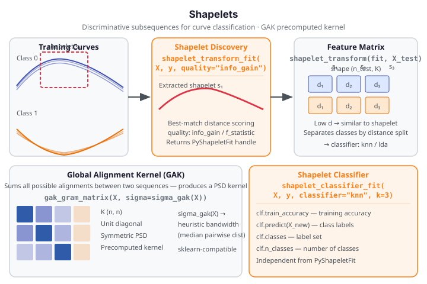

# Shapelets

A **shapelet** is a short, discriminative subsequence of a time series (or functional
observation) that best separates two or more classes by minimum-distance matching.
`fdars` discovers shapelets from labeled data and transforms curves into a feature
matrix of best-match distances — one column per shapelet — enabling off-the-shelf
classification with full interpretability. The **Global Alignment Kernel (GAK)** is
a related similarity measure based on all possible alignments between two sequences;
it produces a positive semi-definite Gram matrix usable as a precomputed kernel for
SVMs and other kernel methods.

{ .fdars-diagram }

## Shapelets

### Core Concept

Given labeled curves $\{(x_i, y_i)\}$ with $y_i \in \{0, 1, \ldots\}$, shapelet
discovery searches all candidate subsequences of all training curves and selects those
whose best-match distance to any full curve maximally discriminates classes. The quality
of each candidate is measured by **information gain** or **F-statistic** over the induced
distance split. Once $K$ shapelets $s_1, \ldots, s_K$ are discovered, any curve $x$ is
represented as:

$$
\boldsymbol{z} = \bigl(\min_{t}\|x_{t:\,t+|s_1|} - s_1\|,\;\ldots,\;\min_{t}\|x_{t:\,t+|s_K|} - s_K\|\bigr) \in \mathbb{R}^K
$$

Classification is then carried out on this distance feature matrix.

```python exec="1" source="above"
import numpy as np
from fdars.shapelet import (shapelet_transform_fit, shapelet_transform,
                             shapelet_classifier_fit)
from fdars.metric import gak_gram_matrix, sigma_gak

rng = np.random.default_rng(42)
m = 40
t = np.linspace(0, 1, m)
# Two classes: sin (label 0) and cos (label 1)
n_per_class = 8
X_train = np.vstack([
    np.array([np.sin(2*np.pi*t + rng.uniform(-0.1, 0.1)) for _ in range(n_per_class)]),
    np.array([np.cos(2*np.pi*t + rng.uniform(-0.1, 0.1)) for _ in range(n_per_class)]),
])
y_train = np.array([0]*n_per_class + [1]*n_per_class, dtype=np.int64)
X_test  = X_train[:4]   # 4 test curves (n_test != n_train)

fit    = shapelet_transform_fit(X_train, y_train, quality="info_gain")
X_feat = shapelet_transform(fit, X_test)

sig     = sigma_gak(X_train)
K_train = gak_gram_matrix(X_train, sigma=sig)

clf = shapelet_classifier_fit(X_train, y_train, quality="info_gain",
                              classifier="knn", k=3)
print(f"shapelet features shape: {X_feat.shape}")
print(f"GAK Gram shape:          {K_train.shape}")
print(f"classifier train_acc:    {clf.train_accuracy:.3f}  FDARS_FENCE_OK")
```

`shapelet_transform_fit` returns a `PyShapeletFit` opaque handle — pass it to
`shapelet_transform` to transform new data. `shapelet_classifier_fit` is an independent
fit path that takes raw data and labels and returns a `PyShapeletClassifierFit` handle
with a `.predict(data)` method. Valid quality strings: `"info_gain"`, `"f_statistic"`.
Valid classifier strings: `"knn"`, `"lda"`.

## Shapelet API Reference

### `shapelet_transform_fit` — Discover Shapelets and Build Feature Transform

```python
from fdars.shapelet import shapelet_transform_fit

fit = shapelet_transform_fit(data, labels, quality="info_gain", seed=0)
```

| Parameter | Type | Description |
|-----------|------|-------------|
| `data` | `np.ndarray` (n, m) | Training functional observations |
| `labels` | `np.ndarray` (n,) dtype int64 | Integer class labels (≥ 2 distinct values) |
| `quality` | `str` | Shapelet quality measure: `"info_gain"` or `"f_statistic"` |
| `seed` | `int` | Random seed (default: 0) |

Returns a `PyShapeletFit` opaque handle exposing `.n_shapelets` and `.n_train`.

---

### `shapelet_transform` — Transform New Data

```python
from fdars.shapelet import shapelet_transform

X_feat = shapelet_transform(fit, data)
```

| Parameter | Type | Description |
|-----------|------|-------------|
| `fit` | `PyShapeletFit` | Handle from `shapelet_transform_fit` |
| `data` | `np.ndarray` (n_test, m) | Curves to transform |

Returns a 2D array of shape `(n_test, K)` — the shapelet distance feature matrix.

---

### `shapelet_classifier_fit` — End-to-End Shapelet Classifier

```python
from fdars.shapelet import shapelet_classifier_fit

clf = shapelet_classifier_fit(data, labels, quality="info_gain",
                              classifier="knn", k=1)
```

| Parameter | Type | Description |
|-----------|------|-------------|
| `data` | `np.ndarray` (n, m) | Training functional observations |
| `labels` | `np.ndarray` (n,) dtype int64 | Integer class labels |
| `quality` | `str` | `"info_gain"` or `"f_statistic"` |
| `classifier` | `str` | Inner classifier: `"knn"` (default) or `"lda"` |
| `k` | `int` | Neighbours for kNN (default: 1) |

Returns a `PyShapeletClassifierFit` handle with `.train_accuracy`, `.predict(data)`,
`.classes`, and `.n_classes`.

---

### `discover_shapelets` — Return Shapelets as Arrays

```python
from fdars.shapelet import discover_shapelets

shapes = discover_shapelets(data, labels, n_shapelets=10, quality="info_gain")
```

Returns a list of 1D numpy arrays — the raw shapelet subsequences.

---

### `shapelet_distance` — Minimum Subsequence Distance

```python
from fdars.shapelet import shapelet_distance

d = shapelet_distance(x, y)
```

Returns the minimum-distance match between curve `x` and shapelet `y` as a scalar float.

---

## GAK — Global Alignment Kernel

!!! note "Readers from Distance Metrics"
    GAK is covered here because it is tightly coupled to shapelet-based workflows
    (both model time-series similarity via alignment). For the general distance-metric
    overview see [Distance Metrics](../represent/distance-metrics.md).

The **Global Alignment Kernel** (GAK) sums the contributions of all possible alignments
between two sequences, yielding a positive semi-definite kernel. For sequences $x$ and
$y$ with bandwidth $\sigma$:

$$
\text{GAK}(x, y) = \sum_{\pi \in \mathcal{A}} \exp\!\left(-\frac{\|\pi(x) - y\|^2}{2\sigma^2}\right)
$$

The resulting Gram matrix $K_{ij} = \text{GAK}(x_i, x_j)$ has unit diagonal (a curve is
maximally similar to itself) and is directly usable as a precomputed kernel with
`sklearn.svm.SVC(kernel="precomputed")`.

### GAK API Reference

```python
from fdars.metric import gak, sigma_gak, gak_gram_matrix, gak_gram_train, gak_gram_predict
```

| Function | Signature | Returns |
|----------|-----------|---------|
| `sigma_gak(data)` | `data` (n, m) | `float` — heuristic bandwidth (median pairwise distance) |
| `gak(x, y, sigma)` | two 1D arrays + float | `float` — single kernel value |
| `gak_gram_matrix(data, sigma=None)` | (n, m) + optional float | (n, n) symmetric PSD Gram matrix |
| `gak_gram_train(data, sigma=None)` | (n, m) + optional float | `PyGakGramTrain` opaque handle |
| `gak_gram_predict(train_handle, new_data)` | handle + (n_test, m) | (n_test, n_train) Gram matrix |

Pass `sigma=None` to any function to use the automatic `sigma_gak` heuristic.

## References

- Ye, L. and Keogh, E. (2009). Time series shapelets: a new primitive for data mining.
  *Proceedings of the 15th ACM SIGKDD*, 947–956.
- Cuturi, M. (2011). Fast global alignment kernels. *Proceedings of ICML*, 929–936.
- Lines, J., Davis, L. M., Hills, J. and Bagnall, A. (2012). A shapelet transform for time
  series classification. *Proceedings of the 18th ACM SIGKDD*, 289–297.
