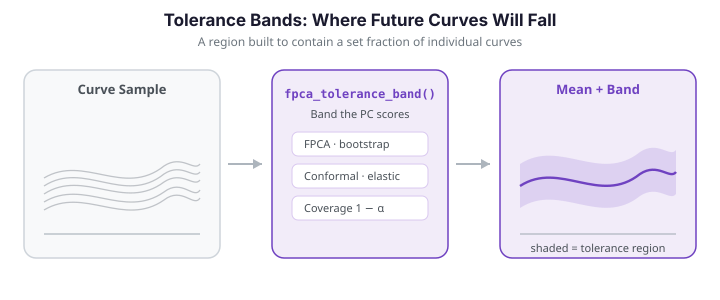

# Tolerance Bands

A **tolerance band** for functional data is a region expected to contain a given
fraction of *individual* curves in the population -- the functional analogue of a
classical tolerance interval. It answers the question *"if I observe one more curve,
where will it likely fall?"*

This is a different question from the one a **confidence band** answers. A confidence
band targets the uncertainty in the *mean* function $\mu(t)$; a tolerance band targets
the *spread* of individual curves. Because individual-curve variability always exceeds
mean-estimation uncertainty, tolerance bands are wider than confidence bands -- and,
crucially, they do **not** shrink as the sample size grows.

`fdars` provides four tolerance-band constructions plus one simultaneous confidence
band for the mean:

| Construction | Function | Idea |
|---|---|---|
| FPCA bootstrap | `fpca_tolerance_band` | Bootstrap the principal-component scores |
| Conformal | `conformal_prediction_band` | Distribution-free calibration split |
| Exponential family | `exponential_family_tolerance_band` | Transform to a natural-parameter scale |
| Elastic | `elastic_tolerance_band` | Align away phase, then band the amplitude |
| SCB (Degras) *(mean)* | `scb_mean_degras` | Multiplier bootstrap for $\mu(t)$ |

---

{ .fdars-diagram }

## How it works (intuition)

Imagine a stack of daily temperature curves, one per year. A tolerance band should be
wide enough that roughly 95% of *future* years' curves fall inside it.

- **FPCA** decomposes each curve into a mean shape plus a few dominant modes of variation
  (principal components), then *resamples the scores* on those modes to estimate where
  new curves might land.
- **Conformal** is distribution-free: it holds out some curves, measures how far they
  deviate from the rest, and uses those deviations directly to set the band width.
- **Elastic** first aligns the curves to remove *timing* differences (phase variability),
  then builds the band on the aligned data. The result is tighter, because alignment
  concentrates variation into the amplitude component.
- **Exponential family** handles non-Gaussian data (counts, proportions) by transforming
  to the natural-parameter scale, building the band there, and transforming back so the
  band respects constraints such as non-negativity.
- **SCB (Degras)** is different in kind: it is a confidence band for the mean $\mu(t)$,
  answering *"where does the true population mean lie?"* rather than *"where will the next
  curve fall?"*

---

## Mathematical framework

Let $X_1, \dots, X_n$ be i.i.d. random functions on a grid $t_1, \dots, t_m \in [a, b]$,
with mean $\mu(t) = \mathbb{E}[X(t)]$ and covariance $C(s, t) = \operatorname{Cov}(X(s), X(t))$.
A $(1-\alpha)$-**tolerance band** is a region $[\ell(t), u(t)]$ with

$$
\mathbb{P}\big(X_{\text{new}}(t) \in [\ell(t), u(t)] \ \text{for all } t\big) \ge 1 - \alpha .
$$

**FPCA method** (Rathnayake & Cuevas, 2016). Using the Karhunen--Loève expansion

$$
X_i(t) = \mu(t) + \sum_{k=1}^{K} \xi_{ik}\, \phi_k(t),
\qquad \operatorname{Var}(\xi_{ik}) = \lambda_k,
$$

we estimate $\hat\mu$, the eigenfunctions $\hat\phi_k$, and the scores $\hat\xi_{ik}$;
resample the scores; reconstruct bootstrap curves; and read off pointwise quantiles (a
*pointwise* band) or a single scaling $c$ with $\hat\mu(t) \pm c\,\hat\sigma(t)$ chosen so
that $\ge 1-\alpha$ of the bootstrap curves lie entirely inside (a *simultaneous* band).

**Conformal method** (Lei & Wasserman, 2014). Split into training and calibration sets.
Fit $\hat\mu$ on training; for each calibration curve compute a non-conformity score
$R_j = \sup_t |X_j(t) - \hat\mu(t)|$; take $\hat q$ as the
$\lceil (1-\alpha)(n_{\text{cal}}+1)\rceil / n_{\text{cal}}$ quantile; the band is
$\hat\mu(t) \pm \hat q$. This gives $\mathbb{P}(R_{\text{new}} \le \hat q) \ge 1-\alpha$
with *no* distributional assumptions.

**SCB Degras** (Degras, 2011). A simultaneous confidence band for the mean via a Gaussian
multiplier bootstrap: draw $W_i^* \sim N(0,1)$, form
$G^*(t) = \tfrac{1}{\sqrt n\,\hat\sigma(t)} \sum_i W_i^* (X_i(t) - \bar X_n(t))$, take
$c_\alpha$ as the $(1-\alpha)$ quantile of $\sup_t |G^*(t)|$, and report
$\bar X_n(t) \pm c_\alpha\,\hat\sigma(t)/\sqrt n$. The band width is $O(1/\sqrt n)$ -- it
shrinks with $n$, whereas tolerance bands do not.

---

## Sample data

We simulate a small Gaussian functional sample. The same data feed every construction so
the widths are directly comparable.

```python exec="1" html="1" source="above"
import numpy as np
from docs_fig import fig, render
from fdars.simulation import simulate

t = np.linspace(0, 1, 80)
X = np.asarray(simulate(60, t, n_basis=5, seed=1))

f, ax = fig()
ax.plot(t, X.T, color="#6c757d", lw=0.6, alpha=0.5)
ax.plot(t, X.mean(0), color="#e8710a", lw=2.2, label="sample mean")
ax.set(title="Simulated functional sample (60 curves)", xlabel="t", ylabel="X(t)")
ax.legend()
print(render(f))
```

---

## FPCA bootstrap band

The workhorse construction: resample the FPC scores to generate bootstrap replicates and
read off a simultaneous band.

```python
import numpy as np
from fdars import Fdata
from fdars.simulation import simulate
from fdars.tolerance import fpca_tolerance_band

argvals = np.linspace(0, 1, 80)
fd = Fdata(simulate(60, argvals, n_basis=5, seed=1), argvals=argvals)

band = fpca_tolerance_band(fd.data, ncomp=3, nb=1000, coverage=0.95, seed=42)
```

```python exec="1" html="1" source="above"
import numpy as np
from docs_fig import fig, render
from fdars.simulation import simulate
from fdars.tolerance import fpca_tolerance_band

t = np.linspace(0, 1, 80)
X = np.asarray(simulate(60, t, n_basis=5, seed=1))
band = fpca_tolerance_band(X, ncomp=3, nb=600, coverage=0.95, seed=42)
lower, upper, center = (np.asarray(band[k]) for k in ("lower", "upper", "center"))

f, ax = fig()
ax.plot(t, X.T, color="#6c757d", lw=0.6, alpha=0.4)
ax.fill_between(t, lower, upper, color="#3f51b5", alpha=0.18,
                label="95% tolerance band")
ax.plot(t, center, color="#e8710a", lw=2.2, label="center (mean)")
ax.set(title=f"FPCA bootstrap tolerance band "
             f"(mean half-width {np.asarray(band['half_width']).mean():.3f})",
       xlabel="t", ylabel="X(t)")
ax.legend()
print(render(f))
```

**Parameters**

| Parameter | Type | Default | Description |
|---|---|---|---|
| `data` | `ndarray (n, m)` | -- | Observed functional data |
| `ncomp` | `int` | `3` | Number of FPC components to retain |
| `nb` | `int` | `1000` | Number of bootstrap replicates |
| `coverage` | `float` | `0.95` | Desired coverage probability |
| `seed` | `int` | `42` | Random seed |

**Returns** a dictionary with keys `upper`, `lower`, `center` (each shape `(m,)`) and
`half_width` (the half-width $u(t)-\text{center}$ at each grid point).

---

## Conformal prediction band

A distribution-free alternative that splits the data into a training set and a
calibration set, then uses the sup-norm calibration residuals to set the band width.

```python
from fdars.tolerance import conformal_prediction_band

band_cp = conformal_prediction_band(fd.data, coverage=0.95, cal_fraction=0.25, seed=42)
```

**Parameters**

| Parameter | Type | Default | Description |
|---|---|---|---|
| `data` | `ndarray (n, m)` | -- | Observed functional data |
| `coverage` | `float` | `0.95` | Target coverage |
| `cal_fraction` | `float` | `0.25` | Fraction of data reserved for calibration |
| `seed` | `int` | `42` | Random seed |

**Returns** a dictionary with the same keys as the FPCA band.

!!! note "When to prefer conformal bands"
    Conformal bands make no distributional assumptions. They are especially useful when
    the underlying process is non-Gaussian or when the sample is small enough that the
    FPCA bootstrap may be unreliable. The sup-norm score yields a constant-width band
    ($\hat\mu(t) \pm \hat q$), which appears as a band of uniform vertical thickness.

### Validation: empirical coverage ≈ nominal

The defining property of a $(1-\alpha)$ band is that it *actually* contains the target
fraction of new curves. We check it by Monte Carlo: fit the conformal band on one sample,
then draw many independent fresh curves from the same generating process and count how many
fall entirely inside the band. Distribution-free split-conformal calibration guarantees
$\mathbb{P}(X_{\text{new}} \in \text{band}) \ge 1-\alpha$, so the empirical coverage of a
95% band should land near 0.95 (a touch conservative), *not* far below it.

```python exec="1" html="1" source="above"
import numpy as np
from docs_fig import fig, render
from fdars.simulation import simulate
from fdars.tolerance import conformal_prediction_band

t = np.linspace(0, 1, 60)
coverage = 0.95

# Fit the band once on a training sample.
X_fit = np.asarray(simulate(200, t, n_basis=5, seed=0))
band = conformal_prediction_band(X_fit, coverage=coverage, cal_fraction=0.3, seed=0)
lower, upper = np.asarray(band["lower"]), np.asarray(band["upper"])

# Draw many FRESH curves from the same process and measure how many land inside.
inside = []
for rep in range(400):
    x_new = np.asarray(simulate(1, t, n_basis=5, seed=1000 + rep))[0]
    inside.append(bool(np.all((x_new >= lower) & (x_new <= upper))))
emp = float(np.mean(inside))

# Ground-truth property: split-conformal is (1-alpha)-valid, so coverage >= nominal
# up to finite-sample Monte-Carlo error. Assert it is not far below nominal.
assert emp >= coverage - 0.05, f"under-coverage: {emp:.3f} < {coverage}"
print(f"nominal coverage = {coverage:.2f}   empirical coverage = {emp:.3f}  (n=400 fresh curves)")

f, ax = fig(figsize=(7, 3.6))
ax.plot(t, X_fit[:40].T, color="#6c757d", lw=0.5, alpha=0.3)
ax.fill_between(t, lower, upper, color="#3f51b5", alpha=0.18,
                label=f"95% conformal band (empirical {emp:.2f})")
ax.plot(t, np.asarray(band["center"]), color="#e8710a", lw=2.0, label="center")
ax.set(title=f"Conformal band achieves its nominal coverage "
             f"(empirical = {emp:.3f})", xlabel="t", ylabel="X(t)")
ax.legend()
print(render(f))
```

The empirical coverage sits at (or just above) the nominal 0.95, confirming the band is
valid rather than merely plausible-looking -- exactly the finite-sample guarantee split
conformal provides.

---

## Mean confidence band (SCB Degras)

Constructs a simultaneous confidence band for the **mean function** using the Gaussian
multiplier bootstrap of Degras (2011). Note this is a *confidence* band, not a tolerance
band -- it is much narrower.

```python
from fdars.tolerance import scb_mean_degras

band_scb = scb_mean_degras(fd.data, fd.argvals, bandwidth=0.1, nb=1000, confidence=0.95)
```

**Parameters**

| Parameter | Type | Default | Description |
|---|---|---|---|
| `data` | `ndarray (n, m)` | -- | Observed data |
| `argvals` | `ndarray (m,)` | -- | Evaluation grid |
| `bandwidth` | `float` | `0.0` | Smoothing bandwidth (`0.0` = automatic selection) |
| `nb` | `int` | `1000` | Number of multiplier-bootstrap samples |
| `confidence` | `float` | `0.95` | Confidence level |

**Returns** the same dictionary structure (`upper`, `lower`, `center`, `half_width`).

!!! warning "Bandwidth must be positive (or use auto)"
    Pass `bandwidth=0.0` to let the routine choose the smoothing bandwidth automatically,
    or supply a small positive value (e.g. `0.1`). A literal zero passed to the smoother
    is treated as the auto path -- do not pass a tiny value that under-smooths.

The three families answer different questions: the tolerance bands are wide enough to
contain individual future curves, while the Degras SCB is a much narrower band around the
*mean function* only. The figure below places the FPCA tolerance band, the conformal
band, and the Degras SCB side by side on the same data.

```python exec="1" html="1" source="above"
import numpy as np
from docs_fig import fig, render
from fdars.simulation import simulate
from fdars.tolerance import (
    fpca_tolerance_band, conformal_prediction_band, scb_mean_degras)

t = np.linspace(0, 1, 80)
X = np.asarray(simulate(60, t, n_basis=5, seed=7))
bands = [
    ("FPCA tolerance", fpca_tolerance_band(X, ncomp=3, nb=600, coverage=0.95, seed=1)),
    ("Conformal (sup-norm)", conformal_prediction_band(X, coverage=0.95,
                                                       cal_fraction=0.25, seed=1)),
    ("Degras SCB (mean)", scb_mean_degras(X, t, bandwidth=0.1, nb=600, confidence=0.95)),
]

f, axes = fig(1, 3, figsize=(11.5, 3.4), sharey=True)
for ax, (name, b) in zip(axes, bands):
    lower, upper, center = (np.asarray(b[k]) for k in ("lower", "upper", "center"))
    hw = np.asarray(b["half_width"]).mean()
    ax.plot(t, X.T, color="#6c757d", lw=0.5, alpha=0.35)
    ax.fill_between(t, lower, upper, color="#3f51b5", alpha=0.2)
    ax.plot(t, center, color="#e8710a", lw=1.8)
    ax.set(title=f"{name}\nmean half-width {hw:.3f}", xlabel="t")
axes[0].set_ylabel("X(t)")
print(render(f))
```

The Degras SCB is visibly the narrowest: its width scales as $O(1/\sqrt n)$ and would
keep shrinking with more data, whereas the two tolerance bands stay wide because they
track a fixed population property (individual-curve spread).

---

## Exponential family band

For non-Gaussian functional data (counts, proportions), the band is built on a
transformed *natural-parameter* scale and mapped back, so it respects the data's
constraints. With `family="gaussian"` (identity link) it coincides with the FPCA band; it
is included here for API completeness and as a baseline.

```python
from fdars.tolerance import exponential_family_tolerance_band

band_exp = exponential_family_tolerance_band(
    fd.data, family="gaussian", ncomp=3, nb=200, coverage=0.95, seed=42)
```

**Parameters**

| Parameter | Type | Default | Description |
|---|---|---|---|
| `data` | `ndarray (n, m)` | -- | Observed data |
| `family` | `str` | `"gaussian"` | Exponential-family link (`"gaussian"`, `"poisson"`, ...) |
| `ncomp` | `int` | `3` | FPC components on the transformed scale |
| `nb` | `int` | `200` | Bootstrap replicates |
| `coverage` | `float` | `0.95` | Target coverage |
| `seed` | `int` | `42` | Random seed |

**Returns** the standard band dictionary.

---

## Elastic (alignment-based) band

When curves differ in *timing* (phase), a plain FPCA band is inflated because it treats a
horizontal shift as vertical spread. The elastic band first computes the Karcher mean and
warping functions in the Fisher--Rao (elastic) framework, aligns the curves, and builds
the FPCA band on the aligned amplitudes. The result is tighter because the phase
variability has been factored out.

We demonstrate on a phase-shifted sine sample, and compare against the plain FPCA band on
the same data.

```python exec="1" html="1" source="above"
import numpy as np
from docs_fig import fig, render
from fdars.tolerance import elastic_tolerance_band, fpca_tolerance_band

rng = np.random.default_rng(42)
t = np.linspace(0, 1, 50)
n = 40
X = np.empty((n, t.size))
for i in range(n):
    shift = rng.uniform(-0.05, 0.05)
    X[i] = (np.sin(2 * np.pi * (t - shift))
            + rng.normal(0, 0.2) + rng.normal(0, 0.05, t.size))

band_el = elastic_tolerance_band(X, t, ncomp=3, nb=200, coverage=0.95,
                                 band_type="simultaneous", max_iter=10, seed=42)
band_fp = fpca_tolerance_band(X, ncomp=3, nb=200, coverage=0.95, seed=42)

hw_el = np.asarray(band_el["half_width"]).mean()
hw_fp = np.asarray(band_fp["half_width"]).mean()

f, (a1, a2) = fig(1, 2, figsize=(11, 3.6), sharey=True)
for ax, band, title, hw in [
    (a1, band_fp, "FPCA (phase treated as amplitude)", hw_fp),
    (a2, band_el, "Elastic (phase removed first)", hw_el),
]:
    lo, up, ce = (np.asarray(band[k]) for k in ("lower", "upper", "center"))
    ax.plot(t, X.T, color="#6c757d", lw=0.5, alpha=0.35)
    ax.fill_between(t, lo, up, color="#3f51b5", alpha=0.2)
    ax.plot(t, ce, color="#e8710a", lw=1.8)
    ax.set(title=f"{title}\nmean half-width {hw:.3f}", xlabel="t")
a1.set_ylabel("X(t)")
print(render(f))
```

On this phase-shifted data the elastic band is narrower than the plain FPCA band, because
alignment concentrates variation into the amplitude dimension rather than inflating the
pointwise variance.

**Parameters** (`elastic_tolerance_band`)

| Parameter | Type | Default | Description |
|---|---|---|---|
| `data` | `ndarray (n, m)` | -- | Observed data |
| `argvals` | `ndarray (m,)` | -- | Evaluation grid |
| `ncomp` | `int` | `3` | FPC components on aligned data |
| `nb` | `int` | `200` | Bootstrap replicates |
| `coverage` | `float` | `0.95` | Target coverage |
| `band_type` | `str` | `"simultaneous"` | `"pointwise"` or `"simultaneous"` |
| `max_iter` | `int` | `20` | Karcher-mean / alignment iterations |
| `seed` | `int` | `42` | Random seed |

---

## Phase tolerance bands

The `phase_tolerance_band` construction quantifies the *timing* variation directly, in
terms of the warping functions $\gamma$: how far ahead or behind a future curve's clock
may run relative to the aligned template. It returns a band on the warping functions
(`gamma_lower`, `gamma_center`, `gamma_upper`) rather than on the amplitude.

```python exec="1" html="1" source="above"
import numpy as np
from docs_fig import fig, render
from fdars.tolerance import phase_tolerance_band

rng = np.random.default_rng(42)
t = np.linspace(0, 1, 50)
n = 40
X = np.empty((n, t.size))
for i in range(n):
    shift = rng.uniform(-0.08, 0.08)
    X[i] = np.sin(2 * np.pi * (t - shift)) + rng.normal(0, 0.05, t.size)

pb = phase_tolerance_band(X, t, ncomp=3, nb=200, coverage=0.95, seed=42)
lo, ce, up = (np.asarray(pb[k]) for k in ("gamma_lower", "gamma_center", "gamma_upper"))

f, ax = fig()
ax.plot(t, t, color="#6c757d", lw=1.0, ls="--", label="identity (no warp)")
ax.fill_between(t, lo, up, color="#198754", alpha=0.2, label="95% phase band")
ax.plot(t, ce, color="#198754", lw=2.0, label="center warp")
ax.set(title="Phase tolerance band (on warping functions γ)",
       xlabel="t", ylabel="γ(t)")
ax.legend()
print(render(f))
```

A phase band that hugs the identity diagonal means little expected timing variation; a
wider band means future curves may be substantially advanced or delayed.

---

## Joint amplitude + phase band

`elastic_tolerance_band_with_config` returns *both* an amplitude band and a phase band in
one call, so shape deviations and timing deviations can be bounded separately. The result
is a dictionary with `amplitude` and `phase` sub-dictionaries.

```python
from fdars.tolerance import elastic_tolerance_band_with_config

band_joint = elastic_tolerance_band_with_config(
    X, t, ncomp_amplitude=3, ncomp_phase=3, nb=200, coverage=0.95, seed=42)

amp = band_joint["amplitude"]   # keys: lower, center, upper, half_width
pha = band_joint["phase"]       # keys: gamma_lower, gamma_center, gamma_upper
```

Use the amplitude band to bound shape deviations and the phase band to bound timing
deviations -- a decomposition that a single amplitude-only band cannot provide.

---

## Choosing a method

| Your goal | Recommended construction |
|---|---|
| General-purpose tolerance band | `fpca_tolerance_band` |
| No distributional assumptions | `conformal_prediction_band` |
| Data with timing differences | `elastic_tolerance_band` |
| Bound timing variation only | `phase_tolerance_band` |
| Separate amplitude + phase bounds | `elastic_tolerance_band_with_config` |
| Count or proportion functional data | `exponential_family_tolerance_band` |
| Confidence band for the **mean** | `scb_mean_degras` |

!!! info "Tolerance band vs. confidence band"
    A **tolerance band** targets individual future curves (analogous to a prediction
    interval) and does not shrink with sample size. A **confidence band** targets the mean
    function (analogous to a confidence interval) and shrinks as $O(1/\sqrt n)$. Use a
    tolerance construction for the former and `scb_mean_degras` for the latter.

## See also

- [Equivalence testing](equivalence-testing.md) -- test whether two mean functions differ
  by no more than a margin, using functional TOST.
- [Covariance functions](covariance-functions.md) -- the covariance $C(s,t)$ underlying
  the FPCA construction.

## References

- Rathnayake, L. N. & Cuevas, E. (2016). Tolerance bands for functional data.
- Lei, J. & Wasserman, L. (2014). Distribution-free prediction bands for non-parametric
  regression. *JRSS-B*.
- Degras, D. (2011). Simultaneous confidence bands for nonparametric regression with
  functional data. *Statistica Sinica*.
