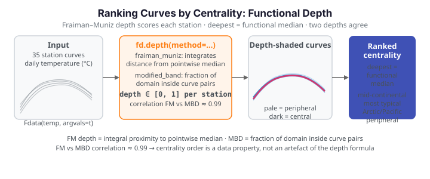

# Ranking curves by centrality with functional depth

**The problem.** Given a sample of curves, which ones are *typical* and which are
*atypical*? For scalars we would reach for the median and the quartiles, but a curve
has no natural ordering — you cannot sort 35 temperature trajectories from "smallest"
to "largest". **Functional depth** supplies the missing order: it scores each curve by
how central it sits within the sample, so the deepest curve is a functional median and
the shallowest curves are candidate outliers.

This page ranks the daily temperature curves of 35 Canadian weather stations by depth,
reads off the most and least typical climates, and shows that two different depth
notions produce essentially the same ordering.

{ .fdars-diagram }

## The data

Each station contributes one curve: daily temperature across the year. Plotted together
they form a band a few degrees wide in summer that fans out over the cold months.

```python exec="1" html="1" source="above"
import numpy as np
from docs_fig import fig, render
from docs_data import load_canadian_weather

t, temp, meta = load_canadian_weather()   # t: (365,), temp: (35, 365)

f, ax = fig()
ax.plot(t, temp.T, color="#6c757d", lw=0.8, alpha=0.4)
ax.set(title="Daily temperature — 35 Canadian weather stations",
       xlabel="day of year", ylabel="temperature (°C)")
print(render(f))
```

The winter spread is what makes a single "average curve" unsatisfying: a pointwise mean
runs through the middle of the band but corresponds to no real station, and it says
nothing about which stations are representative of the group.

## Ranking by depth

Wrap the curves in an [`Fdata`](../learn/introduction.md) object and call `depth()`. The
default **Fraiman–Muniz** depth integrates, at every day of the year, how far each curve
sits from the pointwise median; a curve that stays near the centre all year scores high.

```python exec="1" html="1" source="above"
import numpy as np
from matplotlib import cm
from docs_fig import fig, render
from docs_data import load_canadian_weather
from fdars import Fdata

t, temp, meta = load_canadian_weather()
fd = Fdata(temp, argvals=t)
depth = fd.depth(method="fraiman_muniz")        # (35,) in [0, 1]

# shade each curve by its depth: pale = peripheral, dark = central
norm = (depth - depth.min()) / (depth.max() - depth.min())
f, ax = fig()
for i in np.argsort(depth):                      # draw shallow first, deep on top
    ax.plot(t, temp[i], color=cm.Blues(0.25 + 0.75 * norm[i]), lw=1.0)
deepest = int(np.argmax(depth))
ax.plot(t, temp[deepest], color="#d6336c", lw=2.5, label="deepest (functional median)")
ax.set(title="Temperature curves shaded by Fraiman–Muniz depth",
       xlabel="day of year", ylabel="temperature (°C)")
ax.legend()
print(render(f))
```

The dark curves cluster in the centre of the band; the pale ones are the extreme
climates that ride its upper and lower edges. The highlighted red curve is the deepest
station — the closest thing the sample has to a **median climate**, and unlike the
pointwise mean it is an actual observed station.

## The most and least typical climates

Sorting by depth turns the picture into a ranked list. The central stations are
mid-continental; the peripheral ones are the maritime and far-north extremes.

```python exec="1" source="above"
import numpy as np
from docs_data import load_canadian_weather
from fdars import Fdata

t, temp, meta = load_canadian_weather()
depth = Fdata(temp, argvals=t).depth(method="fraiman_muniz")
order = np.argsort(depth)[::-1]                  # deepest first

print("Most central (typical climate):")
for i in order[:3]:
    r = meta.iloc[i]
    print(f"  {r['station']:<15} {r['province']:<8} {r['region']:<12} depth={depth[i]:.3f}")

print("\nMost peripheral (atypical climate):")
for i in order[-3:][::-1]:
    r = meta.iloc[i]
    print(f"  {r['station']:<15} {r['province']:<8} {r['region']:<12} depth={depth[i]:.3f}")
```

The interpretation is geographic: a deep curve belongs to a station whose seasonal cycle
is representative of the country as a whole, while a shallow curve flags a station whose
climate is unusual — exactly the ranking you would want before fitting a model that
assumes the sample is homogeneous.

## Different depth notions, same ordering

"Depth" is not a single formula. **Modified band depth (MBD)** scores a curve by the
fraction of the domain on which it lies inside the band traced by pairs of other curves —
a completely different construction from Fraiman–Muniz. Reassuringly, on this sample the
two rankings agree almost perfectly, so the centrality ordering is a property of the data
rather than an artefact of one particular depth.

```python exec="1" html="1" source="above"
import numpy as np
from docs_fig import fig, render
from docs_data import load_canadian_weather
from fdars import Fdata

t, temp, meta = load_canadian_weather()
fd = Fdata(temp, argvals=t)
fm  = fd.depth(method="fraiman_muniz")
mbd = fd.depth(method="modified_band")
rho = np.corrcoef(fm, mbd)[0, 1]

f, ax = fig()
ax.scatter(fm, mbd, color="#3f51b5", s=30)
ax.set(title=f"Two depth notions agree (correlation = {rho:.2f})",
       xlabel="Fraiman–Muniz depth", ylabel="Modified band depth")
print(render(f))
```

When two independent depths disagree it is usually a sign of multimodality — several
distinct groups of curves, each central to its own cluster. Here the tight diagonal says
the stations form one coherent population with a clear centre-to-edge gradient.

## Parameters

| Argument | Default | Meaning |
|---|---|---|
| `method` | `"fraiman_muniz"` | Depth definition — also `"modified_band"`, `"band"`, `"modal"`, `"random_projection"`, `"random_tukey"`, and more |
| `ref` | `None` | Optional reference `Fdata` to measure depth *against* (e.g. score new curves relative to a training sample); defaults to the sample itself |

## See also

- [Functional depth — concept diagram](../represent/depth-functions.md) — the depth toolkit and what each method category captures
- [Outlier detection](andrews-wine.md) — depth's shallow tail drives outlier flags
- [Distance metrics](../represent/distance-metrics.md) — the geometry underneath band-based depths

## References

- Fraiman, R. & Muniz, G. (2001). *Trimmed means for functional data.* Test, 10(2), 419–440.
- López-Pintado, S. & Romo, J. (2009). *On the concept of depth for functional data.* JASA, 104(486), 718–734.
