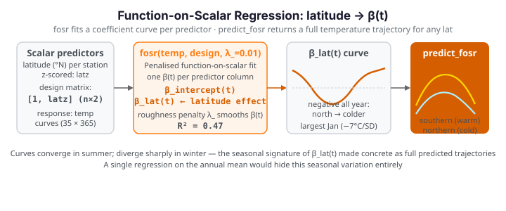

# Function-on-scalar regression

**The problem.** [Scalar-on-function regression](tecator-regression.md) predicts a *number*
from a *curve*. Function-on-scalar regression runs the other way: the response is a whole
**curve** and the predictors are ordinary scalars. The question here is geographic — how
does a Canadian station's entire annual temperature curve depend on its **latitude**? The
answer is not one number but a **coefficient function** $\beta(t)$: the effect of latitude
at every day of the year.

{ .fdars-diagram }

## The data

35 temperature curves, coloured by station latitude. Northern stations are colder — but
the gap is not constant across the year, which is exactly what the model will quantify.

```python exec="1" html="1" source="above"
import numpy as np
from matplotlib import cm
from docs_fig import fig, render
from docs_data import load_canadian_weather

t, temp, meta = load_canadian_weather()
lat = meta["lat"].to_numpy().astype(float)

f, ax = fig()
norm = (lat - lat.min()) / (lat.max() - lat.min())
for i in np.argsort(lat):
    ax.plot(t, temp[i], color=cm.coolwarm(1 - norm[i]), lw=0.9)
ax.set(title="Temperature curves coloured by latitude (blue = far north)",
       xlabel="day of year", ylabel="temperature (°C)")
print(render(f))
```

The northern (blue) curves plunge in winter but rejoin the pack in summer — a hint that
latitude's effect is seasonal.

## The coefficient function β(t)

`fosr` regresses the response curves on a design matrix (here an intercept plus
standardised latitude) and returns a coefficient function per predictor. A small
roughness penalty `lambda_` keeps the estimate stable.

```python exec="1" html="1" source="above"
import numpy as np
from docs_fig import fig, render
from docs_data import load_canadian_weather
from fdars.regression import fosr

t, temp, meta = load_canadian_weather()
lat = meta["lat"].to_numpy().astype(float)
latz = (lat - lat.mean()) / lat.std()
design = np.column_stack([np.ones_like(latz), latz])   # intercept + latitude

fit = fosr(temp, design, lambda_=0.01)
beta_lat = np.asarray(fit["beta"])[1]                  # latitude coefficient function
r2 = float(np.asarray(fit["r_squared"]))

f, ax = fig()
ax.axhline(0, color="#adb5bd", lw=1)
ax.plot(t, beta_lat, color="#D55E00", lw=2.5)
ax.fill_between(t, beta_lat, 0, color="#D55E00", alpha=0.12)
ax.set(title=f"Effect of latitude on temperature (R² = {r2:.2f})",
       xlabel="day of year", ylabel="°C per SD of latitude")
print(render(f))
```

The coefficient function is negative all year — more northerly stations are colder — but
it dives in the winter months and flattens in summer. Numerically, a one-standard-deviation
step north costs about **7 °C in January but under 3 °C in July**: latitude governs winter
severity far more than summer warmth. A single scalar regression on, say, the annual mean
would have hidden this entirely.

## Predicting a whole curve

Because the fit is functional, prediction returns curves. `predict_fosr` takes new scalar
predictors and reconstructs the expected temperature trajectory — here for a southern and
a northern station.

```python exec="1" html="1" source="above"
import numpy as np
from docs_fig import fig, render
from docs_data import load_canadian_weather
from fdars.regression import fosr, predict_fosr

t, temp, meta = load_canadian_weather()
lat = meta["lat"].to_numpy().astype(float)
latz = (lat - lat.mean()) / lat.std()
design = np.column_stack([np.ones_like(latz), latz])

new = np.array([[1.0, -1.5],    # southern (low latitude)
                [1.0,  1.5]])   # northern (high latitude)
pred = np.asarray(predict_fosr(temp, design, new, lambda_=0.01))

f, ax = fig()
ax.plot(t, temp.T, color="#dee2e6", lw=0.7, alpha=0.6)
ax.plot(t, pred[0], color="#B37700", lw=2.5, label="southern (−1.5 SD lat)")
ax.plot(t, pred[1], color="#2C5F8A", lw=2.5, label="northern (+1.5 SD lat)")
ax.set(title="Predicted annual temperature curves by latitude",
       xlabel="day of year", ylabel="temperature (°C)")
ax.legend()
print(render(f))
```

The two predicted curves converge in summer and diverge sharply in winter — the seasonal
signature of the coefficient function, made concrete as two curves you could overlay on a
new station's data.

## Parameters

| Argument | Default | Meaning |
|---|---|---|
| `response` | — | The `(n, m)` matrix of response curves |
| `predictors` | — | The `(n, p)` scalar design matrix (include an intercept column) |
| `lambda_` | `0.0` | Roughness penalty on the coefficient functions; a small positive value stabilises the fit |

## See also

- [Function-on-scalar — concept diagram](../regression/function-on-scalar.md) — the method at a glance
- [Scalar-on-function regression](tecator-regression.md) — the transpose problem (curve → scalar)
- [Seasonal analysis](../analyze/seasonal-analysis.md) — other ways to model annual structure

## References

- Ramsay, J. O. & Silverman, B. W. (2005). *Functional Data Analysis* (2nd ed.), ch. 13. Springer.
- Reiss, P. T., Huang, L. & Mennes, M. (2010). *Fast function-on-scalar regression with penalized basis expansions.* Int. J. Biostatistics, 6(1).
