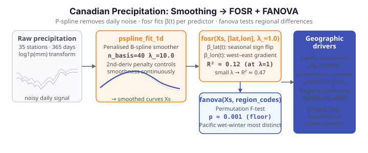

# Canadian Precipitation: Geographic Effects on Rainfall Profiles

**Dataset:** Canadian Weather — daily precipitation (mm) over a 365-day year for
35 weather stations, each tagged with its climatic region (Arctic, Atlantic,
Continental, Pacific) and its geographic coordinates (latitude, longitude).

Precipitation across Canada varies dramatically with *place*. Pacific stations
receive heavy winter rain from moisture-laden air masses off the ocean,
Continental stations see summer-dominated convective rainfall, and Arctic
stations remain dry year-round because cold air holds little moisture. Each
station is a precipitation **curve**, and the question is how **geography shapes
its shape**. We use `fdars` to smooth the noisy daily curves, then fit
**function-on-scalar regression** (FOSR) on latitude and longitude and a
**functional ANOVA** on region to quantify how geography drives the whole annual
profile.

{ .fdars-diagram }

## The data

Raw daily precipitation (mm/day) has many near-zero days and a long right tail,
so a `log1p` transform stabilises the variance and handles the zeros gracefully.
We work on `log1p(precip)` throughout, exactly as the R reference does. The four
regions are unbalanced — Atlantic (15) and Continental (12) dominate, with only
5 Pacific and 3 Arctic stations.

```python exec="1" html="1" source="above"
import numpy as np
from docs_fig import fig, render
from docs_data import load_canadian_weather

day, X, meta = load_canadian_weather("precipitation")
X = np.log1p(X)                                   # stabilise variance, handle zeros
region = meta["region"].to_numpy()
colors = {"Arctic": "#0dcaf0", "Atlantic": "#e8710a",
          "Continental": "#198754", "Pacific": "#6f42c1"}

f, ax = fig()
for r, c in colors.items():
    ax.plot(day, X[region == r].T, color=c, lw=0.5, alpha=0.5)
for r, c in colors.items():
    n = int((region == r).sum())
    ax.plot([], [], color=c, label=f"{r} ({n})")
ax.set(title="Daily precipitation profiles, 35 Canadian stations",
       xlabel="day of year", ylabel="log1p(precipitation, mm)")
ax.set_xticks([1, 91, 182, 274]); ax.set_xticklabels(["Jan", "Apr", "Jul", "Oct"])
ax.legend(ncol=2)
print(render(f))
```

Several patterns emerge at once. Pacific stations sit high in winter and drop in
summer, Continental stations peak in mid-summer, Arctic stations hug the bottom
all year, and Atlantic stations are intermediate and comparatively uniform. The
shapes differ, not just the averages — exactly what functional methods exploit.

## Regional patterns

Averaging within each region isolates the between-group contrast from the
station-to-station scatter. The regional mean curve (dark) rides through its
band of member stations (light).

```python exec="1" html="1" source="above"
import numpy as np
from docs_fig import fig, render, plt
from docs_data import load_canadian_weather

day, X, meta = load_canadian_weather("precipitation")
X = np.log1p(X)
region = meta["region"].to_numpy()
regions = ["Arctic", "Atlantic", "Continental", "Pacific"]
colors = ["#0dcaf0", "#e8710a", "#198754", "#6f42c1"]

f, axes = plt.subplots(2, 2, figsize=(8.4, 5.4), sharex=True, sharey=True)
for ax, r, c in zip(axes.ravel(), regions, colors):
    m = region == r
    ax.plot(day, X[m].T, color="#adb5bd", lw=0.5, alpha=0.7)
    ax.plot(day, X[m].mean(0), color=c, lw=2.0)
    ax.set_title(f"{r} ({int(m.sum())})", color=c)
    ax.set_xticks([1, 91, 182, 274]); ax.set_xticklabels(["Jan", "Apr", "Jul", "Oct"])
for ax in axes[:, 0]:
    ax.set_ylabel("log1p(precip)")
f.suptitle("Precipitation by region (coloured = regional mean)", y=1.0)
print(render(f))
```

The regional signatures are clear: the **Pacific** wet-winter/dry-summer cycle
driven by frontal systems, the **Continental** summer convective hump, the
**Atlantic** near-uniform year with a slight autumn lift, and the uniformly low
**Arctic**. Clear by eye, these differences are what the FANOVA below tests
formally.

## Smoothing

Daily precipitation is noisy even after averaging over 30+ years. Before fitting
any regression we fit each curve with a **penalised B-spline** (P-spline) on 40
basis functions, which removes high-frequency day-to-day fluctuation while
preserving the seasonal signal. For a curve with B-spline coefficients $c$ the
smoother minimizes a penalized least-squares criterion,

$$
\min_{c}\ \bigl\lVert y - Bc \bigr\rVert^2 \;+\; \lambda \int \bigl(m''(t)\bigr)^2\,dt,
\qquad m(t) = \sum_k c_k\,B_k(t),
$$

where $B$ is the B-spline design matrix and the second-derivative penalty
enforces smoothness. `fdars.basis.pspline_fit_1d` fits the penalised
coefficients and returns the smoothed curves directly in its `fitted` field; the
roughness penalty `lambda_` ($\lambda$ above) controls how aggressively the daily
noise is damped.

!!! note "Why P-splines rather than a fixed basis?"
    We use the penalised-spline smoother (`pspline_fit_1d`) rather than a plain
    fixed-count B-spline projection (`fdata_to_basis_1d`/`basis_to_fdata_1d`)
    because the roughness penalty `lambda_` controls smoothness *directly* — a
    single continuous knob — instead of forcing us to choose an exact number of
    basis functions. On noisy daily precipitation that gives a stable,
    non-negative-respecting fit without hunting for the right `n_basis`.

```python exec="1" html="1" source="above"
import numpy as np
from docs_fig import fig, render
from docs_data import load_canadian_weather
from fdars.basis import pspline_fit_1d

day, X, meta = load_canadian_weather("precipitation")
X = np.ascontiguousarray(np.log1p(X), dtype=np.float64)
day = np.ascontiguousarray(day, dtype=np.float64)
station = meta["station"].to_numpy()

Xs = np.ascontiguousarray(
    np.asarray(pspline_fit_1d(X, day, n_basis=40, lambda_=10.0)["fitted"]),
    dtype=np.float64)

i = int(np.where(station == "Vancouver")[0][0]) if "Vancouver" in station else 0
f, ax = fig()
ax.plot(day, X[i], color="#adb5bd", lw=0.6, label="raw")
ax.plot(day, Xs[i], color="#3f51b5", lw=1.8, label="P-spline smoothed (40)")
ax.set(title=f"{station[i]}: raw vs. P-spline smoothed precipitation",
       xlabel="day of year", ylabel="log1p(precipitation, mm)")
ax.set_xticks([1, 91, 182, 274]); ax.set_xticklabels(["Jan", "Apr", "Jul", "Oct"])
ax.legend()
print(render(f))
```

The smoothed curve captures the winter-peak seasonality without the daily noise,
and stays non-negative like the underlying `log1p` precipitation. All subsequent
analyses use these smoothed curves `Xs`.

## FOSR: latitude and longitude effects

Function-on-scalar regression models each station's whole precipitation curve as
a linear function of its two scalar geographic predictors:

$$
Y_i(t) \;=\; \mu(t) \;+\; \beta_{\text{lat}}(t)\,\text{lat}_i \;+\;
\beta_{\text{lon}}(t)\,\text{lon}_i \;+\; \varepsilon_i(t).
$$

Each coefficient is itself a **curve** $\beta_p(t)$, revealing *when* during the
year each geographic variable matters most. `fdars.regression.fosr` takes the
`(n, m)` response and an `(n, p)` predictor matrix, plus a roughness penalty
`lambda_`.

```python exec="1" html="1" source="above"
import numpy as np
from docs_fig import fig, render
from docs_data import load_canadian_weather
from fdars.basis import pspline_fit_1d
from fdars.regression import fosr

day, X, meta = load_canadian_weather("precipitation")
X = np.ascontiguousarray(np.log1p(X), dtype=np.float64)
day = np.ascontiguousarray(day, dtype=np.float64)
lat = meta["lat"].to_numpy(); lon = meta["lon"].to_numpy()

Xs = np.ascontiguousarray(
    np.asarray(pspline_fit_1d(X, day, n_basis=40, lambda_=10.0)["fitted"]),
    dtype=np.float64)

predictors = np.ascontiguousarray(np.column_stack([lat, lon]), dtype=np.float64)
fit = fosr(Xs, predictors, lambda_=1.0)
beta = np.asarray(fit["beta"])                    # (2, 365): lat, lon

f, ax = fig()
ax.plot(day, beta[0], color="#e8710a", lw=1.8, label=r"$\beta_{\mathrm{lat}}(t)$")
ax.plot(day, beta[1], color="#0072b2", lw=1.8, label=r"$\beta_{\mathrm{lon}}(t)$")
ax.axhline(0, color="#6c757d", ls="--", lw=1)
ax.set(title=f"FOSR coefficient functions (R² = {fit['r_squared']:.3f})",
       xlabel="day of year", ylabel=r"$\beta(t)$")
ax.set_xticks([1, 91, 182, 274]); ax.set_xticklabels(["Jan", "Apr", "Jul", "Oct"])
ax.legend()
print(render(f))
```

The **latitude** coefficient $\hat\beta_{\text{lat}}(t)$ swings across the year:
clearly negative in winter — higher-latitude stations are drier when the wet
weather is coastal and southern — but rising to positive in mid-summer, when
interior/northern convection lifts high-latitude rainfall. The **longitude**
coefficient $\hat\beta_{\text{lon}}(t)$ is near zero in deep winter and positive
through spring, summer, and autumn (peaking around August), when the east–west
position separates the drier interior from the wetter coasts.

### Pointwise R²

The overall R² is a single number, but the explanatory power of latitude and
longitude *varies across the year*. `fosr` does not return a pointwise R²
directly, so we compute it honestly from the fitted residuals as
$R^2(t) = 1 - \mathrm{SS}_{\text{res}}(t)/\mathrm{SS}_{\text{tot}}(t)$ (clipped at
0 where the sample variance is tiny and the estimate is unstable).

```python exec="1" html="1" source="above"
import numpy as np
from docs_fig import fig, render
from docs_data import load_canadian_weather
from fdars.basis import pspline_fit_1d
from fdars.regression import fosr

day, X, meta = load_canadian_weather("precipitation")
X = np.ascontiguousarray(np.log1p(X), dtype=np.float64)
day = np.ascontiguousarray(day, dtype=np.float64)
lat = meta["lat"].to_numpy(); lon = meta["lon"].to_numpy()

Xs = np.ascontiguousarray(
    np.asarray(pspline_fit_1d(X, day, n_basis=40, lambda_=10.0)["fitted"]),
    dtype=np.float64)
predictors = np.ascontiguousarray(np.column_stack([lat, lon]), dtype=np.float64)
fit = fosr(Xs, predictors, lambda_=1.0)

resid = np.asarray(fit["residuals"])
ss_res = (resid ** 2).sum(axis=0)
ss_tot = ((Xs - Xs.mean(axis=0)) ** 2).sum(axis=0)
r2t = np.clip(1 - ss_res / ss_tot, 0, 1)

f, ax = fig()
ax.plot(day, r2t, color="#3f51b5", lw=1.6)
ax.fill_between(day, 0, r2t, color="#3f51b5", alpha=0.12)
ax.set(title="Pointwise R²(t): precipitation ~ latitude + longitude",
       xlabel="day of year", ylabel=r"$R^2(t)$", ylim=(0, 1))
ax.set_xticks([1, 91, 182, 274]); ax.set_xticklabels(["Jan", "Apr", "Jul", "Oct"])
print(render(f))
```

Explanatory power peaks in spring (around April, R² ≈ 0.23), when the coastal
moisture gradient creates a strong contrast that latitude and longitude capture
well, and collapses to near zero in mid-summer, when convective rain is more
uniform geographically and geography explains little of the day-to-day pattern.

## FOSR with an FPC basis

An alternative to penalising the coefficient functions directly is to project
the response onto its leading **functional principal components** before fitting,
which compresses the response variation into a few modes and tends to give
smoother coefficient estimates when the sample is small.
`fdars.regression.fosr_fpc` does this and — unlike plain `fosr` — returns the
pointwise `r_squared_t` for free.

```python exec="1" html="1" source="above"
import numpy as np
from docs_fig import fig, render, plt
from docs_data import load_canadian_weather
from fdars.basis import pspline_fit_1d
from fdars.regression import fosr, fosr_fpc

day, X, meta = load_canadian_weather("precipitation")
X = np.ascontiguousarray(np.log1p(X), dtype=np.float64)
day = np.ascontiguousarray(day, dtype=np.float64)
lat = meta["lat"].to_numpy(); lon = meta["lon"].to_numpy()

Xs = np.ascontiguousarray(
    np.asarray(pspline_fit_1d(X, day, n_basis=40, lambda_=10.0)["fitted"]),
    dtype=np.float64)
predictors = np.ascontiguousarray(np.column_stack([lat, lon]), dtype=np.float64)

fit = fosr(Xs, predictors, lambda_=1.0)
fit_fpc = fosr_fpc(Xs, predictors, n_comp=5)
b_pen = np.asarray(fit["beta"]); b_fpc = np.asarray(fit_fpc["beta"])

f, axes = plt.subplots(1, 2, figsize=(9.0, 3.8))
for ax, k, name in zip(axes, range(2), ["Latitude", "Longitude"]):
    ax.plot(day, b_pen[k], color="#e8710a", lw=1.4, label="penalised")
    ax.plot(day, b_fpc[k], color="#0072b2", lw=1.4, ls="--", label="FPC-based")
    ax.axhline(0, color="#6c757d", ls=":", lw=1)
    ax.set_title(name); ax.set_xlabel("day of year")
    ax.set_xticks([1, 91, 182, 274]); ax.set_xticklabels(["Jan", "Apr", "Jul", "Oct"])
axes[0].set_ylabel(r"$\beta(t)$"); axes[0].legend()
f.suptitle(f"Penalised (R² = {fit['r_squared']:.3f}) vs "
           f"FPC-based (R² = {fit_fpc['r_squared']:.3f}) coefficients", y=1.02)
print(render(f))
```

The FPC-based fit reaches a much higher overall R² here (≈0.47 vs ≈0.12 for the
penalised fit at λ=1) because the response variation is concentrated in a few
principal components that the 5-component model captures almost entirely. As the
[lambda-sensitivity](#model-comparison-and-lambda-sensitivity) section shows,
much of that gap is really about *penalty strength*, not the FPC machinery
itself — the penalised fit at a small λ closes most of it.

## Regional FANOVA

Function-on-scalar regression treats geography as continuous. **Functional
ANOVA** instead asks the categorical question: do the four regions have
significantly *different mean precipitation profiles*?
`fdars.regression.fanova` runs a permutation-based global F-test and returns the
per-region `group_means`, a pointwise `f_statistic_t`, the `global_statistic`,
and a permutation `p_value`. Group labels are passed as **integer codes**.

```python exec="1" html="1" source="above"
import numpy as np
from docs_fig import fig, render
from docs_data import load_canadian_weather
from fdars.basis import pspline_fit_1d
from fdars.regression import fanova

day, X, meta = load_canadian_weather("precipitation")
X = np.ascontiguousarray(np.log1p(X), dtype=np.float64)
day = np.ascontiguousarray(day, dtype=np.float64)
region = meta["region"].to_numpy()

Xs = np.ascontiguousarray(
    np.asarray(pspline_fit_1d(X, day, n_basis=40, lambda_=10.0)["fitted"]),
    dtype=np.float64)

labels, codes = np.unique(region, return_inverse=True)
codes = np.ascontiguousarray(codes, dtype=np.int64)
fan = fanova(Xs, codes, n_perm=999)
gm = np.asarray(fan["group_means"])               # (4, 365)

colors = {"Arctic": "#0dcaf0", "Atlantic": "#e8710a",
          "Continental": "#198754", "Pacific": "#6f42c1"}
f, ax = fig()
for k, lab in enumerate(labels):
    ax.plot(day, gm[k], color=colors[lab], lw=1.8, label=lab)
ax.set(title=f"FANOVA regional mean precipitation "
             f"(global F = {fan['global_statistic']:.1f}, p = {fan['p_value']:.3g})",
       xlabel="day of year", ylabel="log1p(precipitation, mm)")
ax.set_xticks([1, 91, 182, 274]); ax.set_xticklabels(["Jan", "Apr", "Jul", "Oct"])
ax.legend(ncol=2)
print(render(f))
```

The permutation test rejects the null decisively (a large global F, `p` at the
permutation floor): the four regions genuinely differ. The mean curves rank as
the raw data suggested — Pacific highest and most distinctive in winter,
Continental peaking in summer, Arctic lowest throughout.

## Prediction

With the fitted FOSR model, we can predict a precipitation profile for a
*hypothetical* station at any latitude/longitude. `predict_fosr` takes the same
fitted design plus a `(k, p)` matrix of new predictor rows. Here we predict a
northern Saskatchewan station at 55 °N, 100 °W and overlay the actual smoothed
curves of real stations near that latitude for context.

```python exec="1" html="1" source="above"
import numpy as np
from docs_fig import fig, render
from docs_data import load_canadian_weather
from fdars.basis import pspline_fit_1d
from fdars.regression import predict_fosr

day, X, meta = load_canadian_weather("precipitation")
X = np.ascontiguousarray(np.log1p(X), dtype=np.float64)
day = np.ascontiguousarray(day, dtype=np.float64)
lat = meta["lat"].to_numpy(); lon = meta["lon"].to_numpy()
station = meta["station"].to_numpy()

Xs = np.ascontiguousarray(
    np.asarray(pspline_fit_1d(X, day, n_basis=40, lambda_=10.0)["fitted"]),
    dtype=np.float64)
predictors = np.ascontiguousarray(np.column_stack([lat, lon]), dtype=np.float64)

new = np.ascontiguousarray(np.array([[55.0, -100.0]]), dtype=np.float64)
pred = np.asarray(predict_fosr(Xs, predictors, new, lambda_=1.0))[0]

near = np.where(np.abs(lat - 55) < 5)[0]
f, ax = fig()
for i in near:
    ax.plot(day, Xs[i], color="#adb5bd", lw=0.8, alpha=0.9)
ax.plot([], [], color="#adb5bd", label="actual stations near 55°N")
ax.plot(day, pred, color="#3f51b5", lw=2.4, label="predicted (55°N, 100°W)")
ax.set(title="Predicted vs. actual profiles near 55°N",
       xlabel="day of year", ylabel="log1p(precipitation, mm)")
ax.set_xticks([1, 91, 182, 274]); ax.set_xticklabels(["Jan", "Apr", "Jul", "Oct"])
ax.legend()
print(render(f))
```

The predicted curve falls within the band of actual stations at similar
latitude, reproducing the Continental summer-peak character expected of an
interior northern station.

## Model comparison and lambda sensitivity

How much does each predictor contribute alone versus together? We fit
latitude-only, longitude-only, and the joint model — first all at λ=1, then
sweeping λ.

```python exec="1" html="1" source="above"
import numpy as np
from docs_fig import fig, render
from docs_data import load_canadian_weather
from fdars.basis import pspline_fit_1d
from fdars.regression import fosr

day, X, meta = load_canadian_weather("precipitation")
X = np.ascontiguousarray(np.log1p(X), dtype=np.float64)
day = np.ascontiguousarray(day, dtype=np.float64)
lat = meta["lat"].to_numpy(); lon = meta["lon"].to_numpy()

Xs = np.ascontiguousarray(
    np.asarray(pspline_fit_1d(X, day, n_basis=40, lambda_=10.0)["fitted"]),
    dtype=np.float64)
Zlat = np.ascontiguousarray(lat.reshape(-1, 1), dtype=np.float64)
Zlon = np.ascontiguousarray(lon.reshape(-1, 1), dtype=np.float64)
Zboth = np.ascontiguousarray(np.column_stack([lat, lon]), dtype=np.float64)

lambdas = [0.01, 0.1, 1.0, 10.0]
specs = [("Latitude only", Zlat, "#e8710a"),
         ("Longitude only", Zlon, "#0072b2"),
         ("Latitude + Longitude", Zboth, "#198754")]

f, ax = fig()
w = 0.26
x = np.arange(len(lambdas))
for j, (name, Z, c) in enumerate(specs):
    r2 = [max(float(fosr(Xs, Z, lambda_=lam)["r_squared"]), 0) for lam in lambdas]
    ax.bar(x + (j - 1) * w, r2, w, color=c, label=name)
ax.set_xticks(x); ax.set_xticklabels([f"{lam:g}" for lam in lambdas])
ax.set(title="FOSR R² is sensitive to λ (joint model wins only at small λ)",
       xlabel=r"roughness penalty $\lambda$", ylabel="R²", ylim=(0, 1))
ax.legend(loc="upper right", ncol=1)
print(render(f))
```

At small λ (0.01) the **joint** model outperforms either single predictor, as
expected when latitude and longitude carry complementary information. At λ=1 the
heavier penalty shrinks *two* coefficient functions more aggressively than one,
so the joint fit falls *below* both single-predictor models — a **regularisation
artefact**, not evidence that the predictors hurt. The single-predictor models
have only one coefficient function to penalise, so they degrade more slowly.

The moderate correlation between the predictors ($r \approx -0.53$: Canadian
stations cluster along a northwest–southeast line) amplifies this sensitivity.
The practical lesson: when comparing FOSR models with different numbers of
predictors, either select λ separately per model by cross-validation, or compare
them all at the same, well-chosen λ.

!!! tip "Automatic penalty selection"
    Pass a **negative** `lambda_` to `fosr` / `predict_fosr` to select the
    roughness penalty automatically by generalized cross-validation instead of
    fixing it by hand — the cleanest way to make the model comparison above fair.

## Conclusion

- **Latitude** has a *seasonal* sign flip (higher-latitude stations are drier in
  winter but relatively wetter at the mid-summer convective peak), and
  **longitude** carries a west-to-east moisture gradient that is largest in the
  warmer half of the year.
- The joint model's apparent underperformance at λ=1 is a penalty-strength
  artefact; at small λ, latitude and longitude together beat either alone.
- **Functional ANOVA** confirms highly significant regional differences, with
  Pacific the most distinctive region.
- P-spline smoothing removes daily noise while preserving seasonal structure; the
  FPC-based FOSR variant offers a smoother, lower-variance alternative.

With only 35 stations and 2 predictors the models are necessarily limited, but
they capture the dominant geographic signal.

!!! note "Binding notes vs. the R reference"
    Plain `fosr` here returns `fitted`, `beta`, `residuals`, and a scalar
    `r_squared` — it does **not** expose a `gcv` field or a pointwise
    `r_squared_t`, so the pointwise curve above is computed by hand from the
    residuals, and the model-comparison table is shown as overall R² only.
    `fosr_fpc` *does* return `r_squared_t` and an explicit `intercept`.
    Absolute R² values differ slightly from the R vignette because the smoothing
    and penalty scaling are not identical, but the qualitative story — and the
    λ-sensitivity ordering — matches exactly.

## Parameters

| Function | Key parameters | Description |
|----------|----------------|-------------|
| `pspline_fit_1d(data, argvals, n_basis, lambda_, order)` | `n_basis`, `lambda_` | Penalised B-spline smooth; returns `fitted`, `coefficients`, `edf`, `gcv`, … |
| `fosr(response, predictors, lambda_)` | `lambda_` | Function-on-scalar regression; returns `fitted`, `beta`, `residuals`, `r_squared` |
| `fosr_fpc(data, predictors, n_comp)` | `n_comp` | FPC-basis FOSR; returns `beta`, `intercept`, `r_squared`, `r_squared_t` |
| `predict_fosr(response, predictors, new_predictors, lambda_)` | `new_predictors` | Fitted response curves for new predictor rows |
| `fanova(data, groups, n_perm)` | `groups` (int codes), `n_perm` | Permutation functional ANOVA; returns `group_means`, `f_statistic_t`, `global_statistic`, `p_value` |

## See also

- [Weather curves: FPCA and clustering](canadian-weather.md) — FPCA and
  clustering on the temperature curves for the same stations.
- [Canadian temperature: annual cycle](canadian-seasonal.md) — period detection
  and STL on the seasonal signal.
- [Functional PCA](../represent/fpca.md) for the decomposition in depth.

## References

- Ramsay, J.O., Silverman, B.W. (2005). *Functional Data Analysis*, 2nd ed. Springer.
- Ramsay, J.O., Hooker, G., Graves, S. (2009). *Functional Data Analysis with R and MATLAB.* Springer.
- Reiss, P.T., Huang, L., Mennes, M. (2010). *Fast function-on-scalar regression with penalized basis expansions.* International Journal of Biostatistics 6(1):Article 28.
