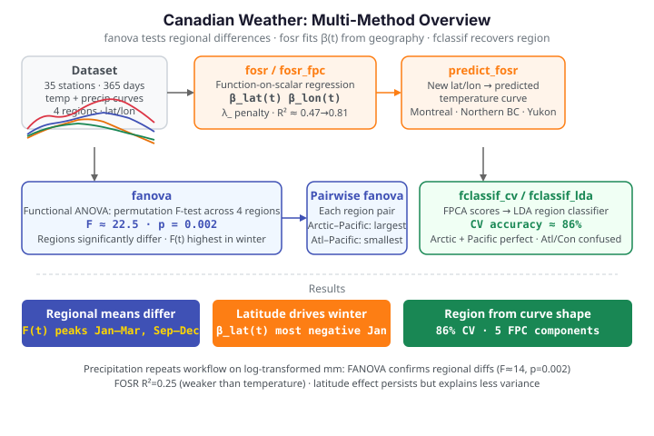

# Canadian Weather: Regional Climate Patterns

**Dataset:** Canadian Weather — daily mean temperature (°C) and precipitation
(mm) over a 365-day year for 35 weather stations, each tagged with its climatic
region: **Arctic** (3 stations), **Atlantic** (15), **Continental** (12), and
**Pacific** (5), plus its latitude and longitude.

A climate analyst asks two linked questions. First, *do the regions genuinely
differ* in their seasonal temperature and precipitation, or could the spread be
chance? That is a hypothesis test on whole curves — **functional ANOVA**.
Second, *which geographic variables drive* the seasonal pattern? Latitude and
longitude are scalars; the response is a curve, so this is **function-on-scalar
regression** (FOSR). We answer both with `fdars`, then close by predicting the
temperature curve of a station that does not exist and classifying region from
shape alone.

{ .fdars-diagram }

## Temperature curves by region

```python exec="1" html="1" source="above"
--8<-- "includes/load-canadian-weather.md"
region = meta["region"].to_numpy()
colors = {"Atlantic": "#3f51b5", "Continental": "#e8710a",
          "Pacific": "#198754", "Arctic": "#dc3545"}

f, ax = fig()
for r, c in colors.items():
    ax.plot(day, X[region == r].T, color=c, lw=1, alpha=0.55)
for r, c in colors.items():
    ax.plot([], [], color=c, label=r)
ax.set(title="Daily mean temperature, 35 Canadian stations",
       xlabel="day of year", ylabel="temperature (°C)")
ax.legend(ncol=2)
print(render(f))
```

Every station shows the same summer-peaked annual cycle, but they differ in
**level** (Arctic stations sit far below Pacific ones) and in **amplitude**
(coastal Pacific stations are mild year-round; Continental ones swing hard
between summer and winter). The regional separation is largest in **winter** —
keep that in mind, because the analyses below quantify it.

## Functional ANOVA: do the regions differ?

`fanova` tests the null hypothesis that all four regions share one mean
temperature curve. It computes a pointwise F-statistic — at each day $t$, the
ratio of between-region to within-region variance,

$$
F(t) = \frac{\sum_{g=1}^{G} n_g\,\bigl(\bar Y_g(t) - \bar Y(t)\bigr)^2 \big/ (G-1)}
            {\sum_{g=1}^{G} \sum_{i \in g} \bigl(Y_i(t) - \bar Y_g(t)\bigr)^2 \big/ (n-G)},
$$

with $\bar Y_g$ the region-$g$ mean curve and $\bar Y$ the grand mean — aggregates
it to a global statistic, and calibrates a **p-value by permutation** —
reshuffling the region labels `n_perm` times and asking how often the shuffled
data produce as extreme a statistic. The group codes are integer-encoded region
labels.

```python exec="1" html="1" source="above"
import numpy as np
from docs_fig import fig, render
from docs_data import load_canadian_weather
from fdars.regression import fanova

day, X, meta = load_canadian_weather("temperature")
X = np.ascontiguousarray(X, dtype=np.float64)
region = meta["region"].to_numpy()
classes = sorted(set(region))
grp = np.array([classes.index(r) for r in region], dtype=np.int64)

res = fanova(X, grp, n_perm=500)
means = np.asarray(res["group_means"])          # (4, 365)
fstat = np.asarray(res["f_statistic_t"])        # pointwise F(t)

colors = {"Atlantic": "#3f51b5", "Continental": "#e8710a",
          "Pacific": "#198754", "Arctic": "#dc3545"}
f, (a1, a2) = fig(nrows=2, figsize=(7.5, 5.6), sharex=True,
                  gridspec_kw={"height_ratios": [2, 1]})
for k, cls in enumerate(classes):
    a1.plot(day, means[k], color=colors[cls], lw=2.2, label=cls)
a1.set(ylabel="mean temp (°C)",
       title=f"FANOVA: regional mean curves "
             f"(F={res['global_statistic']:.1f}, p={res['p_value']:.3f})")
a1.legend(ncol=2)
a2.plot(day, fstat, color="#6f42c1", lw=1.6)
a2.fill_between(day, 0, fstat, color="#6f42c1", alpha=0.15)
a2.set(xlabel="day of year", ylabel="pointwise F(t)")
print(render(f))
```

The global F-statistic is about **22.5** with a permutation p-value of **0.002**:
the regions are separated far beyond chance. The pointwise $F(t)$ panel shows
*where* — it towers in the winter months (days 1–90 and 275–365) and dips in
summer, confirming visually that regions diverge most when it is cold and
converge when it is warm.

### Which pairs of regions differ?

A significant global test does not say *which* regions differ. Running `fanova`
on each pair localises the contrasts.

```python exec="1" html="1" source="above"
import numpy as np, itertools
from docs_fig import fig, render
from docs_data import load_canadian_weather
from fdars.regression import fanova

day, X, meta = load_canadian_weather("temperature")
X = np.ascontiguousarray(X, dtype=np.float64)
region = meta["region"].to_numpy()
classes = sorted(set(region))
grp = np.array([classes.index(r) for r in region], dtype=np.int64)

labels, fstats = [], []
for a, b in itertools.combinations(range(4), 2):
    m = (grp == a) | (grp == b)
    g2 = (grp[m] == b).astype(np.int64)
    r = fanova(np.ascontiguousarray(X[m]), g2, n_perm=500)
    labels.append(f"{classes[a][:4]}–{classes[b][:4]}")
    fstats.append(r["global_statistic"])

order = np.argsort(fstats)
f, ax = fig(figsize=(6.4, 4.0))
ax.barh(range(len(labels)), np.array(fstats)[order], color="#3f51b5")
ax.set_yticks(range(len(labels)))
ax.set_yticklabels([labels[i] for i in order])
ax.set(title="Pairwise FANOVA F-statistics", xlabel="global F")
print(render(f))
```

The largest contrasts are **Arctic vs Pacific** and **Arctic vs Atlantic** — the
climatic extremes — with F-statistics above 50. The smallest is **Atlantic vs
Pacific** (both maritime, both mild). Every pair is significant, but the ordering
recovers the intuitive geography: the further apart two regions sit on the
warmth–continentality spectrum, the larger their curves diverge.

## FOSR: temperature ~ latitude + longitude

Functional ANOVA treats region as a category. `fosr` goes further and regresses
the whole temperature *curve* on continuous predictors — here latitude and
longitude — fitting a **coefficient function** $\beta_j(t)$ for each. The model is

$$
x_i(t) \;=\; \beta_0(t) \;+\; \sum_j \beta_j(t)\,z_{ij} \;+\; \varepsilon_i(t),
$$

so $\beta_{\text{lat}}(t)$ reads as "°C of temperature change per degree of
latitude, on day $t$." The `lambda_` argument penalises roughness in the
coefficient curves.

```python exec="1" html="1" source="above"
import numpy as np
from docs_fig import fig, render
from docs_data import load_canadian_weather
from fdars.regression import fosr

day, X, meta = load_canadian_weather("temperature")
X = np.ascontiguousarray(X, dtype=np.float64)
lat = meta["lat"].to_numpy()
lon = meta["lon"].to_numpy()
predictors = np.column_stack([lat, lon])

fo = fosr(X, predictors, lambda_=1.0)
beta = np.asarray(fo["beta"])                    # (2, 365): lat, lon

f, ax = fig()
ax.axhline(0, color="#6c757d", lw=0.8)
ax.plot(day, beta[0], color="#3f51b5", lw=2, label=r"$\beta_{\rm lat}(t)$")
ax.plot(day, beta[1], color="#e8710a", lw=2, label=r"$\beta_{\rm lon}(t)$")
ax.set(title=f"FOSR coefficient functions ($R^2$={fo['r_squared']:.3f})",
       xlabel="day of year", ylabel="°C per unit predictor")
ax.legend()
print(render(f))
```

The model explains about **47%** of the curve-to-curve variation. The **latitude
coefficient is negative all year** — higher latitude means colder — and it is
*most* negative in winter, exactly where the regional means fan out. The
**longitude coefficient is subtler**: western stations run slightly warmer in
winter (the Pacific's maritime moderation) and the effect flattens in summer.
Latitude is by far the stronger driver of seasonal temperature.

### FPC-based FOSR: a tighter fit

Penalised FOSR works pointwise; `fosr_fpc` first projects the response curves
onto their leading functional principal components, regresses in that
low-dimensional space, and maps back. Because it borrows strength across the
whole domain, it fits considerably better.

```python exec="1" html="1" source="above"
import numpy as np
from docs_fig import fig, render
from docs_data import load_canadian_weather
from fdars.regression import fosr, fosr_fpc

day, X, meta = load_canadian_weather("temperature")
X = np.ascontiguousarray(X, dtype=np.float64)
predictors = np.column_stack([meta["lat"].to_numpy(), meta["lon"].to_numpy()])

r2_pw = fosr(X, predictors, lambda_=1.0)["r_squared"]
fpc = fosr_fpc(X, predictors, n_comp=5)
r2_fpc_t = np.asarray(fpc["r_squared_t"])        # pointwise R^2(t)

f, ax = fig()
ax.plot(day, r2_fpc_t, color="#198754", lw=2,
        label=f"FPC-FOSR, 5 comp ($R^2$={fpc['r_squared']:.3f})")
ax.axhline(r2_pw, color="#3f51b5", ls="--", lw=1.4,
           label=f"penalised FOSR ($R^2$={r2_pw:.3f})")
ax.set(title="Variance explained by geography, across the year",
       xlabel="day of year", ylabel=r"$R^2(t)$", ylim=(0, 1))
ax.legend()
print(render(f))
```

The FPC model lifts the overall $R^2$ from 0.47 to about **0.81**. The pointwise
$R^2(t)$ curve shows geography explains almost all the variation in **winter**
(latitude nearly determines how cold January is) and less in summer, when even
Arctic stations warm up and the stations converge.

### Predicting an unobserved station

Because FOSR is a genuine regression, `predict_fosr` returns a full temperature
curve for any latitude/longitude — including coordinates no station occupies.

```python exec="1" html="1" source="above"
import numpy as np
from docs_fig import fig, render
from docs_data import load_canadian_weather
from fdars.regression import predict_fosr

day, X, meta = load_canadian_weather("temperature")
X = np.ascontiguousarray(X, dtype=np.float64)
predictors = np.column_stack([meta["lat"].to_numpy(), meta["lon"].to_numpy()])

new_locs = np.array([[45., -75.],    # Montreal-like (Continental)
                     [55., -120.],   # Northern BC
                     [65., -135.]])  # Yukon (Arctic)
names = ["45°N, 75°W (Montreal-like)", "55°N, 120°W (Northern BC)",
         "65°N, 135°W (Yukon)"]
pred = np.asarray(predict_fosr(X, predictors, new_locs, lambda_=1.0))  # (3, 365)

f, ax = fig()
for row, name, c in zip(pred, names, ["#3f51b5", "#e8710a", "#dc3545"]):
    ax.plot(day, row, color=c, lw=2, label=name)
ax.set(title="Predicted temperature curves at hypothetical locations",
       xlabel="day of year", ylabel="temperature (°C)")
ax.legend(fontsize=8)
print(render(f))
```

The three predicted curves order by latitude **in winter** exactly as physical
intuition demands: the Montreal-like station stays mildest through the cold months
while the Yukon coordinate plunges to the deepest winter trough. The **summer**
ranking, though, is not a simple warmest→coldest-by-latitude ordering — at the
July peak the curves nearly converge, and the higher-latitude coordinates actually
edge *above* the Montreal-like one (the shorter, more continental northern summer
warms hard and briefly). What latitude really controls is the **amplitude**: the
further north, the deeper the winter trough and the larger the annual swing, while
the summer peak barely moves. All three share the summer-peaked shape the
coefficient functions encode, so FOSR has effectively learned a *map* from
geography to seasonal climate — one dominated by winter, not summer, contrasts.

## Precipitation: same tools, weaker geography

Repeating the workflow on **precipitation** (log₁₀ mm, to match the multiplicative
nature of rainfall) tests whether geography drives *how much it rains* as cleanly
as it drives temperature.

```python exec="1" html="1" source="above"
import numpy as np
from docs_fig import fig, render
from docs_data import load_canadian_weather
from fdars.regression import fanova, fosr

day, Xp, meta = load_canadian_weather("precipitation")
Xp = np.ascontiguousarray(np.log10(np.maximum(Xp, 0.05)), dtype=np.float64)
region = meta["region"].to_numpy()
classes = sorted(set(region))
grp = np.array([classes.index(r) for r in region], dtype=np.int64)
predictors = np.column_stack([meta["lat"].to_numpy(), meta["lon"].to_numpy()])

fa = fanova(Xp, grp, n_perm=500)
means = np.asarray(fa["group_means"])
fo = fosr(Xp, predictors, lambda_=1.0)

colors = {"Atlantic": "#3f51b5", "Continental": "#e8710a",
          "Pacific": "#198754", "Arctic": "#dc3545"}
f, ax = fig()
for k, cls in enumerate(classes):
    ax.plot(day, means[k], color=colors[cls], lw=2.2, label=cls)
ax.set(title=f"Regional mean precipitation "
             f"(FANOVA F={fa['global_statistic']:.1f}, "
             f"FOSR $R^2$={fo['r_squared']:.3f})",
       xlabel="day of year", ylabel="log₁₀ precipitation (mm)")
ax.legend(ncol=2)
print(render(f))
```

Precipitation regions differ significantly too (FANOVA F ≈ **14**, p ≈ 0.002).
The **Atlantic** curve sits highest — wettest year-round — while the **Pacific**
curve is the one with a distinct *seasonal shape*: it is the only region that is
clearly wetter in winter than in summer, the maritime wet-winter/dry-summer
signature. The regional gaps here are modest, though, and geography explains far
less of precipitation than of temperature: the FOSR
$R^2$ is only about **0.25** versus 0.47. Rainfall is governed by local terrain
and storm tracks that latitude and longitude capture poorly — a genuine
scientific finding, not a modelling artefact.

## Classifying region from the temperature curve

Finally, can we *recover* a station's region from its temperature curve alone?
`fclassif_cv` runs cross-validated functional LDA — projecting each curve onto
FPCA scores, then discriminating — and reports an honest out-of-fold error rate.

```python exec="1" html="1" source="above"
import numpy as np
from docs_fig import fig, render
from docs_data import load_canadian_weather
from fdars.classification import fclassif_cv, fclassif_lda

day, X, meta = load_canadian_weather("temperature")
X = np.ascontiguousarray(X, dtype=np.float64)
day = np.ascontiguousarray(day, dtype=np.float64)
region = meta["region"].to_numpy()
classes = sorted(set(region))
grp = np.array([classes.index(r) for r in region], dtype=np.int64)

cv = fclassif_cv(X, day, grp, method="lda", nfold=5)
acc_cv = 1.0 - float(cv["error_rate"])

# full-data confusion matrix
pred = np.asarray(fclassif_lda(X, grp, ncomp=int(cv["best_ncomp"]))["predicted"])
K = len(classes)
cm = np.zeros((K, K), int)
for t_, p_ in zip(grp, pred):
    cm[t_, p_] += 1

f, ax = fig(figsize=(5.2, 4.4))
ax.imshow(cm, cmap="Blues", aspect="auto")
ax.set_xticks(range(K)); ax.set_xticklabels(classes, rotation=30, ha="right")
ax.set_yticks(range(K)); ax.set_yticklabels(classes)
for i in range(K):
    for j in range(K):
        ax.text(j, i, cm[i, j], ha="center", va="center",
                color="#222" if cm[i, j] < cm.max() * 0.6 else "white")
ax.set(title=f"Region from temperature (CV acc {acc_cv:.0%}, "
             f"ncomp={int(cv['best_ncomp'])})",
       xlabel="predicted", ylabel="true region")
ax.grid(False)
print(render(f))
```

Cross-validated accuracy is about **86%** (error rate 0.14) with just a few FPCA
components. The confusion matrix shows **Arctic** and **Pacific** stations
recognised almost perfectly — their profiles are distinctive — while the handful
of errors land between **Atlantic** and **Continental**, whose summer
temperatures overlap. The classifier's mistakes echo the pairwise FANOVA: the
regions hardest to tell apart statistically are the ones it confuses.

## Parameters

| Function | Key parameters | Description |
|----------|----------------|-------------|
| `fanova(data, groups, n_perm)` | `n_perm` | Permutation F-test across groups; `global_statistic`, `p_value`, `f_statistic_t`, `group_means` |
| `fosr(response, predictors, lambda_)` | `lambda_` | Function-on-scalar regression; `beta` (one row per predictor), `fitted`, `r_squared` |
| `fosr_fpc(data, predictors, n_comp)` | `n_comp` | FPC-based FOSR; `beta`, `r_squared`, `r_squared_t`, `intercept` |
| `predict_fosr(response, predictors, new_predictors, lambda_)` | `new_predictors` | Predicted response curves at new predictor values |
| `fclassif_cv(data, argvals, labels, method, nfold)` | `method`, `nfold` | Cross-validated `error_rate`, `best_ncomp` |
| `fclassif_lda(data, labels, ncomp)` | `ncomp` | LDA on FPCA scores; `predicted`, `accuracy` |

!!! note "FOSR beta rows"
    `fosr` returns one coefficient curve per predictor column (here row 0 =
    latitude, row 1 = longitude); the intercept curve is fit internally.
    `fosr_fpc` additionally exposes the fitted `intercept` and a pointwise
    `r_squared_t`. R's reference uses `log10precip`; the Python loader returns raw
    mm, so we log-transform to reproduce the same coefficients and $R^2$.

## See also

- [Canadian temperature: seasonal analysis](canadian-seasonal.md) — the same
  stations treated as periodic signals (period detection, STL/SSA, peak timing).
- [Functional PCA](../represent/fpca.md) for the decomposition underlying
  FPC-FOSR and the classifier.
- [Scalar-on-function regression](../regression/scalar-on-function.md) for the
  complementary direction (curve predictors, scalar response).

## References

- Ramsay, J.O., Silverman, B.W. (2005). *Functional Data Analysis*, 2nd ed. Springer.
- Ramsay, J.O., Hooker, G., Graves, S. (2009). *Functional Data Analysis with R and MATLAB.* Springer.
- Febrero-Bande, M., Oviedo de la Fuente, M. (2012). *Statistical computing in functional data analysis: fda.usc.* JSS 51(4):1-28.
