# Examples

End-to-end case studies on **real, classic functional-data datasets**. Each
page loads a vendored dataset, runs a genuine `fdars` analysis, and generates
its figures at build time — so the code you read is exactly the code that
produced the plots.

The datasets (Berkeley Growth, Canadian Weather, Tecator, Phoneme, Wine, Sonar)
live under `docs/data/` with sources and licenses documented in the
[data README](../data/README.md); the penicillin batches are synthetic. All are
loaded through the small helper `docs_data`.

## Alignment &amp; shape

<div class="fdars-gallery fdars-sec-examples">

<a class="fdars-gallery-item" href="growth-alignment/">
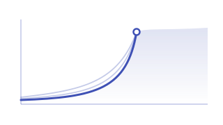
<div class="fdars-gallery-title">Growth curve alignment</div>
<div class="fdars-gallery-desc">Berkeley Growth: separate the timing of the pubertal growth spurt from its size with elastic alignment and the Karcher mean.</div>
</a>

<a class="fdars-gallery-item" href="sonar-tsrvf/">
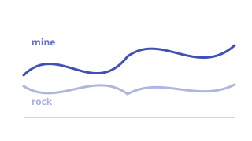
<div class="fdars-gallery-title">Sonar: mine vs rock</div>
<div class="fdars-gallery-desc">Does elastic/TSRVF alignment help classify sonar returns? An honest head-to-head against the raw curves.</div>
</a>

</div>

## Representation: Andrews curves

<div class="fdars-gallery fdars-sec-examples">

<a class="fdars-gallery-item" href="andrews-wine-intro/">
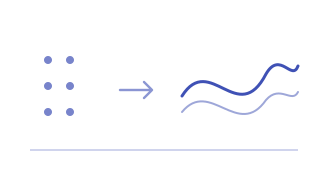
<div class="fdars-gallery-title">Andrews Wine: why curves?</div>
<div class="fdars-gallery-desc">Turn a 13-dimensional wine table into curves and watch three cultivars separate visually.</div>
</a>

<a class="fdars-gallery-item" href="andrews-wine/">
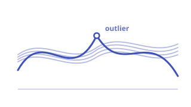
<div class="fdars-gallery-title">Andrews Wine: outliers</div>
<div class="fdars-gallery-desc">Functional depth and the outliergram flag atypical wines among the Andrews curves.</div>
</a>

<a class="fdars-gallery-item" href="andrews-wine-clustering/">
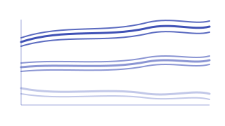
<div class="fdars-gallery-title">Andrews Wine: clustering</div>
<div class="fdars-gallery-desc">Cluster the curves, compare to the true cultivars, and see which chemical features drive the split.</div>
</a>

<a class="fdars-gallery-item" href="andrews-wine-qc/">
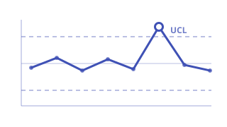
<div class="fdars-gallery-title">Andrews Wine: quality control</div>
<div class="fdars-gallery-desc">Treat one cultivar as in-control and flag out-of-spec wines with a functional tolerance view.</div>
</a>

</div>

## Regression &amp; explainability

<div class="fdars-gallery fdars-sec-examples">

<a class="fdars-gallery-item" href="tecator-regression/">
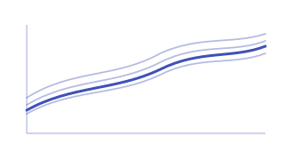
<div class="fdars-gallery-title">Predicting fat from NIR spectra</div>
<div class="fdars-gallery-desc">Tecator: scalar-on-function PLS predicts meat fat content, with an interpretable coefficient curve.</div>
</a>

<a class="fdars-gallery-item" href="cross-validation/">
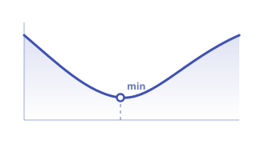
<div class="fdars-gallery-title">Honest model comparison</div>
<div class="fdars-gallery-desc">Out-of-fold cross-validation compares FPC-LM, PLS and NP regression — and exposes optimistic in-sample R².</div>
</a>

<a class="fdars-gallery-item" href="explainability-regions/">
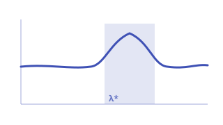
<div class="fdars-gallery-title">Recovering predictive regions</div>
<div class="fdars-gallery-desc">Which wavelengths drive the fat prediction? Significant-region and importance tools localize the signal.</div>
</a>

</div>

## Classification

<div class="fdars-gallery fdars-sec-examples">

<a class="fdars-gallery-item" href="phoneme-shape/">
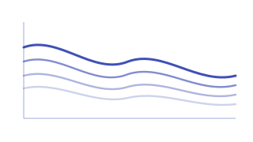
<div class="fdars-gallery-title">Phoneme recognition</div>
<div class="fdars-gallery-desc">Shape-based classification of five phonemes from their log-periodogram curves, evaluated by cross-validation.</div>
</a>

</div>

## Seasonal &amp; regional analysis

<div class="fdars-gallery fdars-sec-examples">

<a class="fdars-gallery-item" href="canadian-weather/">
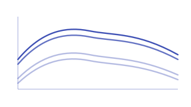
<div class="fdars-gallery-title">Weather curves: FPCA &amp; clustering</div>
<div class="fdars-gallery-desc">Canadian Weather: FPCA finds the dominant temperature modes and k-means recovers Canada's climate regions.</div>
</a>

<a class="fdars-gallery-item" href="canadian-seasonal/">
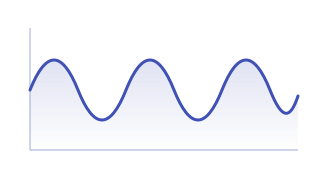
<div class="fdars-gallery-title">Annual cycle detection</div>
<div class="fdars-gallery-desc">Recover the ~365-day period, quantify seasonal strength, and decompose a station with STL.</div>
</a>

<a class="fdars-gallery-item" href="canadian-precipitation/">
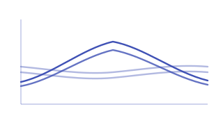
<div class="fdars-gallery-title">Geographic effects on rainfall</div>
<div class="fdars-gallery-desc">Precipitation profiles by region, with FPCA scores tracking latitude across the country.</div>
</a>

</div>

## Process monitoring

<div class="fdars-gallery fdars-sec-examples">

<a class="fdars-gallery-item" href="tecator-monitoring/">
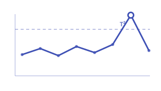
<div class="fdars-gallery-title">Inline spectra monitoring</div>
<div class="fdars-gallery-desc">Tecator: a T²/SPE control chart flags off-spec spectra and contribution plots localize the fault.</div>
</a>

<a class="fdars-gallery-item" href="inline-monitoring/">
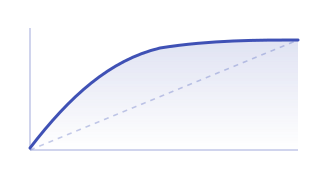
<div class="fdars-gallery-title">Detection power &amp; false alarms</div>
<div class="fdars-gallery-desc">Trade off detection rate against false-alarm rate as the control limit is tightened.</div>
</a>

<a class="fdars-gallery-item" href="biopharma-monitoring/">
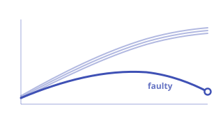
<div class="fdars-gallery-title">Penicillin batch monitoring</div>
<div class="fdars-gallery-desc">Monitor fermentation batches (synthetic) and catch faulty batches as their trajectories drift.</div>
</a>

</div>

## What each example shows

| Example | Dataset | fdars techniques |
|---------|---------|------------------|
| [Growth curve alignment](growth-alignment.md) | Berkeley Growth | `deriv_1d`, `elastic_align_pair`, `karcher_mean` |
| [Sonar: mine vs rock](sonar-tsrvf.md) | Sonar | `tsrvf_transform`, `elastic_self_distance_matrix`, `fclassif_knn` |
| [Andrews Wine: why curves?](andrews-wine-intro.md) | Wine | Andrews transform, `Fdata` |
| [Andrews Wine: outliers](andrews-wine.md) | Wine | `depth`, `outliergram`, `magnitude_shape` |
| [Andrews Wine: clustering](andrews-wine-clustering.md) | Wine | `kmeans_fd`, `gmm_cluster`, `silhouette_score_data` |
| [Andrews Wine: quality control](andrews-wine-qc.md) | Wine | `fpca_tolerance_band` / `spm` |
| [Predicting fat from NIR spectra](tecator-regression.md) | Tecator | `fregre_pls`, `predict_fregre_pls`, `fregre_np` |
| [Honest model comparison](cross-validation.md) | Tecator | `fregre_cv`, `model_selection_ncomp` |
| [Recovering predictive regions](explainability-regions.md) | Tecator | `significant_regions`, `pointwise_importance`, `functional_pdp` |
| [Phoneme recognition](phoneme-shape.md) | Phoneme | `fclassif_knn`, `fclassif_lda`, `fclassif_cv` |
| [Weather curves: FPCA &amp; clustering](canadian-weather.md) | Canadian Weather | `fpca`, `kmeans_fd`, `silhouette_score_data` |
| [Annual cycle detection](canadian-seasonal.md) | Canadian Weather | `estimate_period_fft`, `seasonal_strength`, `stl_decompose` |
| [Geographic effects on rainfall](canadian-precipitation.md) | Canadian Weather | `fpca`, `fosr` |
| [Inline spectra monitoring](tecator-monitoring.md) | Tecator | `spm_phase1`, `spm_monitor`, `hotelling_t2` |
| [Detection power &amp; false alarms](inline-monitoring.md) | Penicillin (synthetic) | `spm_phase1`, `t2_control_limit`, `arl0_t2` |
| [Penicillin batch monitoring](biopharma-monitoring.md) | Penicillin (synthetic) | `spm_phase1`, `spm_monitor`, `t2_pc_contributions` |

!!! tip "Reproducing locally"
    Every dataset is loadable outside the docs too:

    ```python
    import sys; sys.path.insert(0, "scripts")
    from docs_data import (load_growth, load_canadian_weather, load_tecator,
                           load_phoneme, load_wine, load_sonar, load_penicillin)

    age, X, meta = load_growth()          # (argvals, curves, labels)
    ```
