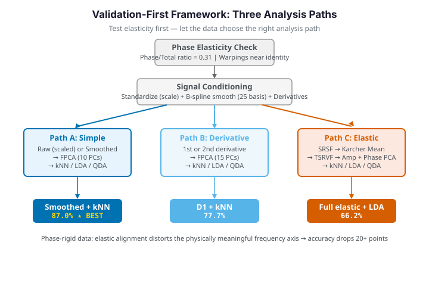

# Sonar: Mine vs Rock — when does elastic alignment help?

**Dataset:** Sonar — 208 sonar returns (111 Mines, 97 Rocks), each a 60-band
energy spectrum, bounced off either a metal cylinder (a "Mine") or a roughly
cylindrical rock (a "Rock"). The task is the classic Gorman–Sejnowski benchmark:
classify the object from its spectrum.

Each observation is a 60-point **curve** — energy as a function of frequency
band. A natural question for functional data is whether the curves should be
**aligned** before comparing them. Elastic alignment (via the transported
square-root velocity framework, TSRVF) factors out phase, comparing curves by
*shape* alone. That is a powerful idea for data where features drift along the
$x$-axis — but is sonar such a case?

This page follows a **validation-first** discipline: before reaching for
elastic alignment we *measure* whether the data actually has phase variation,
then run a small ablation that pits the elastic representations against plain
standardized spectra under an identical cross-validated classifier. The honest
answer turns out to be **no**: on sonar, elastic alignment *removes*
discriminative signal.

{ .fdars-diagram }

## The two classes

We standardize each frequency band to unit variance first — a fixed physical
band should not dominate merely because it carries more raw energy — then look
at the class-mean spectra.

```python exec="1" html="1" source="above"
import numpy as np
from docs_fig import fig, render
from docs_data import load_sonar

band, X, meta = load_sonar()
is_mine = meta["label"].to_numpy() == "Mine"
Xz = (X - X.mean(0)) / X.std(0)               # standardize each band

f, ax = fig()
ax.plot(band, Xz[is_mine].T, color="#e8710a", lw=0.6, alpha=0.15)
ax.plot(band, Xz[~is_mine].T, color="#3f51b5", lw=0.6, alpha=0.15)
ax.plot(band, Xz[is_mine].mean(0), color="#e8710a", lw=2.6, label="Mine (mean)")
ax.plot(band, Xz[~is_mine].mean(0), color="#3f51b5", lw=2.6, label="Rock (mean)")
ax.set(title="Standardized sonar spectra: Mine vs Rock",
       xlabel="frequency band (1–60)", ylabel="standardized energy")
ax.legend()
print(render(f))
```

The two class-mean spectra (bold) differ mostly in **level and curvature** in
the mid-frequency bands, not in the *position* of a feature. The individual
curves are noisy and heavily overlapping — this is a genuinely hard problem
(published accuracies hover around 80–87% for nearest-neighbour methods).
Crucially, band $k$ means the same physical frequency for every return: the
spectra are already registered on a common axis.

## Phase-elasticity check: is there any phase to remove?

Rather than assume alignment will help, we *quantify* the phase content.
`fdars.alignment.alignment_quality` runs the elastic alignment and splits the
total variation into an **amplitude** part (differences in shape at fixed
warped position) and a **phase** part (differences removable by warping the
axis). A high phase share is the green light for elastic methods.

```python exec="1" html="1" source="above"
import numpy as np
from docs_fig import fig, render
from docs_data import load_sonar
from fdars.alignment import alignment_quality, karcher_mean

band, X, meta = load_sonar()
is_mine = meta["label"].to_numpy() == "Mine"
Xz = (X - X.mean(0)) / X.std(0)
t = np.linspace(0.0, 1.0, X.shape[1])

aq = alignment_quality(Xz, t, max_iter=20)
ratio = aq["phase_amplitude_ratio"]
km = karcher_mean(Xz, t, max_iter=20)
gammas = np.asarray(km["gammas"])             # warping functions on [0, 1] axis

f, (ax1, ax2) = fig(1, 2, figsize=(9.2, 4.0))
ax1.bar(["amplitude", "phase"],
        [aq["amplitude_variance"], aq["phase_variance"]],
        color=["#3f51b5", "#e8710a"])
ax1.set(title=f"Variance split (phase/amp = {ratio:.2f})", ylabel="variance")
ax2.plot(t, gammas[is_mine].T, color="#e8710a", lw=0.5, alpha=0.2)
ax2.plot(t, gammas[~is_mine].T, color="#3f51b5", lw=0.5, alpha=0.2)
ax2.plot([0, 1], [0, 1], color="#6c757d", ls=":", lw=1)
ax2.set(title="Warping functions vs identity", xlabel="t", ylabel="$\\gamma(t)$")
print(render(f))
```

The phase share (~0.33) looks *moderate* — enough that a naive reading might
green-light alignment. But the warping functions tell a subtler story: they
depart from the diagonal, yet because the bands are a **fixed physical grid**,
that "phase" has no physical meaning to remove. Any warp is fitting noise. This
is the trap the validation-first framework is built to catch: a middling
variance ratio is *not* sufficient evidence that the $x$-axis is stretchable.

## Two distance geometries

We compare curves two ways, both as **distance matrices** that we feed to the
same $k$-nearest-neighbour classifier so the *only* thing that changes is the
geometry:

- **$L^2$ distance** — `fdars.metric.lp_self_1d(X, band, 2.0)` — the ordinary
  functional distance $\lVert x_i - x_j\rVert_2$, comparing curves band by band.
- **Elastic distance** — `fdars.alignment.elastic_self_distance_matrix` — the
  amplitude (shape) distance after optimally warping the frequency axis, i.e. the
  TSRVF geodesic distance. Two curves are close if one can be *reparameterised*
  into the other.

```python exec="1" html="1" source="above"
import numpy as np
from docs_fig import fig, render
from docs_data import load_sonar
from fdars.metric import lp_self_1d
from fdars.alignment import elastic_self_distance_matrix

band, X, meta = load_sonar()
Xz = (X - X.mean(0)) / X.std(0)
t = np.linspace(0.0, 1.0, X.shape[1])
order = np.argsort(meta["label"].to_numpy())   # group Mine/Rock for block structure
DL2 = np.asarray(lp_self_1d(Xz, t, 2.0))[order][:, order]
DEL = np.asarray(elastic_self_distance_matrix(Xz, t))[order][:, order]

f, axes = fig(ncols=2, figsize=(9.0, 4.0))
for ax, D, name in zip(axes, [DL2, DEL], ["$L^2$ distance", "elastic distance"]):
    im = ax.imshow(D, cmap="magma_r", aspect="auto")
    ax.set(title=name, xlabel="curve (sorted by class)", ylabel="curve")
    ax.grid(False)
    f.colorbar(im, ax=ax, fraction=0.046)
print(render(f))
```

Both matrices are sorted so the first block is one class and the second the
other. Under $L^2$ the two diagonal blocks are visibly darker (within-class pairs
are closer) than the off-diagonal blocks — the class structure is *in* the
geometry. Under the elastic distance that block contrast is much fainter: warping
the frequency axis lets a Rock spectrum bend into a Mine-like shape, washing out
the between-class gap.

## Derivatives: a second "obvious" idea that also fails

Before the elastic pipeline, one more natural transform to try is the
**derivative** — often derivatives sharpen discriminative shape features. We
compute the first and second derivatives with `fdars.fdata.deriv_1d`.

```python exec="1" html="1" source="above"
import numpy as np
from docs_fig import fig, render
from docs_data import load_sonar
from fdars.fdata import deriv_1d

band, X, meta = load_sonar()
is_mine = meta["label"].to_numpy() == "Mine"
Xz = (X - X.mean(0)) / X.std(0)
t = np.linspace(0.0, 1.0, X.shape[1])
d1 = np.asarray(deriv_1d(Xz, t, nderiv=1))
d2 = np.asarray(deriv_1d(Xz, t, nderiv=2))

f, axes = fig(ncols=3, figsize=(10.5, 3.4))
for ax, D, name in zip(axes, [Xz, d1, d2], ["$f$", "$f'$", "$f''$"]):
    ax.plot(band, D[is_mine].mean(0), color="#e8710a", lw=2, label="Mine")
    ax.plot(band, D[~is_mine].mean(0), color="#3f51b5", lw=2, label="Rock")
    ax.set(title=f"class mean of {name}", xlabel="band")
axes[0].legend()
print(render(f))
```

Each derivative progressively amplifies noise and strips away the baseline
level — and the level, we already saw, is exactly where the class difference
lives. Differentiation moves in the wrong direction; the ablation below confirms
it costs accuracy.

## TSRVF as a representation

The TSRVF (`fdars.alignment.tsrvf_transform`) makes the alignment explicit: it
iteratively estimates a Karcher-mean shape and returns each curve's
**tangent vector** — its shape residual in the aligned space — together with the
warping functions $\gamma_i$ that carried each curve onto the mean.

```python exec="1" html="1" source="above"
import numpy as np
from docs_fig import fig, render
from docs_data import load_sonar
from fdars.alignment import tsrvf_transform

band, X, meta = load_sonar()
is_mine = meta["label"].to_numpy() == "Mine"
Xz = (X - X.mean(0)) / X.std(0)
t = np.linspace(0.0, 1.0, X.shape[1])
ts = tsrvf_transform(Xz, t, max_iter=15)
tv = np.asarray(ts["tangent_vectors"])       # (n, m) shape residuals
mean_shape = np.asarray(ts["mean"])

f, axes = fig(ncols=2, figsize=(9.0, 4.0))
axes[0].plot(band, tv[is_mine].T, color="#e8710a", lw=0.5, alpha=0.2)
axes[0].plot(band, tv[~is_mine].T, color="#3f51b5", lw=0.5, alpha=0.2)
axes[0].set(title="TSRVF tangent vectors by class",
            xlabel="band", ylabel="$v_i$")
axes[1].plot(band, mean_shape, color="#198754", lw=2.4)
axes[1].set(title="Karcher-mean shape", xlabel="band", ylabel="aligned energy")
print(render(f))
```

The tangent vectors — the "shape residuals" the elastic pipeline hands to a
classifier — show only weak class separation, spread thinly across many bands.
The warping absorbed structure that $L^2$ kept as clean amplitude differences.

## Amplitude vs phase, in PC space

To see how little class signal survives, project both the **amplitude**
(tangent vectors) and the **phase** (warping functions) onto their first two
functional principal components with `fdars.regression.fpca` and colour by
class. Clean clusters would mean the representation separates the classes.

```python exec="1" html="1" source="above"
import numpy as np
from docs_fig import fig, render
from docs_data import load_sonar
from fdars.alignment import tsrvf_transform
from fdars.regression import fpca

band, X, meta = load_sonar()
is_mine = meta["label"].to_numpy() == "Mine"
Xz = (X - X.mean(0)) / X.std(0)
t = np.linspace(0.0, 1.0, X.shape[1])
ts = tsrvf_transform(Xz, t, max_iter=15)
tv = np.asarray(ts["tangent_vectors"])
gammas = np.asarray(ts["gammas"])

amp = np.asarray(fpca(tv, t, n_comp=2)["scores"])
pha = np.asarray(fpca(gammas, t, n_comp=2)["scores"])

f, axes = fig(ncols=2, figsize=(9.0, 4.0))
for ax, S, name in zip(axes, [amp, pha], ["amplitude PCA", "phase PCA"]):
    ax.scatter(S[is_mine, 0], S[is_mine, 1], color="#e8710a", s=16, alpha=0.6, label="Mine")
    ax.scatter(S[~is_mine, 0], S[~is_mine, 1], color="#3f51b5", s=16, alpha=0.6, label="Rock")
    ax.set(title=name, xlabel="PC1", ylabel="PC2")
axes[0].legend()
print(render(f))
```

Neither scatter shows clean class clusters — Mines and Rocks are thoroughly
intermingled in both the amplitude and phase principal subspaces. The elastic
decomposition has *scattered* the discriminative signal rather than
concentrating it.

## The ablation: does any elastic path beat plain spectra?

Finally we settle it with numbers. For a fair contest we run **10-fold
cross-validated** functional classification (`fdars.classification.fclassif_cv`,
selecting the best number of FPCs per feature) on five representations — raw
standardized spectra, first and second derivatives, the aligned curves, and the
TSRVF tangent vectors — and report the best CV accuracy each achieves.

```python exec="1" html="1" source="above"
import numpy as np
import warnings
from docs_fig import fig, render
from docs_data import load_sonar
from fdars.fdata import deriv_1d
from fdars.alignment import karcher_mean, tsrvf_transform
from fdars.classification import fclassif_cv

warnings.filterwarnings("ignore")
band, X, meta = load_sonar()
y = (meta["label"].to_numpy() == "Mine").astype(int)
Xz = (X - X.mean(0)) / X.std(0)
t = np.linspace(0.0, 1.0, X.shape[1])

d1 = np.asarray(deriv_1d(Xz, t, nderiv=1))
d2 = np.asarray(deriv_1d(Xz, t, nderiv=2))
aligned = np.asarray(karcher_mean(Xz, t, max_iter=15)["aligned_data"])
tv = np.asarray(tsrvf_transform(Xz, t, max_iter=15)["tangent_vectors"])

feature_sets = {
    "Raw (scaled)": Xz,   "1st deriv": d1,      "2nd deriv": d2,
    "Aligned": aligned,   "TSRVF (amp)": tv,
}
paths = {"Raw (scaled)": "simple", "1st deriv": "deriv", "2nd deriv": "deriv",
         "Aligned": "elastic", "TSRVF (amp)": "elastic"}
path_color = {"simple": "#3f51b5", "deriv": "#6c757d", "elastic": "#e8710a"}

names, accs, cols = [], [], []
for name, fd in feature_sets.items():
    tt = np.linspace(0.0, 1.0, fd.shape[1])
    best = 0.0
    for meth in ("lda", "knn"):
        for nc in (5, 8, 10):
            cv = fclassif_cv(fd, tt, y, method=meth, ncomp=nc, nfold=10)
            best = max(best, 1.0 - cv["error_rate"])
    names.append(name); accs.append(best); cols.append(path_color[paths[name]])

f, ax = fig(figsize=(8.0, 4.2))
ax.bar(names, accs, color=cols)
ax.axhline(max(y.mean(), 1 - y.mean()), color="#6c757d", ls="--", lw=1,
           label="majority baseline")
for i, a in enumerate(accs):
    ax.text(i, a + 0.005, f"{a:.2f}", ha="center", fontsize=9)
ax.set(title="10-fold CV accuracy by representation",
       ylabel="best CV accuracy", ylim=(0.5, 0.95))
ax.legend()
print(render(f))
```

The verdict is unambiguous. Plain standardized spectra reach about **85%** —
in line with the Gorman–Sejnowski literature — while the elastic representations
drop well below: the aligned curves lose about **10 points** and the TSRVF
tangent vectors over **20**, the latter barely above the majority baseline.
Derivatives land in between but still below raw. Warping the frequency axis does
not help; it actively hurts.

!!! note "Why elastic alignment loses here"
    Elastic methods pay off when the *same feature* appears at a **shifted or
    stretched location** across curves — misaligned peaks in growth-velocity
    curves, phase-drifting gait cycles, ROI-registered spectra. Sonar bands are
    already a fixed physical frequency grid, so there is no phase to remove. The
    discriminative signal lives in **amplitude at fixed bands**, which is exactly
    what $L^2$ preserves and what elastic alignment throws away. The moderate
    phase/amplitude ratio (~0.33) was a red herring: a variance number alone
    cannot tell you whether the axis is *physically* stretchable. This is the
    honest, negative result — a more sophisticated representation is not a free
    lunch; it must match the structure of the data.

## Parameters

| Function | Key parameters | Description |
|----------|----------------|-------------|
| `alignment_quality(data, argvals, max_iter)` | `max_iter` | Phase/amplitude variance split; `phase_amplitude_ratio` |
| `lp_self_1d(data, argvals, p)` | `p` | Order of the $L^p$ functional distance ($p=2$ is $L^2$) |
| `elastic_self_distance_matrix(data, argvals, lambda_)` | `lambda_` | Roughness penalty on the warping (0 = unpenalised) |
| `tsrvf_transform(data, argvals, max_iter, tol, lambda_)` | `max_iter` | Returns `gammas`, `mean`, `tangent_vectors` |
| `fclassif_cv(data, argvals, labels, method, ncomp, nfold)` | `method`, `ncomp`, `nfold` | CV functional classifier; `error_rate` |

## See also

- [Elastic alignment](../align/elastic-alignment.md) for the TSRVF machinery in
  depth, including where it *does* help.
- [Growth curve alignment](growth-alignment.md) for a case study where phase
  removal is the whole point.
- [Classification](../regression/classification.md) for the functional
  classifiers used here.

## References

- Gorman, R.P., Sejnowski, T.J. (1988). *Analysis of hidden units in a layered network trained to classify sonar targets.* Neural Networks 1(1):75-89.
- Dua, D., Graff, C. (2019). *UCI Machine Learning Repository.* University of California, Irvine.
- Srivastava, A., Klassen, E.P. (2016). *Functional and Shape Data Analysis.* Springer.
- Kurtek, S., Srivastava, A., Klassen, E., Ding, Z. (2012). *Statistical modeling of curves using shapes and related features.* JASA 107(499):1152-1165.
