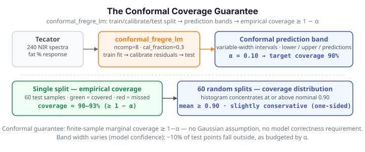

# The conformal coverage guarantee

**The problem.** A regression model predicts the fat content of a meat sample from its
near-infrared spectrum, but a single number `ŷ = 21.4%` says nothing about how much to
trust it. We want an **interval** that contains the true value with a stated probability —
and we want that probability to *hold* without assuming the errors are Gaussian, the model
is correct, or anything else about the data-generating process.

**Split conformal prediction** delivers exactly that. It wraps any fitted regressor with a
calibration step that turns raw residuals into intervals with a finite-sample marginal
coverage guarantee: for a miscoverage level $\alpha$, the interval covers the truth with
probability at least $1-\alpha$. This page demonstrates the guarantee on the Tecator
spectra and shows it empirically holding across many random splits.

{ .fdars-diagram }

## The data

Tecator records 240 near-infrared absorbance curves (100 wavelengths each); the target is
the sample's fat percentage. Spectra of fatty samples sit higher and have a distinctive
shoulder — a clean scalar-on-function regression problem.

```python exec="1" html="1" source="above"
import numpy as np
from matplotlib import cm
from docs_fig import fig, render
from docs_data import load_tecator

t, X, meta = load_tecator()          # t: (100,), X: (240, 100)
fat = meta["fat"].to_numpy()

f, ax = fig()
norm = (fat - fat.min()) / (fat.max() - fat.min())
for i in np.argsort(fat):
    ax.plot(t, X[i], color=cm.viridis(norm[i]), lw=0.7, alpha=0.7)
ax.set(title="Tecator NIR spectra, coloured by fat content",
       xlabel="wavelength index", ylabel="absorbance")
print(render(f))
```

## Split conformal intervals

`conformal_fregre_lm` fits a functional linear model on a training slice, calibrates on a
held-out slice, and returns a lower/upper bound and a point prediction for each test
sample. Sorting the test set by prediction shows the intervals as vertical bands; at
$\alpha = 0.1$ we expect about one test point in ten to fall outside its band.

```python exec="1" html="1" source="above"
import numpy as np
from docs_fig import fig, render
from docs_data import load_tecator
from fdars.conformal import conformal_fregre_lm

t, X, meta = load_tecator()
y = meta["fat"].to_numpy()

rng = np.random.default_rng(0)
idx = rng.permutation(len(y))
test, train = idx[:60], idx[60:]
res = conformal_fregre_lm(X[train], y[train], X[test],
                          ncomp=8, cal_fraction=0.3, alpha=0.1, seed=1)
lo, up, pred = res["lower"], res["upper"], res["predictions"]
truth = y[test]
covered = (truth >= lo) & (truth <= up)

o = np.argsort(pred)                      # sort by prediction for a readable chart
xs = np.arange(len(o))
f, ax = fig()
ax.vlines(xs, lo[o], up[o], color="#adb5bd", lw=2)
ax.scatter(xs[covered[o]], truth[o][covered[o]], color="#2E8B57", s=18, label="covered")
ax.scatter(xs[~covered[o]], truth[o][~covered[o]], color="#D55E00", s=24, label="missed")
ax.set(title=f"90% conformal intervals — empirical coverage {covered.mean():.0%}",
       xlabel="test sample (sorted by prediction)", ylabel="fat (%)")
ax.legend()
print(render(f))
```

Almost every truth (green) sits inside its band; the handful of red misses is exactly the
~10% miscoverage the level $\alpha = 0.1$ budgets for. Note the bands are not all the same
width — that is the model expressing where it is more or less certain.

## The guarantee holds across splits

A single split could get lucky. The guarantee is about the *long run*: repeat the
train/calibrate/test split many times and the empirical coverage concentrates around the
nominal $1-\alpha = 0.90$, regardless of which samples happen to land where.

```python exec="1" html="1" source="above"
import numpy as np
from docs_fig import fig, render, fast
from docs_data import load_tecator
from fdars.conformal import conformal_fregre_lm

t, X, meta = load_tecator()
y = meta["fat"].to_numpy()
n = len(y)

n_splits = fast(60, 12)                   # full build: 60 splits; DOCS_FAST: 12
covs = []
for s in range(n_splits):
    idx = np.random.default_rng(s).permutation(n)
    test, train = idx[:60], idx[60:]
    r = conformal_fregre_lm(X[train], y[train], X[test],
                            ncomp=8, cal_fraction=0.3, alpha=0.1, seed=s)
    covs.append(((y[test] >= r["lower"]) & (y[test] <= r["upper"])).mean())
covs = np.array(covs)

f, ax = fig()
ax.hist(covs, bins=12, color="#4A90D9", alpha=0.8, edgecolor="white")
ax.axvline(0.90, color="#D55E00", lw=2, ls="--", label="nominal 1 − α = 0.90")
ax.axvline(covs.mean(), color="#2E8B57", lw=2, label=f"mean = {covs.mean():.2f}")
ax.set(title=f"Empirical coverage over {n_splits} random splits",
       xlabel="coverage", ylabel="count")
ax.legend()
print(render(f))
```

The distribution sits on or just above the dashed nominal line: conformal prediction is
(slightly) conservative, never systematically under-covering. That one-sided robustness —
coverage you can *rely* on without distributional assumptions — is why conformal intervals
are the honest way to quantify uncertainty for a black-box functional regressor.

## Parameters

| Argument | Default | Meaning |
|---|---|---|
| `ncomp` | `3` | Number of functional principal components the linear model uses |
| `cal_fraction` | `0.25` | Fraction of the training data held out to calibrate the interval width |
| `alpha` | `0.1` | Miscoverage level; the interval targets coverage `1 − alpha` |
| `seed` | `42` | RNG seed for the calibration split |

## See also

- [Conformal prediction — concept](../regression/conformal-prediction.md) — the split-conformal recipe and the classification variant
- [Tolerance bands vs conformal](tolerance-vs-conformal.md) — two routes to coverage, compared
- [Scalar-on-function regression](tecator-regression.md) — the underlying `fregre_lm` model

## References

- Vovk, V., Gammerman, A. & Shafer, G. (2005). *Algorithmic Learning in a Random World.* Springer.
- Lei, J., G'Sell, M., Rinaldo, A., Tibshirani, R. & Wasserman, L. (2018). *Distribution-free predictive inference for regression.* JASA, 113(523), 1094–1111.
