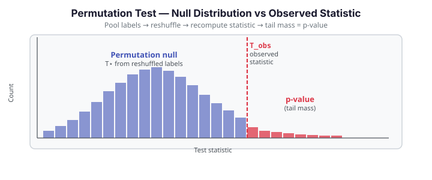
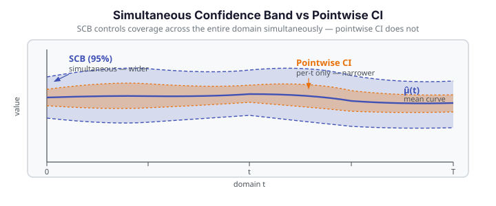
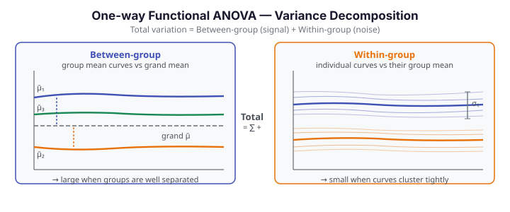

# Functional Inference

Functional inference extends classical hypothesis testing to data where each observation is a curve. Instead of comparing scalar means with a $t$-test, you compare mean *functions*; instead of a pointwise confidence interval, you build a band that covers the entire domain simultaneously. The `fdars.inference` module provides three families of procedures:

| Family | Functions | What it tests | Returns |
|---|---|---|---|
| **Two-sample tests** | `t_perm_test`, `f_perm_test`, `two_sample_mean_test` | Equal mean curves between two groups | `{"statistic", "p_value", "n_perm"}` |
| **Simultaneous confidence bands** | `mean_scb`, `scb_two_sample_test` | Coverage of the mean curve / mean-difference curve | `{"lower","upper","center","half_width"}` or `{"statistic","p_value","n_perm"}` |
| **One-way functional ANOVA** | `oneway_anova_vstat` | Equal mean curves across $k \ge 2$ groups | `{"statistic", "p_value", "n_perm"}` |

---

## Two-sample tests

{ .fdars-diagram }

### Theory

Given two independent samples of curves $\{X_1^{(a)}, \dots, X_{n_a}^{(a)}\}$ and $\{X_1^{(b)}, \dots, X_{n_b}^{(b)}\}$, the null hypothesis $H_0 : \mu_a = \mu_b$ is tested by constructing a permutation null distribution. The observed test statistic is

$$
T_{\mathrm{obs}} \;=\; \left(\int_{\mathcal T}\bigl(\hat\mu_a(t) - \hat\mu_b(t)\bigr)^2\,dt\right)^{1/2}
$$

for `t_perm_test` (integrated $L^2$ distance between sample mean curves) or the analogous integrated $F$-ratio for `f_perm_test`. The permutation null pools all $n_a + n_b$ curves, re-draws a random split of size $n_a$ and $n_b$ via a seeded Fisher–Yates shuffle, and recomputes the statistic. After `n_perm` reshufflings the p-value is

$$
\hat p \;=\; \frac{\#\{T^* \ge T_{\mathrm{obs}}\} + 1}{n_{\mathrm{perm}} + 1}.
$$

The $+1$ numerator and denominator follow the standard conservative correction (Phipson & Smyth, 2010): the observed statistic is always counted once on both sides, preventing an exact $0/n$ p-value.

`two_sample_mean_test` projects both samples onto a shared FPC basis fitted on the pooled data and applies Hotelling $T^2$ on the difference of group score vectors; the p-value is asymptotic ($\chi^2$ with `ncomp` degrees of freedom) and `n_perm` is always `0`.

**Parameters**

| Parameter | Type | Default | Description |
|---|---|---|---|
| `data_a` | `ndarray (n_a, m)` | — | First sample; rows are observations |
| `data_b` | `ndarray (n_b, m)` | — | Second sample; must have the same column count |
| `argvals` | `ndarray (m,)` | — | Shared evaluation grid |
| `n_perm` | `int` | `999` | Number of permutations (`t_perm_test`, `f_perm_test`) |
| `seed` | `int \| None` | `None` | RNG seed (`None` → fixed default `0`); `t_perm_test`, `f_perm_test` only |
| `ncomp` | `int` | `5` | FPC components for shared basis (`two_sample_mean_test` only) |

**Returns** a dict `{"statistic": float, "p_value": float, "n_perm": int}`.

```python exec="1" html="1" source="above"
import numpy as np
from docs_data import load_growth
from docs_fig import fig, render, fast
import fdars.inference as fi

age, X, meta = load_growth()
boys_idx = np.where(meta["sex"].values == "male")[0]
girls_idx = np.where(meta["sex"].values == "female")[0]
# Subset: first 20 boys and first 20 girls (keeps compute tiny)
A = X[boys_idx[:20]]
B = X[girls_idx[:20]]

n_perm = fast(199, 19)
r_t = fi.t_perm_test(A, B, age, n_perm=n_perm, seed=0)
r_f = fi.f_perm_test(A, B, age, n_perm=n_perm, seed=0)

# Build permutation null manually for the plot (reuse the same n_perm)
rng = np.random.default_rng(0)
pooled = np.vstack([A, B])
n_a = len(A)
stats_null = []
for _ in range(n_perm):
    perm = rng.permutation(len(pooled))
    ga = pooled[perm[:n_a]]
    gb = pooled[perm[n_a:]]
    diff = ga.mean(0) - gb.mean(0)
    # Simpson integration over age grid for the L2 statistic
    dt = np.diff(age)
    mid = (diff[:-1] ** 2 + diff[1:] ** 2) / 2.0
    stats_null.append(float(np.sqrt((mid * dt).sum())))

obs_t = float(r_t["statistic"])

f, (a0, a1) = fig(1, 2, figsize=(11.0, 3.8))

# Left: curves
colors = {"male": "#3f51b5", "female": "#e8710a"}
for i, idx in enumerate(boys_idx[:20]):
    a0.plot(age, X[idx], color="#3f51b5", lw=0.8, alpha=0.4)
for i, idx in enumerate(girls_idx[:20]):
    a0.plot(age, X[idx], color="#e8710a", lw=0.8, alpha=0.4)
a0.plot(age, A.mean(0), color="#3f51b5", lw=2.2, label="boys mean")
a0.plot(age, B.mean(0), color="#e8710a", lw=2.2, label="girls mean")
a0.set(title="Growth curves (20 boys / 20 girls)",
       xlabel="age (years)", ylabel="height (cm)")
a0.legend(fontsize=9)

# Right: permutation null histogram + observed statistic
a1.hist(stats_null, bins=15, color="#3f51b5", alpha=0.65, label="permutation null T*")
a1.axvline(obs_t, color="#dc3545", lw=2.2, ls="--",
           label=f"T_obs = {obs_t:.2f}")
tail = [s for s in stats_null if s >= obs_t]
if tail:
    a1.hist(tail, bins=6, color="#dc3545", alpha=0.75, label=f"tail (p ≈ {r_t['p_value']:.2f})")
a1.set(title="Permutation null vs observed statistic",
       xlabel="integrated L² distance", ylabel="count")
a1.legend(fontsize=9)

print(render(f))
print(f"t_perm_test:            statistic={r_t['statistic']:.3f}  p_value={r_t['p_value']:.3f}  n_perm={r_t['n_perm']}")
print(f"f_perm_test:            statistic={r_f['statistic']:.3f}  p_value={r_f['p_value']:.3f}  n_perm={r_f['n_perm']}")
print("FDARS_FENCE_OK")
```

---

## Simultaneous confidence bands

{ .fdars-diagram }

### Theory

A pointwise confidence interval at level $1-\alpha$ covers the true mean $\mu(t)$ at each *individual* time point with probability $1-\alpha$; the family-wise coverage across the full domain can be much lower. A **simultaneous confidence band** controls coverage over the *entire* domain at once:

$$
P\!\Bigl(\mu(t) \in \bigl[\hat\mu(t) - h(t),\; \hat\mu(t) + h(t)\bigr] \;\forall\, t \in \mathcal T\Bigr) \;\ge\; 1 - \alpha.
$$

`mean_scb` uses the Degras (2011) multiplier bootstrap: generate `nb` independent multiplier vectors $\varepsilon^{(b)} \in \mathbb R^n$ (Gaussian or Rademacher), form the perturbed mean $\hat\mu^{(b)}(t) = n^{-1}\sum_i \varepsilon^{(b)}_i X_i(t)$, and take the $(1-\alpha)$ quantile of $\sup_t |\hat\mu^{(b)}(t)| / \hat\sigma(t)$ as the critical value $q_{1-\alpha}$. The half-width is then

$$
h(t) \;=\; q_{1-\alpha} \cdot \hat\sigma(t) / \sqrt{n},
$$

where $\hat\sigma(t)$ is the local-polynomial pointwise standard error estimated with the given `bandwidth`. The SCB is always wider than the pointwise CI because it must guard against the worst-case excursion over all of $t$ simultaneously.

`scb_two_sample_test` forms the paired difference $d_i(t) = X_i^{(a)}(t) - X_i^{(b)}(t)$ over the first $\min(n_a, n_b)$ rows and builds an SCB for the mean difference; the null $\mu_a = \mu_b$ is rejected when the band excludes zero at any $t$. The returned `statistic` is $\max_t |\hat\mu_d(t)| / h(t)$; it exceeds `1.0` when the null is rejected.

**Parameters**

| Parameter | Type | Default | Description |
|---|---|---|---|
| `data` | `ndarray (n, m)` | — | Functional data matrix; `n >= 3` |
| `argvals` | `ndarray (m,)` | — | Evaluation grid |
| `bandwidth` | `float` | — | Kernel bandwidth for local-polynomial smoothing; must be positive |
| `nb` | `int` | `200` | Multiplier bootstrap replicates |
| `confidence` | `float` | `0.95` | Simultaneous coverage level, in `(0, 1)` |
| `multiplier` | `str` | `"gaussian"` | Multiplier distribution: `"gaussian"` or `"rademacher"` |

`mean_scb` returns `{"lower": ndarray, "upper": ndarray, "center": ndarray, "half_width": ndarray}` — each shape `(m,)`.

`scb_two_sample_test` takes `data_a`, `data_b`, `argvals`, `bandwidth` (plus the same optional parameters) and returns `{"statistic": float, "p_value": float, "n_perm": int}` with `n_perm` always `0`.

```python exec="1" html="1" source="above"
import numpy as np
from docs_data import load_canadian_weather
from docs_fig import fig, render, fast
import fdars.inference as fi

day, X, meta = load_canadian_weather()
# Subsample: every 4th day → 92-point grid; first 15 stations
step = 4
day_sub = day[::step]
X_sub = X[:15, ::step]

bandwidth = (day_sub[-1] - day_sub[0]) / 6.0  # ~60 days
nb = fast(200, 50)

scb = fi.mean_scb(X_sub, day_sub, bandwidth=bandwidth, nb=nb, confidence=0.95)
center = np.asarray(scb["center"])
lower  = np.asarray(scb["lower"])
upper  = np.asarray(scb["upper"])
hw     = np.asarray(scb["half_width"])

# Pointwise ±1.96·SE for comparison
se = np.std(X_sub, axis=0, ddof=1) / np.sqrt(X_sub.shape[0])
pw_lo = center - 1.96 * se
pw_hi = center + 1.96 * se

f, ax = fig(figsize=(9.0, 4.2))
for xi in X_sub:
    ax.plot(day_sub, xi, color="#6c757d", lw=0.5, alpha=0.25)
ax.fill_between(day_sub, lower, upper, color="#3f51b5", alpha=0.22,
                label="95% simultaneous band (SCB)")
ax.fill_between(day_sub, pw_lo, pw_hi, color="#e8710a", alpha=0.35,
                label="95% pointwise CI (narrower)")
ax.plot(day_sub, center, color="#3f51b5", lw=2.2, label="mean curve")
ax.set(title="Canadian temperature — simultaneous vs pointwise confidence bands",
       xlabel="day of year", ylabel="temperature (°C)")
ax.legend(fontsize=9)

print(render(f))
print(f"mean_scb: mean half_width = {hw.mean():.3f} °C  (95% SCB, nb={nb})")
print("FDARS_FENCE_OK")
```

---

## One-way functional ANOVA

{ .fdars-diagram }

### Theory

Functional ANOVA decomposes the total variation across $n$ curves from $k$ groups into a **between-group** term (separation of group mean curves from the grand mean) and a **within-group** term (spread of individual curves around their group mean). Denote the grand mean $\bar\mu(t) = n^{-1}\sum_i X_i(t)$, group means $\bar\mu_g(t) = n_g^{-1}\sum_{i \in g} X_i(t)$, and group sizes $n_g$. The decomposition is

$$
\underbrace{\sum_i\!\int_{\mathcal T}\!\bigl(X_i(t)-\bar\mu(t)\bigr)^2 dt}_{\text{total}}
\;=\;
\underbrace{\sum_g n_g\!\int_{\mathcal T}\!\bigl(\bar\mu_g(t)-\bar\mu(t)\bigr)^2 dt}_{\text{between}}
\;+\;
\underbrace{\sum_g\sum_{i\in g}\!\int_{\mathcal T}\!\bigl(X_i(t)-\bar\mu_g(t)\bigr)^2 dt}_{\text{within}}.
$$

`oneway_anova_vstat` computes the V-statistic (Shen & Faraway, 2004; Zhang & Liang, 2014), which aggregates the between-group separation over the domain and applies a Satterthwaite $\chi^2$ approximation to its asymptotic null distribution. Unlike the permutation-based `fanova` (in `fdars.regression`), `oneway_anova_vstat` is a single-pass computation whose `n_perm` is always `0`.

!!! note "Integer group labels required"
    `groups` must be a 1-D `int64` array of **non-negative** labels. Map string or categorical labels to `0, 1, 2, ...` before calling. Labels need not be contiguous — any distinct non-negative `int64` values define the groups.

**Parameters**

| Parameter | Type | Default | Description |
|---|---|---|---|
| `data` | `ndarray (n, m)` | — | Functional data matrix |
| `groups` | `ndarray (n,)` int64 | — | Non-negative integer group labels |
| `argvals` | `ndarray (m,)` | — | Evaluation grid |

**Returns** `{"statistic": float, "p_value": float, "n_perm": int}` with `n_perm` always `0`.

```python exec="1" html="1" source="above"
import numpy as np
from docs_data import load_canadian_weather
from docs_fig import fig, render, fast
import fdars.inference as fi

day, X, meta = load_canadian_weather()
regions = meta["region"].values
unique_regions = sorted(set(regions))
region_map = {r: i for i, r in enumerate(unique_regions)}
groups_all = np.array([region_map[r] for r in regions], dtype=np.int64)

# Downsample: every 5th day → 73-point grid
step = 5
day_sub = day[::step]
X_sub = X[:, ::step]

r_anova = fi.oneway_anova_vstat(X_sub, groups_all, day_sub)

f, ax = fig(figsize=(9.0, 4.2))
palette = ["#3f51b5", "#e8710a", "#198754", "#dc3545"]
for g, region in enumerate(unique_regions):
    idx = np.where(groups_all == region_map[region])[0]
    color = palette[g % len(palette)]
    for i in idx:
        ax.plot(day_sub, X_sub[i], color=color, lw=0.7, alpha=0.35)
    ax.plot(day_sub, X_sub[idx].mean(0), color=color, lw=2.4,
            label=f"{region} (n={len(idx)})")
ax.set(title="Canadian temperature by region — functional ANOVA groups",
       xlabel="day of year", ylabel="temperature (°C)")
ax.legend(fontsize=9)

print(render(f))
print(f"oneway_anova_vstat: statistic={r_anova['statistic']:.2f}  "
      f"p_value={r_anova['p_value']:.4f}  n_perm={r_anova['n_perm']}")
print("FDARS_FENCE_OK")
```

---

## Functional linear model inference

Two additional functions test the scalar-on-function regression model $Y_i = \int X_i(t)\,\beta(t)\,dt + \varepsilon_i$ fitted via `fregre_lm` with `n_comp` FPC components. Both are asymptotic (no permutations; `n_perm` always `0`).

**`flm_f_test(data, response, n_comp=5)`** — overall F-test for the regression. A significant result (small `p_value`) means the functional predictor explains a statistically significant fraction of the variance in the scalar response, i.e. the regression is globally meaningful.

**`flm_gof_test(data, response, n_comp=5)`** — Ramsey–RESET-style goodness-of-fit test. A significant result (small `p_value`) indicates that the functional linear specification is inadequate: a nonlinear effect of the functional predictor is present.

Both accept `data` of shape `(n, m)`, a 1-D `response` of length `n`, and an optional `n_comp` (default `5`; must satisfy `n > n_comp + 4` for sufficient residual degrees of freedom).

**Returns** `{"statistic": float, "p_value": float, "n_perm": int}`.

```python exec="1" html="1" source="above"
import numpy as np
from docs_data import load_tecator
from docs_fig import fig, render
import fdars.inference as fi

wav, X, meta = load_tecator()
fat = meta["fat"].values
# Subset: first 80 samples (keeps compute fast)
X_sub = X[:80]
fat_sub = fat[:80]

r_f   = fi.flm_f_test(X_sub, fat_sub, n_comp=3)
r_gof = fi.flm_gof_test(X_sub, fat_sub, n_comp=3)

f, ax = fig(figsize=(7.5, 4.0))
ax.scatter(np.arange(len(fat_sub)), fat_sub, s=18, color="#3f51b5", alpha=0.6)
ax.set(title="Tecator: fat content (response for FLM inference)",
       xlabel="sample index", ylabel="fat (%)")

print(render(f))
print(f"flm_f_test:   statistic={r_f['statistic']:.3f}  p_value={r_f['p_value']:.2e}")
print(f"flm_gof_test: statistic={r_gof['statistic']:.3f}  p_value={r_gof['p_value']:.3f}")
print("FDARS_FENCE_OK")
```

!!! tip "Which test to use?"
    - Run `flm_f_test` first: a non-significant result means the functional predictor is not useful at all.
    - If `flm_f_test` is significant, run `flm_gof_test`: a significant result flags that the linear model is misspecified and a nonlinear extension may be warranted.

---

## References

1. Ramsay, J. O., and Silverman, B. W. (2005). *Functional Data Analysis*, 2nd ed. Springer. — Chapter 13: statistical inference for functional data; the basis for `t_perm_test` and `f_perm_test`.
2. Degras, D. (2011). "Simultaneous confidence bands for nonparametric regression with functional data." *Statistica Sinica*, 21(4), 1735–1765. — multiplier bootstrap SCB methodology behind `mean_scb` and `scb_two_sample_test`.
3. Zhang, J.-T. (2014). *Analysis of Variance for Functional Data*. CRC Press. — the asymptotic V-statistic for functional ANOVA underlying `oneway_anova_vstat`.
4. Phipson, B., and Smyth, G. K. (2010). "Permutation P-values should never be zero: calculating exact P-values when permutations are randomly drawn." *Statistical Applications in Genetics and Molecular Biology*, 9(1). — justification of the `(#perm ≥ T_obs + 1) / (n_perm + 1)` convention.
