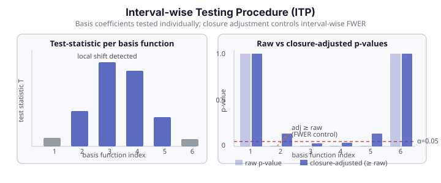

# Interval-wise Testing Procedure (ITP)

The **Interval-wise Testing Procedure** (ITP) tests *where along the domain* two functional populations differ — or where a single functional population deviates from a reference curve — with rigorous interval-wise family-wise error rate (FWER) control. Rather than producing a single p-value for the whole domain, ITP returns a **vector of p-values**, one per basis function, identifying which basis coefficients drive the difference. The `fdars.inference` module exposes three ITP entry points:

| Function | Question answered |
|---|---|
| `itp_one_pop` | Does the functional mean equal a reference curve $\mu_0$? |
| `itp_two_pop` | Do two functional populations share the same mean curve? |
| `itp_flm` | Is the functional predictor significant in a scalar-on-function regression? |

---

## Diagram

{ .fdars-diagram }

---

## Theory

### Basis expansion and projection

Each observed curve $X_i(t)$ is projected onto a set of $K$ basis functions $\{\phi_1, \dots, \phi_K\}$ (B-spline or Fourier), giving scalar coefficients $c_{ik} = \langle X_i, \phi_k \rangle$. Testing proceeds **separately** on each coefficient:

$$
H_0^{(k)} : \mathbb{E}[c_{ik}] = c_k^{(0)}, \quad k = 1, \dots, K.
$$

For each coefficient $k$, a permutation null distribution is built by randomly shuffling group labels (or adding/removing the reference function) and recomputing the test statistic. The raw p-value for basis $k$ is

$$
p_k^{\mathrm{raw}} = \frac{\#\{T_k^* \ge T_k^{\mathrm{obs}}\} + 1}{n_{\mathrm{perm}} + 1}.
$$

### Closure adjustment and FWER control

Because $K$ hypotheses are tested simultaneously, ITP applies the **closure principle** to control the interval-wise FWER. The closure adjustment takes cumulative min-p values across nested subsets of basis indices, then re-applies the marginal distribution, producing adjusted p-values $p_k^{\mathrm{adj}}$ that satisfy

$$
P\!\Bigl(\exists\, k \in S : p_k^{\mathrm{adj}} \le \alpha \;\Big|\; H_0^{(k)} \text{ true for all } k \in S\Bigr) \le \alpha
$$

for every subset $S \subseteq \{1, \dots, K\}$ simultaneously.

!!! note "Closure increases individual p-values"
    The adjusted p-values are **at or above** the raw p-values: $p_k^{\mathrm{adj}} \ge p_k^{\mathrm{raw}}$. This is the expected behaviour of a multiple-testing correction — the price paid for simultaneous FWER control is that individual coefficients need a stronger signal to be declared significant after adjustment. A coefficient whose raw p-value is 0.005 may have an adjusted p-value of 0.14 if its neighbours are not also significant.

---

## Parameters

### `itp_one_pop`

Tests whether the mean of a single functional sample equals a reference curve.

| Parameter | Type | Default | Description |
|---|---|---|---|
| `data` | `ndarray (n, m)` | — | Functional data matrix; $n \ge 2$ |
| `argvals` | `ndarray (m,)` | — | Evaluation grid |
| `mu0` | `ndarray (m,) \| None` | `None` | Reference mean curve; `None` → zero function |
| `basis_type` | `str` | `"bspline"` | Projection basis: `"bspline"` or `"fourier"` |
| `nbasis` | `int` | `5` | Requested number of basis functions (see clamping note below) |
| `n_perm` | `int` | `999` | Permutation count |
| `seed` | `int \| None` | `None` | RNG seed; `None` resolves to `0` — two calls with identical inputs and `seed=None` are byte-identical |

### `itp_two_pop`

Tests whether two independent functional samples share the same mean curve.

| Parameter | Type | Default | Description |
|---|---|---|---|
| `data_a` | `ndarray (n_a, m)` | — | First sample; $n_a \ge 2$ |
| `data_b` | `ndarray (n_b, m)` | — | Second sample; $n_b \ge 2$; must match column count |
| `argvals` | `ndarray (m,)` | — | Evaluation grid |
| `basis_type` | `str` | `"bspline"` | `"bspline"` or `"fourier"` |
| `nbasis` | `int` | `5` | Requested basis count |
| `n_perm` | `int` | `999` | Permutation count |
| `seed` | `int \| None` | `None` | RNG seed |

### `itp_flm`

Tests whether the functional predictor is significant in the scalar-on-function regression $Y_i = \int X_i(t)\beta(t)\,dt + \varepsilon_i$ projected onto the basis.

| Parameter | Type | Default | Description |
|---|---|---|---|
| `data` | `ndarray (n, m)` | — | Functional predictor matrix |
| `response` | `ndarray (n,)` | — | Scalar response |
| `argvals` | `ndarray (m,)` | — | Evaluation grid |
| `basis_type` | `str` | `"bspline"` | `"bspline"` or `"fourier"` |
| `nbasis` | `int` | `5` | Requested basis count |
| `n_perm` | `int` | `999` | Permutation count |
| `seed` | `int \| None` | `None` | RNG seed |

---

## Returns

All three functions return the same five-key dict:

| Key | Type | Description |
|---|---|---|
| `adjusted_pvalues` | `ndarray (n_basis,)` | Closure-adjusted p-values, one per basis function |
| `raw_pvalues` | `ndarray (n_basis,)` | Raw (unadjusted) permutation p-values |
| `basis_type` | `str` | The basis used (`"bspline"` or `"fourier"`) |
| `n_basis` | `int` | **Actual** basis count after clamping (see note) |
| `n_perm` | `int` | Permutations actually run |

!!! warning "n_basis after B-spline clamping (Pitfall 5)"
    For `basis_type="bspline"`, the B-spline library may reduce the actual basis count below the requested `nbasis` if the grid is too coarse to support that many basis functions. Always read `n_basis` from the returned dict to know the true length of `adjusted_pvalues` and `raw_pvalues` — do **not** assume `len(adjusted_pvalues) == nbasis`.

---

## Example

```python exec="1" source="above"
import numpy as np
from docs_fig import fast
import fdars.inference as fi

rng = np.random.default_rng(5)
n, m = 20, 40
t = np.linspace(0, 1, m)
# Curves with a local mean shift in the middle of the domain
X = np.array([np.sin(2 * np.pi * t) + rng.normal(0, 0.3, m) for _ in range(n)])
X[:, 16:28] += 1.0   # local shift in basis coefficients 2–4

n_perm = fast(199, 19)
res = fi.itp_one_pop(X, t, mu0=None, basis_type="bspline", nbasis=5,
                     n_perm=n_perm, seed=0)
adj_p = np.asarray(res["adjusted_pvalues"])
raw_p = np.asarray(res["raw_pvalues"])

print(f"n_basis (actual)={res['n_basis']}  n_perm={res['n_perm']}")
print(f"adjusted_pvalues={adj_p.round(3).tolist()}")
print(f"raw_pvalues     ={raw_p.round(3).tolist()}")
print("FDARS_FENCE_OK")
```

---

## References

1. Pini, A., and Vantini, S. (2017). "Interval-wise testing for functional data." *Journal of Nonparametric Statistics*, 29(2), 407–424. — the original ITP paper defining the closure-based interval-wise FWER control.
2. Ramsay, J. O., and Silverman, B. W. (2005). *Functional Data Analysis*, 2nd ed. Springer. — Chapter 13 on functional hypothesis testing; B-spline and Fourier basis expansion background.
3. Romano, J. P., and Wolf, M. (2005). "Exact and approximate stepdown methods for multiple hypothesis testing." *Journal of the American Statistical Association*, 100(469), 94–108. — closure principle and stepdown procedures underlying the FWER correction.
