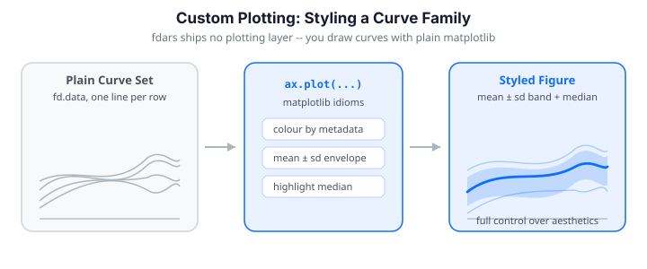

# Custom Plotting

fdars deliberately ships **no plotting layer** -- an `Fdata` object is just a
grid (`argvals`), a `(n_obs, n_points)` data matrix, and optional metadata, so
you draw it with plain matplotlib. That gives you full control over styling,
but a functional sample is a *family of curves* rather than a scatter of points,
so a few idioms recur: plotting whole curve families, colouring by metadata or
depth, drawing mean±sd envelopes, and highlighting the functional median. This
guide collects those recipes and mirrors the ggplot2 walkthrough from the R
package, translating each aesthetic mapping into matplotlib.


Every curve family reduces to one call -- `ax.plot(argvals, data.T)` plots each
row as its own line:

{ .fdars-diagram }

```python exec="1" html="1" source="above"
import numpy as np
from docs_fig import fig, render
from fdars import Fdata
from fdars.simulation import simulate

t = np.linspace(0, 1, 120)
X = np.asarray(simulate(n=30, argvals=t, n_basis=6, efun_type="fourier", seed=1))
fd = Fdata(X, argvals=t)

f, ax = fig()
ax.plot(t, np.asarray(fd.data).T, color="#3f51b5", lw=1, alpha=0.5)
ax.plot(t, np.asarray(fd.mean()), color="#e8710a", lw=2.6, label="pointwise mean")
ax.set(title="A functional sample: 30 curves and their mean",
       xlabel="t", ylabel="X(t)")
ax.legend()
print(render(f))
```

---

## The data behind a plot

Three attributes of an `Fdata` cover almost every plot you will draw:

| Attribute | Shape | Role in a plot |
|-----------|-------|----------------|
| `fd.argvals` | `(n_points,)` | the x-axis (shared grid) |
| `fd.data` | `(n_obs, n_points)` | one row per curve -- transpose to plot |
| `fd.metadata` | `DataFrame` `(n_obs, ...)` | per-curve colour / group keys |

The single most important idiom is the **transpose**. matplotlib's `ax.plot`
draws one line per *column* of a 2-D array, but fdars stores one curve per
*row*, so you plot `data.T`:

```python
ax.plot(fd.argvals, np.asarray(fd.data).T, lw=1, alpha=0.4)
```

!!! note "No long-format detour"
    The R vignette starts by melting the wide matrix into a tidy long
    data frame (`curve_id, t, value, ...`) because ggplot2 maps *columns* of a
    data frame to aesthetics. matplotlib works straight off the 2-D array, so
    there is nothing to reshape -- the `(n_obs, n_points)` matrix *is* the plot
    input. Metadata stays a separate `(n_obs, ...)` table you index into by row.

!!! note "Wrap returns with `np.asarray`"
    `Fdata` accessors and most `fdars` functions return Rust-backed sequences.
    Wrapping with `np.asarray(...)` before `.T`, slicing, or arithmetic keeps
    the examples robust and lets you use full NumPy indexing.

For the group-based recipes below we reuse one two-population sample: a
`control` group and a `treatment` group that is shifted and steepened. Attaching
a metadata frame lets us colour, band, and facet by `group` throughout.

---

## Colouring by group metadata

When curves carry a categorical label, colour each group separately and build
the legend from the group names rather than from individual curves. Iterate over
the unique groups, mask the data matrix, and give the whole block one label.
This is the matplotlib translation of ggplot2's `color = group` aesthetic:

```python exec="1" html="1" source="above"
import numpy as np
import pandas as pd
from docs_fig import fig, render
from fdars import Fdata
from fdars.simulation import simulate

t = np.linspace(0, 1, 120)
# Two populations: a baseline and a shifted+steeper variant
A = np.asarray(simulate(n=18, argvals=t, n_basis=6, seed=3))
B = np.asarray(simulate(n=18, argvals=t, n_basis=6, seed=9)) + 1.5 * t
X = np.vstack([A, B])
meta = pd.DataFrame({"group": ["control"] * 18 + ["treatment"] * 18})
fd = Fdata(X, argvals=t, metadata=meta)

palette = {"control": "#56b4e9", "treatment": "#e69f00"}
groups = np.asarray(fd.metadata["group"])
data = np.asarray(fd.data)

f, ax = fig()
for name, col in palette.items():
    rows = data[groups == name]
    ax.plot(t, rows.T, color=col, lw=1, alpha=0.35)
    ax.plot(t, rows.mean(axis=0), color=col, lw=2.6, label=f"{name} mean")
ax.set(title="Curves coloured by group, with per-group means",
       xlabel="t", ylabel="X(t)")
ax.legend()
print(render(f))
```

The trick with the legend is to attach the label only to the bold group-mean
line, so matplotlib does not add 36 entries for the individual curves.

---

## Colouring by a continuous covariate

When the interesting covariate is numeric -- age, dose, temperature -- map it to
a colormap instead of a discrete palette. In ggplot2 this is
`scale_color_viridis_c`; in matplotlib you normalise the covariate to `[0, 1]`
and pass each value through a colormap. A `ScalarMappable` gives you the
matching colourbar:

```python exec="1" html="1" source="above"
import numpy as np
import matplotlib.pyplot as plt
from matplotlib.cm import ScalarMappable
from matplotlib.colors import Normalize
from docs_fig import fig, render
from fdars import Fdata
from fdars.simulation import simulate

rng = np.random.default_rng(42)
t = np.linspace(0, 1, 120)
X = np.asarray(simulate(n=30, argvals=t, n_basis=6, seed=7))
age = rng.uniform(20, 60, size=30)          # a continuous per-curve covariate
data = np.asarray(X)

norm = Normalize(vmin=age.min(), vmax=age.max())
cmap = plt.cm.plasma

f, ax = fig()
for i in range(data.shape[0]):
    ax.plot(t, data[i], color=cmap(norm(age[i])), lw=1.2, alpha=0.8)
ax.set(title="Curves shaded by a continuous covariate (age)",
       xlabel="t", ylabel="X(t)")
sm = ScalarMappable(norm=norm, cmap=cmap)
f.colorbar(sm, ax=ax, label="age")
print(render(f))
```

The colourbar replaces the discrete legend: a reader reads a curve's covariate
value straight off the colour scale.

---

## Mean ± standard-deviation bands

A cleaner summary of a group is a shaded envelope: the pointwise mean with a
band at $\pm k$ standard deviations. Compute both statistics along the
observation axis (`axis=0`) and draw the band with `ax.fill_between` -- the
matplotlib equivalent of `geom_ribbon`:

$$
\bar{X}(t) = \frac{1}{n}\sum_{i=1}^{n} X_i(t), \qquad
s(t) = \sqrt{\frac{1}{n-1}\sum_{i=1}^{n}\bigl(X_i(t) - \bar{X}(t)\bigr)^2}
$$

```python exec="1" html="1" source="above"
import numpy as np
import pandas as pd
from docs_fig import fig, render
from fdars import Fdata
from fdars.simulation import simulate

t = np.linspace(0, 1, 120)
A = np.asarray(simulate(n=25, argvals=t, n_basis=6, seed=3))
B = np.asarray(simulate(n=25, argvals=t, n_basis=6, seed=9)) + 1.5 * t
X = np.vstack([A, B])
meta = pd.DataFrame({"group": ["control"] * 25 + ["treatment"] * 25})
fd = Fdata(X, argvals=t, metadata=meta)

palette = {"control": "#56b4e9", "treatment": "#e69f00"}
groups = np.asarray(fd.metadata["group"])
data = np.asarray(fd.data)

f, ax = fig()
for name, col in palette.items():
    rows = data[groups == name]
    mu = rows.mean(axis=0)
    sd = rows.std(axis=0, ddof=1)
    ax.fill_between(t, mu - sd, mu + sd, color=col, alpha=0.20)
    ax.plot(t, mu, color=col, lw=2.4, label=f"{name}  (mean ± sd)")
ax.set(title="Mean ± 1 sd envelope per group",
       xlabel="t", ylabel="X(t)")
ax.legend()
print(render(f))
```

!!! tip "Bands vs. spaghetti"
    Overlaying dozens of raw curves ("spaghetti plots") hides the central
    tendency. A mean±sd band scales to hundreds of curves and makes group
    differences pop out. Use `fill_between(..., alpha=0.2)` so overlapping bands
    stay legible.

---

## Mean with a 95% confidence band

A standard-deviation band shows the *spread* of the curves; a confidence band
shows the uncertainty of the *mean*. Divide the pointwise standard deviation by
$\sqrt{n}$ to get the standard error, then draw the band at $\pm 1.96$ standard
errors:

$$
\text{SE}(t) = \frac{s(t)}{\sqrt{n}}, \qquad
\bar{X}(t) \pm 1.96\,\text{SE}(t)
$$

The R vignette layers faded individual curves under the ribbon; we do the same
so the raw data stays visible behind the summary:

```python exec="1" html="1" source="above"
import numpy as np
import pandas as pd
from docs_fig import fig, render
from fdars import Fdata
from fdars.simulation import simulate

t = np.linspace(0, 1, 120)
A = np.asarray(simulate(n=25, argvals=t, n_basis=6, seed=3))
B = np.asarray(simulate(n=25, argvals=t, n_basis=6, seed=9)) + 1.5 * t
X = np.vstack([A, B])
meta = pd.DataFrame({"group": ["control"] * 25 + ["treatment"] * 25})
fd = Fdata(X, argvals=t, metadata=meta)

palette = {"control": "#56b4e9", "treatment": "#e69f00"}
groups = np.asarray(fd.metadata["group"])
data = np.asarray(fd.data)

f, ax = fig()
for name, col in palette.items():
    rows = data[groups == name]
    ax.plot(t, rows.T, color=col, lw=0.4, alpha=0.15)         # faded raw curves
    mu = rows.mean(axis=0)
    se = rows.std(axis=0, ddof=1) / np.sqrt(rows.shape[0])
    ax.fill_between(t, mu - 1.96 * se, mu + 1.96 * se, color=col, alpha=0.30)
    ax.plot(t, mu, color=col, lw=1.6, label=f"{name} mean")
ax.set(title="Group means with 95% confidence bands",
       xlabel="t", ylabel="X(t)")
ax.legend(loc="upper left")
print(render(f))
```

Because the band is $s/\sqrt{n}$ wide, it shrinks as the sample grows -- a
95% CI is much tighter than the ±1 sd envelope above and answers a different
question ("where is the mean?" rather than "where are the curves?").

---

## Median with quantile bands

Means and standard deviations assume roughly symmetric spread. A distribution-free
alternative is the **pointwise median** wrapped in nested quantile bands: an
inner interquartile band (25th--75th percentile) and an outer 10th--90th band.
`np.percentile` along `axis=0` gives every band at once:

```python exec="1" html="1" source="above"
import numpy as np
import pandas as pd
from docs_fig import fig, render
from fdars import Fdata
from fdars.simulation import simulate

t = np.linspace(0, 1, 120)
A = np.asarray(simulate(n=30, argvals=t, n_basis=6, seed=3))
B = np.asarray(simulate(n=30, argvals=t, n_basis=6, seed=9)) + 1.5 * t
X = np.vstack([A, B])
meta = pd.DataFrame({"group": ["control"] * 30 + ["treatment"] * 30})
fd = Fdata(X, argvals=t, metadata=meta)

palette = {"control": "#e41a1c", "treatment": "#377eb8"}
groups = np.asarray(fd.metadata["group"])
data = np.asarray(fd.data)
names = list(palette)

f, axes = fig(1, 2, figsize=(9.0, 4.0), sharex=True, sharey=True)
for ax, name in zip(axes, names):
    rows = data[groups == name]
    col = palette[name]
    q10, q25, q50, q75, q90 = np.percentile(rows, [10, 25, 50, 75, 90], axis=0)
    ax.fill_between(t, q10, q90, color=col, alpha=0.20)      # 10-90% band
    ax.fill_between(t, q25, q75, color=col, alpha=0.40)      # IQR band
    ax.plot(t, q50, color=col, lw=1.8)                       # median
    ax.set_title(name)
    ax.set_xlabel("t")
axes[0].set_ylabel("X(t)")
f.suptitle("Median with IQR and 10-90% bands", y=1.02)
print(render(f))
```

Faceting the two groups into separate panels (matching R's `facet_wrap(~ group)`)
keeps the nested bands from overlapping into mud. Quantile bands are robust: a
single wild curve widens the outer band slightly but leaves the median untouched.

---

## Highlighting outliers by depth

Instead of eyeballing which curves look odd, rank them by **functional depth**
and flag the shallowest. Curves whose depth falls below the 10th percentile are
drawn in red over a grey backdrop -- the matplotlib version of R's
depth-thresholded outlier plot (there the depth is `depth.MBD`; here we use the
modified band depth, `fd.depth("modified_band")`):

```python exec="1" html="1" source="above"
import numpy as np
from docs_fig import fig, render
from fdars import Fdata
from fdars.simulation import simulate

t = np.linspace(0, 1, 120)
X = np.asarray(simulate(n=30, argvals=t, n_basis=6, efun_type="fourier", seed=1))
fd = Fdata(X, argvals=t)

depth = np.asarray(fd.depth("modified_band"))
threshold = np.percentile(depth, 10)          # shallowest 10% = candidate outliers
is_outlier = depth < threshold
data = np.asarray(fd.data)

f, ax = fig()
ax.plot(t, data[~is_outlier].T, color="#b0b0b0", lw=0.9, alpha=0.6)
ax.plot(t, data[is_outlier].T, color="#d62728", lw=1.6, alpha=0.9)
ax.set(title=f"Depth-based outliers highlighted ({is_outlier.sum()} flagged)",
       xlabel="t", ylabel="X(t)")
print(render(f))
```

This is a quick visual screen, not a formal test. For principled functional
outlier detection -- functional boxplots, the outliergram, and magnitude/shape
diagnostics -- see [Outlier Detection](../analyze/outlier-detection.md).

---

## Highlighting a labelled subset

Sometimes you want to trace a handful of named curves through the crowd. Draw
everything else in light grey, plot the chosen rows in a qualitative palette,
and annotate each at its right endpoint with `ax.annotate`. Extend the x-axis a
little so the labels have room:

```python exec="1" html="1" source="above"
import numpy as np
from docs_fig import fig, render
from fdars import Fdata
from fdars.simulation import simulate

t = np.linspace(0, 1, 120)
X = np.asarray(simulate(n=30, argvals=t, n_basis=6, efun_type="fourier", seed=1))
data = np.asarray(X)

highlight = [0, 14, 29]                        # curves to trace and label
colors = ["#1b9e77", "#d95f02", "#7570b3"]     # a Dark2-style palette
mask = np.zeros(data.shape[0], dtype=bool)
mask[highlight] = True

f, ax = fig()
ax.plot(t, data[~mask].T, color="#cccccc", lw=0.8, alpha=0.6)
for idx, col in zip(highlight, colors):
    ax.plot(t, data[idx], color=col, lw=1.8)
    ax.annotate(f"curve {idx}", xy=(t[-1], data[idx, -1]),
                xytext=(6, 0), textcoords="offset points",
                color=col, va="center", fontsize=9)
ax.set(title="Three labelled curves over a grey backdrop",
       xlabel="t", ylabel="X(t)")
ax.set_xlim(t[0], t[-1] + 0.12 * np.ptp(t))    # room for the labels
print(render(f))
```

Endpoint labels beat a legend when only a few curves matter: the eye jumps
straight from the line to its name without a colour-matching step.

---

## Faceting: small multiples

When you want to compare several conditions without overplotting, give each its
own panel. This mirrors R's `facet_wrap`. `fig(nrows, ncols, sharey=True)`
returns a grid of axes; keep the y-axis shared so magnitudes are comparable
across panels:

```python exec="1" html="1" source="above"
import numpy as np
from docs_fig import fig, render
from fdars import Fdata
from fdars.simulation import simulate

t = np.linspace(0, 1, 120)
seeds = [1, 7, 21, 42]

f, axes = fig(2, 2, figsize=(9.0, 5.4), sharex=True, sharey=True)
for ax, s in zip(axes.ravel(), seeds):
    fd = Fdata(np.asarray(simulate(n=20, argvals=t, n_basis=6, seed=s)), argvals=t)
    data = np.asarray(fd.data)
    ax.plot(t, data.T, color="#6c757d", lw=0.9, alpha=0.35)
    ax.plot(t, data.mean(axis=0), color="#3f51b5", lw=2.4)
    ax.set_title(f"sample seed={s}")
for ax in axes[-1]:
    ax.set_xlabel("t")
for ax in axes[:, 0]:
    ax.set_ylabel("X(t)")
print(render(f))
```

Small multiples are the honest way to show four samples: nothing is hidden
behind anything else, and the shared axes make the panels directly comparable.
To facet by a *binned continuous* covariate (R's "Young / Middle / Senior" age
panels), bin the covariate with `np.digitize` and route each curve to the panel
for its bin.

---

## Rainbow plot: colouring by curve order

A **rainbow plot** maps each curve's index (or any monotone ordering) through a
full-spectrum colormap. It is handy when the curves have a natural sequence --
successive trials, days, or depth rank -- and you want to see drift across that
order. This is R's `scale_color_viridis_c(option = "turbo")`:

```python exec="1" html="1" source="above"
import numpy as np
import matplotlib.pyplot as plt
from docs_fig import fig, render
from fdars.simulation import simulate

t = np.linspace(0, 1, 120)
X = np.asarray(simulate(n=30, argvals=t, n_basis=6, seed=4))
data = np.asarray(X)
n = data.shape[0]

f, ax = fig()
for i in range(n):
    ax.plot(t, data[i], color=plt.cm.turbo(i / (n - 1)), lw=1.1, alpha=0.8)
ax.set(title="Rainbow plot: curves coloured by index order",
       xlabel="t", ylabel="X(t)")
print(render(f))
```

Ordering the curves by functional depth before colouring turns this into a
*centrality* rainbow -- deep curves at one end of the spectrum, outliers at the
other.

---

## Phase-plane plots

Some questions are about the *shape* of the dynamics rather than the value at a
given `t`. A **phase-plane plot** trades the time axis for a second signal --
classically a function against its own derivative. Compute the derivative with
`fd.deriv(1)` and plot value against velocity with `ax.plot`; time becomes the
implicit parameter tracing each loop:

```python exec="1" html="1" source="above"
import numpy as np
import pandas as pd
from docs_fig import fig, render
from fdars import Fdata
from fdars.simulation import simulate

t = np.linspace(0, 1, 200)
A = np.asarray(simulate(n=8, argvals=t, n_basis=5, seed=3))
B = np.asarray(simulate(n=8, argvals=t, n_basis=5, seed=9)) + 1.5 * t
X = np.vstack([A, B])
meta = pd.DataFrame({"group": ["control"] * 8 + ["treatment"] * 8})
fd = Fdata(X, argvals=t, metadata=meta)

value = np.asarray(fd.data)
velocity = np.asarray(fd.deriv(1).data)        # d/dt of each curve
palette = {"control": "#e41a1c", "treatment": "#377eb8"}
groups = np.asarray(fd.metadata["group"])

f, ax = fig(figsize=(5.4, 5.0))
seen = set()
for i in range(value.shape[0]):
    g = groups[i]
    ax.plot(value[i], velocity[i], color=palette[g], lw=1.2, alpha=0.7,
            label=g if g not in seen else None)
    seen.add(g)
ax.set(title="Phase-plane view: value vs. velocity",
       xlabel="X(t)", ylabel="X'(t)")
ax.set_aspect("equal", adjustable="datalim")
ax.legend()
print(render(f))
```

!!! note "Argvals disappear on the axes"
    In a phase-plane plot `t` is no longer an axis -- it is the *parameter*
    tracing each loop. Time is implicit in the direction of travel, so add
    arrows or a start marker if the direction matters. See
    [Working with Derivatives](derivatives.md) for more on velocity/acceleration
    curves.

---

## A custom functional boxplot envelope

The functional boxplot summarises a sample as a **median curve** wrapped in the
**central envelope** of the deepest 50% of curves, with shallow curves flagged
as outliers. fdars gives you the ingredient -- depth -- and you assemble the
envelope yourself: rank by depth, take the deepest half, and shade the pointwise
min/max of that central band with `fill_between`:

```python exec="1" html="1" source="above"
import numpy as np
from docs_fig import fig, render
from fdars import Fdata
from fdars.simulation import simulate

t = np.linspace(0, 1, 120)
X = np.asarray(simulate(n=30, argvals=t, n_basis=6, efun_type="fourier", seed=1))
fd = Fdata(X, argvals=t)

depth = np.asarray(fd.depth("modified_band"))
order = np.argsort(depth)[::-1]                 # deepest first
data = np.asarray(fd.data)

median = data[order[0]]                          # deepest curve = functional median
central = data[order[: len(order) // 2]]         # deepest 50%
env_lo, env_hi = central.min(axis=0), central.max(axis=0)
outliers = data[np.percentile(depth, 10) > depth]

f, ax = fig()
ax.fill_between(t, env_lo, env_hi, color="#4c72b0", alpha=0.35,
                label="central 50% envelope")
ax.plot(t, median, color="#1f2a44", lw=2.4, label="functional median")
if len(outliers):
    ax.plot(t, outliers.T, color="#d62728", lw=1.2, alpha=0.8)
ax.set(title="Custom functional boxplot from depth",
       xlabel="t", ylabel="X(t)")
ax.legend(loc="upper left")
print(render(f))
```

This is the manual construction R shows via `boxplot(fd)$median / $central /
$outliers`. For a fully-featured functional boxplot -- with the 1.5×IQR whisker
rule and the outliergram -- reach for
[Outlier Detection](../analyze/outlier-detection.md) rather than hand-rolling it.

---

## Heatmap of the data matrix

For dense samples, a heatmap can carry more than a spaghetti plot: each curve
becomes a horizontal strip, `t` runs along the x-axis, and the value is a
colour. Ordering the rows by depth (central curves at the bottom, outliers at
the top) turns the image into a centrality map. `ax.imshow` renders the matrix
directly:

```python exec="1" html="1" source="above"
import numpy as np
from docs_fig import fig, render
from fdars import Fdata
from fdars.simulation import simulate

t = np.linspace(0, 1, 120)
X = np.asarray(simulate(n=30, argvals=t, n_basis=6, efun_type="fourier", seed=1))
fd = Fdata(X, argvals=t)

depth = np.asarray(fd.depth("modified_band"))
order = np.argsort(depth)                        # shallow -> deep
M = np.asarray(fd.data)[order]

f, ax = fig(figsize=(7.2, 4.4))
im = ax.imshow(M, aspect="auto", origin="lower", cmap="magma",
               extent=[t[0], t[-1], 0, M.shape[0]])
ax.set(title="Heatmap of the sample (rows ordered by depth)",
       xlabel="t", ylabel="curve rank (deep at top)")
f.colorbar(im, ax=ax, label="X(t)")
print(render(f))
```

`extent` maps the pixel grid onto the real `argvals` axis so the x-ticks are in
data units, not column indices.

---

## Annotating peaks

Overlaying markers is often clearer than describing a feature in prose. Here we
find each curve's pointwise maximum with `argmax` and drop a dot on it, coloured
by group -- R's peak-annotation recipe. The curves fade into the background so
the markers carry the message:

```python exec="1" html="1" source="above"
import numpy as np
import pandas as pd
from docs_fig import fig, render
from fdars import Fdata
from fdars.simulation import simulate

t = np.linspace(0, 1, 120)
A = np.asarray(simulate(n=15, argvals=t, n_basis=6, seed=3))
B = np.asarray(simulate(n=15, argvals=t, n_basis=6, seed=9)) + 1.5 * t
X = np.vstack([A, B])
meta = pd.DataFrame({"group": ["control"] * 15 + ["treatment"] * 15})
fd = Fdata(X, argvals=t, metadata=meta)

data = np.asarray(fd.data)
groups = np.asarray(fd.metadata["group"])
palette = {"control": "#e41a1c", "treatment": "#377eb8"}

f, ax = fig()
ax.plot(t, data.T, color="#909090", lw=0.6, alpha=0.4)
for name, col in palette.items():
    rows = data[groups == name]
    peak_idx = rows.argmax(axis=1)               # time index of each peak
    ax.scatter(t[peak_idx], rows[np.arange(len(rows)), peak_idx],
               color=col, s=28, alpha=0.85, label=name, zorder=3)
ax.set(title="Peak location of each curve, coloured by group",
       xlabel="t", ylabel="X(t)")
ax.legend()
print(render(f))
```

The `zorder=3` keeps the markers above the grey curves; without it they would be
buried under later `plot` calls.

---

## FPCA score scatter with group ellipses

To collapse a whole curve to a point, project onto its first two functional
principal components. `fdars.regression.fpca` returns a `scores` matrix of shape
`(n_obs, n_comp)`; plotting PC1 against PC2 gives a 2-D map of the sample where
distance approximates functional dissimilarity. Adding a per-group covariance
ellipse -- R does this with `ggforce::geom_mark_ellipse` -- shows how the groups
separate:

```python exec="1" html="1" source="above"
import numpy as np
import pandas as pd
import matplotlib.pyplot as plt
from matplotlib.patches import Ellipse
from docs_fig import fig, render
from fdars import Fdata
from fdars.simulation import simulate
import fdars.regression as reg

t = np.linspace(0, 1, 120)
A = np.asarray(simulate(n=25, argvals=t, n_basis=6, seed=3))
B = np.asarray(simulate(n=25, argvals=t, n_basis=6, seed=9)) + 1.5 * t
X = np.vstack([A, B])
groups = np.array(["control"] * 25 + ["treatment"] * 25)

res = reg.fpca(X, argvals=t, n_comp=2)
scores = np.asarray(res["scores"])               # (n_obs, 2)
palette = {"control": "#e41a1c", "treatment": "#377eb8"}

def cov_ellipse(ax, pts, color, n_std=2.0):
    mu = pts.mean(axis=0)
    cov = np.cov(pts.T)
    vals, vecs = np.linalg.eigh(cov)
    order = vals.argsort()[::-1]
    vals, vecs = vals[order], vecs[:, order]
    angle = np.degrees(np.arctan2(vecs[1, 0], vecs[0, 0]))
    w, h = 2 * n_std * np.sqrt(vals)
    ax.add_patch(Ellipse(mu, w, h, angle=angle, facecolor=color,
                         alpha=0.12, edgecolor=color, lw=1.4))

f, ax = fig(figsize=(5.6, 5.0))
for name, col in palette.items():
    pts = scores[groups == name]
    ax.scatter(pts[:, 0], pts[:, 1], color=col, s=30, label=name, zorder=3)
    cov_ellipse(ax, pts, col)
ax.set(title="FPCA scores with 2σ group ellipses",
       xlabel="PC1 score", ylabel="PC2 score")
ax.axhline(0, color="#cccccc", lw=0.8, zorder=0)
ax.axvline(0, color="#cccccc", lw=0.8, zorder=0)
ax.legend()
print(render(f))
```

The ellipse is the standard 2-D confidence region: eigenvectors of the score
covariance give its axes, and `n_std` scales it (2σ covers roughly 95% of a
Gaussian cloud). Well-separated ellipses mean the groups differ in the dominant
modes of variation. See [FPCA](../represent/fpca.md) for what the components mean.

---

## Theming for publication

Journal figures want a restrained, high-contrast look: no minor gridlines, thin
axis spines, a bottom legend. matplotlib's equivalent of R's custom
`theme_publication()` is a small dict of `rcParams` you apply with a context
manager, so the styling stays local to one figure:

```python exec="1" html="1" source="above"
import numpy as np
import matplotlib.pyplot as plt
from docs_fig import fig, render
from fdars import Fdata
from fdars.simulation import simulate

t = np.linspace(0, 1, 120)
A = np.asarray(simulate(n=25, argvals=t, n_basis=6, seed=3))
B = np.asarray(simulate(n=25, argvals=t, n_basis=6, seed=9)) + 1.5 * t
groups = {"Treatment": (B, "#d55e00"), "Control": (A, "#0072b2")}

pub_style = {
    "axes.grid": True, "grid.color": "#e6e6e6", "grid.linewidth": 0.4,
    "axes.spines.top": False, "axes.spines.right": False,
    "axes.titleweight": "bold", "axes.titlelocation": "left",
    "legend.frameon": False,
}

with plt.rc_context(pub_style):
    f, ax = fig()
    for name, (rows, col) in groups.items():
        mu = rows.mean(axis=0)
        se = rows.std(axis=0, ddof=1) / np.sqrt(rows.shape[0])
        ax.fill_between(t, mu - 1.96 * se, mu + 1.96 * se, color=col, alpha=0.20)
        ax.plot(t, mu, color=col, lw=2.0, label=name)
    ax.set(title="Group means with 95% CI  (publication style)",
           xlabel="Time (s)", ylabel="Signal (a.u.)")
    ax.legend(loc="lower center", ncol=2)
    print(render(f))
```

Wrapping the styling in `rc_context` means the recipe does not leak into the
other figures on the page -- each block stays reproducible on its own.

---

## Saving figures

The docs render figures inline, but in your own scripts you save with
`fig.savefig`. The format follows the file extension; raise `dpi` for raster
output and use a vector format for print:

```python
f.savefig("functional_plot.png", dpi=300, bbox_inches="tight")  # web / slides
f.savefig("functional_plot.pdf", bbox_inches="tight")           # publications
f.savefig("functional_plot.svg", bbox_inches="tight")           # vector editing
```

`bbox_inches="tight"` trims surrounding whitespace; PDF and SVG stay sharp at
any zoom, so prefer them whenever the figure is destined for print.

---

## A reusable helper

Most of the recipes above are one-liners once you have `argvals` and `data`.
This small function bundles the spaghetti-plus-mean idiom so you are not
retyping the transpose every time:

```python
import numpy as np
import matplotlib.pyplot as plt

def plot_fdata(fd, ax=None, color="#3f51b5", show_mean=True, **kw):
    """Plot every curve in an Fdata, optionally with its pointwise mean."""
    ax = ax or plt.gca()
    t = np.asarray(fd.argvals)
    data = np.asarray(fd.data)
    ax.plot(t, data.T, color=color, lw=1, alpha=0.35, **kw)
    if show_mean:
        ax.plot(t, data.mean(axis=0), color=color, lw=2.6)
    ax.set(xlabel="t", ylabel="X(t)")
    return ax
```

The whole fdars-to-matplotlib workflow reduces to five moves: pull `argvals` and
`data`, index metadata by row, compute the summary you want along `axis=0`,
layer raw curves under the summary, then style and save. Every recipe on this
page is a variation on that spine.

---

## References

- Ramsay, J. O. & Silverman, B. W. (2005). *Functional Data Analysis* (2nd ed.).
  Springer. (Ch. 1, plotting and displaying functional data samples.)
- Sun, Y. & Genton, M. G. (2011). Functional Boxplots. *Journal of Computational
  and Graphical Statistics*, 20(2), 316--334.
- López-Pintado, S. & Romo, J. (2009). On the Concept of Depth for Functional
  Data. *Journal of the American Statistical Association*, 104(486), 718--734.
- Arribas-Gil, A. & Romo, J. (2014). Shape Outlier Detection and Visualization
  for Functional Data: The Outliergram. *Biostatistics*, 15(4), 603--619.

## Next Steps

- [Depth Functions](../represent/depth-functions.md) -- the depth measures that
  drive the functional-median highlight, outlier screen, and heatmap ordering.
- [Working with Derivatives](derivatives.md) -- velocity/acceleration curves and
  true phase-plane plots.
- [FPCA](../represent/fpca.md) -- the score decomposition behind the biplot.
- [Outlier Detection](../analyze/outlier-detection.md) -- functional boxplots and
  outliergrams built on the same depth values.
- [Simulation Toolbox](simulation.md) -- generate the curve families you plot.
