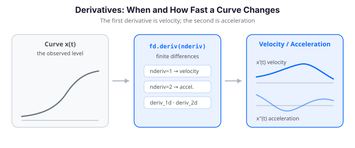

# Working with Derivatives

Derivatives of functional data expose information hidden inside the raw curves.
The **first derivative** describes *velocity* -- the rate of change. The **second
derivative** describes *acceleration* -- how the rate itself evolves -- and is
tied to curvature and to the location of inflection points. Scientific questions
are frequently about *when* and *how fast* something changes rather than about the
observed level itself.

The `Fdata` class provides a `deriv()` convenience method for both 1D and 2D
functional data (the low-level functions `deriv_1d` and `deriv_2d` are still
available in `fdars.fdata`).


{ .fdars-diagram }

```python
import numpy as np
from fdars import Fdata
```

!!! note "Notation"
    For a functional observation $x_i(t)$, the $r$-th derivative is
    $x_i^{(r)}(t) = \dfrac{d^r x_i}{dt^r}$. The first derivative $x_i'(t)$ is the
    velocity; the second derivative $x_i''(t)$ is the acceleration.

---

## Loading Growth Data

The **Berkeley Growth Study** is the canonical dataset for demonstrating
derivatives. Height curves show the overall growth trajectory; their first
derivative (velocity) reveals the pubertal growth spurt as a peak; and the second
derivative (acceleration) marks the onset and end of that spurt through its sign.

We load the girls' height curves (54 subjects measured at 31 ages) with the
`docs_data` helper:

```python
from docs_data import load_growth

age, X, meta = load_growth()          # age: (31,), X: (93, 31)
girls = X[meta["sex"].values == "female"]   # (54, 31)
fd = Fdata(girls, argvals=age)
print(f"Loaded {fd.n_obs} growth curves from ages {age.min():.0f} to {age.max():.0f}")
# Loaded 54 growth curves from ages 1 to 18
```

Note that `age` is **unequally spaced** -- yearly up to age 8, then biannual.
`deriv()` uses the actual `argvals` spacing, so this is handled automatically.

---

## The Problem: Noise Amplifies with Differentiation

Differentiation is a *high-pass* operation: small perturbations in the raw data
translate into large fluctuations in the derivative. Naively differentiating
noisy measurements therefore produces a wildly oscillating result that hides the
true dynamics.

```python
# Add measurement noise (sd = 1 cm) and differentiate directly
rng = np.random.default_rng(0)
noisy = girls + rng.normal(0, 1.0, size=girls.shape)
fd_noisy = Fdata(noisy, argvals=age)

fd_deriv_noisy = fd_noisy.deriv(nderiv=1)   # velocity of the noisy curve
fd_deriv_clean = fd.deriv(nderiv=1)         # velocity of the clean curve
```

The single-curve comparison below makes the effect obvious: the derivative of the
raw noisy curve is jagged and untrustworthy, while the derivative of the
underlying clean curve is smooth.

```python exec="1" html="1" source="above"
import numpy as np
from docs_fig import fig, render
from fdars import Fdata
from docs_data import load_growth

age, X, meta = load_growth()
girls = X[meta["sex"].values == "female"]
fd = Fdata(girls, argvals=age)

rng = np.random.default_rng(0)
noisy = girls + rng.normal(0, 1.0, size=girls.shape)
fd_noisy = Fdata(noisy, argvals=age)

v_clean = np.asarray(fd.deriv().data)[0]
v_noisy = np.asarray(fd_noisy.deriv().data)[0]

f, (a1, a2) = fig(1, 2, figsize=(9, 3.6), sharey=True)
a1.plot(age, v_clean, color="#198754", lw=2)
a1.set(title="Original data", xlabel="Age (years)", ylabel="Velocity (cm/year)")
a2.plot(age, v_noisy, color="#dc3545", lw=1.5)
a2.set(title="Noisy data", xlabel="Age (years)")
for a in (a1, a2):
    a.axhline(0, color="#6c757d", lw=0.8)
f.suptitle("Effect of noise on derivative estimation")
print(render(f))
```

---

## Solution: Smooth Before Differentiating

The fundamental rule is: **always smooth before you differentiate.** In R this is
typically done with `pspline()`; in fdars the equivalent penalized-spline
smoother is `pspline_fit_gcv` / `pspline_fit_1d` (in `fdars.basis`), and the
convenient "smooth every curve at once" front-end is `smooth_basis_gcv`. All of
these fit a B-spline basis with a roughness penalty whose strength is chosen by
generalized cross-validation (GCV), producing curves that are smooth enough to
differentiate.

```python
from fdars.basis import smooth_basis_gcv

# Smooth all noisy curves simultaneously, then differentiate the fitted curves
res = smooth_basis_gcv(noisy, age, n_basis=15)
fd_smooth = Fdata(np.asarray(res["fitted"]), argvals=age)

fd_velocity     = fd_smooth.deriv(nderiv=1)   # cm / year
fd_acceleration = fd_smooth.deriv(nderiv=2)   # cm / year^2
```

!!! tip "Recommended pipeline"
    Smooth with `smooth_basis_gcv` (enough basis functions, GCV-chosen penalty),
    then apply `deriv()` to the fitted `Fdata`. This gives the best balance of
    speed, smoothness, and accuracy for most applications.

---

## Understanding Growth Derivatives

A curve and its first two derivatives tell a layered story: zeros of the first
derivative mark the **extrema** of the curve, and zeros of the second derivative
mark its **inflection points**. For growth data this maps directly onto biology.

### Height, Velocity, Acceleration

- **Height** -- the smoothed sigmoid growth trajectory.
- **Velocity** ($x'$) -- growth rate in cm/year. Infants grow fastest; the rate
  falls to roughly 5 cm/year in childhood, then a sharp **pubertal peak** appears
  around ages 11-13, after which growth approaches zero.
- **Acceleration** ($x''$) -- positive when growth is speeding up, negative when
  slowing down. The zero-crossing from positive to negative marks the **age of
  peak velocity**; the deep negative trough is the most rapid deceleration.

```python exec="1" html="1" source="above"
import numpy as np
from docs_fig import fig, render
from fdars import Fdata
from fdars.basis import smooth_basis_gcv
from docs_data import load_growth

age, X, meta = load_growth()
girls = X[meta["sex"].values == "female"]

res = smooth_basis_gcv(girls, age, n_basis=15)
fd_sm = Fdata(np.asarray(res["fitted"]), argvals=age)
vel = np.asarray(fd_sm.deriv(1).data)
acc = np.asarray(fd_sm.deriv(2).data)
hgt = np.asarray(fd_sm.data)

f, (a1, a2, a3) = fig(1, 3, figsize=(11, 3.6))
for i in range(hgt.shape[0]):
    a1.plot(age, hgt[i], color="#3f51b5", lw=0.6, alpha=0.4)
    a2.plot(age, vel[i], color="#e8710a", lw=0.6, alpha=0.4)
    a3.plot(age, acc[i], color="#198754", lw=0.6, alpha=0.4)
a1.set(title="Height", xlabel="Age (years)", ylabel="Height (cm)")
a2.set(title="Velocity (1st derivative)", xlabel="Age (years)", ylabel="cm / year")
a3.set(title="Acceleration (2nd derivative)", xlabel="Age (years)", ylabel="cm / year$^2$")
a2.axhline(0, color="#6c757d", lw=0.8, ls="--")
a3.axhline(0, color="#6c757d", lw=0.8, ls="--")
print(render(f))
```

Every velocity curve shows the same qualitative shape -- a high infant rate, a
childhood plateau, and a pronounced pubertal spurt -- but the *timing* of the
spurt varies from child to child. Quantifying that timing is the next step.

---

## Finding Important Events: Peak Height Velocity

The **age at peak height velocity (PHV)** is a standard marker of developmental
maturity. Because velocity is also very high in infancy, we restrict the search to
the pubertal range ($\text{age} \ge 8$) so we find the *pubertal* spurt rather
than the early-childhood peak.

```python
# Age of maximum velocity within the pubertal window, per child
pubertal = np.where(age >= 8)[0]
phv_ages = np.array([
    age[pubertal[np.argmax(vel[i][pubertal])]]
    for i in range(vel.shape[0])
])

print(f"Mean PHV:  {phv_ages.mean():.1f} years")
print(f"SD:        {phv_ages.std(ddof=1):.1f} years")
print(f"Range:     {phv_ages.min():.1f} - {phv_ages.max():.1f} years")
# Mean PHV:  11.4 years   (SD 1.1, range 9.5 - 14.0)
```

The mean PHV of ~11.4 years for girls matches the well-established biology, and
the spread of roughly two years reflects genuine inter-individual variation in
developmental timing.

```python exec="1" html="1" source="above"
import numpy as np
from docs_fig import fig, render
from fdars import Fdata
from fdars.basis import smooth_basis_gcv
from docs_data import load_growth

age, X, meta = load_growth()
girls = X[meta["sex"].values == "female"]
res = smooth_basis_gcv(girls, age, n_basis=15)
fd_sm = Fdata(np.asarray(res["fitted"]), argvals=age)
vel = np.asarray(fd_sm.deriv(1).data)

pubertal = np.where(age >= 8)[0]
phv = np.array([age[pubertal[np.argmax(vel[i][pubertal])]] for i in range(vel.shape[0])])

f, ax = fig(figsize=(7, 3.8))
ax.hist(phv, bins=10, color="#a9c8e8", edgecolor="white")
ax.axvline(phv.mean(), color="#dc3545", lw=2, label=f"mean = {phv.mean():.1f} yr")
ax.set(title="Distribution of PHV ages (girls)", xlabel="Age at PHV (years)", ylabel="Count")
ax.legend()
print(render(f))
```

### Early vs Median vs Late Developers

Contrasting an early, a median, and a late developer shows how developmental
*timing* shifts the whole velocity peak along the age axis, even when the final
adult heights are similar.

```python exec="1" html="1" source="above"
import numpy as np
from docs_fig import fig, render
from fdars import Fdata
from fdars.basis import smooth_basis_gcv
from docs_data import load_growth

age, X, meta = load_growth()
girls = X[meta["sex"].values == "female"]
res = smooth_basis_gcv(girls, age, n_basis=15)
fd_sm = Fdata(np.asarray(res["fitted"]), argvals=age)
hgt = np.asarray(fd_sm.data)
vel = np.asarray(fd_sm.deriv(1).data)

pubertal = np.where(age >= 8)[0]
phv = np.array([age[pubertal[np.argmax(vel[i][pubertal])]] for i in range(vel.shape[0])])
early, late = int(np.argmin(phv)), int(np.argmax(phv))
median = int(np.argmin(np.abs(phv - np.median(phv))))

idx = {"Early": early, "Median": median, "Late": late}
colors = {"Early": "#0072B2", "Median": "#6c757d", "Late": "#D55E00"}

f, (a1, a2) = fig(1, 2, figsize=(9, 3.8))
for name, i in idx.items():
    a1.plot(age, hgt[i], color=colors[name], lw=2, label=name)
    a2.plot(age, vel[i], color=colors[name], lw=2, label=name)
a1.set(title="Height", xlabel="Age (years)", ylabel="Height (cm)")
a2.set(title="Velocity", xlabel="Age (years)", ylabel="cm / year")
a2.axhline(0, color="#6c757d", lw=0.8, ls="--")
a1.legend(); a2.legend()
print(render(f))
```

---

## Derivative-Based Distances

Two children may reach similar final heights yet grow very differently. Comparing
the **shapes of their velocity or acceleration curves** often captures growth
*dynamics* better than comparing raw heights.

R exposes this through `semimetric.deriv(fd, nderiv=r)`. fdars has no single
function with that name, but the same quantity is obtained directly: differentiate
first, then take an $L^2$ distance on the derivative curves with `lp_self_1d`
(or, equivalently, `Fdata.distance(method="lp")` on the derivative `Fdata`).

```python
from fdars.metric import lp_self_1d

d_height = np.asarray(lp_self_1d(np.asarray(fd_sm.data), age))                # L2 on height
d_velocity = np.asarray(lp_self_1d(np.asarray(fd_sm.deriv(1).data), age))     # L2 on velocity
d_acceleration = np.asarray(lp_self_1d(np.asarray(fd_sm.deriv(2).data), age)) # L2 on acceleration

sub = np.s_[:10, :10]
print("Height vs Velocity:    ",
      round(np.corrcoef(d_height[sub].ravel(), d_velocity[sub].ravel())[0, 1], 3))
print("Height vs Acceleration:",
      round(np.corrcoef(d_height[sub].ravel(), d_acceleration[sub].ravel())[0, 1], 3))
# Height vs Velocity:     0.699
# Height vs Acceleration: 0.442
```

The moderate (not perfect) correlation confirms that derivative-based distances
capture a *distinct* aspect of growth: two curves close in height need not be
close in velocity.

### Clustering by Growth Dynamics

Feeding the **velocity curves** into `kmeans_fd` groups children by growth
dynamics rather than by final height.

```python exec="1" html="1" source="above"
import numpy as np
from docs_fig import fig, render
from fdars import Fdata
from fdars.basis import smooth_basis_gcv
from fdars.clustering import kmeans_fd
from docs_data import load_growth

age, X, meta = load_growth()
girls = X[meta["sex"].values == "female"]
res = smooth_basis_gcv(girls, age, n_basis=15)
fd_sm = Fdata(np.asarray(res["fitted"]), argvals=age)
hgt = np.asarray(fd_sm.data)
vel = np.asarray(fd_sm.deriv(1).data)

km = kmeans_fd(vel, age, k=2, seed=123)          # cluster on velocity curves
labels = np.asarray(km["cluster"])
palette = {0: "#0072B2", 1: "#D55E00"}

f, (a1, a2) = fig(1, 2, figsize=(9, 3.8))
for i in range(hgt.shape[0]):
    c = palette[int(labels[i])]
    a1.plot(age, hgt[i], color=c, lw=0.6, alpha=0.5)
    a2.plot(age, vel[i], color=c, lw=0.6, alpha=0.5)
a1.set(title="Height (colored by velocity cluster)", xlabel="Age (years)", ylabel="Height (cm)")
a2.set(title="Velocity by cluster", xlabel="Age (years)", ylabel="cm / year")
a2.axhline(0, color="#6c757d", lw=0.8, ls="--")
print(render(f))
```

The two clusters separate mainly by the *timing and sharpness* of the pubertal
spurt -- something a height-only distance would largely miss.

---

## Higher-Order Derivatives

Use the `nderiv` parameter to compute second, third, or higher derivatives in a
single call:

```python
fd_d2 = fd_sm.deriv(nderiv=2)   # acceleration / curvature
fd_d3 = fd_sm.deriv(nderiv=3)   # jerk
print(fd_d2.shape)              # (54, 31)
```

!!! warning "Numerical instability"
    Each successive derivative amplifies noise further. On raw noisy data,
    third- and higher-order derivatives quickly become meaningless -- smoothing
    first is not optional at these orders.

---

## 2D Functional Data: Partial Derivatives

For functional data observed on a 2D domain -- surfaces $x_i(s, t)$, e.g.
temperature over space and time -- `deriv()` returns the two first-order partial
derivatives plus the mixed partial.

A 2D observation is stored as a flattened row of shape `(m1 * m2,)`; a dataset is
`(n_obs, m1 * m2)`. The evaluation grid is passed as a tuple `(argvals_s, argvals_t)`.

```python exec="1" html="1" source="above"
import numpy as np
from docs_fig import fig, render
from fdars import Fdata

m1, m2 = 20, 25
s = np.linspace(0, 1, m1)
t = np.linspace(0, 1, m2)
S, T = np.meshgrid(s, t, indexing="ij")

# A single wave-pattern surface: sin(2*pi*s) * cos(2*pi*t)
Z = (np.sin(2 * np.pi * S) * np.cos(2 * np.pi * T)).ravel()[None, :]
fd2d = Fdata(Z, argvals=(s, t))

fd_ds, fd_dt, fd_dsdt = fd2d.deriv()          # three Fdata objects
surf   = np.asarray(fd2d.data)[0].reshape(m1, m2)
d_ds   = np.asarray(fd_ds.data)[0].reshape(m1, m2)
d_dt   = np.asarray(fd_dt.data)[0].reshape(m1, m2)

f, (a1, a2, a3) = fig(1, 3, figsize=(11, 3.4))
kw = dict(origin="lower", extent=[0, 1, 0, 1], aspect="auto", cmap="coolwarm")
a1.imshow(surf, **kw); a1.set(title="$x(s,t)$", xlabel="t", ylabel="s")
a2.imshow(d_ds, **kw); a2.set(title=r"$\partial x/\partial s$", xlabel="t")
a3.imshow(d_dt, **kw); a3.set(title=r"$\partial x/\partial t$", xlabel="t")
print(render(f))
```

The three returned arrays are:

| Array | Meaning |
|-------|---------|
| `fd_ds` | $\partial x_i / \partial s$ -- partial derivative w.r.t. the first dimension |
| `fd_dt` | $\partial x_i / \partial t$ -- partial derivative w.r.t. the second dimension |
| `fd_dsdt` | $\partial^2 x_i / \partial s\, \partial t$ -- mixed partial derivative |

Reshape any single surface back to the grid with `.reshape(m1, m2)` for inspection
or plotting.

---

## Accuracy of the Derivative

`deriv()` uses **central finite differences**, which are second-order accurate --
error $O(h^2)$ in the grid spacing $h$. On a smooth analytic function it recovers
the true derivative to a few parts in a thousand:

```python exec="1" html="1" source="above"
import numpy as np
from docs_fig import fig, render
from fdars import Fdata

t = np.linspace(0, 2 * np.pi, 50)
f_vals = np.sin(t)
f_true = np.cos(t)                       # analytic derivative

fd = Fdata(f_vals[None, :], argvals=t)
d_est = np.asarray(fd.deriv().data)[0]
err = np.max(np.abs(d_est - f_true))

# Validation against a KNOWN ground truth: (sin)' = cos exactly.
# 1. The central-difference estimate must match cos to a few parts in a thousand
#    on this 50-point grid (interior error is O(h^2)).
interior = slice(1, -1)                   # endpoints use one-sided stencils
err_interior = np.max(np.abs(d_est[interior] - f_true[interior]))
assert err_interior < 1e-2, f"derivative off ground truth: {err_interior:.4f}"

# 2. O(h^2) accuracy: halving the grid spacing must cut the interior error by ~4x.
def interior_err(m):
    tt = np.linspace(0, 2 * np.pi, m)
    de = np.asarray(Fdata(np.sin(tt)[None, :], argvals=tt).deriv().data)[0]
    return np.max(np.abs(de[1:-1] - np.cos(tt)[1:-1]))
e_coarse, e_fine = interior_err(40), interior_err(80)   # h -> h/2 (approx)
ratio = e_coarse / e_fine
assert ratio > 3.0, f"error did not shrink ~4x under grid refinement (ratio {ratio:.2f})"
print(f"max interior error = {err_interior:.5f}  (ground truth: (sin)'=cos)")
print(f"error ratio coarse/fine = {ratio:.2f}  (expected ~4 for O(h^2))")

g, ax = fig(figsize=(7, 3.8))
ax.plot(t, f_true, color="black", lw=2, label="true $\\cos t$")
ax.plot(t, d_est, color="#D55E00", lw=1.6, ls="--", label="deriv() [central diff]")
ax.set(title=f"Central-difference derivative (max error = {err:.4f})",
       xlabel="t", ylabel="f'(t)")
ax.legend()
print(render(g))
```

The two asserts turn the O($h^2$) claim into a checked fact: the estimate matches the
analytic $\cos t$ to a few parts in a thousand on the interior, and halving the grid spacing
shrinks that error by roughly $4\times$ -- the signature of second-order accuracy.

!!! note "No 5-point gradient binding yet"
    The R package additionally offers `fdata.gradient()`, a 5-point-stencil
    gradient that is $O(h^4)$ accurate on uniform grids. fdars does not currently
    expose an equivalent, so for maximum first-derivative accuracy the practical
    lever in Python is **smoothing quality** (basis choice and penalty) rather
    than the stencil. For most work the $O(h^2)$ central differences of `deriv()`
    are more than adequate, and higher-order derivatives (order 2+) rely on them
    directly.

---

## Optimal Smoothing for Derivatives

When the derivative -- not the fitted curve -- is the target, the *best* amount of
smoothing is often **more** than what is optimal for fitting the curve itself.
Under-smoothing leaves noise that the derivative amplifies; a larger penalty
$\lambda$ trades a little curve bias for a much cleaner derivative.

The sweep below fits one noisy curve at several penalty levels with
`pspline_fit_1d` (which takes an explicit `lambda_`) and differentiates each fit.
As $\lambda$ grows, the velocity estimate becomes progressively smoother.

```python exec="1" html="1" source="above"
import numpy as np
from docs_fig import fig, render
from fdars import Fdata
from fdars.basis import pspline_fit_1d
from docs_data import load_growth

age, X, meta = load_growth()
girls = X[meta["sex"].values == "female"]

rng = np.random.default_rng(0)
noisy1 = (girls[0] + rng.normal(0, 1.0, size=girls.shape[1]))[None, :]   # one noisy curve
# lightly-smoothed reference derivative
ref = np.asarray(Fdata(np.asarray(pspline_fit_1d(girls[0][None, :], age,
                                                  n_basis=15, lambda_=0.1)["fitted"]),
                       argvals=age).deriv().data)[0]

lambdas = [0.01, 0.1, 1.0, 10.0]
f, axes = fig(2, 2, figsize=(9, 6), sharex=True, sharey=True)
for lam, ax in zip(lambdas, axes.ravel()):
    fit = pspline_fit_1d(noisy1, age, n_basis=15, lambda_=lam)
    v = np.asarray(Fdata(np.asarray(fit["fitted"]), argvals=age).deriv().data)[0]
    ax.plot(age, v, color="#0072B2", lw=2, label="smoothed")
    ax.plot(age, ref, color="#D55E00", lw=1.4, ls="--", label="reference")
    ax.axhline(0, color="#6c757d", lw=0.8, ls=":")
    ax.set(title=f"$\\lambda$ = {lam}")
axes[1, 0].set(xlabel="Age (years)", ylabel="Velocity (cm/year)")
axes[0, 0].legend(fontsize=8)
print(render(f))
```

At very small $\lambda$ the derivative chases the noise; by $\lambda = 10$ it has
converged to a clean, biologically plausible velocity curve. In practice, let
`smooth_basis_gcv` pick the penalty and nudge it up if the derivative still looks
rough.

---

## Practical Workflow

A systematic recipe for robust derivative analysis:

```python
import numpy as np
from fdars import Fdata
from fdars.basis import smooth_basis_gcv
from docs_data import load_growth

# 1. Load and inspect the raw data
age, X, meta = load_growth()
girls = X[meta["sex"].values == "female"]
fd = Fdata(girls, argvals=age)
print(fd.summary())

# 2. Smooth (penalized B-splines, GCV-chosen penalty)
res = smooth_basis_gcv(girls, age, n_basis=15)
fd_smooth = Fdata(np.asarray(res["fitted"]), argvals=age)

# 3. Compute derivatives from the smoothed curves
fd_d1 = fd_smooth.deriv(nderiv=1)
fd_d2 = fd_smooth.deriv(nderiv=2)
v = np.asarray(fd_d1.data)
a = np.asarray(fd_d2.data)

# 4. Extract features from the derivatives
pubertal = np.where(age >= 8)[0]
features = {
    "max_velocity":     v.max(axis=1),
    "age_at_max_vel":   np.array([age[pubertal[np.argmax(v[i][pubertal])]]
                                  for i in range(v.shape[0])]),
    "min_acceleration": a.min(axis=1),
}

# 5. Use the features for downstream analysis
r = np.corrcoef(features["age_at_max_vel"], features["max_velocity"])[0, 1]
print(f"Correlation between age at PHV and max velocity: {r:.3f}")
```

---

## Summary

| Task | Function | Notes |
|------|----------|-------|
| First derivative | `fd.deriv(nderiv=1)` | Velocity / rate of change; central differences, $O(h^2)$ |
| Second derivative | `fd.deriv(nderiv=2)` | Acceleration / curvature |
| 2D partials | `fd.deriv()` (2D) | Returns `(fd_ds, fd_dt, fd_dsdt)` |
| Low-level 1D | `deriv_1d(data, argvals, nderiv=1)` | `fdars.fdata`; raw 2D array in, array out |
| Low-level 2D | `deriv_2d(data, argvals_s, argvals_t)` | `fdars.fdata`; partials of raw 2D data |
| Pre-smoothing (all curves) | `smooth_basis_gcv(data, argvals, n_basis)` | `fdars.basis`; GCV penalty |
| Pre-smoothing (explicit $\lambda$) | `pspline_fit_1d(data, argvals, n_basis, lambda_)` | `fdars.basis` |
| Derivative distance | `lp_self_1d` on `deriv()` output | Shape-based comparison (R's `semimetric.deriv`) |
| Cluster on dynamics | `kmeans_fd(deriv_data, argvals, k)` | `fdars.clustering` |

Key takeaways:

- **Always smooth before differentiating** -- differentiation amplifies noise.
- **Derivatives may want more smoothing** than the curve fit itself.
- **Derivatives reveal dynamics** -- growth spurts, developmental timing, phase.
- **Derivative-based distances** enable shape-based clustering and comparison.

---

## References

- Ramsay, J. O. & Silverman, B. W. (2005). *Functional Data Analysis* (2nd ed.).
  Springer. (Ch. 5, Smoothing Functional Data; Ch. 19, Principal Differential
  Analysis.)
- Ramsay, J. O. (1996). Principal Differential Analysis: Data Reduction by
  Differential Operators. *Journal of the Royal Statistical Society, Series B*,
  58(3), 495--508.
- Tuddenham, R. D. & Snyder, M. M. (1954). Physical Growth of California Boys and
  Girls from Birth to Eighteen Years. *University of California Publications in
  Child Development*, 1(2), 183--364.
- Fan, J. & Gijbels, I. (1996). *Local Polynomial Modelling and Its Applications.*
  Chapman & Hall.

## Next Steps

- [Smoothing](smoothing.md) -- choose the right smoother before differentiating.
- [Functional PCA](../represent/fpca.md) -- decompose derivatives into principal
  components.
- [Basis Representation](../represent/basis-representation.md) -- smooth with
  basis expansions for optimal pre-processing.
