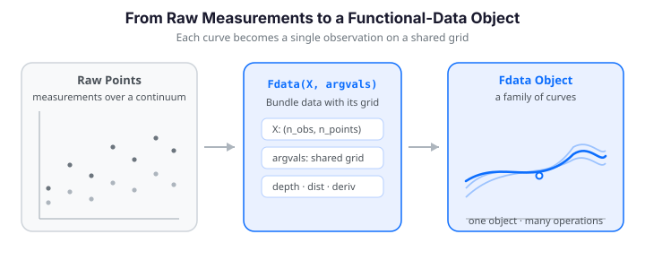

# Introduction to fdars

This guide introduces **Functional Data Analysis (FDA)** and shows you how to
use fdars's Python API to perform common tasks. By the end, you will understand
the data layout, core operations, and the breadth of functionality available.


---

{ .fdars-diagram }

## What Is Functional Data Analysis?

**Functional Data Analysis (FDA)** is the branch of statistics that deals with
data where each observation is an *entire function* -- a curve, a spectrum, a
trajectory, or a surface measured over a continuum -- rather than a single number
or a fixed-length vector.

Examples of functional data appear everywhere:

- **Spectroscopy** -- absorbance spectra measured at hundreds of wavelengths
- **Growth curves** -- height-over-age profiles for a cohort of children
- **Finance** -- intraday price trajectories throughout the trading day
- **Environmental science** -- daily temperature profiles across weather stations
- **Manufacturing** -- quality profiles recorded along a production line

In FDA we treat each curve as a *single observation* and develop methods to
analyze collections of such curves. The key insight is that these are not just
high-dimensional vectors; they have a *smoothness structure* that can be
exploited for better estimation, prediction, and interpretation.

!!! note "Infinite-dimensional observations"
    Mathematically, each observation lives in a function space such as
    $L^2([0, 1])$.  In practice we observe each function on a discrete grid,
    but FDA methods respect the underlying continuity.

---

## The fdars Package

**fdars** provides a comprehensive set of FDA methods implemented in Rust
(via [fdars-core](https://github.com/sipemu/fdars)) and exposed to Python
through [PyO3](https://pyo3.rs).  This gives you:

- **Native speed** -- all heavy computation runs in compiled Rust with
  multithreading, not in Python loops.
- **`Fdata` class** -- a functional data container that bundles data, grid,
  IDs, and metadata into a single object (mirroring the R package's `fdata`).
- **NumPy interface** -- you can also work directly with `numpy.ndarray` for
  full control.
- **Broad coverage** -- depth, distance, smoothing, basis representation, FPCA,
  regression, clustering, alignment, outlier detection, monitoring, and more.
- **2D support** -- many methods extend from curves to *surfaces*, with dedicated
  `*_2d` variants throughout the depth, distance, and derivative modules.

Because the numerics run in Rust, computationally intensive operations such as
depth functions and distance matrices are typically **10-200x faster** than the
equivalent pure-Python (or pure-R) implementation, without giving up the
convenience of a NumPy-based front end.

### Installation

```bash
pip install fdars
```

The only runtime dependency is **NumPy**.

---

## Getting Started

### The `Fdata` Class

The central object in fdars is **`Fdata`** -- a functional data container that
bundles observation data, evaluation grid, identifiers, and per-observation
metadata.  It mirrors the R package's `fdata` S3 class.

Create functional data from a matrix where **rows are observations (curves)** and
**columns are evaluation points**. Here we generate 20 curves observed at 100
points on $[0, 1]$ as sine waves with random phase and a little measurement noise
-- the same running example used throughout this guide:

```python
import numpy as np
import pandas as pd
from fdars import Fdata

# 20 curves evaluated at 100 points on [0, 1]
rng = np.random.default_rng(42)
n_obs, n_points = 20, 100
argvals = np.linspace(0, 1, n_points)

# Sine waves with random phase and noise
X = np.array([
    np.sin(2 * np.pi * argvals + rng.uniform(0, np.pi)) + rng.normal(0, 0.1, n_points)
    for _ in range(n_obs)
])

# Wrap in an Fdata object
fd = Fdata(X, argvals=argvals)
print(fd)
# Fdata (1D)  –  20 obs × 100 points  –  range [0.0, 1.0]
```

#### Adding Identifiers and Metadata

You can attach identifiers and a `pandas.DataFrame` of per-observation covariates
(a `group` factor, `age`, a scalar `response`, ...):

```python
meta = pd.DataFrame({
    "group": ["control"] * 10 + ["treatment"] * 10,
    "age": rng.integers(20, 60, size=n_obs),
    "response": rng.normal(size=n_obs),
})
fd_meta = Fdata(
    X, argvals=argvals,
    id=[f"patient_{i}" for i in range(1, n_obs + 1)],
    metadata=meta,
)
print(fd_meta)
# Fdata (1D)  –  20 obs × 100 points  –  range [0.0, 1.0]  –  metadata: group, age, response

# Access ids and metadata directly
print(fd_meta.id[:5])          # ['patient_1', ..., 'patient_5']
fd_meta.metadata.head()
```

Metadata is preserved when subsetting -- both the ids and the covariate rows are
carried along:

```python
fd_sub = fd_meta[0:5]
print(fd_sub.id)                    # ['patient_1', ..., 'patient_5']
print(fd_sub.metadata["group"][:3]) # 'control', 'control', 'control'
```

!!! info "Row = observation, Column = grid point"
    The underlying `fd.data` array has shape `(n_obs, n_points)` -- the same
    convention used by scikit-learn, making it easy to mix functional and scalar
    analyses.

### Simulating Data

For reproducible experiments, use the built-in simulation module:

```python
from fdars.simulation import simulate

argvals = np.linspace(0, 1, 100)
data = simulate(n=50, argvals=argvals, n_basis=5, seed=42)

fd = Fdata(data, argvals=argvals)
print(fd)  # Fdata (1D)  –  50 obs × 100 points  –  range [0.0, 1.0]
```

### Visualizing Functional Data

A functional sample is a *family of curves* rather than a cloud of points.
Plotting the whole ensemble at once -- here the 20 sine curves from above
together with their pointwise mean -- is the first thing you do with any dataset,
and the kind of object every fdars method operates on:

```python exec="1" html="1" source="above"
import numpy as np
from docs_fig import fig, render
from fdars import Fdata

rng = np.random.default_rng(42)
t = np.linspace(0, 1, 100)
X = np.array([
    np.sin(2 * np.pi * t + rng.uniform(0, np.pi)) + rng.normal(0, 0.1, 100)
    for _ in range(20)
])
fd = Fdata(X, argvals=t)
mu = np.asarray(fd.mean())

f, ax = fig()
ax.plot(t, np.asarray(fd.data).T, color="#3f51b5", lw=1, alpha=0.5)
ax.plot(t, mu, color="#e8710a", lw=2.6, label="pointwise mean")
ax.set(title="20 phase-shifted sine curves and their mean",
       xlabel="t", ylabel="X(t)")
ax.legend()
print(render(f))
```

### Basic Operations

A handful of operations are so common they form the vocabulary of every FDA
workflow: the **mean function**, **centering**, and the **pointwise variance**.
The mean and centering are Rust-backed `Fdata` methods; there is no dedicated
variance binding, so we compute it directly in NumPy over the grid:

```python
# Mean function -- one value per grid point
mean_curve = fd.mean()

# Center the data (subtract the mean function from every curve)
fd_centered = fd.center()

# Pointwise (functional) variance across the sample
variance = np.asarray(fd.data).var(axis=0)   # shape (n_points,)
```

!!! note "No `var()` binding"
    Unlike R's `var(fd)`, fdars does not expose a functional-variance function,
    so the example above computes the pointwise variance with NumPy. For the full
    covariance *surface* $\operatorname{Cov}(s, t)$, see
    `fdars.simulation.covariance_matrix` and the [FPCA](../represent/fpca.md) guide.

### Subsetting

Indexing an `Fdata` selects **curves** (rows). To restrict the **evaluation
grid** (columns) to a sub-interval, build a boolean mask over `argvals` and slice
the underlying array:

```python
# First 5 curves
fd_first5 = fd[0:5]
print(fd_first5.shape)            # (5, 100)

# Restrict the domain to t in [0.25, 0.75]
mask = (fd.argvals >= 0.25) & (fd.argvals <= 0.75)
fd_range = Fdata(np.asarray(fd.data)[:, mask], argvals=fd.argvals[mask])
print(fd_range.shape)             # (20, 50)
```

---

## Norms and Normalization

`Fdata` methods delegate to the Rust backend. They return either numpy arrays
(for scalar results) or new `Fdata` objects (for transformed functional data),
preserving metadata.

### Centering, Visually

We met `fd.center()` above. Because centering only subtracts the common mean, it
leaves the *shape variation* between curves untouched -- exactly what most
downstream analyses (FPCA, depth, clustering) care about. Side by side:

```python exec="1" html="1"
import numpy as np
from docs_fig import fig, render
from fdars import Fdata
from fdars.simulation import simulate

t = np.linspace(0, 1, 100)
fd = Fdata(np.asarray(simulate(n=30, argvals=t, n_basis=6, seed=42)), argvals=t)
fd_c = fd.center()

f, (a1, a2) = fig(1, 2, figsize=(9.0, 3.6), sharex=True)
a1.plot(t, np.asarray(fd.data).T, color="#3f51b5", lw=1, alpha=0.35)
a1.plot(t, np.asarray(fd.mean()), color="#e8710a", lw=2.4)
a1.set(title="Raw curves", xlabel="t", ylabel="X(t)")
a2.plot(t, np.asarray(fd_c.data).T, color="#198754", lw=1, alpha=0.35)
a2.axhline(0.0, color="#e8710a", lw=2.4)
a2.set(title="Centered curves", xlabel="t")
print(render(f))
```

### Norms

Compute the $L^p$ norm of each curve:

$$
\|x_i\|_p = \left( \int_0^1 |x_i(t)|^p \, dt \right)^{1/p}
$$

```python
l2_norms = fd.norm(p=2.0)
print(l2_norms.shape)  # (30,) -- one norm per curve
print(f"Mean L2 norm: {l2_norms.mean():.4f}")
```

### Normalization

```python
# Center and scale each grid point (like sklearn's StandardScaler)
fd_scaled = fd.normalize("autoscale")

# Or normalize each curve individually
fd_curve = fd.normalize("curve_standardize")
```

Available methods: `"center"`, `"autoscale"`, `"pareto"`, `"range"`,
`"curve_center"`, `"curve_standardize"`, `"curve_range"`.

---

## Key Functionality Overview

### Depth

Depth measures quantify how "central" a curve is within a sample. Higher depth
indicates a more *typical* curve; shallow curves are potential outliers. The
deepest curve is a natural notion of a **functional median** -- a robust center
that, unlike the pointwise mean, is itself one of the observed curves.

```python
# Via Fdata convenience method -- Fraiman-Muniz depth
fm_depth = np.asarray(fd.depth("fraiman_muniz"))
median_idx = int(np.argmax(fm_depth))
print(f"Median (deepest) curve index: {median_idx}")

# Or via low-level functions
from fdars.depth import modified_band_1d
mbd = modified_band_1d(fd.data, fd.data)
```

Other depth functions available: `modal`, `band`, `random_projection`,
`random_tukey`, `functional_spatial`, `kernel_functional_spatial`, and
their 2D counterparts.

### Distance Metrics

```python
# Via Fdata convenience method
dist_l2 = fd.distance(method="lp", p=2.0)
print(dist_l2.shape)  # (50, 50)

# Or via low-level functions
from fdars.metric import dtw_self_1d
dist_dtw = dtw_self_1d(fd.data, p=2.0)
print(dist_dtw.shape)  # (50, 50)
```

See also: `hausdorff`, `soft_dtw`, `fourier`, `hshift`, and cross-distance
variants.

### Regression

A common task is to **predict a scalar response from a functional predictor** --
regressing a number $y_i$ on each whole curve $x_i(t)$. Because a curve has far
more grid points than we have observations, fdars regresses on a low-dimensional
summary of the curves. `fregre_pls` fits a functional partial-least-squares model
and reports the in-sample $R^2$:

```python
from fdars.regression import fregre_pls

# Scalar response driven by the mean level of each curve, plus noise
y = np.asarray(fd.data).mean(axis=1) + np.random.default_rng(1).normal(0, 0.1, fd.n_obs)

fit = fregre_pls(fd.data, fd.argvals, y, n_comp=3)
print(f"R-squared: {fit['r_squared']:.4f}")
```

Related fits: `fregre_lm`, `fregre_np` (nonparametric kernel), `fregre_pls`,
`fregre_huber`/`fregre_l1` (robust), and `functional_logistic` for binary
responses. See the [Scalar-on-Function Regression](../regression/scalar-on-function.md)
guide for the full menu.

### FPCA

Functional principal component analysis reduces each curve to a handful of
scores, capturing the dominant modes of variation:

```python
from fdars.regression import fpca

result = fpca(fd.data, fd.argvals, n_comp=3)
scores = result["scores"]        # (50, 3) -- one row per curve
rotation = result["rotation"]    # (100, 3) -- eigenfunctions
print(f"Leading singular value: {result['singular_values'][0]:.4f}")
```

### Clustering

Group curves into clusters by shape. `kmeans_fd` runs functional $k$-means and
returns the label vector, the cluster centers, and the total within-cluster sum
of squares:

```python
from fdars.clustering import kmeans_fd

clusters = kmeans_fd(fd.data, fd.argvals, k=3, seed=0)
print(f"Cluster labels: {clusters['cluster']}")
print(f"Total within-cluster SS: {clusters['tot_withinss']:.4f}")
```

Coloring the curves by their assigned cluster shows how $k$-means partitions the
sample; the cluster centers (bold) summarize each group:

```python exec="1" html="1" source="above"
import numpy as np
from docs_fig import fig, render
from fdars import Fdata
from fdars.simulation import simulate
from fdars.clustering import kmeans_fd

t = np.linspace(0, 1, 100)
fd = Fdata(np.asarray(simulate(n=45, argvals=t, n_basis=6, seed=7)), argvals=t)
km = kmeans_fd(fd.data, fd.argvals, k=3, seed=0)
labels = np.asarray(km["cluster"])
centers = np.asarray(km["centers"])

colors = ["#3f51b5", "#e8710a", "#198754"]
f, ax = fig()
for k in range(3):
    ax.plot(t, np.asarray(fd.data)[labels == k].T, color=colors[k], lw=1, alpha=0.35)
    ax.plot(t, centers[k], color=colors[k], lw=3.0)
ax.set(title="Functional k-means: curves colored by cluster",
       xlabel="t", ylabel="X(t)")
print(render(f))
```

### Outlier Detection

Identify atypical curves. Here we take a clean sample, add a single curve shifted
far above the rest, and let the **magnitude-shape** method (which scores each
curve on how far it departs from the sample in level and in shape) flag it:

```python exec="1" html="1" source="above"
import numpy as np
from docs_fig import fig, render
from fdars.outliers import magnitude_shape

rng = np.random.default_rng(3)
t = np.linspace(0, 1, 100)
X = np.array([
    np.sin(2 * np.pi * t + rng.uniform(0, np.pi)) + rng.normal(0, 0.1, 100)
    for _ in range(25)
])
X_out = np.vstack([X, X[0] + 3.0])           # append one magnitude outlier

ms = magnitude_shape(X_out)
mag = np.abs(np.asarray(ms["magnitude"]))     # magnitude outlyingness
shp = np.abs(np.asarray(ms["shape"]))         # shape outlyingness
score = np.hypot(mag, shp)                     # combined MS distance
flagged = int(np.argmax(score))
print(f"# Flagged curve index {flagged} of {len(score) - 1} (the appended outlier)")

f, ax = fig()
ax.plot(t, X_out[:-1].T, color="#3f51b5", lw=1, alpha=0.4)
ax.plot(t, X_out[flagged], color="#d81b60", lw=2.6, label="detected outlier")
ax.set(title="Outlier detection via magnitude-shape depth",
       xlabel="t", ylabel="X(t)")
ax.legend()
print(render(f))
```

`outliergram` (shape outliers via MEI/MBD) and `detect_outliers_lrt` (a
likelihood-ratio test) provide complementary rules; see the
[Outlier Detection](../analyze/outlier-detection.md) guide.

### Smoothing

```python
from fdars.smoothing import nadaraya_watson, optim_bandwidth

# Pick one noisy curve
x = fd.argvals
y = fd.data[0] + np.random.default_rng(0).normal(0, 0.1, size=len(x))

# Find optimal bandwidth via GCV
bw = optim_bandwidth(x, y)
print(f"Optimal bandwidth: {bw['h_opt']:.4f}")

# Smooth with Nadaraya-Watson
y_hat = nadaraya_watson(x, y, x, bandwidth=bw["h_opt"])
```

---

## Performance Notes

fdars compiles all FDA algorithms to native machine code via Rust. Key
performance characteristics:

- **No GIL contention** -- Rust computations release the Python GIL, so they
  can run alongside other Python threads.
- **Parallelism** -- distance matrices, depth calculations, and other
  embarrassingly parallel tasks use Rayon for automatic multithreading.
- **Zero-copy where possible** -- NumPy arrays are passed directly to Rust
  without copying when memory layouts are compatible.
- **Small overhead** -- the Python/Rust boundary crossing adds only
  microseconds per call, so even small problems benefit.

!!! tip "Benchmarks"
    On a dataset of 500 curves with 1000 grid points, fdars computes the full
    $500 \times 500$ L2 distance matrix in milliseconds -- orders of magnitude
    faster than a pure-Python double loop.

---

## Next Steps

- [Simulation Toolbox](simulation.md) -- learn how to generate realistic
  synthetic data for experiments and benchmarks.
- [Smoothing](smoothing.md) -- remove noise while preserving shape.
- [Working with Derivatives](derivatives.md) -- extract velocity and
  acceleration from functional observations.
- [Depth Functions](../represent/depth-functions.md) -- deep dive into
  centrality measures.
- [Clustering](../analyze/clustering.md) -- group curves by shape.
- [FPCA](../represent/fpca.md) -- dimensionality reduction for curves.

---

## References

- Ramsay, J. O. & Silverman, B. W. (2005). *Functional Data Analysis* (2nd ed.).
  Springer.
- Ferraty, F. & Vieu, P. (2006). *Nonparametric Functional Data Analysis: Theory
  and Practice*. Springer.
- Febrero-Bande, M. & Oviedo de la Fuente, M. (2012). Statistical Computing in
  Functional Data Analysis: The R Package `fda.usc`. *Journal of Statistical
  Software*, 51(4), 1--28.
