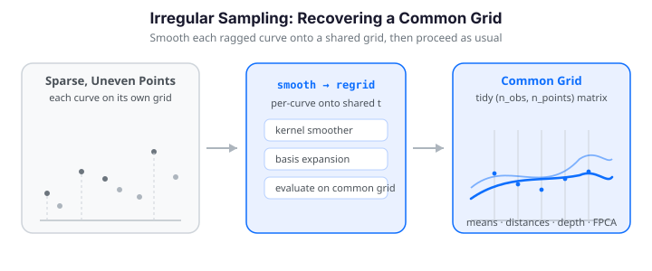

# Working with Irregular / Sparsely Sampled Functional Data

Textbook functional data arrives as a tidy `(n_obs, n_points)` matrix: every
curve observed at the *same* grid of points. Real data rarely obliges. Growth
studies measure children at whatever ages they happened to visit the clinic;
sensors drop samples; longitudinal records are sparse and misaligned. Each curve
then lives on its **own** grid, and the neat matrix disappears.


Irregular sampling shows up almost everywhere functional data does:

| Domain | Why the grid is irregular |
|--------|---------------------------|
| Longitudinal / clinical studies | patients visited at different times |
| Sensor networks | dropped packets, varying duty cycles |
| Environmental monitoring | non-uniform temporal sampling |
| Financial tick data | trades arrive at irregular intervals |

`Fdata` -- and every pointwise operation built on it (means, distances, depth,
FPCA) -- assumes a shared grid. This guide shows why, and how to recover one:
smooth each curve onto a common grid with kernel smoothers or a basis
expansion, then proceed as usual.

!!! note "No `irregFdata` container in fdars (Python)"
    The R package ships an `irregFdata` **class** that stores ragged curves
    natively (a list of `argvals` and a list of `X`), with methods like
    `sparsify()`, `as.fdata()`, `is.irregular()`, and irregular-aware
    `mean()` / `metric.lp()` / `int.simpson()`. The Python `fdars` bindings do
    **not** expose that class. Instead we work with plain Python lists of
    `(argvals_i, values_i)` pairs and reduce every task to the same move:
    reconstruct each curve as a smooth function, evaluate all reconstructions on
    one shared grid, and hand the resulting rectangle to `Fdata`. Everything
    below builds that bridge explicitly in NumPy.

{ .fdars-diagram }

```python exec="1" html="1"
import numpy as np
from docs_fig import fig, render
from fdars.simulation import simulate

t_fine = np.linspace(0, 1, 200)
truth = np.asarray(simulate(n=4, argvals=t_fine, n_basis=5, seed=7))
rng = np.random.default_rng(0)

f, ax = fig()
for i, col in enumerate(["#3f51b5", "#e8710a", "#198754", "#6f42c1"]):
    m = rng.integers(10, 18)                       # each curve, different count...
    ti = np.sort(rng.uniform(0, 1, size=m))        # ...on its own irregular grid
    yi = np.interp(ti, t_fine, truth[i]) + rng.normal(0, 0.12, size=m)
    ax.plot(ti, yi, "o-", color=col, lw=0.8, ms=5, alpha=0.8)
ax.set(title="Four curves, four different sparse grids",
       xlabel="t", ylabel="X(t)")
print(render(f))
```

---

## Why pointwise operations need a common grid

The pointwise mean $\bar{X}(t) = \frac{1}{n}\sum_i X_i(t)$ is only defined if
every $X_i$ is evaluated at the *same* $t$. With curve $i$ observed at grid
$\{t^{(i)}_1, \dots, t^{(i)}_{m_i}\}$ and curve $j$ at a different grid, the sum
$X_i(t) + X_j(t)$ has no meaning at a shared column -- the columns do not line
up, and $m_i \neq m_j$ so they cannot even be stacked into a rectangle.

Everything downstream inherits this requirement:

| Operation | Why it needs a common grid |
|-----------|-----------------------------|
| Pointwise mean / centering | sums curves column-by-column |
| $L^p$ distances / depth | compares $X_i(t)$ to $X_j(t)$ at each $t$ |
| FPCA | eigen-decomposes a `(n_points, n_points)` covariance |
| Basis smoothing of a *batch* | one `(n_obs, n_points)` matrix in, one out |

The fix is always the same: **reconstruct each curve as a smooth function, then
evaluate all reconstructions on one shared grid.** This is a modelling step, not
mere interpolation -- it borrows the smoothness assumption of FDA to fill the
gaps between sparse observations.

$$
X_i(t) \;\approx\; \hat{m}_i(t), \qquad
\text{then sample } \hat{m}_i \text{ on the common grid } t_1, \dots, t_M .
$$

---

## Sparsifying regular data (to test a method)

Before trusting a reconstruction on real sparse data, it helps to sparsify a
*known* signal and check how well you recover it. The R package wraps this in
`sparsify()`; in Python it is a two-line helper -- pick a random number of
observations per curve, then keep a random subset of the grid:

```python exec="1" html="1" source="above"
import numpy as np
from docs_fig import fig, render
from fdars.simulation import simulate

def sparsify(truth, t, min_obs, max_obs, rng, prob=None):
    """Regular (n, len(t)) matrix -> list of (argvals_i, values_i) pairs."""
    curves = []
    for i in range(truth.shape[0]):
        m = int(rng.integers(min_obs, max_obs + 1))
        p = None if prob is None else prob(t) / prob(t).sum()
        idx = np.sort(rng.choice(t.size, size=m, replace=False, p=p))
        curves.append((t[idx], truth[i, idx]))
    return curves

t = np.linspace(0, 1, 200)
truth = np.asarray(simulate(n=12, argvals=t, n_basis=5, seed=42))

# three sampling schemes: uniform, dense-in-middle, dense-at-edges
dense_mid  = lambda s: np.exp(-((s - 0.5) ** 2) / (2 * 0.2 ** 2))
dense_edge = lambda s: 0.1 + 4 * (s - 0.5) ** 2

schemes = {
    "Uniform sampling":  (None, "#3f51b5"),
    "Dense in middle":   (dense_mid, "#e8710a"),
    "Dense at edges":    (dense_edge, "#198754"),
}

f, axes = fig(ncols=3, figsize=(10.5, 3.0))
for ax, (name, (prob, col)) in zip(np.atleast_1d(axes), schemes.items()):
    rng = np.random.default_rng(123)
    for ti, yi in sparsify(truth[:6], t, 15, 25, rng, prob=prob):
        ax.plot(ti, yi, "-", color=col, lw=0.7, alpha=0.35)
        ax.scatter(ti, yi, s=6, color=col, alpha=0.7)
    ax.set(title=name, xlabel="t")
print(render(f))
```

A non-uniform probability lets you stress-test the parts of the domain a method
struggles with: sparse edges expose boundary bias, a sparse middle exposes
over-smoothing. We will lean on `dense_at_edges` later to show why extrapolation
matters.

---

## Smoothing onto a common grid: kernel smoothers

The kernel smoothers in `fdars.smoothing` are the natural tool: they take the
*observed* points `(x, y)` and a *target* grid `x_new`, and return the fit at
`x_new`. Because `x` and `x_new` are independent, a single call moves a curve
from its own sparse grid onto any common grid you choose.

```python
from fdars.smoothing import nadaraya_watson, local_linear, optim_bandwidth

bw = optim_bandwidth(ti, yi)["h_opt"]              # GCV-select on this curve
y_common = nadaraya_watson(ti, yi, common_grid, bandwidth=bw)
```

| Parameter | Type | Description |
|-----------|------|-------------|
| `x` | `np.ndarray` `(m,)` | the curve's own (irregular) grid |
| `y` | `np.ndarray` `(m,)` | observed, possibly noisy values |
| `x_new` | `np.ndarray` `(M,)` | shared target grid for **all** curves |
| `bandwidth` | `float` | smoothing bandwidth (from `optim_bandwidth`) |
| `kernel` | `str` | `"gaussian"`, `"epanechnikov"`, `"tricube"` |

Below, one sparse noisy curve is reconstructed on a dense common grid. Note that
`optim_bandwidth` chooses the bandwidth per curve, so sparser curves get more
smoothing automatically:

```python exec="1" html="1" source="above"
import numpy as np
from docs_fig import fig, render
from fdars.simulation import simulate
from fdars.smoothing import nadaraya_watson, local_linear, optim_bandwidth

t_fine = np.linspace(0, 1, 200)
truth = np.asarray(simulate(n=1, argvals=t_fine, n_basis=5, seed=7))[0]

rng = np.random.default_rng(1)
ti = np.sort(rng.uniform(0, 1, size=22))           # sparse, irregular grid
yi = np.interp(ti, t_fine, truth) + rng.normal(0, 0.15, size=22)

common = np.linspace(0, 1, 200)                     # shared target grid
bw = optim_bandwidth(ti, yi)["h_opt"]
y_nw = np.asarray(nadaraya_watson(ti, yi, common, bandwidth=bw))
y_ll = np.asarray(local_linear(ti, yi, common, bandwidth=bw))

f, ax = fig()
ax.plot(t_fine, truth, color="#198754", lw=2.0, alpha=0.7, label="true signal")
ax.scatter(ti, yi, s=32, color="#6c757d", zorder=3, label="sparse observations")
ax.plot(common, y_nw, color="#3f51b5", lw=2.2, label=f"Nadaraya-Watson (h={bw:.3f})")
ax.plot(common, y_ll, color="#e8710a", lw=2.0, ls="--", label="local linear")
ax.set(title="Sparse points reconstructed on a common grid",
       xlabel="t", ylabel="X(t)")
ax.legend()
print(render(f))
```

!!! info "Local linear near the boundaries"
    On sparse grids the ends of the domain are the weakest spot -- few points to
    average. `local_linear` corrects the boundary bias that `nadaraya_watson`
    suffers there, so it is usually the safer default for sparse data. See
    [Smoothing](smoothing.md) for the full comparison.

---

## Regridding a whole sample

Once you can move one curve, regridding the sample is a loop that stacks the
reconstructions into the `(n_obs, M)` matrix `Fdata` wants. After this step the
data is rectangular and every pointwise operation is valid again.

```python exec="1" html="1" source="above"
import numpy as np
from docs_fig import fig, render
from fdars import Fdata
from fdars.simulation import simulate
from fdars.smoothing import nadaraya_watson, optim_bandwidth

t_fine = np.linspace(0, 1, 200)
truth = np.asarray(simulate(n=20, argvals=t_fine, n_basis=5, seed=7))
rng = np.random.default_rng(3)

common = np.linspace(0, 1, 120)                    # one grid to rule them all
recon = np.empty((truth.shape[0], common.size))
for i in range(truth.shape[0]):
    m = rng.integers(15, 30)                       # each curve: its own sparse grid
    ti = np.sort(rng.uniform(0, 1, size=m))
    yi = np.interp(ti, t_fine, truth[i]) + rng.normal(0, 0.12, size=m)
    bw = optim_bandwidth(ti, yi)["h_opt"]
    recon[i] = nadaraya_watson(ti, yi, common, bandwidth=bw)

fd = Fdata(recon, argvals=common)                  # now a valid Fdata
mu = np.asarray(fd.mean())                         # pointwise mean is defined again

f, ax = fig()
ax.plot(common, recon.T, color="#3f51b5", lw=1, alpha=0.35)
ax.plot(common, mu, color="#e8710a", lw=2.8, label="pointwise mean")
ax.set(title="20 sparse curves regridded, with their mean",
       xlabel="t", ylabel="X(t)")
ax.legend()
print(render(f))
```

!!! tip "Choose the common grid deliberately"
    A common grid finer than your typical per-curve sampling wastes nothing, but
    do not extrapolate blindly with a kernel smoother: keep the grid inside the
    range actually covered by each curve's observations, or the reconstruction
    at the edges is a guess. A basis fit (next section) *can* extrapolate
    sensibly, which is precisely its advantage on truly sparse data.

---

## Basis smoothing onto a common grid

Kernel smoothers evaluate wherever you ask, which makes regridding trivial. A
**basis expansion** takes a slightly different route: `fdars.basis` first fits
coefficients on the observed grid, and you then *evaluate the same
coefficients on the common grid*. The two-step pair is:

- `fdata_to_basis_1d(y, ti, n_basis, basis_type)` -> `(coefficients, n_basis)`
  fits a B-spline (or Fourier) expansion to the sparse observations by least
  squares.
- `basis_to_fdata_1d(coefficients, common, n_basis, basis_type)` evaluates that
  expansion on **any** grid -- here the shared one.

This is the direct analogue of R's `fdata2basis()` / `basis2fdata()`, and it is
the recommended approach for genuinely sparse data: least squares on the
observed points needs no interpolation and handles varying observation densities
naturally.

```python exec="1" html="1" source="above"
import numpy as np
from docs_fig import fig, render
from fdars.simulation import simulate
from fdars.basis import fdata_to_basis_1d, basis_to_fdata_1d

t_fine = np.linspace(0, 1, 200)
truth = np.asarray(simulate(n=1, argvals=t_fine, n_basis=5, seed=7))[0]

rng = np.random.default_rng(1)
ti = np.sort(rng.uniform(0, 1, size=22))
yi = np.interp(ti, t_fine, truth) + rng.normal(0, 0.15, size=22)

common = np.linspace(0, 1, 200)

# 1. fit coefficients on the sparse, irregular grid
coef, nb = fdata_to_basis_1d(yi[None, :], ti, n_basis=10, basis_type="bspline")
# 2. evaluate the fitted expansion on the common grid
recon = np.asarray(basis_to_fdata_1d(np.asarray(coef), common, nb, basis_type="bspline"))[0]

f, ax = fig()
ax.plot(t_fine, truth, color="#198754", lw=2.0, alpha=0.7, label="true signal")
ax.scatter(ti, yi, s=32, color="#6c757d", zorder=3, label="sparse observations")
ax.plot(common, recon, color="#6f42c1", lw=2.4, label="B-spline reconstruction")
ax.set(title="Basis reconstruction of a sparse curve on a common grid",
       xlabel="t", ylabel="X(t)")
ax.legend()
print(render(f))
```

For a periodic signal, swap `basis_type="fourier"` (R's `type = "fourier"`); the
fit and evaluation calls are otherwise identical.

| Function | Purpose | Key arguments |
|----------|---------|---------------|
| `fdata_to_basis_1d` | fit coefficients to observed points | `data`, `argvals`, `n_basis`, `basis_type` |
| `basis_to_fdata_1d` | evaluate coefficients on a target grid | `coefficients`, `argvals`, `n_basis`, `basis_type` |
| `pspline_fit_1d` | penalized fit *at the observed grid* | `data`, `argvals`, `n_basis`, `lambda_`, `order` |
| `fourier_fit_1d` | Fourier fit *at the observed grid* | `data`, `argvals`, `nbasis` |
| `basis_nbasis_cv` | choose `n_basis` by cross-validation | `data`, `argvals`, `nbasis_min`, `nbasis_max`, `basis_type` |

!!! note "`pspline_fit_1d` / `fourier_fit_1d` return the fit on the input grid"
    These convenience fitters return `fitted` **at the same `argvals` you pass
    in**, so they denoise a curve in place but do not, by themselves, move it to
    a new grid. To regrid with a penalized fit, take the `coefficients` they
    return and feed them to `basis_to_fdata_1d` on the common grid -- exactly the
    two-step pattern above.

### Direct fitting vs. interpolate-then-fit

Why prefer fitting a basis *directly* to the sparse points over interpolating
onto the common grid first? Because interpolation cannot see past the first and
last observation. When a curve's observations do not reach the domain edges --
common under edge-sparse sampling -- linear interpolation leaves `NaN` there,
while a least-squares basis fit extrapolates the trend it has already learned.

```python exec="1" html="1" source="above"
import numpy as np
from docs_fig import fig, render
from fdars.simulation import simulate
from fdars.basis import fdata_to_basis_1d, basis_to_fdata_1d

t = np.linspace(0, 1, 100)
truth = np.asarray(simulate(n=1, argvals=t, n_basis=5, seed=42))[0]

# an edge-sparse curve whose observations stop short of the boundaries
rng = np.random.default_rng(11)
inner = (t > 0.12) & (t < 0.86)
idx = np.sort(rng.choice(np.where(inner)[0], size=18, replace=False))
ti, yi = t[idx], truth[idx]

# direct basis fit: extrapolates naturally across the full domain
coef, nb = fdata_to_basis_1d(yi[None, :], ti, n_basis=8, basis_type="bspline")
y_direct = np.asarray(basis_to_fdata_1d(np.asarray(coef), t, nb, basis_type="bspline"))[0]

# interpolate-then-regrid: NaN outside [min(ti), max(ti)]
y_interp = np.interp(t, ti, yi, left=np.nan, right=np.nan)
n_na = int(np.isnan(y_interp).sum())

f, ax = fig()
ax.plot(t, truth, color="#000000", lw=1.6, label="ground truth")
ax.plot(t, y_direct, color="#3f51b5", lw=2.2, ls="--", label="direct basis fit")
ax.plot(t, y_interp, color="#e8710a", lw=2.0, label=f"linear interp ({n_na} NaN)")
ax.scatter(ti, yi, s=28, color="#6c757d", zorder=3, label="observations")
for x in (ti.min(), ti.max()):
    ax.axvline(x, color="#999999", ls=":", lw=1)
ax.set(title="Direct fit spans the full domain; interpolation cannot",
       xlabel="t", ylabel="X(t)")
ax.legend()
print(render(f))
```

The dotted lines mark the observation range. Inside it both methods agree; only
the direct fit produces values in the un-observed margins. With good domain
coverage the distinction shrinks, but for truly sparse data direct fitting is
the safer default.

### P-spline smoothing of noisy curves

When observations are noisy rather than merely sparse, a *penalized* B-spline
(P-spline) trades a small bias for a large variance reduction. `pspline_fit_1d`
takes a roughness penalty `lambda_`: larger values smooth harder.

```python exec="1" html="1" source="above"
import numpy as np
from docs_fig import fig, render
from fdars.simulation import simulate
from fdars.basis import pspline_fit_1d

t = np.linspace(0, 1, 100)
truth = np.asarray(simulate(n=6, argvals=t, n_basis=5, seed=42))
rng = np.random.default_rng(456)
noisy = truth + rng.normal(0, 0.30, size=truth.shape)

# pspline_fit_1d denoises at the SAME grid it is given
res = pspline_fit_1d(noisy, t, n_basis=20, lambda_=0.01)
fitted = np.asarray(res["fitted"] if isinstance(res, dict) else res)

f, (a0, a1) = fig(ncols=2, figsize=(9.5, 3.4))
a0.plot(t, noisy.T, color="#e8710a", lw=0.8, alpha=0.6)
a0.set(title="Noisy data", xlabel="t", ylabel="X(t)")
a1.plot(t, fitted.T, color="#6f42c1", lw=1.4, alpha=0.8)
a1.set(title="P-spline smoothed ($\\lambda=0.01$)", xlabel="t")
print(render(f))
```

To *regrid* a P-spline fit rather than denoise in place, pull its coefficients
and evaluate them on the common grid with `basis_to_fdata_1d`, exactly as in the
two-step pattern above.

---

## Operations once you are back on a common grid

The point of regridding is that the full functional toolbox reopens. A few
staples, mirroring the operations the R `irregFdata` class exposes directly:

**Integration and $L^p$ norms.** With any grid in hand, `np.trapezoid` integrates
and `fdars.fdata.norm_lp_1d` computes $L^p$ norms. For a constant curve $c$ on
$[0,1]$ the integral is $c$ and the $L^2$ norm is $|c|$ -- a quick sanity check:

```python exec="1" html="1" source="above"
import numpy as np
from fdars.fdata import norm_lp_1d

# two constant curves on their own (irregular-length) grids
t1, y1 = np.linspace(0, 1, 50), np.ones(50)
t2, y2 = np.linspace(0, 1, 30), 2 * np.ones(30)

print("<pre>")
print("integral of c=1 :", round(float(np.trapezoid(y1, t1)), 4))
print("integral of c=2 :", round(float(np.trapezoid(y2, t2)), 4))
print("L2 norm  of c=1 :", round(float(np.asarray(norm_lp_1d(y1[None, :], t1, p=2.0))[0]), 4))
print("L2 norm  of c=2 :", round(float(np.asarray(norm_lp_1d(y2[None, :], t2, p=2.0))[0]), 4))
print("</pre>")
```

**Mean estimation: basis vs. kernel.** The R vignette estimates the mean of a
sparse sample two ways -- a basis reconstruction and a kernel smoother -- and
reports the basis mean as far more accurate. In the Python/fdars reproduction
the two are much closer, and the kernel mean is in fact marginally *better* here;
see the honest RMSE numbers below. The lesson is the same either way: reconstruct
each curve, then average on the common grid.

```python exec="1" html="1" source="above"
import numpy as np
from docs_fig import fig, render
from fdars.simulation import simulate
from fdars.smoothing import nadaraya_watson
from fdars.basis import fdata_to_basis_1d, basis_to_fdata_1d

t = np.linspace(0, 1, 100)
truth = np.asarray(simulate(n=50, argvals=t, n_basis=5, seed=42))
rng = np.random.default_rng(123)

recon_b = np.empty((50, t.size))
recon_k = np.empty((50, t.size))
for i in range(50):
    m = int(rng.integers(15, 31))
    idx = np.sort(rng.choice(t.size, size=m, replace=False))
    ti, yi = t[idx], truth[i, idx]
    coef, nb = fdata_to_basis_1d(yi[None, :], ti, n_basis=10, basis_type="bspline")
    recon_b[i] = np.asarray(basis_to_fdata_1d(np.asarray(coef), t, nb, basis_type="bspline"))[0]
    recon_k[i] = np.asarray(nadaraya_watson(ti, yi, t, bandwidth=0.1))

true_mean = truth.mean(axis=0)
mean_b, mean_k = recon_b.mean(axis=0), recon_k.mean(axis=0)
rmse_b = np.sqrt(np.mean((mean_b - true_mean) ** 2))
rmse_k = np.sqrt(np.mean((mean_k - true_mean) ** 2))

f, ax = fig()
ax.plot(t, true_mean, color="#000000", lw=2.2, label="true sample mean")
ax.plot(t, mean_b, color="#3f51b5", lw=1.8, ls="--", label=f"basis mean (RMSE {rmse_b:.4f})")
ax.plot(t, mean_k, color="#e8710a", lw=1.8, ls=":", label=f"kernel mean (RMSE {rmse_k:.4f})")
ax.set(title="Mean of a sparse sample: basis vs. kernel reconstruction",
       xlabel="t", ylabel="mean X(t)")
ax.legend()
print(render(f))
```

**Distance matrix.** With curves regridded, any metric in `fdars.metric` applies.
`lp_self_1d` returns the symmetric pairwise $L^2$ distance matrix -- the analogue
of R's `metric.lp()` -- ready for clustering or classification:

```python exec="1" html="1" source="above"
import numpy as np
from docs_fig import fig, render
from fdars.simulation import simulate
from fdars.metric import lp_self_1d
from fdars.basis import fdata_to_basis_1d, basis_to_fdata_1d

t = np.linspace(0, 1, 100)
truth = np.asarray(simulate(n=5, argvals=t, n_basis=5, seed=42))
rng = np.random.default_rng(123)

recon = np.empty((5, t.size))
for i in range(5):
    idx = np.sort(rng.choice(t.size, size=int(rng.integers(20, 41)), replace=False))
    coef, nb = fdata_to_basis_1d(truth[i, idx][None, :], t[idx], n_basis=10, basis_type="bspline")
    recon[i] = np.asarray(basis_to_fdata_1d(np.asarray(coef), t, nb, basis_type="bspline"))[0]

D = np.asarray(lp_self_1d(recon, t, p=2.0))

f, ax = fig()
im = ax.imshow(D, cmap="viridis")
for (r, c), v in np.ndenumerate(D):
    ax.text(c, r, f"{v:.2f}", ha="center", va="center",
            color="white" if v < D.max() * 0.6 else "black", fontsize=8)
ax.set(title="Pairwise $L^2$ distances (5 regridded curves)",
       xlabel="curve", ylabel="curve")
f.colorbar(im, ax=ax, shrink=0.8)
print(render(f))
```

---

## Kernel vs. basis: which to reach for

| | Kernel smoothers | Basis expansion |
|---|---|---|
| Regrids directly? | yes -- `x_new` is a free grid | via `fdata_to_basis_1d` -> `basis_to_fdata_1d` |
| Very sparse curves | robust, `local_linear` fixes edges | needs `n_basis` below the point count |
| Extrapolates past observations? | no -- guesses at the edges | yes -- least-squares trend continues |
| Derivatives afterwards | use `local_polynomial(degree=2)` | differentiate the basis fit |
| Periodic data | any kernel | `basis_type="fourier"` |
| Cost per curve | one GCV bandwidth search | one linear solve |

A practical default: `local_linear` with a GCV bandwidth for regridding sparse,
noisy curves that cover their domain; switch to a **B-spline basis** when
observations do not reach the edges (so you need extrapolation) or when you want
coefficients for a downstream model, and to a **Fourier basis** when the signal
is periodic. Use `basis_nbasis_cv` to pick `n_basis` rather than guessing.

---

## Memory and best practices

Storing only the observed points is far leaner than padding to a dense grid.
A regular $100 \times 1000$ matrix of doubles is $\approx 781$ KB; the same 100
curves at $\sim\!50$ observations each (values *and* argvals) is $\approx 78$ KB
-- an order of magnitude smaller. Since Python `fdars` has no `irregFdata`
container, you get this saving by keeping your list of `(argvals_i, values_i)`
pairs and only materialising the dense `(n_obs, M)` matrix at the moment you
regrid.

A short preprocessing checklist before regridding:

- **Quality control** -- drop curves with too few observations to fit your basis
  (`n_basis` must be below the point count): `[c for c in curves if c[0].size >= 5]`.
- **Domain alignment** -- pick a common grid inside the range each curve covers,
  unless you deliberately want the basis fit to extrapolate.
- **Bandwidth / `n_basis` selection** -- use `optim_bandwidth` or
  `basis_nbasis_cv` per curve rather than a single global setting; sparser curves
  genuinely need more smoothing.

---

## References

- Ramsay, J. O. & Silverman, B. W. (2005). *Functional Data Analysis* (2nd ed.).
  Springer. (Ch. 4--5, representing and smoothing curves from discrete
  observations.)
- Yao, F., Müller, H.-G. & Wang, J.-L. (2005). Functional Data Analysis for
  Sparse Longitudinal Data. *Journal of the American Statistical Association*,
  100(470), 577--590.
- James, G. M., Hastie, T. J. & Sugar, C. A. (2000). Principal Component Models
  for Sparse Functional Data. *Biometrika*, 87(3), 587--602.
- Ferraty, F. & Vieu, P. (2006). *Nonparametric Functional Data Analysis: Theory
  and Practice.* Springer.

## Next Steps

- [Smoothing](smoothing.md) -- the full menu of kernel and basis smoothers, and
  automatic bandwidth / penalty selection.
- [Basis Representation](../represent/basis-representation.md) -- what the
  B-spline and Fourier coefficients mean.
- [Custom Plotting](custom-plotting.md) -- visualise raw sparse points against
  the smoothed reconstruction.
- [Introduction to fdars](introduction.md) -- the `Fdata` container the common
  grid feeds into.
