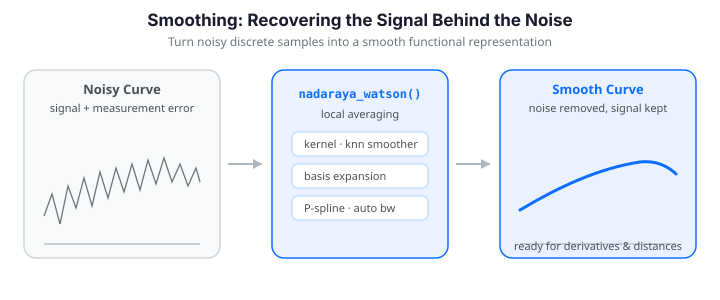

# Smoothing Functional Data


{ .fdars-diagram }

## Why Smooth Functional Data?

Real-world functional measurements almost always carry noise -- from instrument
limitations, random sampling variation, and digitization. Smoothing turns noisy
discrete samples into a smooth functional representation, which matters for
several reasons:

- **Derivatives** amplify noise severely; a smooth curve is a prerequisite for
  differentiation (see [Working with Derivatives](derivatives.md)).
- **Curve comparisons** (distances, alignment, depth) are meaningful only once
  the wiggle of measurement error is removed.
- **Visualization and inference** both rely on the underlying signal, not the
  noise on top of it.

fdars offers several complementary approaches. This guide walks through kernel
smoothers, k-nearest-neighbor smoothing, basis expansion, and penalized-basis
(P-spline) smoothing -- with automatic bandwidth and penalty selection -- using
a real dataset throughout.

---

## Available Smoothing Methods

| Method | Function(s) | Approach | Key parameter |
|--------|-------------|----------|---------------|
| Nadaraya-Watson | `nadaraya_watson` | Kernel-weighted local average | bandwidth $h$ |
| Local linear | `local_linear` | Local linear regression | bandwidth $h$ |
| Local polynomial | `local_polynomial` | Local degree-$p$ regression | bandwidth $h$, degree |
| k-NN | `knn_smoother` | Average of $k$ nearest points | neighbors $k$ |
| Basis expansion | `fdata_to_basis_1d` | Project onto B-spline/Fourier basis | basis count $K$ |
| Penalized basis (fixed) | `pspline_fit_1d` | Many basis functions + roughness penalty | penalty $\lambda$ |
| Penalized basis (auto) | `pspline_fit_gcv`, `smooth_basis_gcv` | Penalized basis with GCV selection | data-driven $\lambda$ |

The first four live in `fdars.smoothing`; the basis methods live in
`fdars.basis`.

---

## Loading Real Data: The Berkeley Growth Study

The Berkeley Growth Study tracked the heights of 54 girls and 39 boys from age 1
to 18. It is the canonical functional-data teaching example. fdars ships it via
`docs_data.load_growth`; we take the girls' curves to match the classic
analysis.

```python
import numpy as np
from fdars import Fdata
from docs_data import load_growth

age, X, meta = load_growth()          # age (31,), X (93, 31), meta with 'sex'
girls = X[(meta["sex"] == "female").values]   # (54, 31)
fd_raw = Fdata(girls, argvals=age)
print(fd_raw)   # Fdata (1D)  -  54 obs x 31 points  -  range [1.0, 18.0]
```

The heights are measured carefully, so the raw curves already look smooth. To
demonstrate smoothing we add synthetic measurement noise (2 cm) to simulate a
less precise instrument:

```python
rng = np.random.default_rng(0)
heights_noisy = girls + rng.normal(0, 2.0, size=girls.shape)
fd_noisy = Fdata(heights_noisy, argvals=age)
```

The panels below show five sample curves before and after adding noise -- the
same underlying growth pattern, now buried in jitter:

```python exec="1" html="1" source="above"
import numpy as np
from docs_fig import fig, render
from docs_data import load_growth

age, X, meta = load_growth()
girls = X[(meta["sex"] == "female").values]
noisy = girls + np.random.default_rng(0).normal(0, 2.0, size=girls.shape)

f, axes = fig(1, 2, figsize=(9.5, 4.0), sharey=True)
for ax, data, title in [(axes[0], girls, "Original"),
                        (axes[1], noisy, "With noise (SD = 2 cm)")]:
    for i in range(5):
        ax.plot(age, data[i], lw=1.6)
    ax.set(title=title, xlabel="Age (years)")
axes[0].set_ylabel("Height (cm)")
print(render(f))
```

The left panel is smooth enough to read a growth trajectory off directly; the
right panel scrambles that signal with 2 cm jitter, so features like the pubertal
spurt are no longer obvious by eye. Everything below is about recovering the left
panel from the right.

---

## Kernel Smoothers

Kernel smoothing estimates the value at each point by a *weighted average* of
nearby observations. A kernel function assigns the weights, and a bandwidth $h$
controls the size of the neighborhood. A smaller $h$ produces a wigglier fit
that chases noise; a larger $h$ over-smooths and flattens real features. This is
the classic bias-variance trade-off.

### Nadaraya-Watson

The Nadaraya-Watson estimator is a locally weighted average:

$$
\hat{m}(t) = \frac{\sum_{i=1}^{n} K_h(t - x_i)\, y_i}{\sum_{i=1}^{n} K_h(t - x_i)}
$$

where $K_h(u) = K(u/h)$ is a kernel with bandwidth $h$.

```python
from fdars.smoothing import nadaraya_watson

y = fd_noisy.data[0]
y_nw = nadaraya_watson(age, y, age, bandwidth=1.5, kernel="gaussian")
```

The first three arguments are the observed grid `x`, the observed values `y`,
and the evaluation grid `x_new` (here the same grid); the smoother returns the
fitted values at `x_new`.

#### Available kernels

| Kernel | `kernel=` | Shape |
|--------|-----------|-------|
| Gaussian | `"gaussian"` | $K(u) = \frac{1}{\sqrt{2\pi}} e^{-u^2/2}$ |
| Epanechnikov | `"epanechnikov"` | $K(u) = \frac{3}{4}(1 - u^2)_+$ |
| Tricube | `"tricube"` | $K(u) = \frac{70}{81}(1 - |u|^3)^3_+$ |

```python
y_gauss = nadaraya_watson(age, y, age, bandwidth=1.5, kernel="gaussian")
y_epan  = nadaraya_watson(age, y, age, bandwidth=1.5, kernel="epanechnikov")
y_tri   = nadaraya_watson(age, y, age, bandwidth=1.5, kernel="tricube")
```

!!! tip "Kernel choice"
    In practice, the bandwidth matters far more than the kernel shape. Gaussian
    is a safe default; Epanechnikov is theoretically MSE-optimal.

### Local linear regression

The Nadaraya-Watson estimator can suffer from **boundary bias**: near the edges
of the domain, the neighborhood is one-sided, so a flat local average is pulled
toward the interior. **Local linear regression** fits a weighted least-squares
*line* at each evaluation point, which automatically corrects this:

$$
\hat{m}(t) = \hat\beta_0(t), \qquad
(\hat\beta_0, \hat\beta_1) = \arg\min_{\beta_0,\beta_1}
\sum_{i=1}^n K_h(t - x_i)\bigl(y_i - \beta_0 - \beta_1 (x_i - t)\bigr)^2 .
$$

```python
from fdars.smoothing import local_linear

y_ll = local_linear(age, y, age, bandwidth=1.5, kernel="gaussian")
```

The interface is identical to `nadaraya_watson`. The comparison below overlays
both kernel fits on one noisy growth curve against the clean original -- notice
how local linear tracks the growth spurt and the endpoints a little better:

```python exec="1" html="1" source="above"
import numpy as np
from docs_fig import fig, render
from docs_data import load_growth
from fdars.smoothing import nadaraya_watson, local_linear

age, X, meta = load_growth()
girls = X[(meta["sex"] == "female").values]
noisy = girls + np.random.default_rng(0).normal(0, 2.0, size=girls.shape)

idx, h = 0, 1.5
y = noisy[idx]
nw = np.asarray(nadaraya_watson(age, y, age, bandwidth=h))
ll = np.asarray(local_linear(age, y, age, bandwidth=h))

f, ax = fig()
ax.scatter(age, y, s=16, color="#6c757d", alpha=0.7, label="noisy data")
ax.plot(age, nw, color="#3f51b5", lw=2.0, label="Nadaraya-Watson")
ax.plot(age, ll, color="#198754", lw=2.0, label="local linear")
ax.plot(age, girls[idx], color="#dc3545", lw=1.8, ls="--", label="original")
ax.set(title="Kernel smoother comparison (h = 1.5)",
       xlabel="Age (years)", ylabel="Height (cm)")
ax.legend()
print(render(f))
```

Both fits sit close to the dashed clean curve in the interior, but local linear
hugs the original more faithfully at the two endpoints and through the steep
growth spurt, where Nadaraya-Watson's one-sided averaging drags the estimate
toward the neighbouring interior values.

### Local polynomial regression

Local linear is the degree-1 case of **local polynomial** regression. Degree 0
recovers Nadaraya-Watson; higher degrees add flexibility and are useful for
estimating derivatives:

```python
from fdars.smoothing import local_polynomial

y_d0 = local_polynomial(age, y, age, bandwidth=1.5, degree=0)  # = Nadaraya-Watson
y_d1 = local_polynomial(age, y, age, bandwidth=1.5, degree=1)  # = local linear
y_d2 = local_polynomial(age, y, age, bandwidth=1.5, degree=2)  # local quadratic
y_d3 = local_polynomial(age, y, age, bandwidth=1.5, degree=3)  # local cubic
```

!!! warning "Higher degrees need wider bandwidths"
    Increasing `degree` amplifies noise. Compensate with a larger bandwidth or
    select one by cross-validation.

### Applying a smoother matrix to a whole sample

Because the kernel weights depend only on the grid and the bandwidth -- not on
the $y$ values -- the Nadaraya-Watson smoother is a **linear operator**: a fixed
matrix $S$ with $\hat{\mathbf y} = S\,\mathbf y$. `smoothing_matrix_nw` builds
that matrix once so you can smooth every curve in a sample with a single
matrix multiply:

```python
from fdars.smoothing import smoothing_matrix_nw

S = np.asarray(smoothing_matrix_nw(age, bandwidth=1.5))   # (31, 31)
fd_kernel = Fdata(fd_noisy.data @ S.T, argvals=age)        # smooth all 54 curves
```

This is exactly the workflow the R package exposes as `S.NW(tt, h)` followed by
`S %*% curve`.

---

## Bandwidth Selection via Cross-Validation

Choosing $h$ is the most important decision in kernel smoothing. Rather than
guess, `optim_bandwidth` searches a grid and minimizes either leave-one-out
cross-validation (CV) or generalized cross-validation (GCV).

### Generalized cross-validation (default)

```python
from fdars.smoothing import optim_bandwidth

result = optim_bandwidth(age, y, criterion="gcv", kernel="gaussian")
print(f"Optimal bandwidth: {result['h_opt']:.4f}")
print(f"GCV score:         {result['value']:.6f}")

y_opt = nadaraya_watson(age, y, age, bandwidth=result["h_opt"])
```

`optim_bandwidth` returns a dict with `h_opt` (the selected bandwidth),
`criterion`, and `value` (the criterion at the optimum).

### Leave-one-out cross-validation

```python
result_cv = optim_bandwidth(age, y, criterion="cv", kernel="gaussian")
print(f"Optimal bandwidth (CV): {result_cv['h_opt']:.4f}")
```

### Controlling the search grid

```python
result_fine = optim_bandwidth(
    age, y,
    criterion="gcv", kernel="gaussian",
    n_grid=100,   # finer grid
    h_min=0.5,    # lower bound (data on a 1-18 year scale)
    h_max=5.0,    # upper bound
)
```

If you only need the score at a *given* bandwidth (e.g. to draw the CV curve
yourself), `gcv_smoother` and `cv_smoother` return that scalar directly:

```python
from fdars.smoothing import gcv_smoother, cv_smoother

score_gcv = gcv_smoother(age, y, bandwidth=1.5)
score_cv  = cv_smoother(age, y, bandwidth=1.5)
```

!!! info "GCV vs CV"
    GCV is an algebraic approximation to leave-one-out CV that avoids refitting
    the model $n$ times. It is faster and usually gives similar results.

The figure below plots the GCV curve over a grid of bandwidths and marks the
minimum -- the classic U-shape of the bias-variance trade-off:

```python exec="1" html="1" source="above"
import numpy as np
from docs_fig import fig, render
from docs_data import load_growth
from fdars.smoothing import gcv_smoother, optim_bandwidth

age, X, meta = load_growth()
girls = X[(meta["sex"] == "female").values]
noisy = girls + np.random.default_rng(0).normal(0, 2.0, size=girls.shape)
y = noisy[0]

hs = np.linspace(0.4, 5.0, 40)
scores = np.array([gcv_smoother(age, y, bandwidth=h) for h in hs])
opt = optim_bandwidth(age, y, criterion="gcv", h_min=0.4, h_max=5.0, n_grid=80)

f, ax = fig()
ax.plot(hs, scores, color="#3f51b5", lw=2.0)
ax.axvline(opt["h_opt"], color="#dc3545", ls="--",
           label=f"h_opt = {opt['h_opt']:.2f}")
ax.set(title="GCV as a function of bandwidth",
       xlabel="bandwidth h", ylabel="GCV score")
ax.legend()
print(render(f))
```

The curve falls steeply, bottoms out at the marked `h_opt`, then rises again --
the signature bias-variance U. To the left of the minimum the fit chases noise
(high variance); to the right it over-smooths (high bias). Reading the minimum
off this curve is exactly what `optim_bandwidth` automates.

---

## k-Nearest-Neighbors Smoother

Instead of a fixed bandwidth in the units of $t$, the k-NN smoother averages the
`k` observations nearest each evaluation point. The effective bandwidth then
*adapts* to the local density -- growing where data is sparse and shrinking
where it is dense, which suits the unequal age spacing of the growth data:

```python
from fdars.smoothing import knn_smoother

y_knn = knn_smoother(age, y, age, k=7)
```

!!! tip "Choosing k"
    Larger `k` produces smoother curves; smaller `k` follows local features more
    closely. With only 31 points here, `k` in the single digits is reasonable.

`knn_gcv` picks `k` for you by generalized cross-validation, returning the
optimal `k` and the CV error for every candidate:

```python
from fdars.smoothing import knn_gcv

sel = knn_gcv(age, y, max_k=20)
print(f"Optimal k: {sel['optimal_k']}")   # dict with 'optimal_k', 'cv_errors'
```

---

## Basis Expansion

A basis expansion represents each curve as a linear combination of $K$ smooth
basis functions, $x(t) \approx \sum_{k=1}^K c_k \phi_k(t)$. Choosing $K$ smaller
than the number of sampling points achieves smoothing *and* dimensionality
reduction in one step -- projecting the noisy data onto a lower-dimensional
smooth subspace.

```python
from fdars.basis import fdata_to_basis_1d, basis_to_fdata_1d

coefs = fdata_to_basis_1d(fd_noisy.data, age, n_basis=12, basis_type="bspline")
fd_basis = Fdata(
    basis_to_fdata_1d(coefs, age, n_basis=12, basis_type="bspline"),
    argvals=age,
)
```

### Automatic basis selection

`basis_nbasis_cv` chooses $K$ by cross-validation over a range of candidates
(mirroring R's `fdata2basis_cv`), supporting GCV (default), CV, AIC, and BIC:

```python
from fdars.basis import basis_nbasis_cv

cv_basis = basis_nbasis_cv(
    fd_noisy.data, age,
    nbasis_min=5, nbasis_max=20,
    basis_type="bspline", criterion="gcv",
)
print(f"Optimal nbasis: {cv_basis['optimal_nbasis']}")
# keys: 'optimal_nbasis', 'scores', 'nbasis_range', 'criterion'
```

!!! tip "Choosing `n_basis`"
    A rule of thumb for B-splines is `n_basis ~ n_points / 5` to `n_points / 4`.
    A roughness penalty (next section) prevents overfitting even with many basis
    functions, so you rarely need to tune $K$ precisely once you penalize.

### AIC-based selection

GCV approximates leave-one-out cross-validation efficiently, but **AIC (Akaike Information Criterion)** penalises effective degrees of freedom (EDF) more explicitly:

$$
\mathrm{AIC}(\lambda) = n \log\!\left(\frac{\mathrm{RSS}}{n}\right) + 2\,\mathrm{edf}(\lambda)
$$

where $\mathrm{edf}(\lambda) = \operatorname{tr}(H_\lambda)$ is the trace of the hat matrix. AIC tends to select slightly more complex models than GCV when the signal-to-noise ratio is high, making it a useful cross-check.

Three fdars functions expose AIC-based selection:

**`smooth_basis_aic` (AIC-optimal P-spline penalty)**

Searches a log-$\lambda$ grid and returns the fit minimising AIC. The returned dict includes `fitted`, `coefficients`, `edf`, `aic`, `gcv`, `bic`, and `nbasis`. Use this when you want the same output shape as `smooth_basis_gcv` but with AIC-selected smoothness:

```python
from fdars.basis import smooth_basis_aic

result = smooth_basis_aic(
    fd_noisy.data, age,
    n_basis=20, basis_type="bspline", lfd_order=2,
)
print(f"AIC:  {result['aic']:.4f}")
print(f"EDF:  {result['edf']:.2f}")
```

**`optim_bandwidth(criterion="aic")` (AIC-optimal kernel bandwidth)**

Selects the kernel bandwidth that minimises AIC instead of GCV. The interface is identical to the GCV call — only `criterion="aic"` changes:

```python
from fdars.smoothing import optim_bandwidth

result_aic = optim_bandwidth(age, y, criterion="aic", kernel="gaussian")
print(f"h_opt (AIC): {result_aic['h_opt']:.4f}")
```

**`basis_nbasis_cv(criterion="aic")` (AIC-optimal basis count)**

Searches the basis-count grid and selects $K$ by AIC rather than GCV. Particularly useful for B-splines when you suspect GCV under-smooths (AIC's stronger EDF penalty pushes toward sparser representations):

```python
from fdars.basis import basis_nbasis_cv

cv_aic = basis_nbasis_cv(
    fd_noisy.data, age,
    nbasis_min=5, nbasis_max=20,
    basis_type="bspline", criterion="aic",
)
print(f"Optimal n_basis (AIC): {cv_aic['optimal_nbasis']}")
```

The fence below runs all three AIC paths on a small synthetic dataset to confirm they return valid selections. No real dataset is loaded — the grid is kept tiny to protect the build.

```python exec="1" html="1" source="above"
import numpy as np
from fdars.basis import smooth_basis_aic, basis_nbasis_cv
from fdars.smoothing import optim_bandwidth

rng = np.random.default_rng(42)
t = np.linspace(0, 1, 30)
true = np.sin(2 * np.pi * t)
X = np.array([true + 0.25 * rng.standard_normal(t.size) for _ in range(12)])
y = X[0]

# AIC-optimal P-spline penalty
r_aic = smooth_basis_aic(X, t, n_basis=10, n_grid=15)
# AIC-optimal kernel bandwidth
bw_aic = optim_bandwidth(t, y, criterion="aic", n_grid=20)
# AIC-optimal basis count
cv_aic = basis_nbasis_cv(X, t, nbasis_min=4, nbasis_max=12, criterion="aic")

print(f"smooth_basis_aic  edf: {r_aic['edf']:.2f}  aic: {r_aic['aic']:.3f}")
print(f"optim_bandwidth   h_opt (AIC): {bw_aic['h_opt']:.4f}")
print(f"basis_nbasis_cv   optimal_nbasis (AIC): {cv_aic['optimal_nbasis']}  FDARS_FENCE_OK")
```

!!! tip "GCV vs AIC in practice"
    GCV and AIC usually agree within one or two basis functions / bandwidth steps.
    AIC may prefer a slightly more complex model when the true signal has sharp
    features. GCV is the faster approximation for large samples; AIC's explicit EDF
    accounting can be more reliable when $n$ is small relative to $m$.

---

## Penalized Basis (P-spline) Smoothing

Penalized-basis smoothing uses *many* basis functions but adds a **roughness
penalty** so the fit cannot overfit. It minimizes

$$
\lVert \mathbf y - \Phi \mathbf c \rVert^2 + \lambda\, \mathbf c^\top D^\top D\, \mathbf c ,
$$

where $\Phi$ holds the basis functions evaluated on the grid, $D$ is a
difference matrix of a chosen `order` (2 penalizes curvature), and $\lambda$
tunes the fit-vs-smoothness balance. This is the P-spline of Eilers & Marx.

### Fixed penalty with `pspline_fit_1d`

When you already know a good $\lambda$, fit directly:

```python
from fdars.basis import pspline_fit_1d

result_ps = pspline_fit_1d(
    fd_noisy.data, age,
    n_basis=25, lambda_=1.0, order=2,
)
print(f"EDF: {result_ps['edf']:.2f}")
print(f"RSS: {result_ps['rss']:.4f}")
print(f"AIC: {result_ps['aic']:.2f}   BIC: {result_ps['bic']:.2f}")
```

The **effective degrees of freedom** (EDF) quantify how much the penalty has
shrunk the 25 basis functions -- a small EDF means heavy smoothing.

### Automatic penalty via GCV

Selecting $\lambda$ automatically is the recommended default. GCV chooses it by
minimizing

$$
\mathrm{GCV}(\lambda) = \frac{\mathrm{RSS}/n}{(1 - \mathrm{edf}/n)^2}.
$$

Two functions do this. `pspline_fit_gcv` returns fitted curves plus EDF and
information criteria:

```python
from fdars.basis import pspline_fit_gcv

result_auto = pspline_fit_gcv(fd_noisy.data, age, n_basis=25, order=2)
print(f"EDF: {result_auto['edf']:.2f}")
print(f"GCV: {result_auto['gcv']:.6f}")
print(f"AIC: {result_auto['aic']:.2f}   BIC: {result_auto['bic']:.2f}")
```

!!! note "Selected $\lambda$ not returned"
    `pspline_fit_gcv` reports the fit quality (EDF, GCV, AIC, BIC) but does not
    currently expose the chosen $\lambda$ itself. If you need the value, search
    a grid yourself with `pspline_fit_1d` and pick the minimum-GCV fit.

`smooth_basis_gcv` is the higher-level entry point (R's `smooth.basis.gcv`),
supporting B-spline and Fourier bases and returning coefficients too:

```python
from fdars.basis import smooth_basis_gcv

result_gcv = smooth_basis_gcv(
    fd_noisy.data, age,
    n_basis=25, basis_type="bspline", lfd_order=2,
)
fitted = result_gcv["fitted"]          # (54, 31) smoothed curves
coeffs = result_gcv["coefficients"]    # (54, 25) basis coefficients
print(f"EDF: {result_gcv['edf']:.2f}   GCV: {result_gcv['gcv']:.6f}")
```

On these girls' growth curves GCV settles on roughly 8 effective degrees of
freedom with a GCV score near 5.7 -- closely matching the R reference
implementation.

### The effect of the penalty $\lambda$

Sweeping $\lambda$ makes the bias-variance trade-off visible. A tiny $\lambda$
under-smooths (tracks noise); a huge $\lambda$ over-smooths (loses the growth
spurt); the GCV-selected value sits in between:

```python exec="1" html="1" source="above"
import numpy as np
from docs_fig import fig, render
from docs_data import load_growth
from fdars.basis import pspline_fit_1d, pspline_fit_gcv

age, X, meta = load_growth()
girls = X[(meta["sex"] == "female").values]
noisy = girls + np.random.default_rng(0).normal(0, 2.0, size=girls.shape)
idx = 0

fits = [
    ("lambda = 0.001", np.asarray(pspline_fit_1d(noisy, age, 20, 1e-3, 2)["fitted"])[idx]),
    ("Optimal (GCV)",  np.asarray(pspline_fit_gcv(noisy, age, 20, 2)["fitted"])[idx]),
    ("lambda = 1e5",   np.asarray(pspline_fit_1d(noisy, age, 20, 1e5, 2)["fitted"])[idx]),
]

f, axes = fig(1, 3, figsize=(10.5, 3.6), sharey=True)
for ax, (title, fit) in zip(axes, fits):
    ax.scatter(age, noisy[idx], s=12, color="#6c757d", alpha=0.6)
    ax.plot(age, fit, color="#3f51b5", lw=2.0)
    ax.set(title=title, xlabel="Age (years)")
axes[0].set_ylabel("Height (cm)")
print(render(f))
```

The tiny penalty (left) leaves the fit interpolating the noise point-to-point;
the huge penalty (right) has flattened the curve toward a straight line, erasing
the pubertal spurt entirely. Only the GCV-selected middle panel keeps the spurt
while suppressing the jitter -- confirming that automatic $\lambda$ selection
lands in the sweet spot without manual tuning.

### Fourier basis for periodic data

For periodic or seasonal data, a Fourier basis is more natural and parsimonious
than B-splines. Here we build ten synthetic periodic curves and smooth them with
`smooth_basis_gcv(..., basis_type="fourier")`:

```python exec="1" html="1" source="above"
import numpy as np
from docs_fig import fig, render
from fdars.basis import smooth_basis_gcv

rng = np.random.default_rng(1)
t = np.linspace(0, 1, 31)
clean = np.sin(2 * np.pi * t) + 0.3 * np.cos(4 * np.pi * t)
periodic = clean + rng.normal(0, 0.25, size=(10, t.size))

res = smooth_basis_gcv(periodic, t, n_basis=13, basis_type="fourier")
fitted = np.asarray(res["fitted"])

f, ax = fig()
ax.scatter(np.tile(t, 3), periodic[:3].ravel(), s=12, color="#6c757d",
           alpha=0.5, label="noisy data")
ax.plot(t, clean, color="#dc3545", lw=1.8, ls="--", label="true signal")
for i in range(3):
    ax.plot(t, fitted[i], lw=1.8)
ax.set(title=f"Fourier smoothing (GCV = {res['gcv']:.4f})", xlabel="t", ylabel="y")
ax.legend()
print(render(f))
```

The Fourier fits recover the dashed true signal almost exactly with only 13 basis
functions, because sines and cosines are the natural building blocks of a periodic
curve -- a B-spline basis would need far more functions to match the same period
faithfully.

---

## Comparing All Methods

Bringing the families together on the same noisy growth curve shows that,
appropriately tuned, they largely agree in the interior and differ mainly at the
boundaries and in noisy stretches:

```python exec="1" html="1" source="above"
import numpy as np
from docs_fig import fig, render
from docs_data import load_growth
from fdars.smoothing import local_linear, knn_smoother, optim_bandwidth
from fdars.basis import smooth_basis_gcv, pspline_fit_gcv

age, X, meta = load_growth()
girls = X[(meta["sex"] == "female").values]
noisy = girls + np.random.default_rng(0).normal(0, 2.0, size=girls.shape)
idx = 2
y = noisy[idx]

bw = optim_bandwidth(age, y, criterion="gcv")
curves = {
    "local linear": np.asarray(local_linear(age, y, age, bandwidth=bw["h_opt"])),
    "k-NN (k=7)":   np.asarray(knn_smoother(age, y, age, k=7)),
    "P-spline":     np.asarray(pspline_fit_gcv(noisy, age, 20, 2)["fitted"])[idx],
    "penalized (GCV)": np.asarray(smooth_basis_gcv(noisy, age, 25)["fitted"])[idx],
}

f, ax = fig()
ax.scatter(age, y, s=16, color="#6c757d", alpha=0.6, label="noisy data")
ax.plot(age, girls[idx], color="#000000", lw=2.2, alpha=0.55, label="original")
for name, yh in curves.items():
    ax.plot(age, yh, lw=1.8, label=name)
ax.set(title="Smoothing method comparison", xlabel="Age (years)",
       ylabel="Height (cm)")
ax.legend(ncol=2)
print(render(f))
```

We can also quantify agreement with the clean signal via mean squared error:

```python
import numpy as np
from fdars.smoothing import nadaraya_watson, local_linear, knn_smoother, optim_bandwidth
from fdars.basis import smooth_basis_gcv

idx = 2
y, y_true = fd_noisy.data[idx], fd_raw.data[idx]
bw = optim_bandwidth(age, y)

fits = {
    "NW":       nadaraya_watson(age, y, age, bandwidth=bw["h_opt"]),
    "LocLin":   local_linear(age, y, age, bandwidth=bw["h_opt"]),
    "k-NN":     knn_smoother(age, y, age, k=7),
    "P-spline": smooth_basis_gcv(fd_noisy.data, age, n_basis=25)["fitted"][idx],
}
for name, y_hat in fits.items():
    mse = np.mean((np.asarray(y_hat) - y_true) ** 2)
    print(f"{name:8s}  MSE = {mse:.4f}")
```

---

## Mean and Variability

Once the sample is smoothed, its **mean curve** and **pointwise variability**
become interpretable. Here we smooth all 54 girls with a penalized basis, then
draw the mean growth trajectory with a $\pm 2$ SD band:

```python exec="1" html="1" source="above"
import numpy as np
from docs_fig import fig, render
from docs_data import load_growth
from fdars.basis import pspline_fit_gcv

age, X, meta = load_growth()
girls = X[(meta["sex"] == "female").values]
noisy = girls + np.random.default_rng(0).normal(0, 2.0, size=girls.shape)

fitted = np.asarray(pspline_fit_gcv(noisy, age, 20, 2)["fitted"])
mean_curve = fitted.mean(axis=0)
sd_curve = fitted.std(axis=0, ddof=1)

f, ax = fig()
ax.fill_between(age, mean_curve - 2 * sd_curve, mean_curve + 2 * sd_curve,
                color="#3f51b5", alpha=0.18, label="mean +/- 2 SD")
ax.plot(age, mean_curve, color="#3f51b5", lw=2.4, label="mean")
ax.set(title="Mean growth curve with variability band",
       xlabel="Age (years)", ylabel="Height (cm)")
ax.legend()
print(render(f))
```

Variability is widest through the pubertal growth spurt and narrows in late
adolescence as the girls approach their adult heights.

---

## Summary: When to Use Each Method

| Method | Module | Best for |
|--------|--------|----------|
| Nadaraya-Watson | `fdars.smoothing` | Simple nonparametric averaging; automatic bandwidth via GCV |
| Local linear | `fdars.smoothing` | Corrects boundary bias |
| Local polynomial | `fdars.smoothing` | Flexible; can estimate derivatives |
| k-NN | `fdars.smoothing` | Adapts to local density / irregular sampling |
| Basis expansion | `fdars.basis` | Dimensionality reduction |
| P-spline / penalized basis | `fdars.basis` | General purpose, automatic penalty; smooths all curves at once |
| Fourier basis | `fdars.basis` | Periodic / seasonal data |
| AIC-optimal smoothing | `fdars.basis`, `fdars.smoothing` | Explicit EDF penalisation; cross-check for GCV |

**Rules of thumb:**

1. Start with `smooth_basis_gcv` -- automatic $\lambda$ selection via GCV works
   well in most cases.
2. Use `pspline_fit_gcv` for fast P-spline smoothing with GCV.
3. Use basis expansion (`fdata_to_basis_1d`) when dimensionality reduction is
   the goal.
4. Use kernel or k-NN smoothers for irregular sampling or adaptive smoothing.
5. Use a Fourier basis for periodic data.

---

## Next Steps

- [Working with Derivatives](derivatives.md) -- smooth first, then
  differentiate.
- [Basis Representation](../represent/basis-representation.md) -- deeper look at
  B-spline and Fourier basis expansions.
- [Simulation Toolbox](simulation.md) -- generate data to test your smoothing
  pipeline.

---

## References

- Ramsay, J.O. and Silverman, B.W. (2005). *Functional Data Analysis*. Springer.
- Eilers, P.H.C. and Marx, B.D. (1996). Flexible Smoothing with B-splines and
  Penalties. *Statistical Science*, 11(2), 89-121.
- Fan, J. and Gijbels, I. (1996). *Local Polynomial Modelling and Its
  Applications*. Chapman and Hall.
