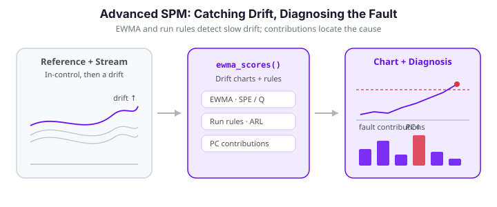

# Advanced Statistical Process Monitoring

The [basic control chart](spm.md) flags an observation whenever its $T^2$ statistic
crosses a limit. Real monitoring problems ask more: *How long until a small drift is
detected? Which principal component is responsible for a fault? Is a run of borderline
points a genuine trend or just noise?* This page covers the tools `fdars.spm` provides
for these questions — the **SPE / Q** statistic, **EWMA** charts for slow drifts,
**run rules** (Nelson, Western Electric), **average run length** (ARL) analysis, and
**per-PC contribution** diagnosis for locating faults.

All of the examples below build on a single Phase I model. The setup — 120 in-control
Phase I curves, then a Phase II stream of 30 in-control curves followed by a slow upward
drift — is reused throughout; each figure block below re-creates it for reproducibility.

{ .fdars-diagram }

```python exec="1" html="1" source="above"
import numpy as np
from docs_fig import fig, render
from fdars.simulation import simulate
from fdars.spm import spm_phase1, spm_monitor, ewma_scores, hotelling_t2

argvals = np.linspace(0, 1, 80)

# Phase I: 120 in-control curves
ic = np.asarray(simulate(120, argvals, n_basis=6, seed=7))
p1 = spm_phase1(ic, argvals, ncomp=4, alpha=0.01)

# Phase II: 30 in-control curves followed by a slow upward drift
ok = np.asarray(simulate(30, argvals, n_basis=6, seed=21))
drift = np.asarray(simulate(20, argvals, n_basis=6, seed=33))
drift = drift + np.linspace(0, 5.0, 20)[:, None]          # ramp: 0 -> 5
new = np.vstack([ok, drift])

f, ax = fig()
ax.plot(argvals, ic.T, color="#6c757d", lw=0.5, alpha=0.30)
ax.plot(argvals, ok.T, color="#3f51b5", lw=0.7, alpha=0.5)
ax.plot(argvals, drift.T, color="#e8710a", lw=0.9, alpha=0.7)
ax.set(title="Phase I baseline (grey), in-control Phase II (indigo), drifting stream (orange)",
       xlabel="t", ylabel="x(t)")
print(render(f))
```

The in-control Phase II curves (indigo) are indistinguishable from the baseline cloud, while the drifting stream (orange) fans upward as the ramp accumulates. Crucially the *early* drift curves still sit inside the baseline envelope -- the shift only becomes obvious late -- which is exactly the situation where a memoryless chart lags and the EWMA and run-rule tools below earn their keep.

---

## Concepts

### Two statistics, two failure modes

FPCA splits every centered curve $\tilde x_i(t) = x_i(t) - \hat\mu(t)$ into a part that
lives in the retained subspace and a residual orthogonal to it:

$$
\tilde x_i(t) = \underbrace{\sum_{k=1}^{K} \xi_{ik}\,\phi_k(t)}_{\text{modelled}}
              + \underbrace{e_i(t)}_{\text{residual}} .
$$

The **Hotelling $T^2$** statistic watches the modelled part; the **SPE** (squared
prediction error, also called the **Q** statistic) watches the residual:

$$
T^2_i = \sum_{k=1}^{K} \frac{\xi_{ik}^2}{\lambda_k},
\qquad
\mathrm{SPE}_i = \int e_i(t)^2\,dt .
$$

A shift *inside* the subspace (an amplitude change, a mean shift along a dominant
mode) inflates $T^2$. A departure the model *cannot* represent (new high-frequency
structure) inflates SPE. Monitoring both is standard practice.

### Control limits

Under the in-control model, $T^2 \sim \chi^2_K$, so
`t2_control_limit(ncomp, alpha)` returns the $1-\alpha$ chi-squared quantile. The SPE
distribution is heavier-tailed; `spe_control_limit` fits a moment-matched
$g\,\chi^2_h$ approximation to the Phase I SPE values.

```python exec="1" html="1" source="above"
import numpy as np
from fdars.simulation import simulate
from fdars.spm import spm_phase1, t2_control_limit, spe_control_limit

argvals = np.linspace(0, 1, 80)
p1 = spm_phase1(np.asarray(simulate(120, argvals, n_basis=6, seed=7)),
                argvals, ncomp=4, alpha=0.01)

t2_ucl = t2_control_limit(ncomp=4, alpha=0.01)
spe_ucl = spe_control_limit(np.asarray(p1["spe"]), alpha=0.01)
print("t2 :", t2_ucl)
print("spe:", spe_ucl)
```

Both return a dict with `ucl`, `alpha`, and a `description` string. In practice
`spm_phase1` has already stored `t2_limit` / `spe_limit`; these helpers are useful when
you want a limit for a different $\alpha$ or for a chart you are building by hand.

### Average run length (ARL)

The **ARL** is the expected number of observations until an alarm. In-control you want
it *large* ($\mathrm{ARL}_0$ = mean time between false alarms); out-of-control you want
it *small* ($\mathrm{ARL}_1$ = detection delay). `fdars.spm` estimates both by Monte
Carlo simulation from the eigenvalues.

| Function | Purpose |
|---|---|
| `arl0_t2(eigenvalues, ucl, ...)` | In-control ARL of the $T^2$ chart |
| `arl1_t2(eigenvalues, ucl, shift, ...)` | Detection delay for a given `shift` vector |
| `arl0_ewma_t2(eigenvalues, ucl, lambda_, ...)` | In-control ARL of the EWMA-$T^2$ chart |
| `arl0_spe(spe_df, spe_scale, ucl, ...)` | In-control ARL of the SPE chart |

Each returns `{arl, std_dev, median_rl}`.

```python exec="1" html="1" source="above"
import numpy as np
from fdars.simulation import simulate
from fdars.spm import spm_phase1, arl0_t2, arl1_t2

argvals = np.linspace(0, 1, 80)
p1 = spm_phase1(np.asarray(simulate(120, argvals, n_basis=6, seed=7)),
                argvals, ncomp=4, alpha=0.01)
ev = np.asarray(p1["eigenvalues"])
ucl = p1["t2_limit"]

a0 = arl0_t2(ev, ucl, n_simulations=3000, seed=1)
a1 = arl1_t2(ev, ucl, shift=np.array([2.0, 0.0, 0.0, 0.0]),
             n_simulations=3000, seed=1)
print(f"ARL0 (mean run to a false alarm): {a0['arl']:.1f}")
print(f"ARL1 (delay for a 2-sigma shift on PC1): {a1['arl']:.1f}")
```

The gap between the two numbers is the whole point: the chart runs for on the order of a hundred observations between false alarms, yet catches a two-sigma shift on the leading component within a handful. That ratio -- large ARL$_0$, small ARL$_1$ -- is the quantitative definition of a well-tuned chart.

Sweeping the shift magnitude traces the chart's **operating characteristic** -- ARL$_1$ as a function of fault size -- which is the single most useful summary of a chart's sensitivity:

```python exec="1" html="1" source="above"
import numpy as np
from docs_fig import fig, render
from fdars.simulation import simulate
from fdars.spm import spm_phase1, arl0_t2, arl1_t2

argvals = np.linspace(0, 1, 80)
p1 = spm_phase1(np.asarray(simulate(120, argvals, n_basis=6, seed=7)),
                argvals, ncomp=4, alpha=0.01)
ev, ucl = np.asarray(p1["eigenvalues"]), float(p1["t2_limit"])

a0 = arl0_t2(ev, ucl, n_simulations=3000, seed=1)["arl"]
deltas = np.linspace(0.0, 3.0, 9)
arls = [arl1_t2(ev, ucl, np.array([d * np.sqrt(ev[0]), 0.0, 0.0, 0.0]),
                n_simulations=3000, seed=1)["arl"] for d in deltas]

f, ax = fig()
ax.plot(deltas, arls, "o-", color="#3f51b5", label="ARL$_1$ (shift on PC1)")
ax.axhline(a0, color="#dc3545", ls="--", lw=1, label=f"in-control ARL$_0 \\approx$ {a0:.0f}")
ax.set(xlabel="mean shift along PC1 (× standard deviation)", ylabel="average run length",
       yscale="log", title="Operating characteristic of the $T^2$ chart")
ax.legend()
print(render(f))
```

At zero shift the simulated ARL lands near $1/\alpha = 100$, confirming the limit hits its
design false-alarm rate; beyond about a one-sigma shift the detection delay collapses toward
a single observation. The flat, slow-detection shoulder at small shifts is the region the
EWMA and run-rule charts below are built to shrink.

!!! note "Interpreting the pair"
    A useful design targets a fixed $\mathrm{ARL}_0$ (say 200) by tuning `alpha`, then
    compares $\mathrm{ARL}_1$ across chart types. The chart with the smaller
    $\mathrm{ARL}_1$ at the same $\mathrm{ARL}_0$ detects the shift faster.

---

## EWMA charts for slow drifts

A Shewhart $T^2$ chart looks at each observation in isolation, so a shift much smaller
than the control limit can persist for a long time undetected. An **EWMA**
(exponentially weighted moving average) smooths the score vector,

$$
\mathbf z_i = \lambda\,\boldsymbol\xi_i + (1-\lambda)\,\mathbf z_{i-1},
\qquad 0 < \lambda \le 1,
$$

so that a sustained small drift accumulates. `spm_ewma(train, seq, argvals, ncomp, lam)`
fits a Phase I FPCA chart on the in-control training curves and then runs the EWMA monitor
over the stream in one call, returning the smoothed-score $T^2$, its control limit, and the
per-observation alarm flags.

```python exec="1" html="1" source="above"
import numpy as np
from docs_fig import fig, render
from fdars.simulation import simulate
from fdars.spm import spm_phase1, spm_ewma, hotelling_t2

argvals = np.linspace(0, 1, 80)
ic = np.asarray(simulate(120, argvals, n_basis=6, seed=7))
ok = np.asarray(simulate(30, argvals, n_basis=6, seed=21))
drift = np.asarray(simulate(20, argvals, n_basis=6, seed=33))
drift = drift + np.linspace(0, 5.0, 20)[:, None]          # ramp: 0 -> 5
new = np.vstack([ok, drift])

lam = 0.2
ew = spm_ewma(ic, new, argvals, ncomp=4, alpha=0.01, lam=lam)
t2_ewma = np.asarray(ew["t2"])            # EWMA-smoothed T2
ewma_ucl = ew["t2_limit"]

# a plain Shewhart T2 on the same stream, for contrast
p1 = spm_phase1(ic, argvals, ncomp=4, alpha=0.01)
scores = ((new - np.asarray(p1["mean"])) * np.asarray(p1["weights"])) @ np.asarray(p1["loadings"])
t2_raw = np.asarray(hotelling_t2(scores, np.asarray(p1["eigenvalues"])))
obs = np.arange(1, len(new) + 1)

f, ax = fig()
ax.plot(obs, t2_raw, "o-", ms=3, lw=0.8, color="#c7cbe0", label="Shewhart $T^2$")
ax.plot(obs, t2_ewma, "o-", ms=4, lw=1.4, color="#3f51b5", label=f"EWMA $T^2$ ($\\lambda={lam}$)")
ax.axhline(ewma_ucl, color="#e8710a", ls="--", lw=1.3, label="EWMA control limit")
ax.axvline(30.5, color="#6c757d", ls=":", lw=1, label="drift starts")
ax.set(title="EWMA smooths a slow drift into a clear, sustained signal",
       xlabel="observation index", ylabel="$T^2$")
ax.legend(loc="upper left", fontsize=8)
print(render(f))
```

The Shewhart trace (grey) wanders around the drift without a decisive crossing; the
EWMA trace (indigo) ramps up smoothly once the drift begins and, once it clears the limit
(around observation 38), stays above it for the rest of the run.

| Parameter | Type | Description |
|---|---|---|
| `train_data` | `(n_train, m)` array | In-control Phase I curves |
| `sequential_data` | `(n_seq, m)` array | Stream to monitor |
| `argvals` | `(m,)` array | Evaluation grid |
| `ncomp` | int | Number of FPCA components |
| `lam` | float in `(0, 1]` | Smoothing weight; smaller = more smoothing, slower response |

The returned dict carries `t2`, `spe`, `t2_limit`, `spe_limit`, `t2_alarm`, `spe_alarm`, and
the `smoothed_scores`, so the EWMA chart also watches the residual (SPE) automatically.

!!! tip "Choosing `λ`"
    Small $\lambda$ (0.05–0.2) is tuned for small persistent shifts; $\lambda \to 1$
    recovers the memoryless Shewhart chart. Use `arl0_ewma_t2(ev, ucl, lambda_)` to
    check the in-control ARL of your chosen $\lambda$ before deploying it.

!!! note "CUSUM is exposed too"
    For a sequential drift the CUSUM chart is the classic alternative to EWMA.
    `spm_cusum(train, seq, argvals, ncomp, k=0.5, h=5.0)` fits Phase I and runs the
    functional CUSUM in one call, returning `cusum_statistic`, its decision interval `ucl`,
    and `alarm` flags (plus `cusum_plus` / `cusum_minus` for the one-sided pair). On the
    same drifting stream it alarms from roughly the same observation the EWMA chart does.

---

## Run rules

Rather than looking only at limit crossings, **run rules** flag suspicious *patterns* —
several points on one side of the centre line, a monotone run, a point in the outer
zone. `fdars.spm` implements the two classic rule sets:

- `western_electric_rules(values, center, sigma)` — the four Western Electric zone rules.
- `nelson_rules(values, center, sigma)` — the eight Nelson rules (a superset).

Both take the monitoring statistic, a centre line, and a $\sigma$ estimate, and return a
`list[dict]`, each `{"rule": <name>, "indices": [...]}`.

```python exec="1" html="1" source="above"
import numpy as np
from fdars.simulation import simulate
from fdars.spm import spm_phase1, hotelling_t2, western_electric_rules, nelson_rules

argvals = np.linspace(0, 1, 80)
p1 = spm_phase1(np.asarray(simulate(120, argvals, n_basis=6, seed=7)),
                argvals, ncomp=4, alpha=0.01)
ok = np.asarray(simulate(30, argvals, n_basis=6, seed=21))
drift = np.asarray(simulate(20, argvals, n_basis=6, seed=33))
drift = drift + np.linspace(0, 5.0, 20)[:, None]
new = np.vstack([ok, drift])
scores = ((new - np.asarray(p1["mean"])) * np.asarray(p1["weights"])) @ np.asarray(p1["loadings"])
ev = np.asarray(p1["eigenvalues"])

t2_stream = np.asarray(hotelling_t2(scores, ev))
center = float(np.median(np.asarray(p1["t2"])))
sigma = float(np.std(np.asarray(p1["t2"])))

we = western_electric_rules(t2_stream, center, sigma)
ns = nelson_rules(t2_stream, center, sigma)
print("Western Electric violations:")
for v in we:
    print(f"  {v['rule']:>4}  at indices {v['indices']}")
print(f"Nelson rules fired: {sorted({v['rule'] for v in ns})}")
```

The rules fire on the drift block even before any single point makes a dramatic limit crossing: a run of consecutive points above the centre line trips the zone and trend rules first. That is the value of run rules -- they convert a *pattern* of mildly elevated points into an alarm, buying detection time on gradual faults.

Plotting the $T^2$ stream over the classic Western-Electric zones (each band one $\sigma$ wide) makes the flagged pattern legible at a glance:

```python exec="1" html="1" source="above"
import numpy as np
from docs_fig import fig, render
from fdars.simulation import simulate
from fdars.spm import spm_phase1, hotelling_t2, nelson_rules

argvals = np.linspace(0, 1, 80)
p1 = spm_phase1(np.asarray(simulate(120, argvals, n_basis=6, seed=7)),
                argvals, ncomp=4, alpha=0.01)
ok = np.asarray(simulate(30, argvals, n_basis=6, seed=21))
drift = np.asarray(simulate(20, argvals, n_basis=6, seed=33))
drift = drift + np.linspace(0, 5.0, 20)[:, None]
new = np.vstack([ok, drift])
scores = ((new - np.asarray(p1["mean"])) * np.asarray(p1["weights"])) @ np.asarray(p1["loadings"])
ev = np.asarray(p1["eigenvalues"])

t2 = np.asarray(hotelling_t2(scores, ev))
center = float(np.median(np.asarray(p1["t2"])))
sigma = float(np.std(np.asarray(p1["t2"])))
ns = nelson_rules(t2, center, sigma)
flagged = sorted({i for v in ns for i in v["indices"]})
mask = np.zeros(len(new), bool); mask[flagged] = True
obs = np.arange(1, len(new) + 1)

f, ax = fig()
for z, col in [(1, "#eef0f8"), (2, "#e0e3f2"), (3, "#d0d5ec")]:
    ax.axhspan(center + (z - 1) * sigma, center + z * sigma, color=col, zorder=0)
ax.axhline(center, color="#6c757d", lw=1, label="centre line")
ax.plot(obs, t2, "-", color="#c7cbe0", lw=0.8, zorder=1)
ax.scatter(obs[~mask], t2[~mask], s=20, color="#3f51b5", zorder=2, label="no rule fired")
ax.scatter(obs[mask], t2[mask], s=36, color="#dc3545", zorder=3, label="rule violation")
ax.set(xlabel="observation index", ylabel="$T^2$",
       title="Nelson run rules flag the drift as a sustained pattern")
ax.legend(loc="upper left", fontsize=8)
print(render(f))
```

The red points cluster in the drift block, where a lengthening run of consecutive above-centre
values trips the trend and zone rules well before the raw statistic would have crossed a
hard limit -- the run-rule layer detects the drift as an emerging *pattern* rather than
waiting for a single decisive spike.

| Parameter | Type | Description |
|---|---|---|
| `values` | `(n,)` array | Monitoring statistic to scan |
| `center` | float | Centre line (e.g. in-control median) |
| `sigma` | float | Standard-deviation estimate for the zone widths |

Run rules increase sensitivity to small shifts but also raise the false-alarm rate;
they are most useful layered on top of, not instead of, a limit-based chart.

---

## Fault diagnosis: per-PC contributions

When a point alarms, the next question is *why*. Because $T^2 = \sum_k \xi_k^2/\lambda_k$
is a sum over components, each component's term is an interpretable **contribution**.
`t2_pc_contributions(scores, eigenvalues)` returns the per-PC contributions (they sum to
the total $T^2$), and `t2_pc_significance(contributions, alpha)` flags which components
are individually significant under a Bonferroni-adjusted per-component test.

```python exec="1" html="1" source="above"
import numpy as np
from docs_fig import fig, render
from fdars.simulation import simulate
from fdars.spm import spm_phase1, t2_pc_contributions, t2_pc_significance

argvals = np.linspace(0, 1, 80)
p1 = spm_phase1(np.asarray(simulate(120, argvals, n_basis=6, seed=7)),
                argvals, ncomp=4, alpha=0.01)
ok = np.asarray(simulate(30, argvals, n_basis=6, seed=21))
drift = np.asarray(simulate(20, argvals, n_basis=6, seed=33))
drift = drift + np.linspace(0, 5.0, 20)[:, None]
new = np.vstack([ok, drift])
scores = ((new - np.asarray(p1["mean"])) * np.asarray(p1["weights"])) @ np.asarray(p1["loadings"])
ev = np.asarray(p1["eigenvalues"])

contrib = np.asarray(t2_pc_contributions(scores, ev))     # (n, ncomp)
sig = np.asarray(t2_pc_significance(contrib, alpha=0.05))  # 0/1 flags

# diagnose the most extreme observation *within the drift block* (obs 31 onward)
worst = 30 + int(np.argmax(contrib[30:].sum(axis=1)))
c = contrib[worst]
flags = sig[worst].astype(bool)
pcs = np.arange(1, len(c) + 1)

f, ax = fig()
colors = ["#dc3545" if fl else "#3f51b5" for fl in flags]
ax.bar(pcs, c, color=colors)
ax.set(title=f"$T^2$ contribution breakdown for observation #{worst + 1}",
       xlabel="principal component", ylabel="contribution $\\xi_k^2/\\lambda_k$")
ax.set_xticks(pcs)
# annotate the total
ax.text(0.97, 0.95, f"total $T^2$ = {c.sum():.1f}", transform=ax.transAxes,
        ha="right", va="top", fontsize=9,
        bbox=dict(boxstyle="round", fc="#f4f4fb", ec="#c7cbe0"))
print(render(f))
```

Red bars mark components flagged as significant contributors — these localise the fault
to specific modes of variation, telling the operator *which* aspect of the process moved
rather than merely *that* it moved.

| Parameter | Type | Description |
|---|---|---|
| `scores` | `(n, ncomp)` array | FPC scores |
| `eigenvalues` | `(ncomp,)` array | Eigenvalues $\lambda_k$ |
| `contributions` | `(n, ncomp)` array | Output of `t2_pc_contributions`, input to `t2_pc_significance` |
| `alpha` | float | Family-wise significance level (Bonferroni-adjusted) |

---

## See also

- [Statistical Process Monitoring](spm.md) — the Phase I / Phase II basics and the
  two-fault control-chart example.
- [Profile and Partial-Domain Monitoring](profile-partial-monitoring.md) — restricting
  the analysis to a sub-interval of the domain to catch localised faults.

!!! note "Robust limits and CUSUM are exposed too"
    Beyond the EWMA, run-rule, ARL, and contribution tools shown above, `fdars` binds two
    more of the R vignette's engines directly. `spm_cusum(train, seq, argvals, ncomp, k, h)`
    runs the functional CUSUM chart (see the note under the EWMA section), and
    `t2_limit_robust(t2_values, ncomp, alpha, method)` /
    `spe_limit_robust(spe_values, alpha, method)` replace the parametric $\chi^2$ / moment-matched
    limits with distribution-free (empirical-quantile) ones estimated straight from the
    Phase I statistics — useful when the in-control scores are visibly non-Gaussian:

    ```python
    from fdars.spm import t2_limit_robust, spe_limit_robust
    t2_ucl  = t2_limit_robust(p1["t2"], ncomp=4, alpha=0.01, method="empirical")["ucl"]
    spe_ucl = spe_limit_robust(p1["spe"], alpha=0.01, method="empirical")["ucl"]
    ```

    Still without a dedicated binding: MEWMA / adaptive MEWMA (`spm.mewma`, `spm.amewma`)
    and iterative outlier-cleaned Phase I (`spm.phase1.iterative`); those would have to be
    assembled by hand from the projected scores until bindings land.

!!! info "Everything runs in Rust"
    Contributions, run rules, and the Monte-Carlo ARL simulations are all implemented in
    the compiled core; the projection step (`(Xc * w) @ loadings`) is the only piece done
    in NumPy on this page, and it reproduces `spm_monitor`'s internal $T^2$ to machine
    precision.

---

## References

- Roberts, S. W. (1959). *Control chart tests based on geometric moving averages.* Technometrics, 1(3), 239–250.
- Lucas, J. M., & Saccucci, M. S. (1990). *Exponentially weighted moving average control schemes: properties and enhancements.* Technometrics, 32(1), 1–29.
- Nelson, L. S. (1984). *The Shewhart control chart — tests for special causes.* Journal of Quality Technology, 16(4), 237–239.
- Western Electric Company. (1956). *Statistical Quality Control Handbook.* Western Electric Co., Indianapolis.
- Colosimo, B. M., & Pacella, M. (2010). *A comparison study of control charts for statistical monitoring of functional data.* International Journal of Production Research, 48(6), 1575–1601.
- Kourti, T., & MacGregor, J. F. (1996). *Multivariate SPC methods for process and product monitoring.* Journal of Quality Technology, 28(4), 409–428.
