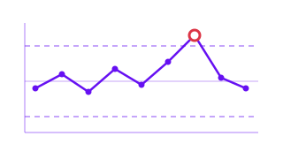

# Monitoring

**Detect process shifts and out-of-control behavior in functional data streams.**

Modern manufacturing, sensor networks, and industrial systems produce functional observations over time. The Monitoring module provides statistical process monitoring (SPM) tools that learn the normal operating regime from historical data (Phase I) and then flag new observations that deviate from it (Phase II). All computations run in Rust for real-time performance.

-   :material-chart-timeline-variant-shimmer:{ .lg .middle } **Statistical Process Monitoring**

    ---

    Phase I estimation of control limits via FPCA, followed by Phase II monitoring with Hotelling $T^2$ and SPE statistics. Detect mean shifts, variance changes, and arbitrary faults in functional data streams.

    [:octicons-arrow-right-24: Process Monitoring](spm.md)

