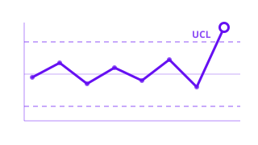
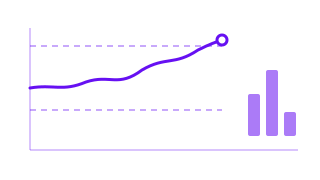
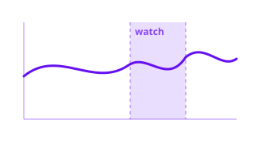

# Monitoring

**Detect process shifts and out-of-control behavior in functional data streams.**

Modern manufacturing, sensor networks, and industrial systems produce functional observations over time. The Monitoring module provides statistical process monitoring (SPM) tools that learn the normal operating regime from historical data (Phase I) and then flag new observations that deviate from it (Phase II). All computations run in Rust for real-time performance.

<a class="fdars-gallery-item" href="spm/">

Process Monitoring

Phase I/II control charts with Hotelling T2 and SPE statistics.

</a>
<a class="fdars-gallery-item" href="advanced-spm/">

Advanced SPM

SPE/Q, EWMA, run rules, ARL, and PC-contribution fault diagnosis.

</a>
<a class="fdars-gallery-item" href="profile-partial-monitoring/">

Profile & Partial-Domain Monitoring

Monitor a sub-interval where faults are localized.

</a>

