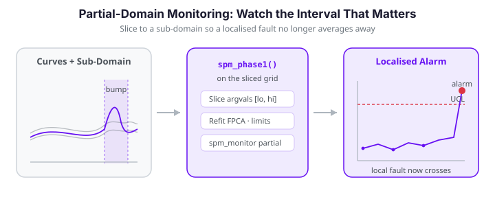

# Profile and Partial-Domain Monitoring

Functional control charts summarise a whole curve into a single $T^2$ or SPE number. That
global view is a liability when a fault is **localised** — a defect confined to a short
sub-interval of the domain. Averaged over the full curve, a small local bump barely moves
the global statistic and slips past the limit. The remedy is simple and powerful:
**restrict the monitoring model to the sub-interval that matters**. This page shows how
to slice the argument grid and rerun the ordinary `fdars.spm` Phase I / Phase II workflow
on a partial domain, and quantifies the sensitivity gain.

{ .fdars-diagram }

```python exec="1" html="1" source="above"
import numpy as np
from docs_fig import fig, render
from fdars.simulation import simulate

argvals = np.linspace(0, 1, 120)
ic = np.asarray(simulate(100, argvals, n_basis=6, seed=7))     # Phase I reference

# Phase II: 20 in-control curves + 8 with a bump localised near t = 0.78
ok = np.asarray(simulate(20, argvals, n_basis=6, seed=21))
loc = np.asarray(simulate(8, argvals, n_basis=6, seed=33))
bump = np.exp(-0.5 * ((argvals - 0.78) / 0.035) ** 2) * 1.8
loc = loc + bump
new = np.vstack([ok, loc])

lo, hi = 0.68, 0.88          # the sub-domain of interest

f, ax = fig()
ax.plot(argvals, ic.T, color="#6c757d", lw=0.5, alpha=0.30)
ax.plot(argvals, ok.T, color="#3f51b5", lw=0.7, alpha=0.5)
ax.plot(argvals, loc.T, color="#dc3545", lw=1.0, alpha=0.8)
ax.axvspan(lo, hi, color="#e8710a", alpha=0.12, label="monitored sub-domain")
ax.set(title="A fault localised near t = 0.78 (red); grey = Phase I, indigo = in-control Phase II",
       xlabel="t", ylabel="x(t)")
ax.legend(loc="upper left", fontsize=8)
print(render(f))
```

Away from the shaded window the faulty curves (red) are indistinguishable from the
in-control ones. Only inside the window does the bump appear.

---

## The monitoring statistics

Both charts on this page are built from the same two functional statistics. Fix a domain
$[a,b]$ (the full grid $[0,1]$ or a restricted sub-interval), and let the Phase I sample
$x_1,\dots,x_N$ define the mean function $\hat\mu(t)$ and the leading FPCA eigenpairs
$(\lambda_k,\phi_k)$, $k=1,\dots,K$, of the sample covariance operator on $[a,b]$.

### FPCA scores

A new curve $x(t)$ is projected onto each eigenfunction through the $L^2$ inner product,

$$
\xi_k \;=\; \langle x-\hat\mu,\ \phi_k\rangle_{[a,b]}
       \;=\; \int_a^b \bigl(x(t)-\hat\mu(t)\bigr)\,\phi_k(t)\,dt ,
\qquad k = 1,\dots,K .
$$

On a discrete grid the integral becomes a weighted sum $\xi_k = \sum_j (x(t_j)-\hat\mu(t_j))\,\phi_k(t_j)\,w_j$,
where the quadrature weights $w_j$ are the `weights` returned by `spm_phase1`. When the
grid is restricted to $[a,b]$ the weights are recomputed on that grid, so every $\xi_k$ is
a *bona fide* functional score on the sub-domain, not a truncation of a full-domain score.

### Hotelling $T^2$ — variation inside the model

The $T^2$ statistic is the squared Mahalanobis length of the score vector, whitened by the
eigenvalues (the FPC variances):

$$
T^2 \;=\; \sum_{k=1}^{K} \frac{\xi_k^{\,2}}{\lambda_k} .
$$

Under in-control Gaussianity $T^2$ is $\chi^2_K$-distributed, giving the closed-form upper
control limit implemented by `t2_control_limit`,

$$
\mathrm{UCL}_{T^2} \;=\; \chi^2_{K,\,1-\alpha}.
$$

The single-observation contribution of component $k$ is $c_k = \xi_k^2/\lambda_k$, and
$T^2 = \sum_k c_k$. These per-PC contributions (`t2_pc_contributions`) are the raw material
for fault *diagnosis*: an alarm with an outsized $c_k$ tells you *which* mode of variation
moved, and `t2_pc_significance` tests each $c_k$ against its own limit.

### Squared prediction error — variation the model cannot explain

$T^2$ only sees the part of $x$ that lives in the span of $\phi_1,\dots,\phi_K$. The
residual — everything the $K$-component model fails to reconstruct — is measured by the
squared prediction error (SPE, also called the $Q$-statistic):

$$
\hat x(t) \;=\; \hat\mu(t) + \sum_{k=1}^{K}\xi_k\,\phi_k(t),
\qquad
\mathrm{SPE} \;=\; \|x-\hat x\|_{[a,b]}^2 \;=\; \int_a^b \bigl(x(t)-\hat x(t)\bigr)^2\,dt .
$$

Its distribution has no simple closed form, so `spe_control_limit` sets the limit from the
Phase I SPE values by a Box moment-matching approximation $\mathrm{SPE}\sim g\,\chi^2_h$
(fit $g,h$ from the sample mean and variance). A fault with a *new shape* — a wiggle no
eigenfunction captures — leaves $T^2$ untouched but inflates SPE; a fault along a known
mode inflates $T^2$. Charting both catches both failure modes.

!!! note "These formulas are exact, not approximations"
    Projecting the centred, restricted data onto `loadings` with `weights` and applying the
    two formulas above reproduces the `t2` and `spe` arrays from `spm_monitor` to machine
    precision. The [second worked example](#worked-example-2-localise-then-diagnose-an-unknown-fault)
    below relies on that identity to compute per-PC contributions and the SPE residual by
    hand on the sub-domain.

### Why the full domain hides local faults

The FPCA $T^2$ statistic weights every point of the curve. If the fault occupies a
fraction $\rho$ of the domain, its contribution to a full-domain score is diluted roughly
in proportion to $\rho$, while in-control variability over the *whole* domain still counts
against the control limit. The signal-to-noise ratio therefore scales like

$$
\mathrm{SNR} \;\approx\;
\frac{\displaystyle\int_a^b \delta(t)^2\,dt}{\displaystyle\int_0^1 \sigma^2(t)\,dt},
$$

where $\delta$ is the fault signal supported on $[a,b]$ and $\sigma^2$ is the in-control
pointwise variance. Restricting the analysis to $[a,b]$ replaces the denominator with
$\int_a^b \sigma^2(t)\,dt$ — a factor of roughly $1/\rho$ smaller — sharpening the ratio
and, provided the fault truly lives there, dramatically improving detection.

### Partial-domain monitoring is just monitoring on a slice

There is no special API: a partial-domain chart is an ordinary chart built on sliced
arrays. Pick the index set of the sub-domain, slice both `argvals` and the data columns,
and run the usual `spm_phase1` / `spm_monitor`. Because the integration weights are
recomputed on the restricted grid, the resulting statistics are proper functional
statistics *on the sub-domain*.

```python exec="1" html="1" source="above"
import numpy as np

argvals = np.linspace(0, 1, 120)
lo, hi = 0.68, 0.88
mask = (argvals >= lo) & (argvals <= hi)
idx = np.where(mask)[0]
print(f"full domain : {argvals.size} points")
print(f"sub-domain  : {idx.size} points on [{lo}, {hi}]")
```

!!! note "Slicing must stay contiguous and aligned"
    Slice `argvals` and every data matrix with the **same** index set, and pass
    C-contiguous arrays (`np.ascontiguousarray`) to the Rust functions. The reference and
    stream must share the grid, so slice them identically.

---

## Full-domain vs partial-domain

We wrap the workflow in a small helper and run it twice: once on the whole grid, once on
the sub-domain. Everything else — `ncomp`, `alpha` — is held fixed for a fair comparison.

```python exec="1" html="1" source="above"
import numpy as np
from fdars.simulation import simulate
from fdars.spm import spm_phase1, spm_monitor

argvals = np.linspace(0, 1, 120)
ic = np.asarray(simulate(100, argvals, n_basis=6, seed=7))
ok = np.asarray(simulate(20, argvals, n_basis=6, seed=21))
loc = np.asarray(simulate(8, argvals, n_basis=6, seed=33))
loc = loc + np.exp(-0.5 * ((argvals - 0.78) / 0.035) ** 2) * 1.8
new = np.vstack([ok, loc])
idx = np.where((argvals >= 0.68) & (argvals <= 0.88))[0]

def monitor_on(index):
    a = np.ascontiguousarray(argvals[index])
    ref = np.ascontiguousarray(ic[:, index])
    stream = np.ascontiguousarray(new[:, index])
    p1 = spm_phase1(ref, a, ncomp=4, alpha=0.01)
    p2 = spm_monitor(
        mean=p1["mean"], loadings=p1["loadings"], weights=p1["weights"],
        eigenvalues=p1["eigenvalues"], t2_limit=p1["t2_limit"],
        spe_limit=p1["spe_limit"], new_data=stream, argvals=a,
    )
    t2 = np.asarray(p2["t2"])
    alarm = np.asarray(p2["t2_alarm"]) | np.asarray(p2["spe_alarm"])
    return t2, p1["t2_limit"], alarm

full_idx = np.arange(argvals.size)
t2_full, ucl_full, alarm_full = monitor_on(full_idx)
t2_part, ucl_part, alarm_part = monitor_on(idx)

fault = slice(20, 28)     # the 8 faulty observations
print(f"full-domain    : {alarm_full[fault].sum()}/8 faults caught, "
      f"{alarm_full[:20].sum()}/20 false alarms")
print(f"partial-domain : {alarm_part[fault].sum()}/8 faults caught, "
      f"{alarm_part[:20].sum()}/20 false alarms")
```

The full-domain chart misses every localised fault; the partial-domain chart catches all
eight, with no false alarms on the in-control observations. The figure makes the gap
visible: on the full domain the faulty points (red) sit comfortably below the limit,
while on the sub-domain they jump far above it.

```python exec="1" html="1"
import numpy as np
from docs_fig import render, plt
from fdars.simulation import simulate
from fdars.spm import spm_phase1, spm_monitor

argvals = np.linspace(0, 1, 120)
ic = np.asarray(simulate(100, argvals, n_basis=6, seed=7))
ok = np.asarray(simulate(20, argvals, n_basis=6, seed=21))
loc = np.asarray(simulate(8, argvals, n_basis=6, seed=33))
loc = loc + np.exp(-0.5 * ((argvals - 0.78) / 0.035) ** 2) * 1.8
new = np.vstack([ok, loc])
idx = np.where((argvals >= 0.68) & (argvals <= 0.88))[0]

def monitor_on(index):
    a = np.ascontiguousarray(argvals[index])
    ref = np.ascontiguousarray(ic[:, index])
    stream = np.ascontiguousarray(new[:, index])
    p1 = spm_phase1(ref, a, ncomp=4, alpha=0.01)
    p2 = spm_monitor(
        mean=p1["mean"], loadings=p1["loadings"], weights=p1["weights"],
        eigenvalues=p1["eigenvalues"], t2_limit=p1["t2_limit"],
        spe_limit=p1["spe_limit"], new_data=stream, argvals=a,
    )
    return np.asarray(p2["t2"]), p1["t2_limit"]

t2_full, ucl_full = monitor_on(np.arange(argvals.size))
t2_part, ucl_part = monitor_on(idx)

obs = np.arange(1, len(new) + 1)
fmask = np.zeros(len(new), bool); fmask[20:28] = True

f, (ax1, ax2) = plt.subplots(1, 2, figsize=(8.4, 3.6), sharey=False)
for ax, t2, ucl, title in [
    (ax1, t2_full, ucl_full, "Full domain [0, 1]"),
    (ax2, t2_part, ucl_part, "Sub-domain [0.68, 0.88]"),
]:
    ax.vlines(obs, 0, t2, color="#c7cbe0", lw=1)
    ax.scatter(obs[~fmask], t2[~fmask], s=20, color="#3f51b5", zorder=3, label="in-control")
    ax.scatter(obs[fmask], t2[fmask], s=28, color="#dc3545", zorder=3, label="localised fault")
    ax.axhline(ucl, color="#e8710a", ls="--", lw=1.3, label="control limit")
    ax.set(title=title, xlabel="observation index", ylim=(0, None))
ax1.set_ylabel("Hotelling $T^2$")
ax1.legend(loc="upper left", fontsize=7)
f.suptitle("Same fault, two monitoring domains", y=1.02)
print(render(f))
```

!!! tip "Where do the sub-domain bounds come from?"
    Domain knowledge (a known critical region — a curing window, a specific frequency
    band) is the usual source. When the location is unknown, a sliding-window scan — run
    the partial-domain chart over a series of overlapping windows — turns detection into
    localisation, at the cost of a multiplicity correction on `alpha`. The next section
    walks through exactly that scan.

---

## Worked example 2: localise *then* diagnose an unknown fault

The first example assumed we already knew the critical window. Here the fault location is
**unknown**, and we recover it in two stages: a sliding-window scan finds *where* the
process drifted, then per-PC contribution analysis on the winning window explains *which
mode of variation* moved. The fault is a narrow bump centred at $t=0.32$ injected into 5
of 20 Phase II curves; the scan is not told this.

### Stage 1 — sliding-window scan localises the fault

We slide a width-$0.12$ window across the domain in steps, rebuild a partial-domain chart
on each window, and count how many of the known-faulty curves alarm. The detection count
peaks where the window straddles the true fault — turning a *detection* tool into a
*localisation* tool.

```python exec="1" html="1" source="above"
import numpy as np
from docs_fig import fig, render
from fdars.simulation import simulate
from fdars.spm import spm_phase1, spm_monitor

argvals = np.linspace(0, 1, 120)
ic  = np.asarray(simulate(80, argvals, n_basis=6, seed=7))
ok  = np.asarray(simulate(15, argvals, n_basis=6, seed=21))
loc = np.asarray(simulate(5,  argvals, n_basis=6, seed=44))
true_center = 0.32
loc = loc + np.exp(-0.5 * ((argvals - true_center) / 0.03) ** 2) * 1.6
new = np.vstack([ok, loc])                     # obs 0..14 in-control, 15..19 faulty

centers = np.linspace(0.10, 0.90, 17)
half = 0.06
detected = []
for c in centers:
    idx = np.where((argvals >= c - half) & (argvals <= c + half))[0]
    a   = np.ascontiguousarray(argvals[idx])
    ref = np.ascontiguousarray(ic[:, idx])
    st  = np.ascontiguousarray(new[:, idx])
    p1  = spm_phase1(ref, a, ncomp=3, alpha=0.01)
    p2  = spm_monitor(mean=p1["mean"], loadings=p1["loadings"], weights=p1["weights"],
                      eigenvalues=p1["eigenvalues"], t2_limit=p1["t2_limit"],
                      spe_limit=p1["spe_limit"], new_data=st, argvals=a)
    alarm = np.asarray(p2["t2_alarm"]) | np.asarray(p2["spe_alarm"])
    detected.append(int(alarm[15:20].sum()))
detected = np.asarray(detected)

f, ax = fig()
ax.bar(centers, detected, width=0.035, color="#3f51b5", alpha=0.85)
ax.axvline(true_center, color="#dc3545", ls="--", lw=1.4, label="true fault centre")
ax.set(title="Sliding-window scan recovers the fault location",
       xlabel="window centre  t", ylabel="faulty curves detected (of 5)")
ax.legend(loc="upper right", fontsize=8)
print(render(f))
```

The scan lights up precisely over $t\approx0.25\text{–}0.40$ and is silent everywhere else:
detection *is* localisation. Away from the fault the window sees only in-control variation
and stays dark.

!!! warning "Correct `alpha` for the number of windows"
    A scan over $W$ overlapping windows runs $W$ charts, so the family-wise false-alarm
    rate inflates. Divide the per-chart `alpha` by $W$ (Bonferroni) or, because
    neighbouring windows are strongly correlated, calibrate a scan-wide threshold from the
    Phase I data by re-running the scan on held-out in-control curves.

### Stage 2 — per-PC contributions diagnose the fault mode

Having localised the fault to the window $[0.26, 0.38]$, we now ask *why* those curves
alarmed. `spm_monitor` returns only the aggregate $T^2$; to open it up we reconstruct the
FPCA scores by projecting the centred, sub-domain data onto the loadings (the exact
identity noted above) and feed them to
`t2_pc_contributions`. The contribution $c_k=\xi_k^2/\lambda_k$ localises the alarm to a
mode of variation the same way the scan localised it to a region of the domain.

```python exec="1" html="1" source="above"
import numpy as np
from docs_fig import fig, render
from fdars.simulation import simulate
from fdars.spm import spm_phase1, t2_pc_contributions, t2_pc_significance

argvals = np.linspace(0, 1, 120)
ic  = np.asarray(simulate(80, argvals, n_basis=6, seed=7))
ok  = np.asarray(simulate(15, argvals, n_basis=6, seed=21))
loc = np.asarray(simulate(5,  argvals, n_basis=6, seed=44))
loc = loc + np.exp(-0.5 * ((argvals - 0.32) / 0.03) ** 2) * 1.6
new = np.vstack([ok, loc])

idx  = np.where((argvals >= 0.26) & (argvals <= 0.38))[0]     # the located window
a    = np.ascontiguousarray(argvals[idx])
p1   = spm_phase1(np.ascontiguousarray(ic[:, idx]), a, ncomp=3, alpha=0.05)
mean = np.asarray(p1["mean"]); L = np.asarray(p1["loadings"])
w    = np.asarray(p1["weights"]); eig = np.asarray(p1["eigenvalues"])

# scores = ∫ (x - mean) φ_k dt, discretised with the quadrature weights
scores  = np.ascontiguousarray((new[:, idx] - mean) @ (L * w[:, None]))
contrib = np.asarray(t2_pc_contributions(scores, eig))        # (n, ncomp) = ξ_k²/λ_k
sig     = np.asarray(t2_pc_significance(np.ascontiguousarray(contrib), 0.05))
worst   = 1 + int(contrib[15:].mean(axis=0).argmax())     # dominant fault mode

ic_mean = contrib[:15].mean(axis=0)
ft_mean = contrib[15:].mean(axis=0)
pcs = np.arange(1, contrib.shape[1] + 1)

f, ax = fig()
ww = 0.38
ax.bar(pcs - ww/2, ic_mean, ww, color="#3f51b5", label="in-control (mean $c_k$)")
ax.bar(pcs + ww/2, ft_mean, ww, color="#dc3545", label="faulty (mean $c_k$)")
ax.set(title="Per-PC $T^2$ contributions isolate the fault mode",
       xlabel="functional principal component  k", ylabel="contribution  $c_k=\\xi_k^2/\\lambda_k$",
       xticks=pcs)
ax.legend(fontsize=8)
n_flagged = int((np.asarray(sig[15:]) != 0).any(axis=1).sum())
print(f"# faulty curves with a flagged PC: {n_flagged}/5; dominant fault mode: PC{worst}")
print(render(f))
```

The diagnosis is unambiguous: on the located window the faulty curves pile essentially all
of their $T^2$ onto **PC3**, while PC1 and PC2 stay at in-control levels.
`t2_pc_significance` flags exactly that component. In practice PC3's eigenfunction is the
shape that best matches the injected bump, so "PC3 is out" is a mechanistic clue to the
physical fault, not just a number.

To make that mechanistic claim concrete, plot the three restricted-domain eigenfunctions
$\phi_1,\phi_2,\phi_3$ alongside the (rescaled) fault signal. The flagged component is the
one whose shape aligns with the fault — the geometric reason its score, and hence its
contribution $\xi_k^2/\lambda_k$, blows up.

```python exec="1" html="1"
import numpy as np
from docs_fig import fig, render
from fdars.simulation import simulate
from fdars.spm import spm_phase1

argvals = np.linspace(0, 1, 120)
ic  = np.asarray(simulate(80, argvals, n_basis=6, seed=7))
idx = np.where((argvals >= 0.26) & (argvals <= 0.38))[0]
a   = argvals[idx]
p1  = spm_phase1(np.ascontiguousarray(ic[:, idx]), np.ascontiguousarray(a), ncomp=3, alpha=0.05)
L   = np.asarray(p1["loadings"])                                  # (m, 3) eigenfunctions

fault = np.exp(-0.5 * ((a - 0.32) / 0.03) ** 2)
fault = fault / np.sqrt(np.trapezoid(fault**2, a))               # unit-L2 for comparison

f, ax = fig()
for k in range(3):
    phi = L[:, k]
    if np.trapezoid(phi * fault, a) < 0:   # fix arbitrary eigenfunction sign for display
        phi = -phi
    ax.plot(a, phi, lw=1.6, label=f"$\\phi_{k+1}$ (PC{k+1})")
ax.plot(a, fault, color="#111", lw=2.2, ls=":", label="fault shape (rescaled)")
ax.set(title="On the located window, PC3's eigenfunction matches the fault",
       xlabel="t", ylabel="eigenfunction value")
ax.legend(fontsize=8)
print(render(f))
```

The dotted fault curve tracks $\phi_3$, not $\phi_1$ or $\phi_2$ — which is exactly why the
contribution mass landed on PC3.

### Stage 3 — SPE catches shapes the model never learned

$T^2$ can only flag variation *inside* the $K$-component span. A fault whose shape no
eigenfunction represents is invisible to $T^2$ but lands entirely in the residual, where
SPE catches it. Below we inject a high-frequency ripple — deliberately unlike the smooth
in-control modes — and compute SPE from the reconstruction residual on the sub-domain,
matching `spm_monitor`'s `spe` array exactly.

```python exec="1" html="1" source="above"
import numpy as np
from docs_fig import fig, render
from fdars.simulation import simulate
from fdars.spm import spm_phase1, spm_monitor, spe_control_limit

argvals = np.linspace(0, 1, 120)
ic  = np.asarray(simulate(80, argvals, n_basis=6, seed=7))
new = np.asarray(simulate(12, argvals, n_basis=6, seed=21))
new[8:] += np.sin(30 * argvals) * 0.4          # obs 8..11: shape outside the model

idx  = np.where((argvals >= 0.26) & (argvals <= 0.38))[0]
a    = np.ascontiguousarray(argvals[idx])
p1   = spm_phase1(np.ascontiguousarray(ic[:, idx]), a, ncomp=2, alpha=0.05)
mean = np.asarray(p1["mean"]); L = np.asarray(p1["loadings"]); w = np.asarray(p1["weights"])

st     = np.ascontiguousarray(new[:, idx])
scores = (st - mean) @ (L * w[:, None])
resid  = st - (mean + scores @ L.T)
spe    = np.sum(resid**2 * w, axis=1)          # ∫ (x - x̂)² dt on [a, b]

p2 = spm_monitor(mean=p1["mean"], loadings=p1["loadings"], weights=p1["weights"],
                 eigenvalues=p1["eigenvalues"], t2_limit=p1["t2_limit"],
                 spe_limit=p1["spe_limit"], new_data=st, argvals=a)
assert np.allclose(spe, np.asarray(p2["spe"]), atol=1e-9)   # exact identity

ucl_info = spe_control_limit(np.ascontiguousarray(p1["spe"]), 0.05)
ucl = ucl_info["ucl"]                           # {'ucl', 'alpha', 'description'}
obs = np.arange(1, len(new) + 1)
fm  = np.zeros(len(new), bool); fm[8:] = True

f, ax = fig()
ax.vlines(obs, 0, spe, color="#c7cbe0", lw=1)
ax.scatter(obs[~fm], spe[~fm], s=22, color="#3f51b5", zorder=3, label="in-control")
ax.scatter(obs[fm],  spe[fm],  s=30, color="#dc3545", zorder=3, label="off-model shape")
ax.axhline(ucl, color="#e8710a", ls="--", lw=1.3, label="SPE limit")
ax.set(title="SPE flags an off-model shape that $T^2$ would miss",
       xlabel="observation index", ylabel="SPE (Q-statistic)", ylim=(0, None))
ax.legend(loc="upper left", fontsize=8)
print(ucl_info["description"])              # e.g. "SPE ~ g * chi2(h), alpha=0.05"
print(render(f))
```

The ripple leaves the $T^2$ scores near-normal but drives the SPE of the four off-model
curves through the limit. Running $T^2$ and SPE together — on the full domain or a
sub-domain — is what makes the chart robust to faults you did not anticipate.

---

## Profile-by-profile monitoring

*Profile monitoring* treats each functional observation as a "profile" and asks whether
it conforms to the reference shape. The Phase II loop above already does this one
observation at a time; the partial-domain twist simply changes **which part** of each
profile is judged. The two ideas compose cleanly: monitor each incoming profile, but
score it only on the sub-domain where the specification is tight.

**`spm_phase1(data, argvals, ncomp=3, alpha=0.05)`** and
**`spm_monitor(mean, loadings, weights, eigenvalues, t2_limit, spe_limit, new_data, argvals)`**

| Parameter | Type | Description |
|---|---|---|
| `data` / `new_data` | `(n, m)` array | Reference / stream profiles, already sliced to the sub-domain |
| `argvals` | `(m,)` array | Sub-domain grid, sliced identically |
| `ncomp` | int | FPC components $K$ retained on the sub-domain |
| `alpha` | float | Per-chart false-alarm rate; sets $\mathrm{UCL}_{T^2}=\chi^2_{K,1-\alpha}$ |
| `mean`, `loadings`, `weights`, `eigenvalues` | arrays | Phase I model $(\hat\mu,\ \phi_k,\ w_j,\ \lambda_k)$ passed straight from `spm_phase1` |

The diagnostic helpers used in [example 2](#worked-example-2-localise-then-diagnose-an-unknown-fault)
operate on the reconstructed score matrix $\Xi\in\mathbb{R}^{n\times K}$:

| Function | Signature | Returns |
|---|---|---|
| `hotelling_t2` | `(scores, eigenvalues)` | $T^2_i=\sum_k \xi_{ik}^2/\lambda_k$, one per row |
| `t2_pc_contributions` | `(scores, eigenvalues)` | `(n, K)` matrix of $c_{ik}=\xi_{ik}^2/\lambda_k$ |
| `t2_pc_significance` | `(contributions, alpha)` | `(n, K)` boolean-coded flags per PC |
| `t2_control_limit` | `(ncomp, alpha)` | $\chi^2_{K,1-\alpha}$ scalar |
| `spe_control_limit` | `(spe_values, alpha)` | moment-matched SPE limit from Phase I |
| `select_ncomp` | `(eigenvalues, method='cumulative_variance', threshold=0.95)` | suggested $K$ |

!!! note "Matrix Profile is a different \"profile\""
    `fdars.seasonal.matrix_profile_fdata` also has *profile* in its name, but it solves an
    unrelated problem — finding repeated subsequences / periodicity within a series
    (`profile`, `primary_period`, `confidence`) rather than SPC-style conformance of one
    curve to a reference. Reach for it for motif and period discovery, not process
    monitoring.

---

## See also

- [Statistical Process Monitoring](spm.md) — the Phase I / Phase II fundamentals used here.
- [Advanced Statistical Process Monitoring](advanced-spm.md) — EWMA charts, run rules,
  ARL analysis, and per-PC fault diagnosis, all of which apply unchanged on a sub-domain.

!!! note "Where this differs from the R vignette"
    The R article implements three dedicated engines that have no `fdars` Python binding
    yet: covariate-aware **profile monitoring** (`spm.profile.phase1` / `.monitor`, built
    on sliding-window function-on-scalar regression), **conditional-completion** partial
    monitoring (`spm.monitor.partial` with BLUP / projection / zero-pad tails for
    curves seen only up to some fraction of the domain), and **elastic SPM**
    (`spm.elastic.phase1` / `.monitor`, which splits amplitude from phase variation). The
    sub-domain slicing shown on this page reproduces the *spirit* of partial-domain
    monitoring using only the exposed `spm_phase1` / `spm_monitor` primitives — it charts a
    fixed critical window rather than completing an unobserved tail. Amplitude/phase
    separation is available through the [elastic alignment](../align/elastic-alignment.md)
    tools (SRSF alignment, Karcher mean) if you want to build an elastic chart by hand.

    The R engine's *conditional-completion* variant solves a genuinely different problem:
    scoring a curve seen only on $[0,\tau]$ with $\tau<1$. Splitting the score vector into
    observed and unobserved blocks $\xi=(\xi_o,\xi_u)$ with covariance blocks
    $\Sigma_{oo},\Sigma_{ou},\Sigma_{uo},\Sigma_{uu}$, the BLUP completion imputes the tail
    by the conditional expectation $\hat\xi_u=\Sigma_{uo}\Sigma_{oo}^{-1}\xi_o$ before
    forming $T^2$. That is not the same
    as our fixed-window chart, which never imputes anything — it simply declines to look
    outside $[a,b]$. Use this page for a *known* critical region; reach for the R engine (or
    a hand-rolled BLUP) when the tail is genuinely *unobserved*.

## References

1. Colosimo, B. M. and Pacella, M. (2010). A comparison study of control charts for
   statistical monitoring of functional data. *International Journal of Production
   Research*, **48**(6), 1575–1601.
2. Capezza, C., Lepore, A., Menafoglio, A., Palumbo, B. and Vantini, S. (2020). Control
   charts for monitoring ship operating conditions and CO₂ emissions based on
   scalar-on-function regression. *Applied Stochastic Models in Business and Industry*,
   **36**(3), 477–500.
3. Ramsay, J. O. and Silverman, B. W. (2005). *Functional Data Analysis* (2nd ed.).
   Springer. — FPCA, the $L^2$ score projection, and reconstruction underlying $T^2$/SPE.
4. Jackson, J. E. and Mudholkar, G. S. (1979). Control procedures for residuals associated
   with principal component analysis. *Technometrics*, **21**(3), 341–349. — the SPE/$Q$
   statistic and its moment-matched control limit.
5. Srivastava, A. and Klassen, E. P. (2016). *Functional and Shape Data Analysis*.
   Springer. — elastic amplitude/phase separation referenced in the note above.
